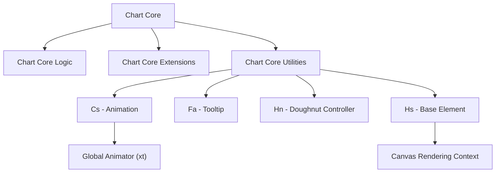
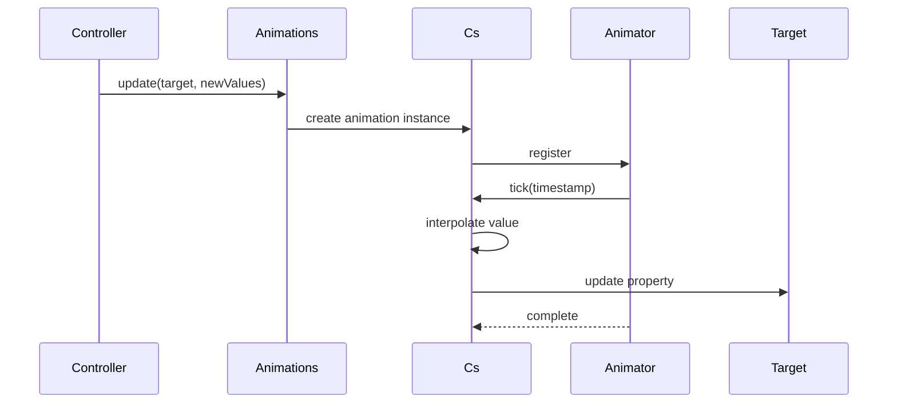
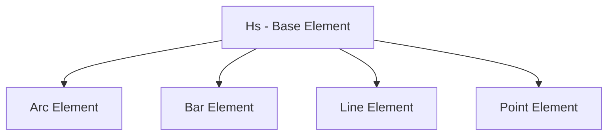
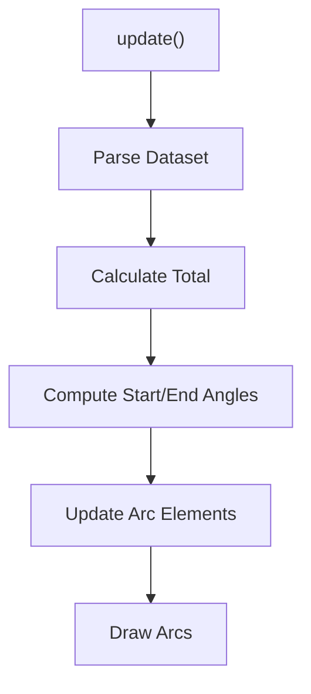
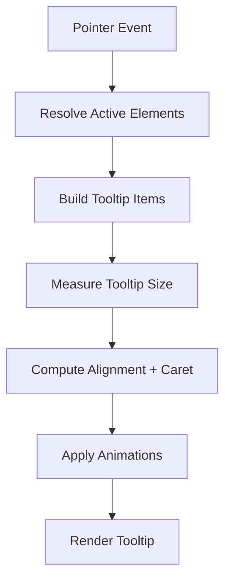
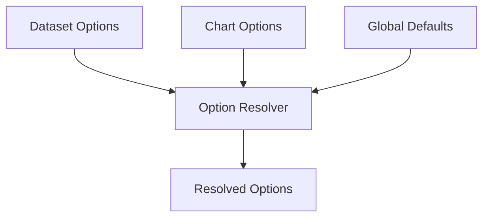
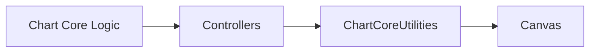

# Chart Core Utilities

The **Chart Core Utilities** module encapsulates the foundational helper classes and low-level primitives that power rendering, animation, configuration resolution, and geometric computation inside the Chart Core layer.

This module is built directly on top of the embedded Chart.js v4 runtime and provides:

- Animation primitives and orchestration
- Option resolution and configuration merging
- Geometry and math helpers
- Color parsing and manipulation
- Drawing utilities for canvas elements

It acts as the internal backbone for higher-level modules such as:

- [Chart Core](../chart-core.md)
- [Chart Core Logic](../chart-core-logic/chart-core-logic.md)
- [Chart Core Extensions](../chart-core-extensions/chart-core-extensions.md)

---

## 1. Core Components

The module is composed of four primary internal components:

| Component | Responsibility |
|------------|----------------|
| `Cs` | Low-level animation primitive (single property animation) |
| `Fa` | Tooltip engine and rendering controller |
| `Hn` | Doughnut/Pie controller implementation |
| `Hs` | Base visual element abstraction |

These components interact with shared utility systems (color, geometry, easing, layout, parsing) embedded within the same runtime file.

---

## 2. Architectural Position in Chart Core

Chart Core Utilities sits below controllers and extensions but above raw canvas APIs.

**Key Idea:**
- Controllers define behavior.
- Elements define drawable units.
- Utilities define *how* behavior is animated, resolved, and rendered.

---

## 3. Animation Subsystem (Cs)

`Cs` is the atomic animation unit.

### Responsibilities

- Animate a single property (`_prop`) on a target object
- Apply easing functions
- Support looping animations
- Handle delays and duration
- Notify completion promises

### Animation Lifecycle

### Design Characteristics

- Stateless easing functions
- Time-based progression
- Interpolation by type (`number`, `color`, etc.)
- Supports promise-based synchronization

This primitive is reused across controllers, scales, tooltips, and layout transitions.

---

## 4. Base Element Abstraction (Hs)

`Hs` defines the minimal drawable entity.

### Responsibilities

- Maintain element state (`x`, `y`, active state, options)
- Provide hit-testing
- Support animated property access
- Expose tooltip positioning

### Element Hierarchy

Each concrete element:

- Implements `draw(ctx)`
- Implements `inRange()` for interaction
- Uses shared geometry utilities

---

## 5. Doughnut / Pie Controller (Hn)

`Hn` is the radial dataset controller.

### Responsibilities

- Parse dataset values
- Compute angular geometry
- Manage inner/outer radii
- Handle stacking and visibility
- Update Arc elements

### Rendering Flow

### Geometry Model

Each arc defines:

- `startAngle`
- `endAngle`
- `innerRadius`
- `outerRadius`
- `circumference`

The controller ensures correct stacking and animation during transitions.

---

## 6. Tooltip Engine (Fa)

`Fa` implements the interactive tooltip system.

### Responsibilities

- Resolve active elements
- Generate tooltip content
- Compute dynamic positioning
- Animate opacity and movement
- Render title, body, footer

### Tooltip Processing Pipeline

### Context-Aware Rendering

Tooltip rendering:

- Uses per-dataset callbacks
- Resolves dynamic colors
- Supports RTL text
- Supports external rendering hooks

---

## 7. Shared Utility Systems

Beyond the four main classes, this module embeds reusable systems:

### 7.1 Color Engine

- RGB / HSL parsing
- Hex conversion
- Alpha manipulation
- Color mixing and interpolation

### 7.2 Geometry Helpers

- Angle normalization
- Bezier curve helpers
- Distance calculations
- Pixel alignment

### 7.3 Configuration Resolver

The configuration system allows layered resolution:

Features:

- Scriptable options (functions as values)
- Indexable options (per data index)
- Fallback routing
- Cached resolution for performance

---

## 8. Interaction with Chart Core Logic

Chart Core Utilities does **not** decide business logic. Instead, it:

- Executes rendering strategies defined by controllers
- Applies animations defined by configuration
- Provides interaction primitives

Interaction relationship:

- Logic computes *what* to draw
- Utilities determine *how* it is animated and rendered

---

## 9. Performance Considerations

The module includes built-in optimizations:

- Decimation plugin for large datasets
- Cached animation descriptors
- Normalized data arrays
- Lazy segment computation
- Shared option objects for memory efficiency

These mechanisms reduce overhead when handling large or frequently updating datasets.

---

## 10. Summary

The **Chart Core Utilities** module provides:

- The animation engine
- The base rendering abstraction
- Radial controller logic
- Tooltip rendering engine
- Shared math, color, and configuration infrastructure

It forms the foundational layer enabling higher-level chart behavior in:

- [Chart Core](../chart-core.md)
- [Chart Core Logic](../chart-core-logic/chart-core-logic.md)
- [Chart Core Extensions](../chart-core-extensions/chart-core-extensions.md)

Without this module, controllers and extensions would lack:

- Deterministic animation
- Unified configuration resolution
- Consistent rendering behavior
- Interactive tooltips

This makes Chart Core Utilities the internal runtime engine of the charting system.