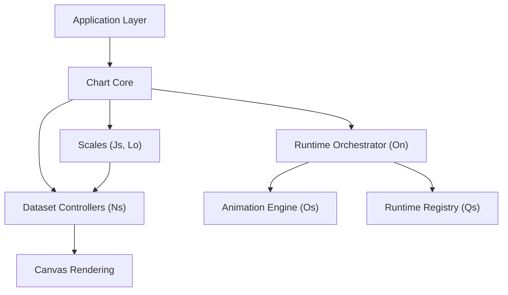
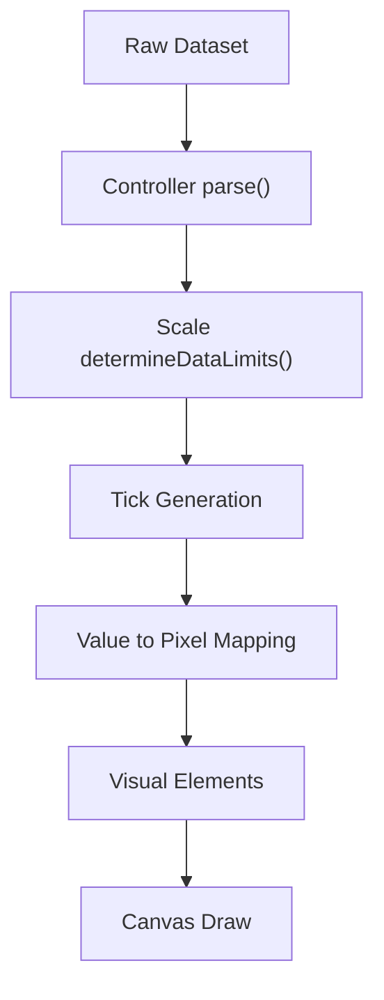
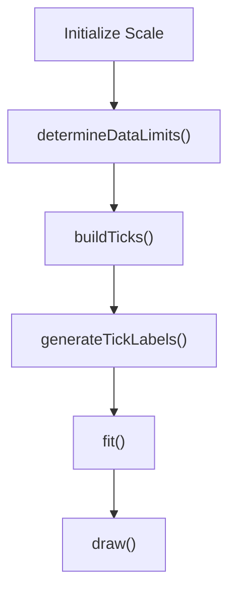
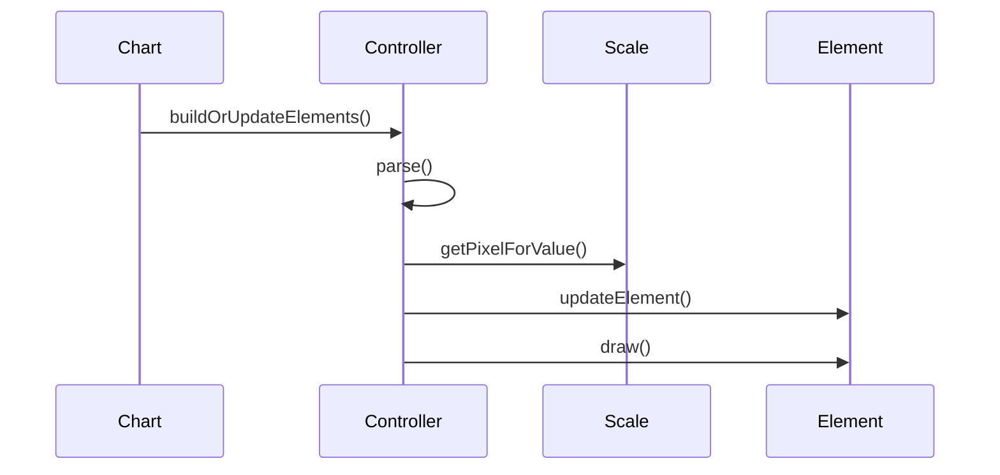
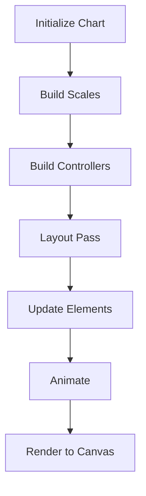
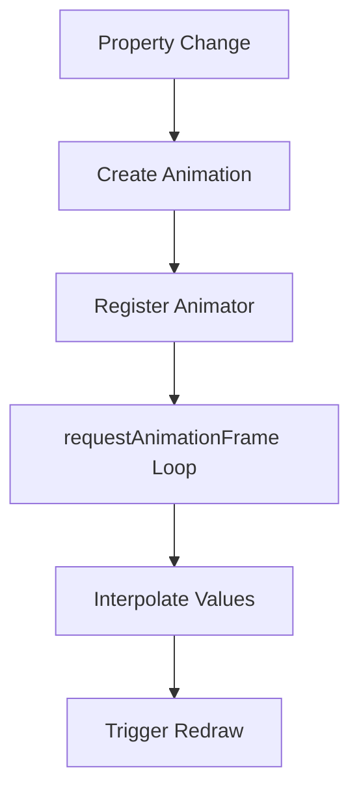
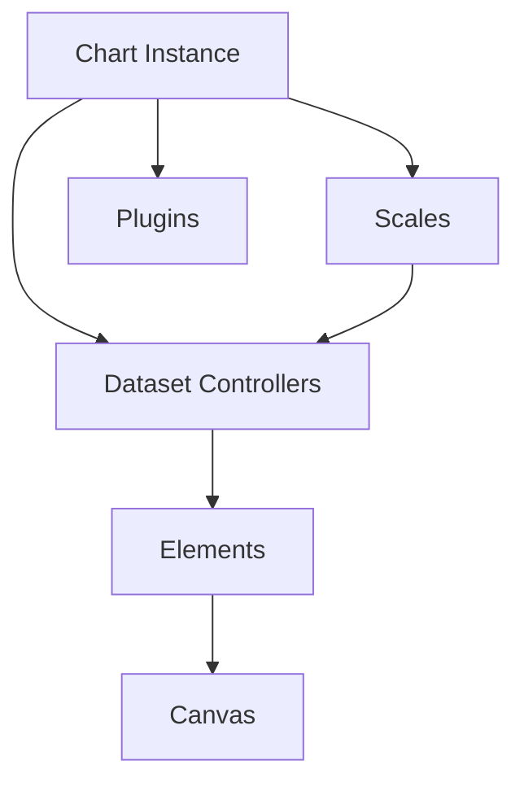
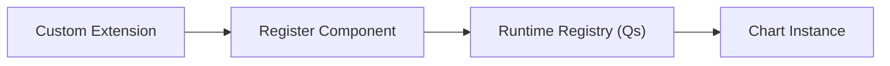

# Chart Core

The **Chart Core** module is the foundational runtime layer of the charting subsystem embedded in MeshCentral. It provides the base infrastructure that powers chart rendering, scale computation, dataset control, animation coordination, and runtime extensibility.

Located under:

```text
public/scripts/charts
```

Chart Core acts as the bridge between raw dataset input and interactive canvas-based visualizations across the MeshCentral UI.

---

## 1. Purpose of the Module

The **Chart Core** module is responsible for:

- Coordinating chart lifecycle execution
- Managing dataset controllers
- Providing scale abstractions (cartesian and radial)
- Handling date/time parsing through adapter interfaces
- Orchestrating layout and rendering
- Integrating animation and plugin systems
- Enabling modular extension of chart behavior

It transforms structured data into pixel-perfect, animated, interactive visualizations.

---

## 2. Repository Structure

```text
public/scripts
└── charts
    └── chart-core
        ├── chart-core-utilities
        │   ├── Cs
        │   ├── Fa
        │   ├── Hn
        │   └── Hs
        │
        ├── chart-core-logic
        │   ├── Js
        │   ├── Ln
        │   ├── Lo
        │   └── Ns
        │
        └── chart-core-extensions
            ├── On
            ├── Os
            └── Qs
```

### Core Components

The Chart Core module includes the following primary runtime classes:

- `meshcentral.public.scripts.charts.Cs`
- `meshcentral.public.scripts.charts.Fa`
- `meshcentral.public.scripts.charts.Hn`
- `meshcentral.public.scripts.charts.Hs`
- `meshcentral.public.scripts.charts.Js`
- `meshcentral.public.scripts.charts.Ln`
- `meshcentral.public.scripts.charts.Lo`
- `meshcentral.public.scripts.charts.Ns`
- `meshcentral.public.scripts.charts.On`
- `meshcentral.public.scripts.charts.Os`
- `meshcentral.public.scripts.charts.Qs`

---

## 3. High-Level Architecture

Chart Core follows a layered runtime architecture:



### Architectural Layers

| Layer | Responsibility |
|-------|---------------|
| Chart Core Utilities | Math helpers, shared infrastructure |
| Chart Core Logic | Scale system and dataset transformation |
| Chart Core Extensions | Runtime orchestration and animation |
| Canvas Rendering | Final drawing surface |

---

## 4. Core Architectural Flow

### 4.1 Data → Pixels → Canvas



The Scale system (`Js`, `Lo`) acts as the mathematical backbone, enabling precise coordinate computation.

---

## 5. Core Submodules

### 5.1 Chart Core Utilities

**Components:**

- `Cs`
- `Fa`
- `Hn`
- `Hs`

Responsibilities:

- Numeric helpers
- Layout helpers
- Configuration resolution
- Internal runtime utilities

These utilities are shared across controllers, scales, and animation subsystems.

---

### 5.2 Chart Core Logic

**Components:**

- `Js` — Base scale abstraction  
- `Ln` — Date adapter interface  
- `Lo` — Radial linear scale  
- `Ns` — Dataset controller base  

#### Scale Lifecycle



#### Dataset Controller Flow



The Chart Core Logic layer ensures consistent transformation of data into renderable primitives.

For detailed documentation, see:

- **Chart Core Logic**
- **Chart Core Logic Main**
- **Chart Core Logic Extensions**

---

### 5.3 Chart Core Extensions

**Components:**

- `On` — Runtime Orchestrator  
- `Os` — Animation Engine  
- `Qs` — Chart.js Runtime Registry  

#### Runtime Execution Model



#### Animation Loop



For deeper details, refer to:

- **Chart Core Extensions**
- **Chart Core Extensions Main**
- **Chart Core Extensions Utilities**

---

## 6. Execution Hierarchy



Everything converges into deterministic canvas rendering with plugin and animation support.

---

## 7. Extensibility Model

Chart Core is designed for modular expansion:

- Custom dataset controllers
- Custom scales
- Plugin registration
- Animation overrides
- Registry-driven component injection



This architecture allows new features to be introduced without modifying core runtime logic.

---

# Summary

The **Chart Core** module is the foundational runtime layer of the MeshCentral chart subsystem.

It provides:

- Scale abstractions (`Js`, `Lo`)
- Dataset controller base (`Ns`)
- Date adapter interface (`Ln`)
- Runtime orchestration (`On`)
- Animation engine (`Os`)
- Registry and runtime integration (`Qs`)
- Shared infrastructure utilities (`Cs`, `Fa`, `Hn`, `Hs`)

By transforming structured datasets into animated, extensible, and interactive canvas visualizations, Chart Core enables the full charting capabilities used throughout the MeshCentral UI.