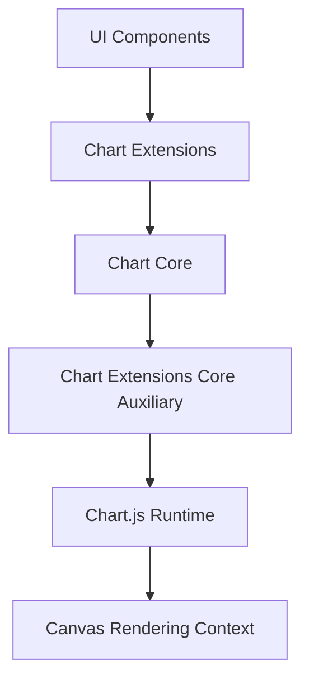
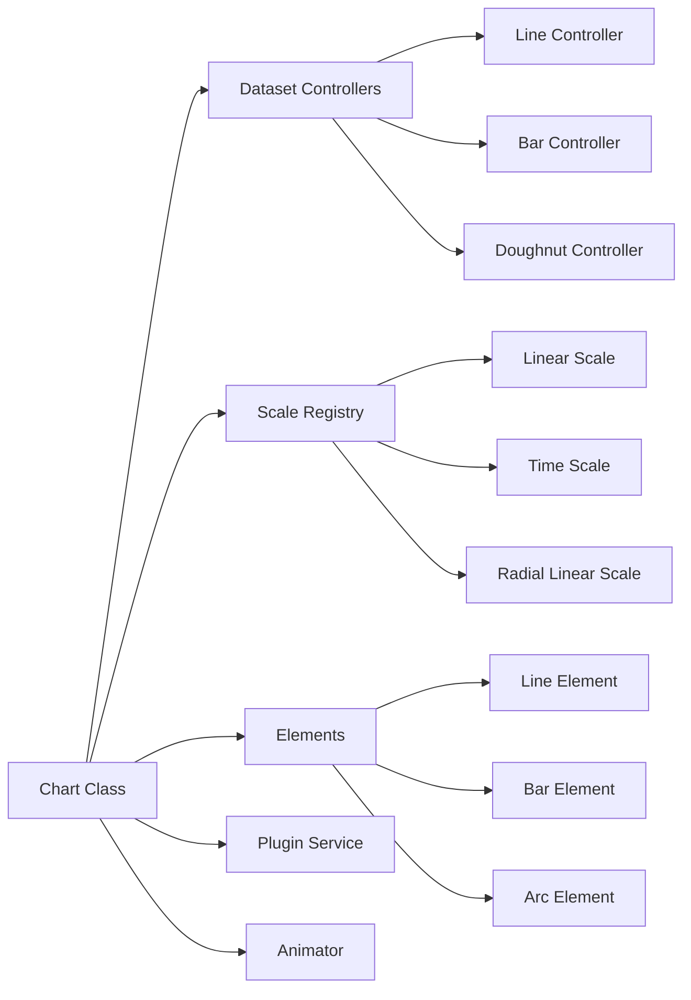
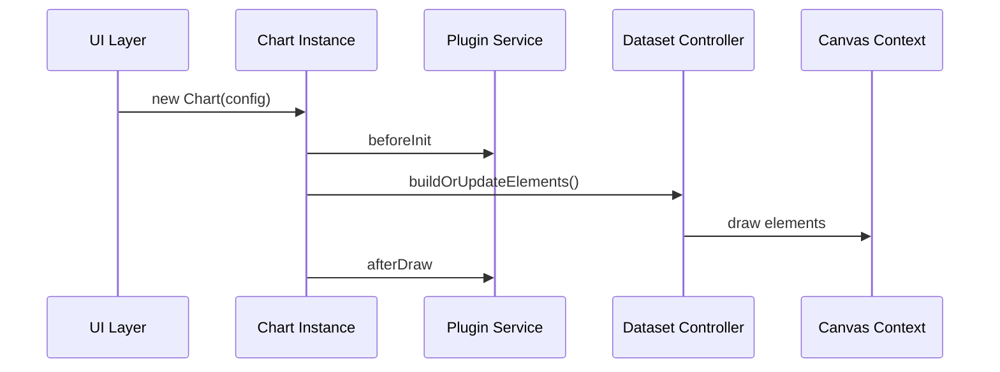
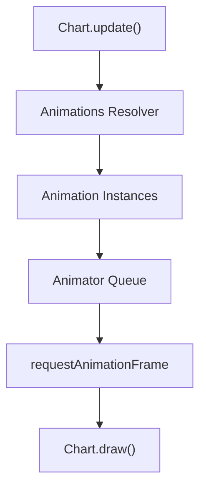
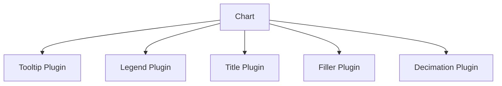
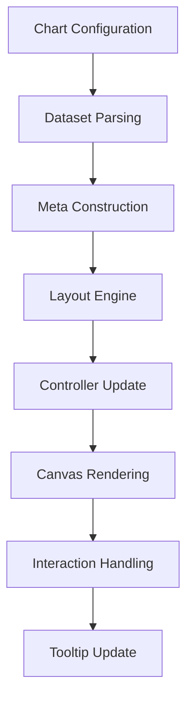

# Chart Extensions Core Auxiliary

The **Chart Extensions Core Auxiliary** module provides auxiliary core functionality for the chart extensions layer built on top of Chart.js v4.3.3. It encapsulates the `meshcentral.public.scripts.charts.so` component, which exposes the Chart.js runtime and its extension points to the rest of the MeshCentral UI.

This module acts as the low-level integration surface between:

- The Chart Core and Chart Extensions modules
- The Chart.js rendering and animation engine
- Plugin, scale, controller, and element registries

It does not define business-specific charts itself. Instead, it provides the foundational extension hooks and runtime services required by higher-level chart modules.

---

## 1. Module Scope and Responsibilities

### Core Component

- `meshcentral.public.scripts.charts.so`
  - Bundled Chart.js runtime (UMD build)
  - Registers controllers, elements, scales, and plugins
  - Exposes animation engine, layout engine, and interaction model

### Primary Responsibilities

1. **Chart Runtime Exposure**
   - Exposes `Chart` global
   - Registers built-in controllers (Line, Bar, Pie, Radar, etc.)
   - Registers scales (Linear, Logarithmic, Time, Radial)

2. **Extension Infrastructure**
   - Plugin registration (`Chart.register(...)`)
   - Controller extension
   - Element customization
   - Tooltip, legend, and title overrides

3. **Rendering & Animation Engine**
   - Dataset controllers
   - Element lifecycle (`update`, `draw`)
   - Animation orchestration (`Animations`, `Animation`, animator)

4. **Interaction Layer**
   - Hover modes
   - Tooltip resolution
   - Active element tracking

---

## 2. High-Level Architecture

The Chart Extensions Core Auxiliary module sits beneath chart-specific extensions and above raw canvas rendering.



### Layer Roles

- **UI Components** – Dashboards, cards, widgets consuming charts
- **Chart Extensions** – Feature-specific chart logic
- **Chart Core** – Shared chart configuration logic
- **Chart Extensions Core Auxiliary** – Runtime + extension plumbing
- **Chart.js Runtime** – Rendering, animation, plugin engine

---

## 3. Internal Runtime Structure

The `so` component bundles and initializes the entire Chart.js ecosystem.



### Key Subsystems

| Subsystem | Purpose |
|------------|----------|
| `DatasetController` | Manages parsing, updating, drawing datasets |
| `Scale` | Maps data values to pixels |
| `Element` | Primitive drawable units (line, arc, point, bar) |
| `Animations` | Property interpolation and transitions |
| `PluginService` | Lifecycle hooks (`beforeDraw`, `afterUpdate`, etc.) |

---

## 4. Extension and Plugin Flow

Chart Extensions Core Auxiliary enables extension through the Chart.js plugin and registry system.



### Plugin Hooks Exposed

- `beforeInit`
- `beforeUpdate`
- `afterUpdate`
- `beforeDraw`
- `afterDraw`
- `beforeDatasetsDraw`
- `afterDatasetsDraw`

Higher-level chart extensions can register plugins via:

```javascript
Chart.register(MyCustomPlugin);
```

---

## 5. Animation Engine Integration

The auxiliary module includes the full animation stack:

- `Animation` – Single property transition
- `Animations` – Batch animation manager
- `Animator` – Global frame scheduler



### Animation Characteristics

- Easing functions (linear, easeInOut, etc.)
- Per-property animation definitions
- Dataset-level and element-level animations
- Tooltip animation support

---

## 6. Scale and Coordinate System Integration

The module integrates multiple scale types:

- Linear
- Logarithmic
- Category
- Time
- TimeSeries
- Radial Linear

Scale responsibilities:

1. Determine data limits
2. Generate ticks
3. Map values to pixels
4. Provide reverse mapping (pixel → value)

This allows higher-level chart extensions to rely on consistent coordinate transformation behavior.

---

## 7. Tooltip, Legend, and Title Infrastructure

The auxiliary layer registers built-in plugins:

- **Tooltip Plugin**
- **Legend Plugin**
- **Title Plugin**
- **Subtitle Plugin**
- **Filler Plugin**
- **Decimation Plugin**
- **Colors Plugin**

These are automatically available to all charts built on top of this module.



Extensions can:

- Override tooltip callbacks
- Replace legend generation
- Inject external tooltip handlers
- Enable dataset decimation for performance

---

## 8. Data Flow Lifecycle



### Lifecycle Phases

1. Configuration resolution
2. Dataset parsing
3. Scale calculation
4. Layout computation
5. Element update
6. Rendering
7. Interaction evaluation

---

## 9. Relationship to Other Chart Modules

Within the chart hierarchy:

- Parent: **Chart Extensions Core**
- Sibling: **Chart Extensions Core Main**

This module specifically:

- Supplies runtime and infrastructure
- Avoids domain-specific rendering logic
- Provides extensibility contracts

It is consumed by higher-level chart extension modules that implement feature-specific visualizations.

---

## 10. When to Modify This Module

Changes in this module should be limited to:

- Upgrading Chart.js runtime
- Adjusting default plugin registration
- Modifying animation defaults
- Extending core registry behavior

It should **not** include:

- Dashboard-specific chart logic
- Business rules
- UI layout decisions

---

## Summary

The **Chart Extensions Core Auxiliary** module is the foundational runtime layer that:

- Hosts the Chart.js engine
- Registers controllers, scales, and elements
- Manages rendering and animation
- Enables plugin-driven extensibility
- Powers interaction and tooltip systems

It forms the technical backbone for all chart-based functionality in the MeshCentral UI stack.
