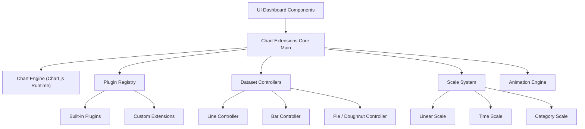
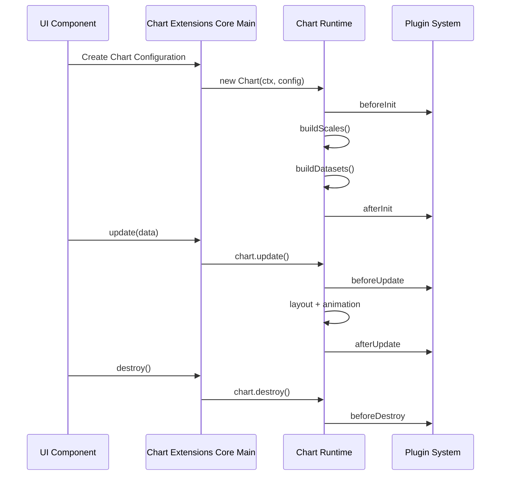
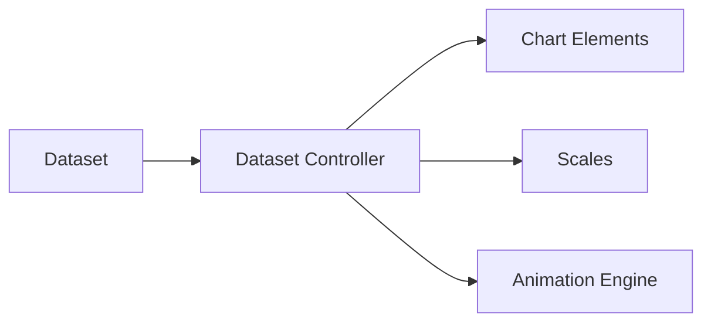
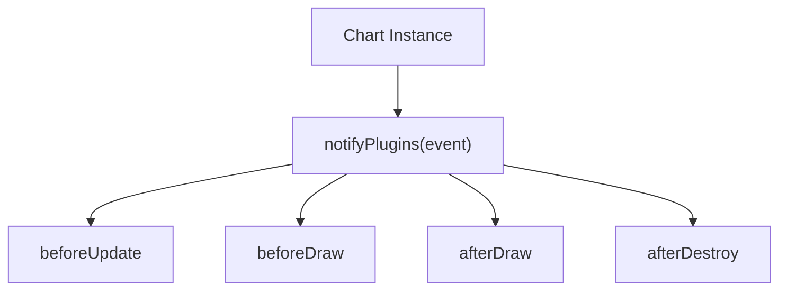
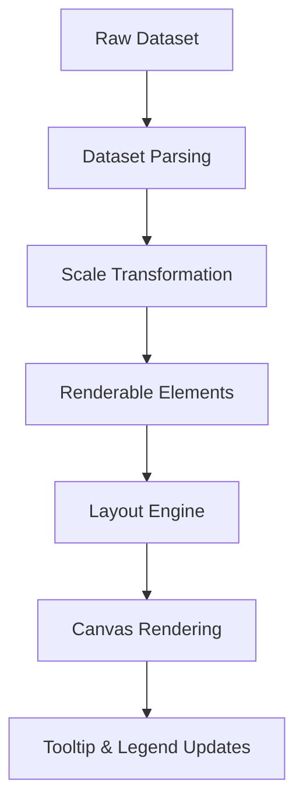

# Chart Extensions Core Main

## Overview

The **Chart Extensions Core Main** module represents the primary integration layer between MeshCentral and the embedded Chart.js engine. It is responsible for initializing, configuring, and exposing the core charting runtime used across dashboards, reporting views, and analytics components.

At its core, this module bundles and configures the main Chart.js runtime (v4.x), wires default plugins, and exposes the primary chart constructors and extension hooks used by higher-level chart utilities and extensions.

This module is part of the following hierarchy:

- Parent: Chart Extensions Core
- Sibling: Chart Extensions Core Auxiliary

---

## Core Components

The module is primarily built around the following Chart.js runtime components:

- `meshcentral.public.scripts.charts.rs`
- `meshcentral.public.scripts.charts.sn`

These correspond to:

- The **Chart core class** (chart lifecycle, rendering pipeline)
- The **Plugin and extension registry system**

Together, they form the execution backbone for all chart rendering and extension logic.

---

## Architectural Role

The Chart Extensions Core Main module provides:

1. Chart lifecycle management (init, update, destroy)
2. Dataset and scale orchestration
3. Plugin registration and execution
4. Rendering pipeline coordination
5. Tooltip, legend, title, and layout orchestration
6. Animation and interaction handling

It acts as the central orchestrator for:

- Chart Core Logic
- Chart Core Extensions
- Chart Utilities
- Chart Extensions Utilities

---

## High-Level Architecture

---

## Chart Lifecycle Flow

The Chart Extensions Core Main module governs the complete lifecycle of a chart instance.

---

## Internal Subsystems

### 1. Chart Core Class

The main Chart class is responsible for:

- Holding chart configuration and dataset state
- Managing canvas context
- Triggering scale and controller builds
- Handling responsive resizing
- Managing active/hovered elements

It coordinates all submodules through an internal registry system.

---

### 2. Dataset Controllers

Each dataset type (line, bar, pie, radar, etc.) is managed by a controller.

Responsibilities:

- Parsing raw data
- Creating drawable elements
- Resolving element options
- Performing scale transformations
- Managing animations

---

### 3. Scale System

The scale system transforms raw dataset values into pixel coordinates.

Supported scale types include:

- Linear
- Logarithmic
- Category
- Time
- Radial

Each scale:

- Determines min/max bounds
- Generates ticks
- Converts values to pixel positions
- Supports grid and label rendering

---

### 4. Plugin Architecture

Chart Extensions Core Main includes a full plugin system.

Built-in plugins include:

- Legend
- Tooltip
- Title
- Subtitle
- Filler
- Decimation
- Colors

Plugins can:

- Modify layout
- Inject custom drawing logic
- Transform datasets
- Provide interactive behaviors

---

### 5. Animation Engine

The animation subsystem:

- Tracks active animations per chart
- Interpolates numeric and color properties
- Manages easing functions
- Coordinates redraw scheduling

Animations are centrally managed by an animator instance shared across chart instances.

---

### 6. Interaction and Event Handling

The module integrates:

- Mouse movement detection
- Click detection
- Hover state tracking
- Active element resolution

Interaction modes include:

- Nearest
- Index
- Dataset
- X-axis
- Y-axis

---

## Data Flow Overview

---

## Integration with Other Modules

Chart Extensions Core Main is consumed by:

- Chart Core Logic modules
- Chart Core Extensions Main
- Chart Utilities Core
- Chart Extensions Utilities Core

It provides the foundational runtime used by higher-level chart abstractions.

For auxiliary helpers and support utilities, see the sibling module:

- Chart Extensions Core Auxiliary

---

## Responsibilities Summary

The Chart Extensions Core Main module:

- Boots and exposes the Chart runtime
- Registers built-in controllers and elements
- Enables plugin-driven extensibility
- Provides animation and interaction engines
- Manages scale computations and layout
- Coordinates rendering across chart types

It is the central orchestration layer for all chart rendering and extension logic within the MeshCentral UI.

---

## When to Modify This Module

Changes to this module should only occur when:

- Upgrading the underlying Chart.js runtime
- Modifying core rendering behavior
- Extending global plugin registration
- Adjusting default animation or layout logic

Higher-level behavior (custom chart types, specialized rendering, UI-specific extensions) should be implemented in extension modules rather than directly in this core module.

---

## Conclusion

The **Chart Extensions Core Main** module is the heart of the charting subsystem. It encapsulates the full Chart.js runtime and provides the extensibility, lifecycle management, and rendering orchestration required for dynamic, interactive visualizations throughout the application.