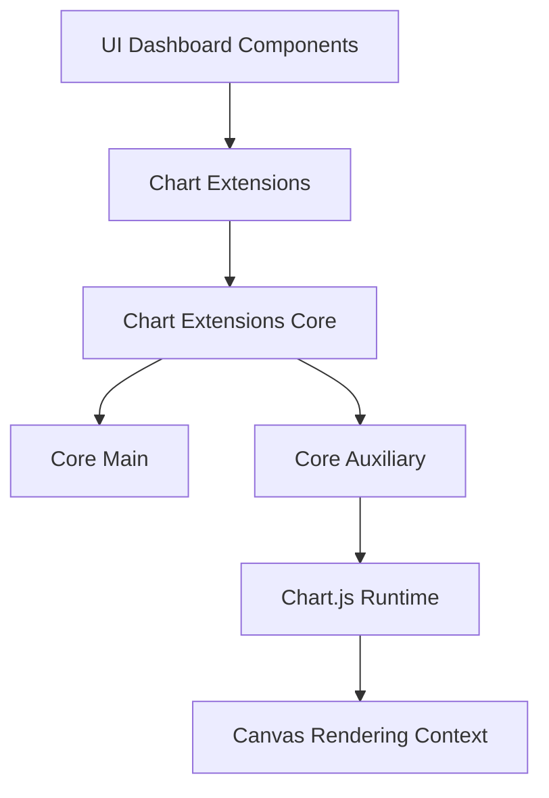
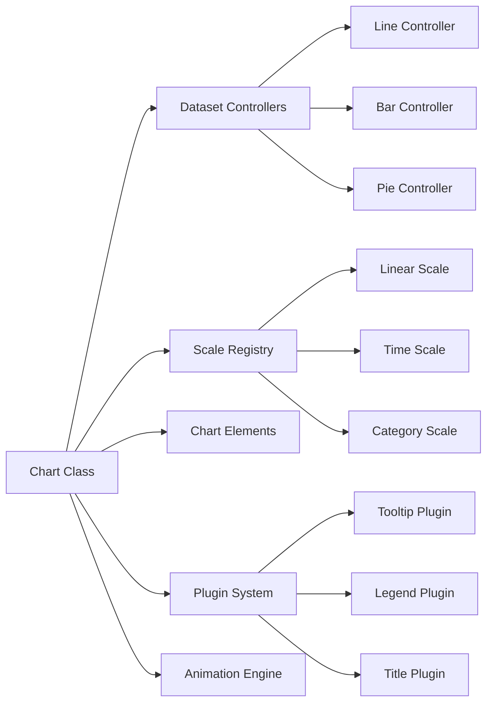
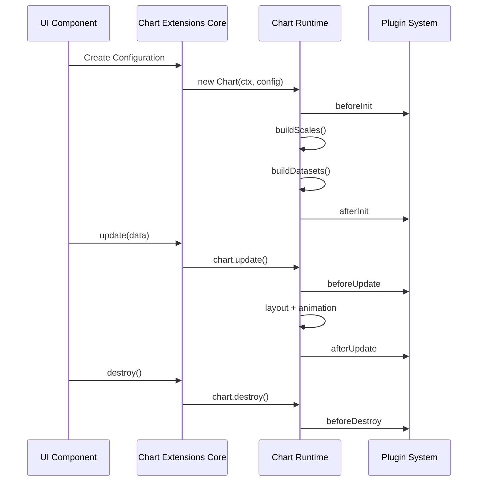
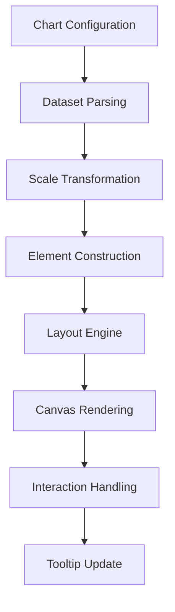

# Chart Extensions Core

The **Chart Extensions Core** module is the foundational integration layer that embeds and orchestrates the Chart.js runtime within the MeshCentral UI. It provides the primary runtime environment, plugin infrastructure, lifecycle management, and extension hooks used by all higher-level chart utilities and domain-specific visualizations.

This module acts as the technical backbone for dashboards, reporting widgets, analytics panels, and any feature that renders interactive charts inside the web interface.

---

## Purpose of the Module

The **Chart Extensions Core** module is responsible for:

- Hosting and exposing the Chart.js runtime
- Registering controllers, scales, elements, and built-in plugins
- Managing chart lifecycle (init, update, destroy)
- Coordinating animation and rendering
- Enabling extension through plugins and custom controllers
- Providing a stable API surface for higher-level chart modules

It does **not** implement business-specific charts. Instead, it provides the infrastructure required for those charts to function consistently and efficiently.

---

## Repository Structure

**Path:** `public/scripts`  
**Namespace:** `meshcentral.public.scripts.charts.*`

### Core Components

Under `chart-extensions → chart-extensions-core`:

- `meshcentral.public.scripts.charts.rs`
- `meshcentral.public.scripts.charts.sn`
- `meshcentral.public.scripts.charts.so`

### Internal Submodules

#### 1. Chart Extensions Core Main
Primary runtime orchestration layer:

- `meshcentral.public.scripts.charts.rs`
- `meshcentral.public.scripts.charts.sn`

Responsible for:
- Chart lifecycle coordination
- Dataset and scale orchestration
- Plugin execution flow
- Rendering pipeline management

#### 2. Chart Extensions Core Auxiliary
Low-level Chart.js runtime exposure:

- `meshcentral.public.scripts.charts.so`

Responsible for:
- Bundled Chart.js runtime (v4.x)
- Controller, element, and scale registration
- Animation engine
- Plugin infrastructure
- Interaction handling

---

## High-Level Architecture

### Layer Responsibilities

- **UI Dashboard Components** – Feature-level consumers
- **Chart Extensions** – Domain-specific chart implementations
- **Chart Extensions Core** – Shared runtime orchestration
- **Core Auxiliary** – Embedded Chart.js runtime
- **Canvas Context** – Low-level rendering surface

---

## Internal Architecture

---

## Chart Lifecycle Flow

The module governs the complete lifecycle of chart instances:

---

## Core Responsibilities

### 1. Runtime Bootstrapping
- Initializes the Chart.js engine
- Registers built-in controllers and elements
- Sets default configuration and plugin stack

### 2. Dataset Controllers
- Parse raw datasets
- Create drawable elements
- Coordinate scale transformations
- Manage per-dataset animations

### 3. Scale System
- Compute data limits
- Generate ticks
- Map data values to pixels
- Support linear, logarithmic, category, time, and radial scales

### 4. Plugin Infrastructure
- Lifecycle hooks (`beforeDraw`, `afterUpdate`, etc.)
- Tooltip and legend orchestration
- Layout modifications
- Custom extension injection

### 5. Animation Engine
- Property interpolation
- Easing functions
- Frame scheduling
- Coordinated redraw management

### 6. Interaction Model
- Hover detection
- Active element resolution
- Click handling
- Tooltip synchronization

---

## Data Flow Overview

---

## Relationship to Other Chart Modules

The **Chart Extensions Core** module sits at the center of the chart subsystem hierarchy:

- **Parent:** Chart Extensions
- **Siblings:** Chart Extensions Utilities
- **Consumers:** Chart Core Logic, Chart Core Extensions, UI Dashboards

It provides the runtime and extensibility contracts relied upon by:

- Chart Core modules
- Chart Utilities modules
- Higher-level feature-specific charts

For detailed component-level documentation, refer to:

- **Chart Extensions Core Main**
- **Chart Extensions Core Auxiliary**

---

## When to Modify This Module

Changes should be limited to:

- Upgrading the Chart.js runtime
- Adjusting plugin registration
- Modifying global animation defaults
- Extending registry behavior

Avoid introducing:

- Business logic
- Dashboard-specific rendering decisions
- Feature-level chart definitions

---

## Summary

The **Chart Extensions Core** module is the foundational runtime layer for all chart rendering in MeshCentral. It:

- Embeds and configures Chart.js
- Manages lifecycle and rendering
- Enables plugin-driven extensibility
- Provides animation and interaction engines
- Serves as the backbone for all higher-level chart modules

Without this module, no interactive chart functionality would be available in the UI stack.