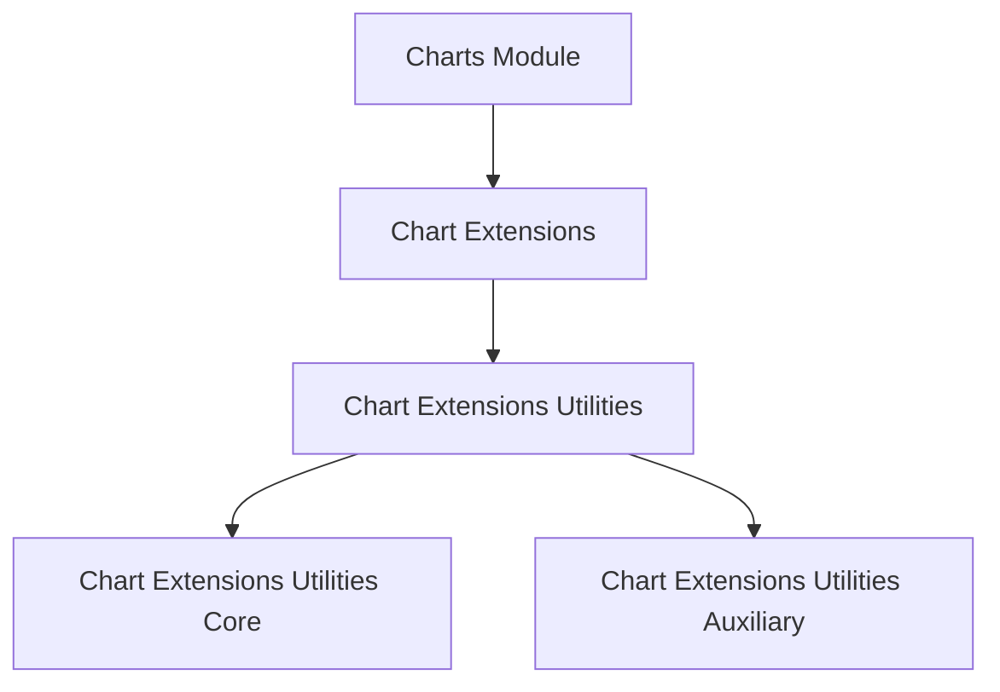
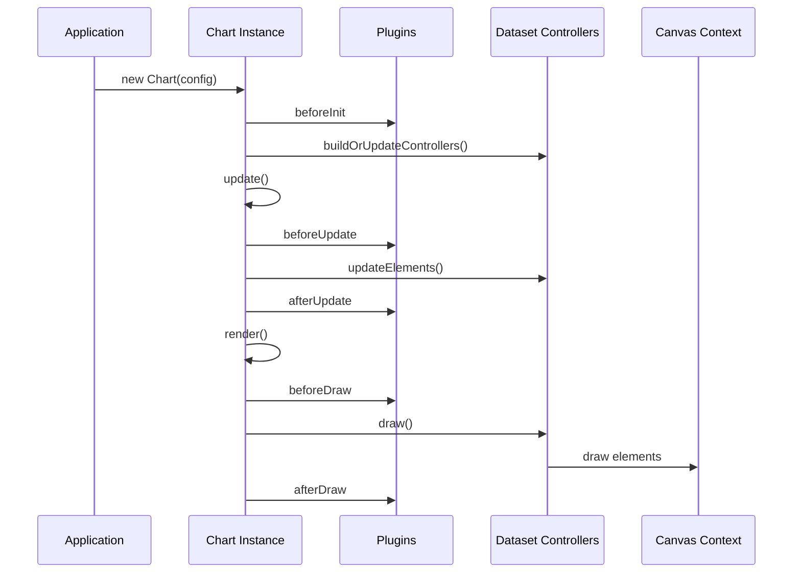
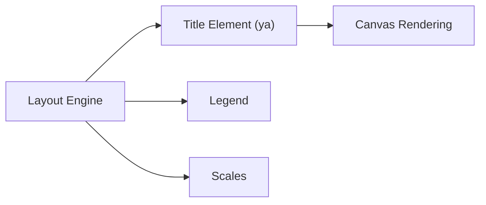
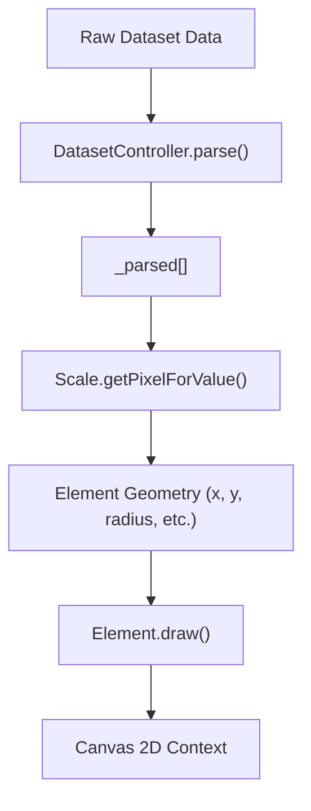
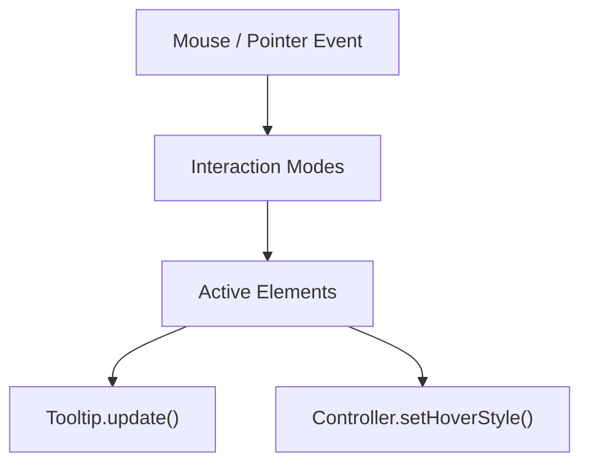
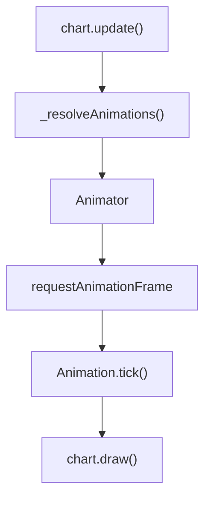
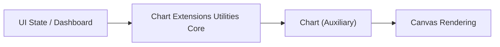

# Chart Extensions Utilities Auxiliary

The **Chart Extensions Utilities Auxiliary** module encapsulates the auxiliary layer of the Chart Extensions Utilities stack. It primarily exposes and integrates advanced Chart.js functionality through the core components:

- `meshcentral.public.scripts.charts.ws`
- `meshcentral.public.scripts.charts.ya`

These components collectively represent the Chart.js UMD bundle and its extended utility bindings used across MeshCentral’s UI dashboards and analytical views.

This module sits under the Chart Extensions Utilities hierarchy and provides:

- The Chart.js runtime (rendering engine, controllers, scales, elements, plugins)
- Tooltip, legend, title, subtitle, filler, decimation, and color plugins
- Interaction modes and animation engine
- Core chart primitives (Line, Bar, Arc, Point, Radar, etc.)

---

## Position in the Module Hierarchy

This module is part of the Chart Extensions Utilities branch:

- Parent: [Chart Extensions Utilities](../chart-extensions-utilities.md)
- Sibling (Core): [Chart Extensions Utilities Core](../chart-extensions-utilities-core/chart-extensions-utilities-core.md)

### Hierarchical Context



The **Chart Extensions Utilities Auxiliary** module provides the heavy-weight rendering and plugin engine, while the Core layer typically wires configuration and integration logic.

---

## Architectural Overview

At its heart, this module bundles Chart.js (v4.x) and exposes its registry-driven architecture.

### High-Level Architecture

```mermaid
flowchart TD
    ChartAPI["Chart API (Chart)"] --> Registry["Registry"]
    Registry --> Controllers["Dataset Controllers"]
    Registry --> Elements["Visual Elements"]
    Registry --> Scales["Scales"]
    Registry --> Plugins["Plugins"]

    Controllers --> LineController["Line Controller"]
    Controllers --> BarController["Bar Controller"]
    Controllers --> DoughnutController["Doughnut Controller"]

    Elements --> LineElement["Line Element"]
    Elements --> PointElement["Point Element"]
    Elements --> ArcElement["Arc Element"]
    Elements --> BarElement["Bar Element"]

    Scales --> LinearScale["Linear Scale"]
    Scales --> CategoryScale["Category Scale"]
    Scales --> TimeScale["Time Scale"]
    Scales --> RadialScale["Radial Linear Scale"]

    Plugins --> TooltipPlugin["Tooltip Plugin"]
    Plugins --> LegendPlugin["Legend Plugin"]
    Plugins --> TitlePlugin["Title / Subtitle Plugin"]
    Plugins --> FillerPlugin["Filler Plugin"]
    Plugins --> DecimationPlugin["Decimation Plugin"]
    Plugins --> ColorsPlugin["Colors Plugin"]
```



The auxiliary module registers all controllers, scales, elements, and built-in plugins into the Chart registry, making them available to higher-level chart configuration layers.

---

## Core Component Responsibilities

### 1. `ws` – Chart Runtime (Chart.js UMD)

This component:

- Exposes the global `Chart` class
- Registers built-in controllers, elements, and scales
- Provides animation engine (`Animation`, `Animations`, `animator`)
- Implements plugin lifecycle hooks
- Manages dataset parsing and rendering pipeline

#### Rendering Lifecycle



This lifecycle ensures extensibility through hooks like:

- `beforeInit`, `afterInit`
- `beforeUpdate`, `afterUpdate`
- `beforeDraw`, `afterDraw`
- `beforeDatasetDraw`, `afterDatasetDraw`

---

### 2. `ya` – Title / Layout Element

The `ya` component implements a layout box used for titles and subtitles. It integrates with the layout manager and:

- Calculates text metrics
- Applies padding and alignment
- Draws horizontal or vertical title blocks
- Participates in chart box layout negotiation

#### Layout Integration



The title element behaves as a full-size layout box and influences chart area dimensions.

---

## Data Flow and Rendering Pipeline

### Dataset Parsing to Pixel Rendering



Key responsibilities:

- Controllers: translate raw data → parsed model
- Scales: map domain values → pixel coordinates
- Elements: render primitives (arc, line, bar, point)
- Plugins: augment rendering (tooltip, legend, filler)

---

## Interaction System

The auxiliary module provides built-in interaction modes:

- `index`
- `dataset`
- `point`
- `nearest`
- `x`
- `y`

### Interaction Resolution Flow



This enables:

- Hover highlighting
- Click-based toggling
- Tooltip positioning strategies (average, nearest)

---

## Animation Engine

Animations are handled by:

- `Animation`
- `Animations`
- Global animator (`animator`)

Features include:

- Property-based animations (numbers, colors)
- Easing functions (linear, easeOutQuart, etc.)
- Looping and staged transitions
- Per-dataset and per-element animation scopes

### Animation Flow



---

## Built-in Plugins

This module registers several built-in plugins:

- **Tooltip** – dynamic overlay with callbacks
- **Legend** – dataset toggling and labeling
- **Title / Subtitle** – layout-aware header blocks
- **Filler** – area fills between lines or to origin
- **Decimation** – data downsampling (LTTB / MinMax)
- **Colors** – automatic dataset color assignment

Each plugin follows the plugin contract:

```text
beforeInit
beforeUpdate
afterUpdate
beforeDraw
afterDraw
beforeDatasetDraw
afterDatasetDraw
```

Plugins can:

- Modify layout
- Inject drawing logic
- Intercept events
- Transform datasets

---

## Performance Considerations

The auxiliary module includes performance-oriented utilities:

- **Data decimation** for large time-series datasets
- Internal caching of parsed values
- Lookup tables for time-series scales
- Animation frame batching

When handling high-density charts (e.g., telemetry or monitoring data), decimation and disabled animations significantly improve rendering performance.

---

## Integration with Higher Layers

The **Chart Extensions Utilities Auxiliary** module is not typically used directly. Instead:

- The Core layer prepares configuration objects
- The Auxiliary layer executes rendering and interaction
- Parent modules orchestrate UI state and data updates



---

## Summary

The **Chart Extensions Utilities Auxiliary** module:

- Embeds the full Chart.js runtime
- Provides rendering, interaction, animation, and plugin systems
- Supplies built-in chart types and scales
- Serves as the execution engine for all chart-based visualizations in MeshCentral

It forms the foundational rendering layer beneath the Core utilities and higher-level dashboard integrations, enabling rich, extensible, and performant chart visualizations across the platform.
