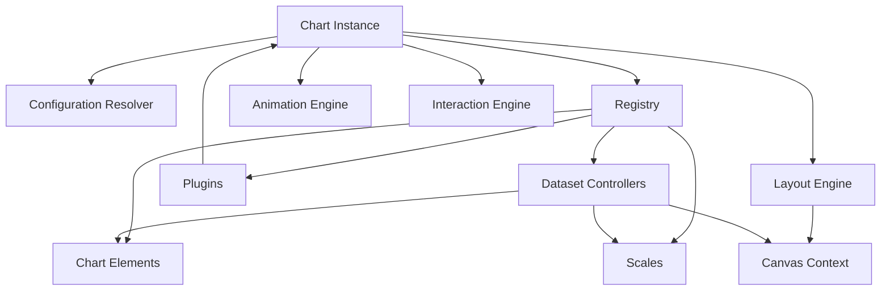
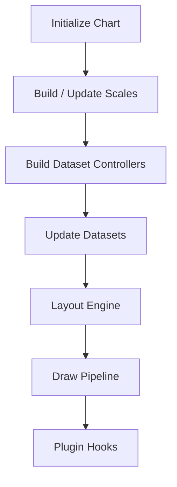
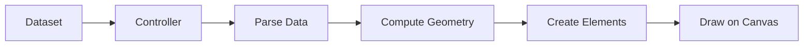
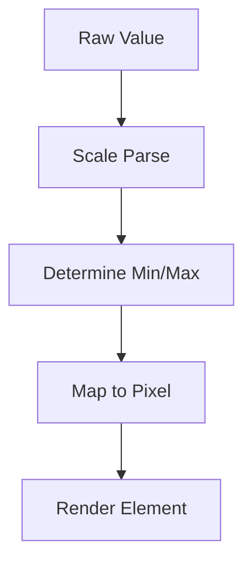
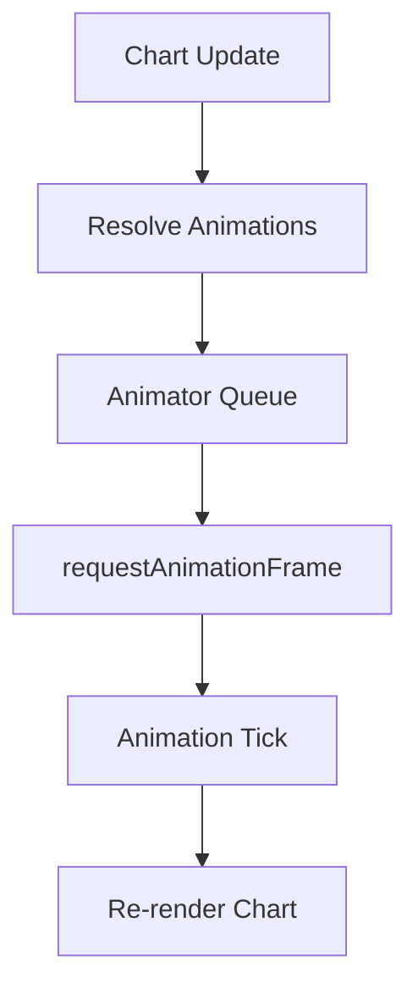
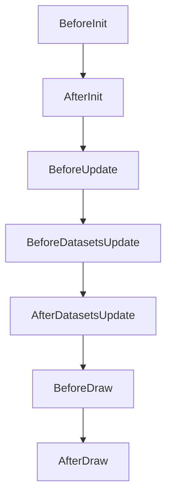
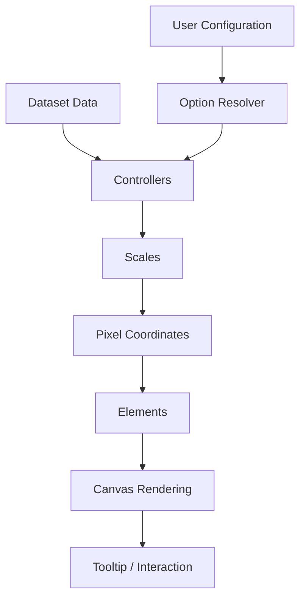

# Chart Extensions Utilities Core Auxiliary

## Overview

The **Chart Extensions Utilities Core Auxiliary** module encapsulates the embedded **Chart.js v4.3.3 UMD bundle** used by MeshCentral’s UI layer for advanced chart rendering.  

At its core, this module exposes the `Chart` constructor (via `meshcentral.public.scripts.charts.wo`) and bundles:

- Core chart engine (controllers, elements, scales)
- Built-in plugins (Legend, Tooltip, Title, SubTitle, Filler, Colors, Decimation)
- Interaction engine
- Animation framework
- Layout and rendering pipeline

This module acts as the **charting runtime foundation** for higher-level chart extensions and utilities in the Chart Extensions hierarchy.

---

## Primary Export

### `meshcentral.public.scripts.charts.wo`

This component provides the full Chart.js runtime, exported as a UMD module and attached globally as `Chart` when executed in a browser context.

It enables:

- Chart instantiation (`new Chart(ctx, config)`)
- Dataset parsing and controller orchestration
- Rendering lifecycle management
- Plugin registration and execution
- Scale computation and layout management

---

# Architectural Overview

The Chart Extensions Utilities Core Auxiliary module contains the full internal architecture of Chart.js.

---

# Core Subsystems

## 1. Chart Core

The `Chart` class orchestrates:

- Configuration resolution
- Dataset meta management
- Scale building
- Layout calculations
- Plugin execution hooks
- Rendering passes

### Rendering Flow

---

## 2. Dataset Controllers

Controllers translate dataset definitions into renderable elements.

Examples embedded in this module:

- Line Controller
- Bar Controller
- Scatter Controller
- Doughnut Controller
- Pie Controller
- Polar Area Controller
- Radar Controller

Each controller:

- Parses raw dataset input
- Computes geometry (pixels)
- Creates and updates elements
- Manages stacking logic

---

## 3. Elements Layer

Elements represent drawable primitives:

- Line Element
- Arc Element
- Bar Element
- Point Element

Each element handles:

- Hit detection
- Hover states
- Animations
- Canvas path generation

---

## 4. Scale System

Scale classes transform raw values into pixel coordinates.

Included scale types:

- Category Scale
- Linear Scale
- Logarithmic Scale
- Time Scale
- Time Series Scale
- Radial Linear Scale

### Scale Data Flow

---

## 5. Animation Engine

The animation subsystem consists of:

- `Animation` class
- `Animations` collection
- Global animator scheduler

It supports:

- Property interpolation
- Easing functions
- Looping animations
- Frame scheduling via `requestAnimationFrame`

---

## 6. Interaction Engine

The interaction subsystem provides:

- Hover detection
- Nearest element resolution
- Dataset / index mode queries
- Tooltip activation

Interaction modes include:

- nearest
- index
- dataset
- point
- x
- y

---

## 7. Plugin System

The plugin architecture enables lifecycle interception.

Built-in plugins included:

- Legend
- Tooltip
- Title
- SubTitle
- Filler
- Colors
- Decimation

### Plugin Lifecycle

Plugins can:

- Modify datasets
- Override rendering
- Inject layout boxes
- Implement advanced behaviors (e.g., area filling)

---

# Data Flow Through the System

---

# Rendering Lifecycle

1. Configuration resolved
2. Scales built or updated
3. Controllers parse datasets
4. Layout engine allocates space
5. Animations applied
6. Elements rendered
7. Plugins invoked

This entire lifecycle is orchestrated by the `Chart` instance.

---

# Performance Features

The embedded bundle includes:

- **Decimation plugin** for large datasets
- Efficient segment computation
- Animation batching
- Layout caching
- Data normalization

These capabilities ensure charts remain responsive even with high-frequency or large datasets.

---

# Integration Within Chart Extensions Hierarchy

The Chart Extensions Utilities Core Auxiliary module acts as:

- The **runtime engine** for all chart extensions
- The provider of base controllers and elements
- The foundation for higher-level chart utility modules

Higher modules build on this by:

- Extending controllers
- Registering custom plugins
- Providing configuration wrappers
- Adding domain-specific chart abstractions

---

# Responsibilities Summary

| Area | Responsibility |
|------|----------------|
| Core Engine | Chart lifecycle orchestration |
| Controllers | Dataset parsing and geometry computation |
| Elements | Canvas rendering primitives |
| Scales | Value-to-pixel transformation |
| Animations | Smooth transitions and interpolation |
| Plugins | Extensibility and feature injection |
| Interaction | Hover, selection, tooltip logic |

---

# Conclusion

The **Chart Extensions Utilities Core Auxiliary** module embeds the complete Chart.js runtime and exposes it as a foundational utility for all chart-related functionality.

It provides:

- Rendering engine
- Scale framework
- Plugin architecture
- Interaction system
- Animation engine

All higher-level chart extensions within the MeshCentral UI ecosystem rely on this module as their execution backbone.
