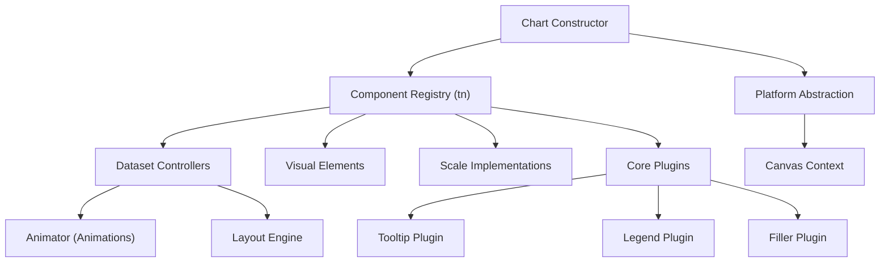
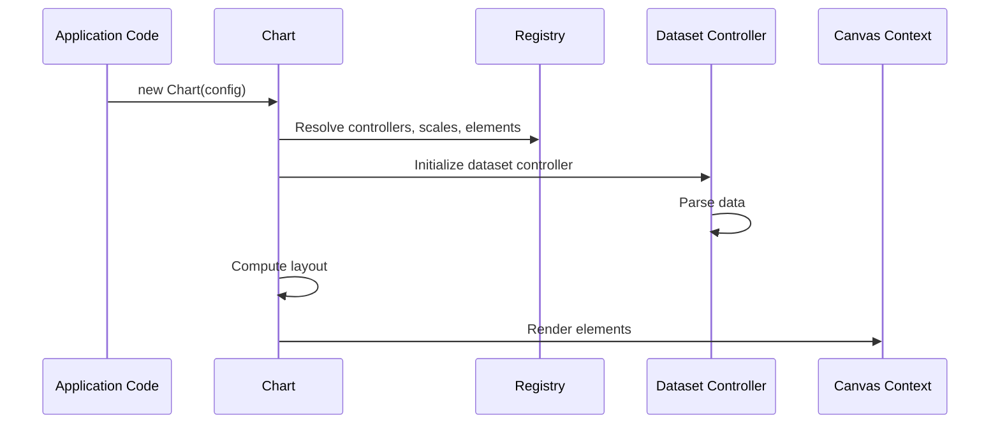
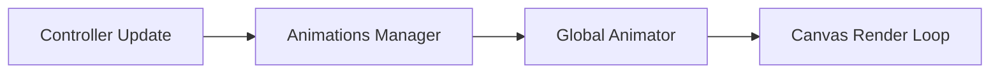
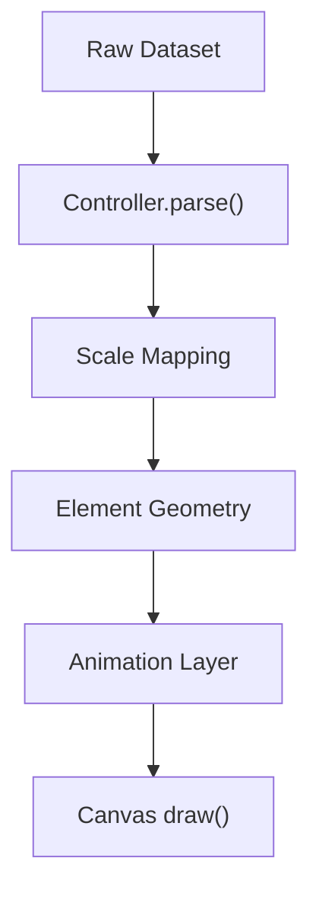
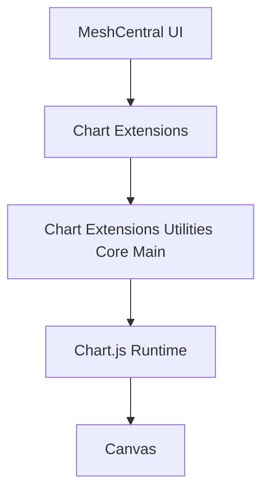

# Chart Extensions Utilities Core Main

## Overview

**Chart Extensions Utilities Core Main** is the foundational module that exposes and configures the Chart.js runtime within the MeshCentral frontend. It centers around the `meshcentral.public.scripts.charts.tn` registry class and bootstraps the complete charting stack (controllers, elements, scales, plugins, platforms, animations, and helpers).

At runtime, this module:

- Registers core controllers (line, bar, pie, doughnut, scatter, radar, polar area)
- Registers visual elements (arc, line, point, bar)
- Registers scales (linear, logarithmic, category, time, radial)
- Registers built-in plugins (legend, tooltip, filler, decimation, colors, title, subtitle)
- Exposes the global `Chart` constructor
- Wires animation, layout, and rendering orchestration

This module is the entry point for all chart rendering logic used by higher-level chart utilities and extensions.

---

## Core Component

### `meshcentral.public.scripts.charts.tn`

This class acts as the **typed registry manager** for Chart.js components.

It maintains separate registries for:

- Controllers
- Elements
- Plugins
- Scales

It provides methods to:

- `add()` / `remove()` components
- `addControllers()`
- `addElements()`
- `addPlugins()`
- `addScales()`
- Resolve components by ID

This registry is used during Chart initialization to dynamically construct the rendering pipeline.

---

## High-Level Architecture

---

## Runtime Flow

When a chart is created:

1. Configuration is parsed
2. Scales are built
3. Controllers are instantiated per dataset
4. Elements are created
5. Layout is computed
6. Animations are scheduled
7. Canvas rendering occurs

---

## Internal Subsystems

### 1. Registry System

The registry (`tn`) ensures decoupled component registration. This allows:

- Custom controller injection
- Plugin-based extensions
- Selective scale usage
- Modular architecture

### 2. Controller Layer

Controllers (e.g., LineController, BarController) are responsible for:

- Parsing raw dataset values
- Managing element creation
- Applying stacking logic
- Computing geometry
- Coordinating animations

Each controller owns:

- Dataset element (optional)
- Data point elements
- Cached metadata

### 3. Element Layer

Elements define how visual primitives render:

- `ArcElement`
- `LineElement`
- `PointElement`
- `BarElement`

They implement:

- `draw()`
- `inRange()`
- `getCenterPoint()`
- Hit testing logic

### 4. Scale System

Scales convert data values into pixel coordinates.

Examples:

- LinearScale
- LogarithmicScale
- CategoryScale
- TimeScale
- RadialLinearScale

Scales handle:

- Tick generation
- Domain calculation
- Pixel interpolation
- Layout constraints

### 5. Plugin System

Built-in plugins include:

- Legend
- Tooltip
- Title
- Subtitle
- Filler
- Decimation
- Colors

Plugins hook into lifecycle stages:

- `beforeInit`
- `beforeUpdate`
- `afterUpdate`
- `beforeDraw`
- `afterDraw`

---

## Animation & Rendering Engine

The animation subsystem includes:

- `Animation` (Cs)
- `Animations` (Os)
- Animator scheduler

Key behaviors:

- Property-level tweening
- Easing support
- Batched redraw scheduling
- Frame synchronization

---

## Layout System

The layout engine:

- Calculates chart area
- Positions scales
- Allocates legend/title blocks
- Applies padding

Boxes (legend, title, subtitle, scales) register into a layout stack.

---

## Platform Abstraction

Two platform types are supported:

- DOM Platform (browser canvas)
- Basic Platform (fallback)

Platform responsibilities:

- Event binding
- Resize observation
- Device pixel ratio scaling
- Context acquisition

---

## Data Decimation

The Decimation plugin supports:

- LTTB (Largest Triangle Three Buckets)
- Min/Max sampling

Purpose:

- Improve rendering performance for large datasets
- Reduce memory footprint
- Maintain visual fidelity

---

## Extension Integration

This module provides the **core runtime** for higher-level chart extensions and utilities.

It integrates with:

- [Chart Extensions Utilities Core Auxiliary](../chart-extensions-utilities-core-auxiliary/chart-extensions-utilities-core-auxiliary.md)

The auxiliary module typically builds on top of this registry and runtime to add:

- Custom utility helpers
- MeshCentral-specific configuration wrappers
- Preconfigured chart types

---

## Data → Pixel → Canvas Pipeline

---

## Responsibilities Summary

| Layer | Responsibility |
|--------|---------------|
| Registry | Component lifecycle management |
| Controllers | Dataset logic + geometry calculation |
| Elements | Primitive rendering |
| Scales | Domain to pixel transformation |
| Layout | Chart region allocation |
| Animator | Transition orchestration |
| Plugins | Cross-cutting features |

---

## Why This Module Matters

Chart Extensions Utilities Core Main is the structural backbone of all chart functionality in the MeshCentral UI.

It:

- Defines the rendering contract
- Controls lifecycle sequencing
- Provides extension hooks
- Ensures consistent animation and layout behavior
- Centralizes plugin integration

Without this module, higher-level chart utilities and extensions cannot function.

---

## Conceptual Position in the System

This module is the bridge between MeshCentral’s frontend chart utilities and the underlying Chart.js engine.

---

## Conclusion

**Chart Extensions Utilities Core Main** initializes, configures, and orchestrates the entire Chart.js runtime within the MeshCentral environment.

It is responsible for:

- Component registration
- Dataset lifecycle management
- Rendering orchestration
- Plugin coordination
- Performance optimization hooks

All higher-level chart functionality depends on this foundational runtime layer.