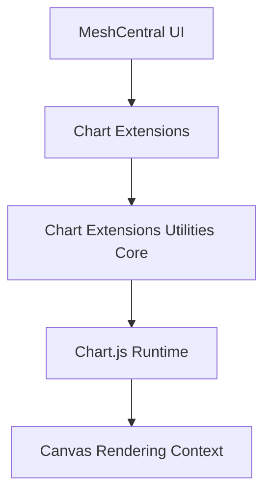
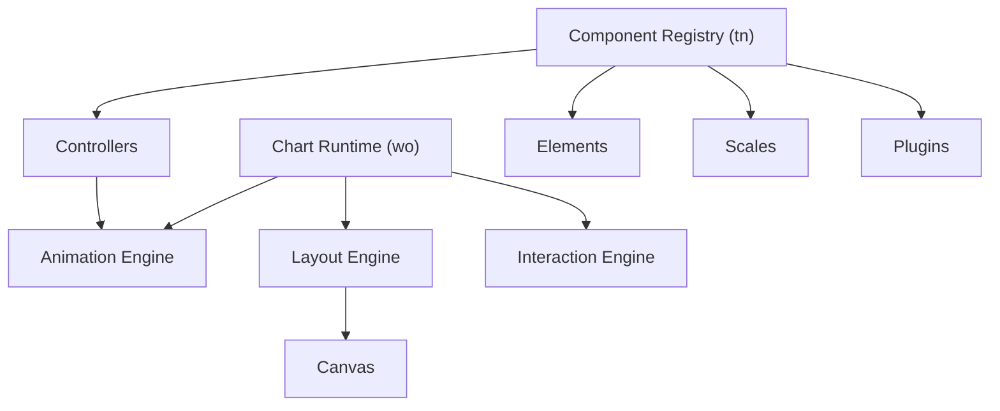
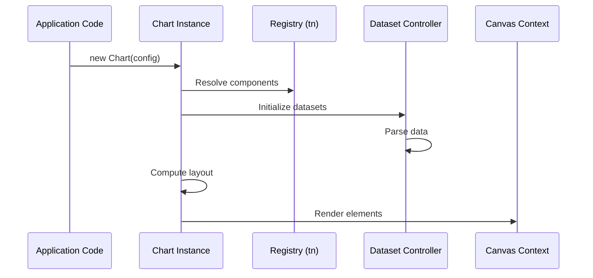
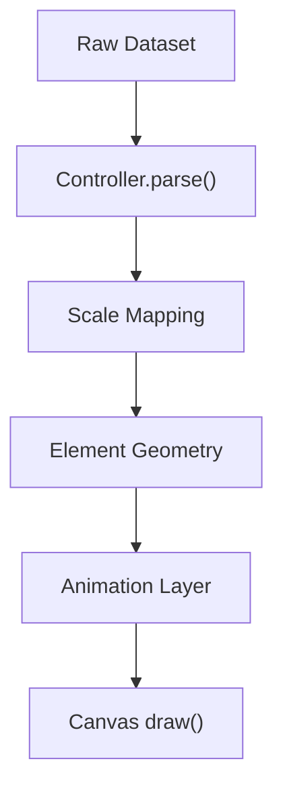
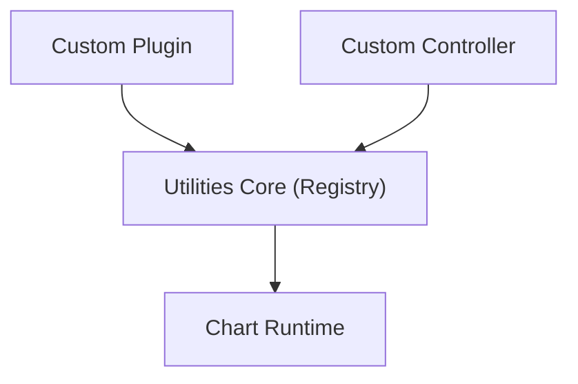

# Chart Extensions Utilities Core

## Overview

**Chart Extensions Utilities Core** is a foundational module within the MeshCentral frontend charting stack. It provides the utility-layer glue between:

- The embedded Chart.js runtime (via `chart-extensions-utilities-core-auxiliary`)
- Higher-level chart extensions
- MeshCentral-specific chart configuration and orchestration logic

This module encapsulates the core utility components that extend and adapt the Chart.js engine for internal use in dashboards, analytics panels, and reporting views.

It lives under:

```text
public/scripts
└── charts
    └── chart-extensions
        └── chart-extensions-utilities
            └── chart-extensions-utilities-core
```

Primary components:

- `meshcentral.public.scripts.charts.tn`
- `meshcentral.public.scripts.charts.wo`

---

## Purpose of the Module

The **Chart Extensions Utilities Core** module is responsible for:

1. Exposing the Chart.js runtime into the MeshCentral UI layer.
2. Managing the typed registry of chart components (controllers, elements, plugins, scales).
3. Providing a structured extension point for:
   - Custom plugins
   - Extended controllers
   - Utility helpers
4. Standardizing chart initialization and lifecycle handling.
5. Acting as the runtime backbone for all higher-level chart extensions.

Without this module, higher-level chart utility and extension layers cannot instantiate or configure charts consistently.

---

## High-Level Architecture



### Responsibilities by Layer

| Layer | Responsibility |
|-------|----------------|
| Chart.js Runtime | Rendering engine, controllers, elements, scales |
| Utilities Core | Registry wiring, lifecycle orchestration |
| Extensions | Domain-specific chart enhancements |
| UI | Dashboard & analytics integration |

---

## Internal Architecture

The module consists of two tightly integrated subcomponents:

- **Core Main** (`tn`) – Registry & orchestration layer
- **Core Auxiliary** (`wo`) – Embedded Chart.js runtime bundle

### Structural View



---

## Core Components

### 1. `meshcentral.public.scripts.charts.tn`

**Role:** Typed Registry Manager

This component:

- Registers controllers (line, bar, pie, radar, etc.)
- Registers elements (arc, line, bar, point)
- Registers scales (linear, category, time, radial)
- Registers built-in plugins (legend, tooltip, title, filler, decimation)
- Manages add/remove lifecycle

It acts as the dependency injection container for Chart.js components.

---

### 2. `meshcentral.public.scripts.charts.wo`

**Role:** Chart.js Runtime Export

This component bundles and exposes the full Chart.js runtime, including:

- `Chart` constructor
- Dataset controllers
- Scale implementations
- Plugin system
- Animation scheduler
- Layout engine
- Interaction resolution logic

It provides:

```text
new Chart(context, configuration)
```

And orchestrates the full chart lifecycle.

---

## Runtime Flow

When a chart is created:



### Lifecycle Phases

1. Configuration resolution
2. Registry lookup
3. Scale construction
4. Dataset controller instantiation
5. Layout computation
6. Animation scheduling
7. Canvas rendering
8. Plugin hook execution

---

## Data → Pixel → Canvas Pipeline



This deterministic pipeline ensures:

- Accurate domain-to-pixel mapping
- Smooth animations
- Plugin interception capability
- Performance optimizations (decimation, batching)

---

## Extension Integration Model

The **Chart Extensions Utilities Core** module is designed for extension.



Extensions can:

- Register new chart types
- Inject plugins
- Modify default behaviors
- Override animation logic
- Provide MeshCentral-specific defaults

---

## Repository Structure (Relevant Scope)

```text
public/scripts/charts/
└── chart-extensions/
    └── chart-extensions-utilities/
        └── chart-extensions-utilities-core/
            ├── chart-extensions-utilities-core-main
            │   └── meshcentral.public.scripts.charts.tn
            └── chart-extensions-utilities-core-auxiliary
                └── meshcentral.public.scripts.charts.wo
```

---

## Relationship to Core Component Documentation

This overview builds upon:

- **Chart Extensions Utilities Core Main**  
  - Registry system  
  - Controller wiring  
  - Plugin registration lifecycle  

- **Chart Extensions Utilities Core Auxiliary**  
  - Embedded Chart.js runtime  
  - Animation engine  
  - Interaction engine  
  - Scale framework  

Together, these define:

- Runtime orchestration (Main)
- Rendering engine (Auxiliary)

---

## Why This Module Matters

**Chart Extensions Utilities Core** is the architectural bridge between MeshCentral’s UI and the Chart.js rendering engine.

It provides:

- Centralized chart lifecycle management
- Modular component registration
- Performance optimizations (decimation, batching)
- Plugin extensibility
- Deterministic rendering behavior
- Clean separation between runtime and extensions

All chart-based dashboards, reports, and analytics views in MeshCentral depend on this module as their execution backbone.

---

## Summary

| Area | Responsibility |
|------|----------------|
| Registry | Component lifecycle management |
| Runtime | Rendering, animation, interaction |
| Utilities | Chart initialization standardization |
| Extensions | Custom behaviors and domain logic |
| UI Integration | Dashboard embedding |

**Chart Extensions Utilities Core** ensures that chart rendering inside MeshCentral is modular, extensible, and performant while maintaining a clean separation between runtime engine and application-specific extensions.