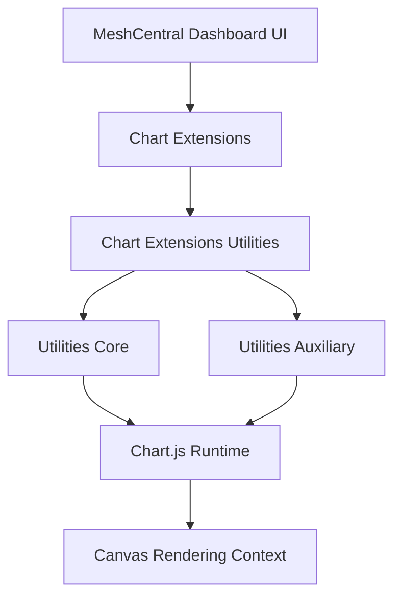
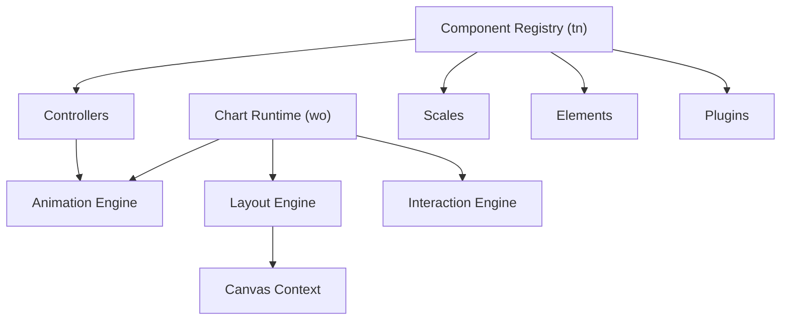
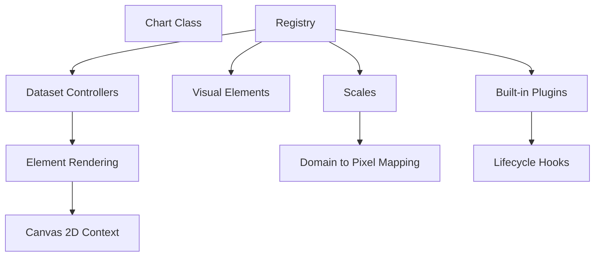
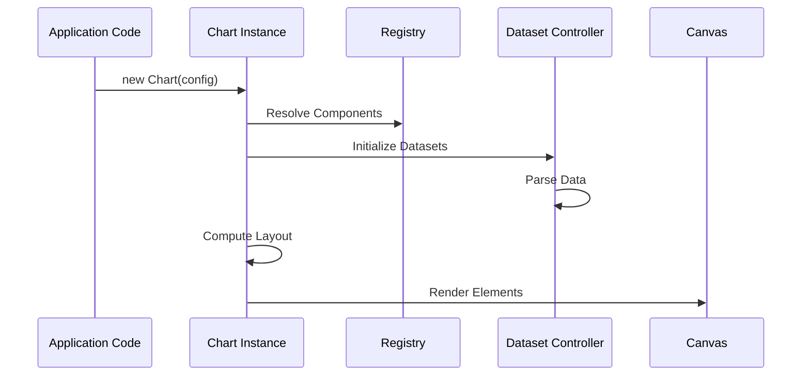
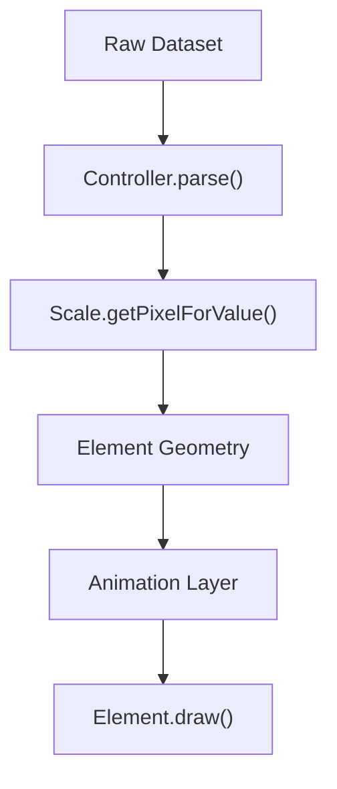
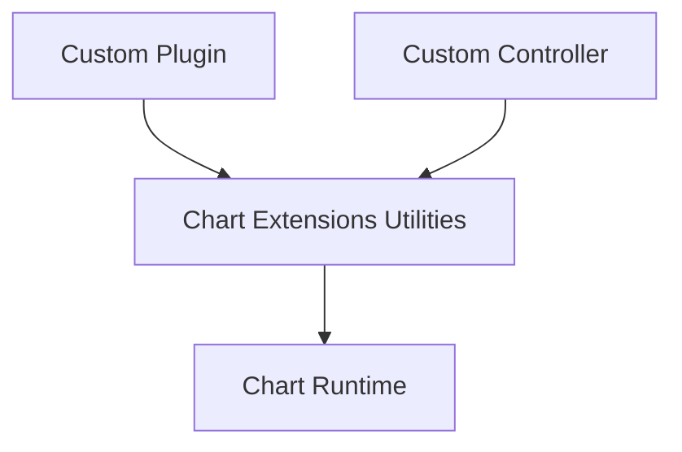

# Chart Extensions Utilities

The **Chart Extensions Utilities** module is part of the MeshCentral frontend charting stack located under:

```text
public/scripts/charts/chart-extensions/chart-extensions-utilities
```

It acts as the **utility and orchestration layer** for advanced chart extensions built on top of the embedded Chart.js runtime. This module bridges:

- Chart.js rendering engine
- MeshCentral-specific chart configuration
- Higher-level chart extensions
- Dashboard and analytics UI components

It standardizes how charts are registered, extended, initialized, and rendered across the MeshCentral web interface.

---

## Purpose of the Module

The **Chart Extensions Utilities** module is responsible for:

- Providing reusable chart utility helpers
- Registering and wiring Chart.js controllers, scales, and plugins
- Exposing extension points for custom MeshCentral behaviors
- Encapsulating runtime lifecycle management
- Supporting advanced rendering, layout, animation, and interaction

It ensures that all dashboards, reporting panels, and telemetry views use a consistent and extensible chart foundation.

---

## Position in the Charts Architecture



### Layer Responsibilities

| Layer | Responsibility |
|-------|---------------|
| Chart.js Runtime | Rendering, animation, interaction |
| Utilities Core | Registry & lifecycle orchestration |
| Utilities Auxiliary | Runtime exposure & layout elements |
| Chart Extensions | Domain-specific customization |
| UI Layer | Data binding and embedding |

---

# Internal Architecture

The module is divided into two major submodules:

```text
chart-extensions-utilities
├── chart-extensions-utilities-core
└── chart-extensions-utilities-auxiliary
```

---

## 1️⃣ Chart Extensions Utilities Core

**Primary Components:**

- `meshcentral.public.scripts.charts.tn`
- `meshcentral.public.scripts.charts.wo`

### Responsibilities

- Chart component registry management
- Controller and scale registration
- Plugin lifecycle wiring
- Dataset parsing orchestration
- Chart initialization standardization

### Core Architecture



The Core layer acts as the **dependency injection and lifecycle backbone** for all chart instances.

📘 See detailed documentation:
- **Chart Extensions Utilities Core Main**
- **Chart Extensions Utilities Core Auxiliary**

---

## 2️⃣ Chart Extensions Utilities Auxiliary

**Primary Components:**

- `meshcentral.public.scripts.charts.ws`
- `meshcentral.public.scripts.charts.ya`

### Responsibilities

- Embeds Chart.js runtime (UMD bundle)
- Provides built-in controllers and scales
- Implements animation scheduler
- Handles interaction resolution
- Provides layout-aware title and subtitle blocks

### Auxiliary Architecture



This layer functions as the **execution engine** behind all charts rendered in MeshCentral.

📘 See detailed documentation:
- **Chart Extensions Utilities Auxiliary**

---

# Runtime Lifecycle

When a chart is instantiated, the following sequence occurs:



### Lifecycle Phases

1. Configuration resolution
2. Registry lookup
3. Dataset controller creation
4. Data parsing
5. Scale mapping
6. Layout negotiation
7. Animation scheduling
8. Canvas rendering
9. Plugin hook execution

---

# Data → Pixel → Canvas Pipeline



This deterministic pipeline ensures:

- Accurate data scaling
- Smooth transitions
- Plugin interception
- High-performance rendering

---

# Extension Model

The module is intentionally extensible.



Extensions can:

- Register new chart types
- Override default animations
- Inject MeshCentral-specific behaviors
- Modify tooltip and legend logic
- Implement performance optimizations

---

# Repository Structure (Scoped View)

```text
public/scripts/charts/
└── chart-extensions/
    └── chart-extensions-utilities/
        ├── chart-extensions-utilities-core/
        │   ├── meshcentral.public.scripts.charts.tn
        │   └── meshcentral.public.scripts.charts.wo
        └── chart-extensions-utilities-auxiliary/
            ├── meshcentral.public.scripts.charts.ws
            └── meshcentral.public.scripts.charts.ya
```

---

# Relationship to Other Chart Modules

The **Chart Extensions Utilities** module integrates with:

- **Chart Core** – foundational chart logic
- **Chart Utilities** – general-purpose helpers
- **Chart Extensions Core** – domain-level enhancements
- **Dashboard UI Components** – presentation layer

It serves as the structured intermediary between raw Chart.js capabilities and MeshCentral's higher-level visualization features.

---

# Why This Module Matters

The **Chart Extensions Utilities** module provides:

- ✅ Centralized chart lifecycle management  
- ✅ Registry-driven architecture  
- ✅ Modular extension points  
- ✅ Animation and interaction standardization  
- ✅ High-performance rendering support  
- ✅ Clean separation between runtime and UI logic  

All chart-based dashboards and analytical views in MeshCentral depend on this module as their extensible rendering backbone.

---

# Summary

| Area | Responsibility |
|------|----------------|
| Core | Registry and lifecycle orchestration |
| Auxiliary | Chart.js runtime and layout elements |
| Extensions | Custom behaviors and domain logic |
| UI Integration | Dashboard embedding |
| Rendering Engine | Canvas-based visualization |

The **Chart Extensions Utilities** module ensures that MeshCentral’s charting system remains modular, extensible, consistent, and performant across all user interfaces.