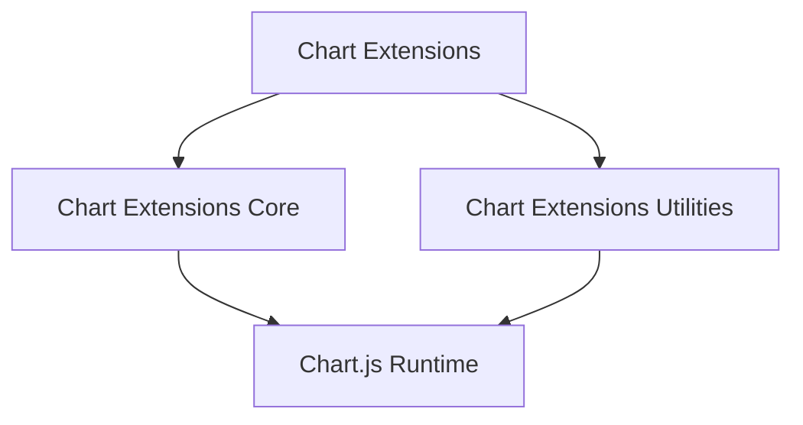
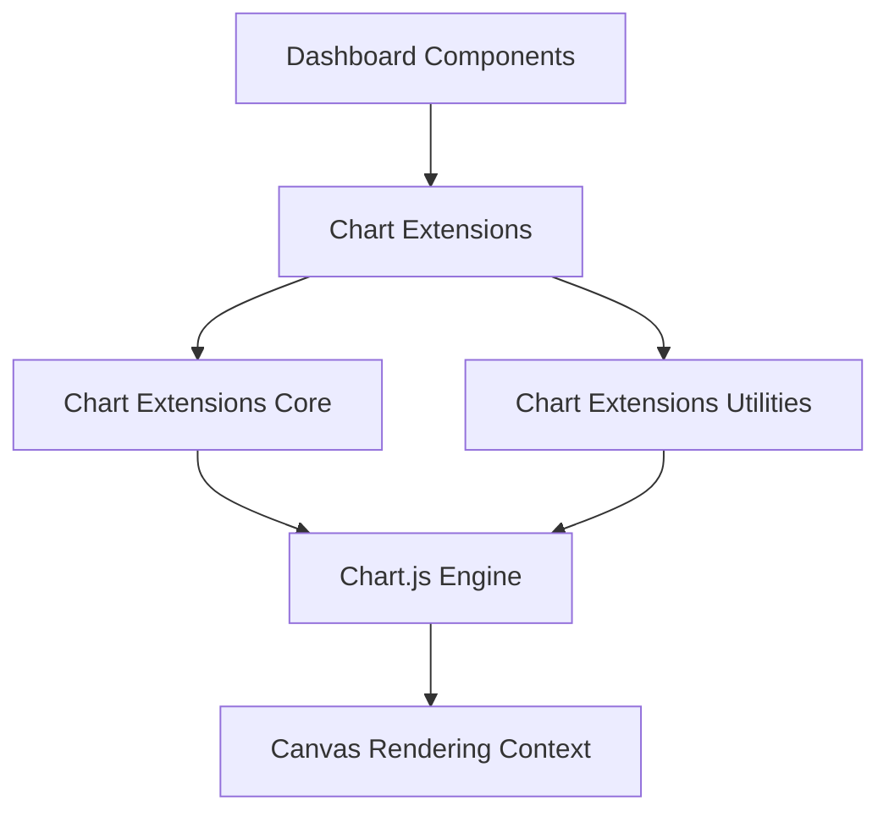
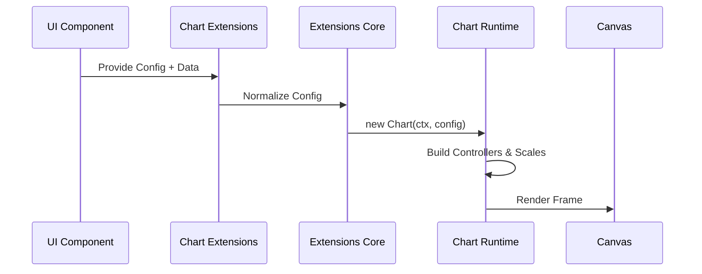
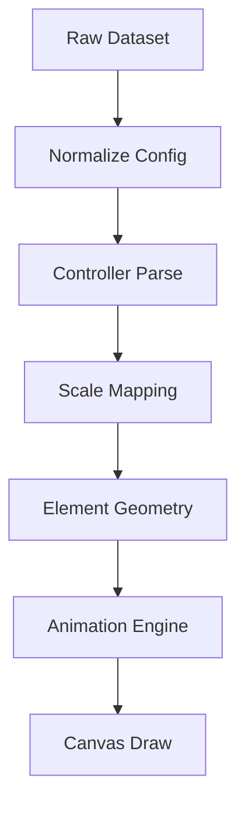
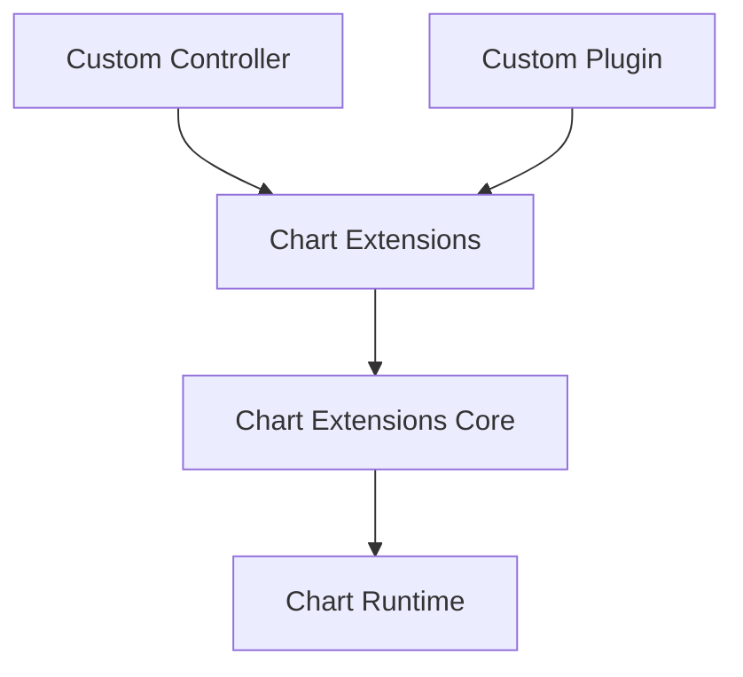

# Chart Extensions

The **Chart Extensions** module is the top-level orchestration layer for all advanced charting functionality in the MeshCentral web interface. It builds on top of the Chart.js runtime and the internal chart core and utility modules to provide extensible, modular, and feature-ready visualizations.

This module acts as the bridge between:

- Dashboard and analytics UI components  
- Chart Core runtime infrastructure  
- Chart Utilities helpers  
- Embedded Chart.js engine  

It enables consistent chart behavior across telemetry panels, reporting views, analytics dashboards, and device monitoring widgets.

---

## Purpose of the Module

The **Chart Extensions** module is responsible for:

- Aggregating chart runtime and utilities
- Exposing extension points for feature-specific charts
- Standardizing chart configuration patterns
- Coordinating lifecycle management across extensions
- Providing reusable building blocks for dashboards
- Encapsulating advanced interaction and rendering logic

It does **not** implement low-level rendering. Instead, it composes:

- **Chart Extensions Core** (runtime integration)
- **Chart Extensions Utilities** (helper and orchestration layer)

---

# Repository Structure

**Base Path:** `public/scripts/charts`  
**Namespace:** `meshcentral.public.scripts.charts.*`

```text
public/scripts/charts/
└── chart-extensions/
    ├── meshcentral.public.scripts.charts.rs
    ├── meshcentral.public.scripts.charts.sn
    ├── meshcentral.public.scripts.charts.so
    ├── meshcentral.public.scripts.charts.tn
    ├── meshcentral.public.scripts.charts.wo
    ├── meshcentral.public.scripts.charts.ws
    └── meshcentral.public.scripts.charts.ya
```

---

# Internal Module Breakdown

The module is divided into two major architectural layers:



---

## 1️⃣ Chart Extensions Core

**Components:**

- `meshcentral.public.scripts.charts.rs`
- `meshcentral.public.scripts.charts.sn`
- `meshcentral.public.scripts.charts.so`

### Responsibilities

- Embeds and configures Chart.js runtime
- Registers controllers, scales, elements, and plugins
- Manages chart lifecycle (init, update, destroy)
- Coordinates animation and rendering pipeline
- Exposes plugin extension hooks

📘 See detailed documentation:
- **Chart Extensions Core Main**
- **Chart Extensions Core Auxiliary**

---

## 2️⃣ Chart Extensions Utilities

**Components:**

- `meshcentral.public.scripts.charts.tn`
- `meshcentral.public.scripts.charts.wo`
- `meshcentral.public.scripts.charts.ws`
- `meshcentral.public.scripts.charts.ya`

### Responsibilities

- Registry management
- Dataset parsing orchestration
- Layout standardization
- Animation coordination
- Interaction handling
- MeshCentral-specific configuration helpers

📘 See detailed documentation:
- **Chart Extensions Utilities Core**
- **Chart Extensions Utilities Auxiliary**

---

# High-Level Architecture

The **Chart Extensions** module sits between UI features and the rendering engine.



### Layer Responsibilities

| Layer | Responsibility |
|-------|---------------|
| Dashboard UI | Data binding and embedding |
| Chart Extensions | Feature-level chart orchestration |
| Chart Extensions Core | Runtime integration |
| Chart Extensions Utilities | Registry & helper layer |
| Chart.js Engine | Rendering & animation |
| Canvas | Low-level drawing surface |

---

# Chart Creation Flow

When a chart is instantiated from a dashboard or analytics component:



### Lifecycle Phases

1. Configuration normalization  
2. Registry resolution  
3. Controller initialization  
4. Dataset parsing  
5. Scale mapping  
6. Layout computation  
7. Animation scheduling  
8. Canvas rendering  
9. Plugin hook execution  

---

# Data Flow Pipeline

The module ensures a deterministic transformation from data to rendered visualization:



This pipeline guarantees:

- Consistent scaling behavior  
- Smooth animations  
- Plugin interception support  
- High-performance rendering  

---

# Extension Model

The module is intentionally extensible to support new chart types and behaviors.



Extensions can:

- Register new controllers
- Override default animations
- Modify tooltip and legend logic
- Inject MeshCentral-specific behaviors
- Implement performance optimizations

---

# Relationship to Other Chart Modules

The **Chart Extensions** module integrates:

- **Chart Core** – foundational logic and data orchestration  
- **Chart Utilities** – shared helpers and abstractions  
- **Chart Extensions Core** – runtime backbone  
- **Chart Extensions Utilities** – lifecycle and registry management  
- **UI Components** – dashboard-level consumers  

It acts as the structured integration layer that transforms raw Chart.js capabilities into production-ready MeshCentral visualizations.

---

# When to Modify This Module

Changes are appropriate when:

- Adding new chart extension types  
- Adjusting runtime configuration defaults  
- Enhancing animation or interaction behavior  
- Introducing new plugin integrations  
- Refactoring extension architecture  

Avoid placing:

- Business-specific dashboard logic  
- Direct UI layout decisions  
- Feature-only rendering rules  

---

# Summary

The **Chart Extensions** module is the orchestration layer of MeshCentral’s frontend charting system. It:

- Composes runtime and utilities layers  
- Standardizes chart initialization and lifecycle  
- Enables extensibility via plugins and controllers  
- Bridges dashboards and rendering engine  
- Ensures consistent, performant visualization behavior  

All advanced dashboards, telemetry panels, and analytical interfaces depend on this module as their charting integration backbone.