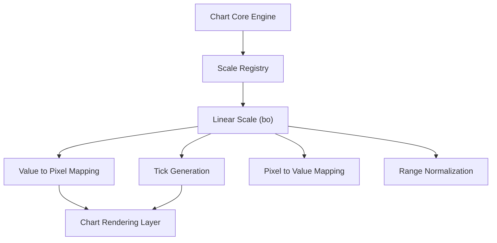
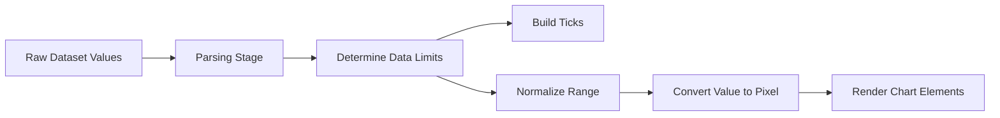
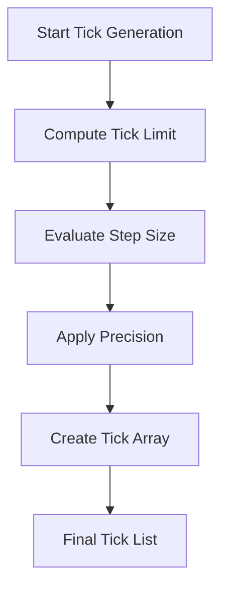
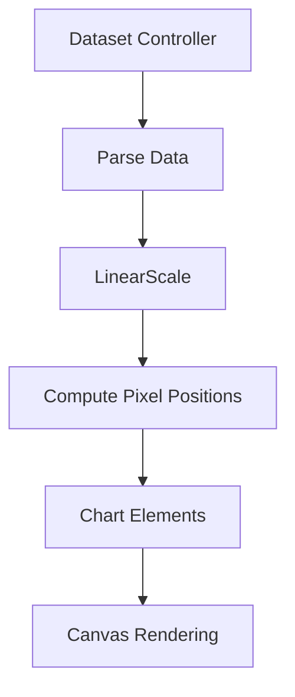

# Chart Utilities Core Extensions Auxiliary

The **Chart Utilities Core Extensions Auxiliary** module provides auxiliary extension logic for the Chart Utilities Core Extensions layer. It encapsulates advanced or supporting behaviors that extend the core chart utility system without altering primary chart lifecycle logic.

This module is built around the `meshcentral.public.scripts.charts.bo` component, which corresponds to the **Linear Scale** implementation from Chart.js. It enables numeric axis rendering, tick generation, pixel-value transformations, and range normalization for charts that rely on continuous numerical domains.

This module acts as a foundational numeric scaling utility that higher-level chart utilities and extensions depend on.

---

## Module Position in the Hierarchy

This module is part of the Chart Utilities Core Extensions layer:

- Parent: Chart Utilities Core Extensions
- Sibling: [Chart Utilities Core Extensions Main](chart-utilities-core-extensions-main/chart-utilities-core-extensions-main.md)

It provides scale computation logic that other chart utilities use for layout, rendering, and interaction.

---

## Core Component

### `meshcentral.public.scripts.charts.bo`

This component implements a **Linear Scale** and extends the base scale abstraction. It is responsible for:

- Determining numeric data limits
- Generating ticks
- Converting values to pixels
- Converting pixels back to values
- Managing range normalization

It inherits from the generic scale base and specializes it for continuous linear domains.

---

## Architectural Role

The Chart Utilities Core Extensions Auxiliary module provides:

- Numeric axis handling
- Range expansion and normalization
- Tick density control
- Coordinate transformation utilities
- Boundary clamping and precision handling

It does not render visual elements directly; instead, it enables other chart modules to render data accurately.

---

## Architectural Overview



The Linear Scale is registered in the scale registry and used by chart controllers during rendering and layout.

---

## Data Flow: Numeric Value to Rendered Position



### Steps Explained

1. **Parsing** – Raw numeric values are parsed and validated.
2. **Limit Detection** – The scale computes minimum and maximum bounds.
3. **Tick Building** – Tick positions are generated based on density constraints.
4. **Range Normalization** – The scale calculates internal value ranges.
5. **Coordinate Mapping** – Values are converted into pixel coordinates.

---

## Core Responsibilities

### 1. Determining Data Limits

The scale computes:

- Minimum value
- Maximum value
- Suggested bounds
- Adjusted bounds when `beginAtZero` is enabled

It ensures:

- Zero is included when required
- Degenerate ranges are expanded
- Negative and positive-only datasets are handled correctly

---

### 2. Tick Generation

Tick generation logic:

- Calculates optimal tick count
- Honors `maxTicksLimit`
- Supports `stepSize`
- Applies numeric formatting
- Rounds to meaningful precision



---

### 3. Value ↔ Pixel Mapping

The Linear Scale transforms numeric values into renderable pixel positions.

#### Value to Pixel

```text
pixel = start_pixel + (value - min) / (max - min) * pixel_range
```

#### Pixel to Value

```text
value = min + decimal_position * (max - min)
```

This enables:

- Interactive hover detection
- Tooltip alignment
- Dynamic animations

---

## Interaction with Chart Controllers



Controllers depend on this scale to determine:

- Element positions
- Bar heights
- Line coordinates
- Axis layout

---

## Precision and Numerical Stability

The module includes:

- Floating-point rounding guards
- Logarithmic scaling helpers (inherited behavior)
- Clamping utilities
- Tick rounding to avoid visual drift

This ensures consistent rendering across browsers and zoom levels.

---

## Integration with the Chart System

The Linear Scale integrates with:

- Chart registry
- Dataset controllers
- Layout engine
- Interaction system
- Animation engine

It does not directly manage:

- Visual drawing of datasets
- UI components
- Event handlers

Instead, it provides deterministic numeric positioning for all dependent modules.

---

## Relationship to Sibling Modules

- **Chart Utilities Core Extensions Main** – Defines primary extension logic.
- **Chart Utilities Core Main** – Provides base chart utilities.

This auxiliary module specializes in numeric scaling and axis logic.

---

## Summary

The **Chart Utilities Core Extensions Auxiliary** module delivers:

- A robust Linear Scale implementation
- Numeric range management
- Tick computation and formatting
- Pixel-to-value transformation logic
- Stable numeric rendering support

It is a low-level but essential building block that ensures charts render accurately, scale properly, and remain interactive across diverse datasets.

Without this module, higher-level chart utilities would lack deterministic coordinate systems and reliable axis behavior.