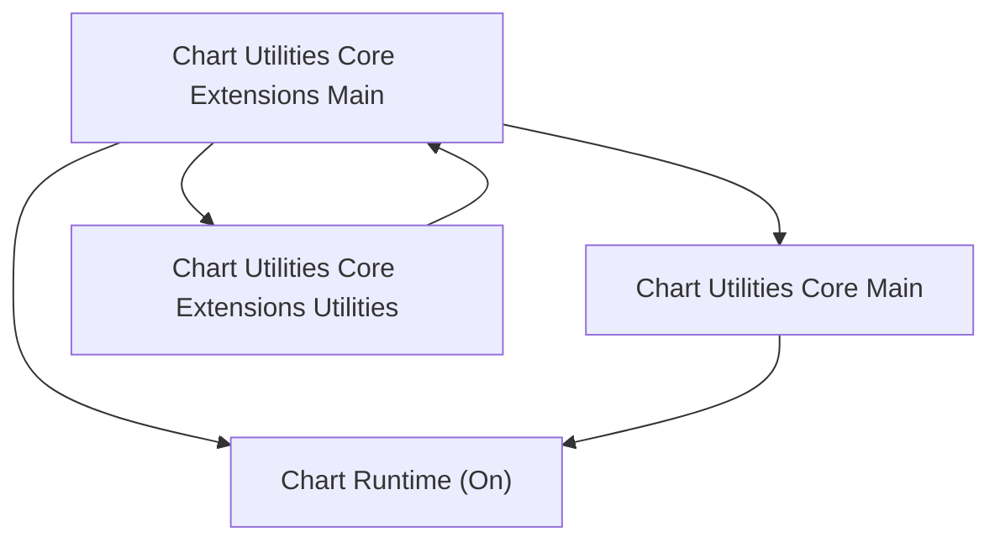
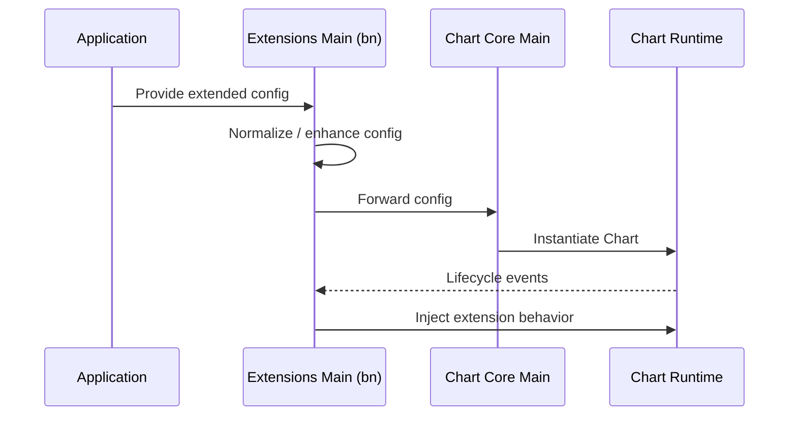
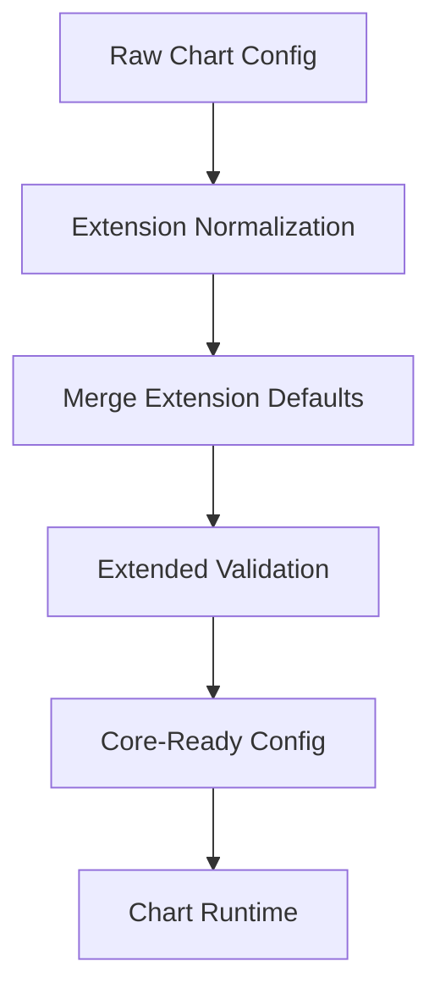
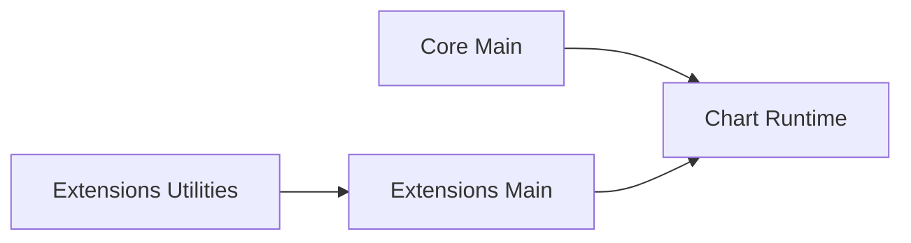
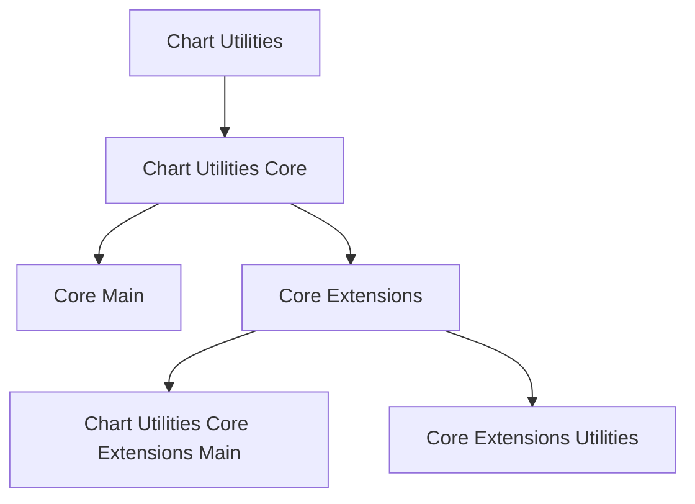

# Chart Utilities Core Extensions Main

The **Chart Utilities Core Extensions Main** module provides the primary extension layer on top of the Chart Utilities Core runtime. It enhances and augments the core chart engine with additional behaviors, configuration normalization, and integration glue that bridges low-level chart primitives with higher-level chart utilities.

This module is located under:

```text
public/scripts
└── charts
    └── chart-utilities
        └── chart-utilities-core
            └── chart-utilities-core-extensions
                └── chart-utilities-core-extensions-main
```

It is a child of **Chart Utilities Core Extensions** and works closely with:

- [Chart Utilities Core Main](../chart-utilities-core-main.md)
- [Chart Utilities Core Extensions](../chart-utilities-core-extensions.md)

---

## 1. Purpose of the Module

**Chart Utilities Core Extensions Main** serves as the central runtime entry point for core-level chart extensions.

Its responsibilities include:

- Extending base Chart runtime behavior
- Registering additional configuration defaults
- Enhancing dataset and option resolution
- Providing extension hooks for advanced chart features
- Coordinating with utility helpers (`ba`) and auxiliary extensions

Unlike **Chart Utilities Core Main**, which owns the base rendering and lifecycle orchestration, this module focuses on **augmenting and extending** that behavior without modifying the core engine directly.

---

## 2. Core Component

This module contains:

- `meshcentral.public.scripts.charts.bn`

The `bn` component acts as the primary extension coordinator that:

- Hooks into the Chart lifecycle
- Registers extension behaviors
- Enhances configuration processing
- Bridges extension utilities with the core Chart runtime

---

## 3. Architectural Overview

### High-Level Relationship



This diagram shows:

- The **core runtime** remains the rendering and lifecycle engine.
- The **extensions main** layer augments behavior.
- The **extensions utilities** module provides helper logic consumed by this module.

---

## 4. Extension Integration Model

The extension layer operates by integrating into the Chart lifecycle and configuration resolution pipeline.

### Extension Hook Flow



Key characteristics:

- Pre-processing of configuration before chart instantiation
- Injection of additional defaults
- Runtime enhancement via lifecycle interception

---

## 5. Configuration Enhancement Pipeline

One of the primary roles of this module is extending how chart configuration is interpreted and normalized.



This ensures:

- Consistent configuration across higher-level modules
- Backward compatibility with legacy configuration formats
- Centralized extension logic

---

## 6. Interaction with Core Modules

### With Chart Utilities Core Main

- Reuses the `Chart (On)` runtime
- Relies on dataset controllers, scales, and elements
- Enhances plugin registration and behavior

### With Chart Utilities Core Extensions Utilities

- Delegates reusable helper logic
- Avoids duplicating transformation utilities
- Keeps extension orchestration separate from utility logic



---

## 7. Responsibilities Breakdown

| Concern | Responsibility |
|----------|----------------|
| Extension orchestration | Coordinates core-level chart enhancements |
| Configuration processing | Normalizes and enriches chart options |
| Lifecycle augmentation | Hooks into Chart initialization and update |
| Runtime integration | Bridges utilities with the Chart runtime |
| Compatibility layer | Supports extended and legacy configuration patterns |

---

## 8. Boundaries of the Module

**Chart Utilities Core Extensions Main does not:**

- Render charts directly
- Implement dataset controllers
- Define scale logic
- Manage animation primitives

Those responsibilities remain within:

- **Chart Utilities Core Main**
- Chart controllers (`Ns` derivatives)
- Elements (`Hs` derivatives)
- Scales (`Js` derivatives)

Instead, this module enhances how those systems are configured and orchestrated.

---

## 9. Position in the Chart Subsystem



This placement highlights:

- It is not a top-level chart utility.
- It is a **mid-layer extension runtime**.
- It enables higher-level chart features without modifying base core logic.

---

## 10. Summary

**Chart Utilities Core Extensions Main** is the orchestration layer that:

- Extends the core Chart runtime
- Enhances configuration processing
- Injects advanced behaviors
- Bridges extension utilities with core execution

It provides a clean separation between:

- Core rendering engine (Chart Utilities Core Main)
- Reusable helper logic (Core Extensions Utilities)
- Higher-level chart features

By centralizing extension behavior in this module, the charting subsystem remains modular, maintainable, and extensible without tightly coupling new features to the base runtime.

For foundational runtime behavior, see:

- [Chart Utilities Core Main](../chart-utilities-core-main.md)

For supporting helpers:

- [Chart Utilities Core Extensions Utilities](../chart-utilities-core-extensions-utilities.md)