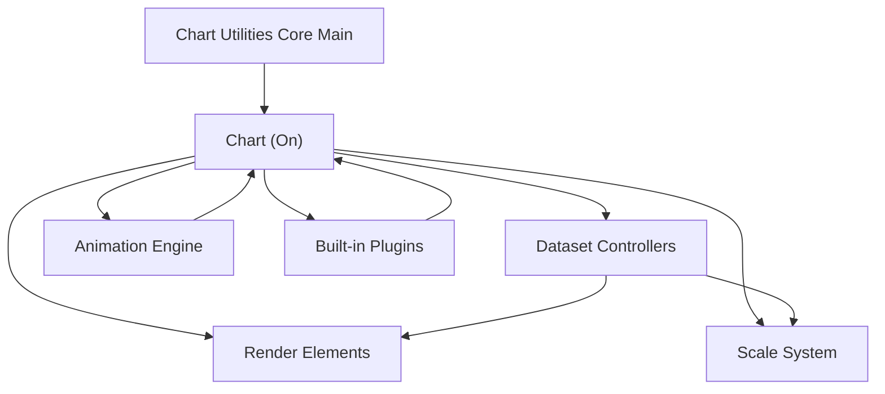
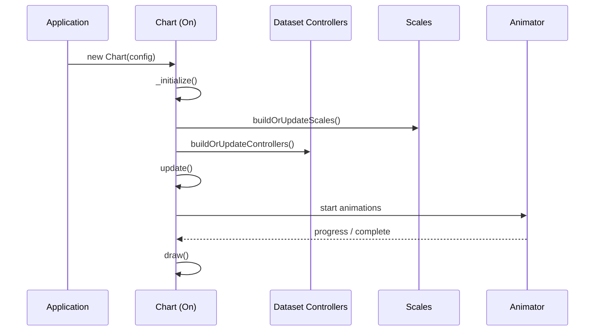
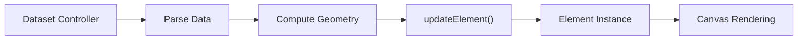
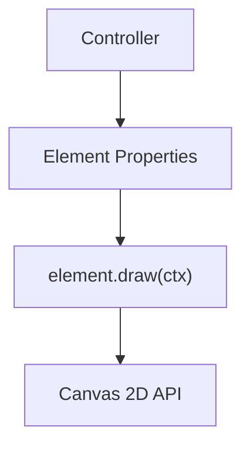
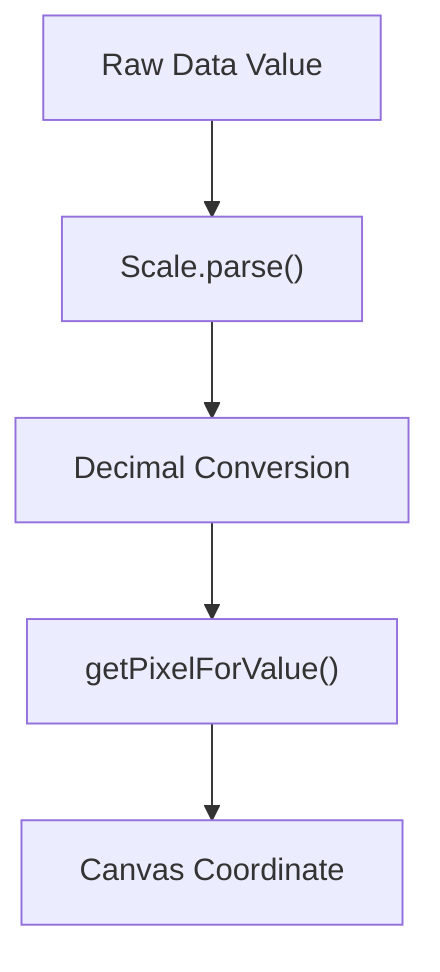
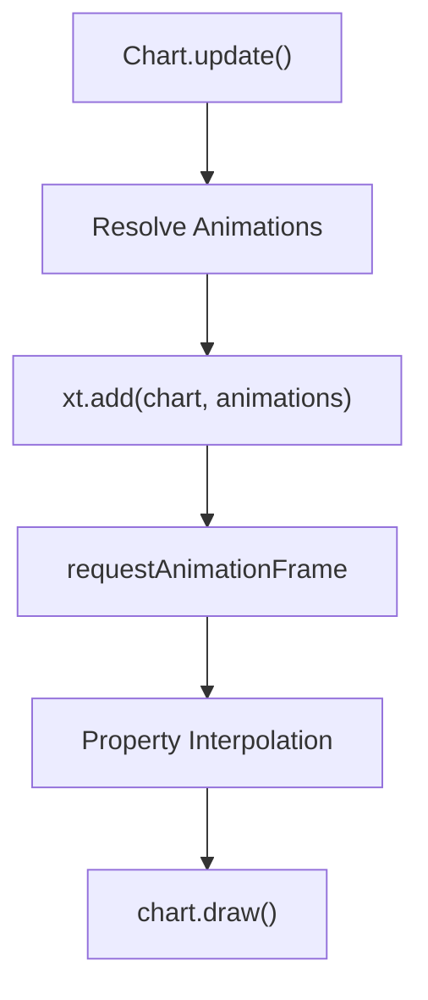
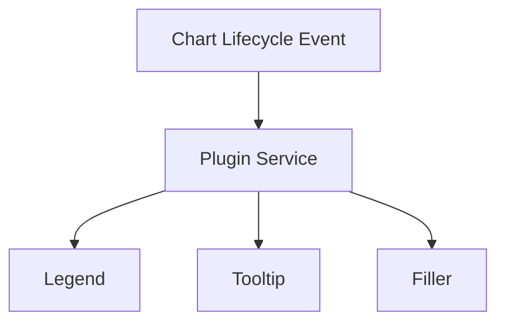
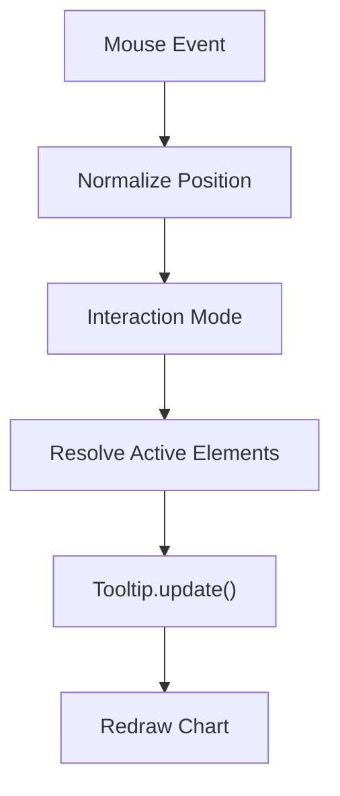

# Chart Utilities Core Main

The **Chart Utilities Core Main** module provides the foundational runtime utilities of the charting subsystem built around Chart.js v4.3.3. It encapsulates the primary chart engine entry point and exposes the core rendering, animation, scale, controller, and plugin infrastructure used by higher-level chart utilities and extensions.

At its core, this module is responsible for:

- Initializing and exporting the Chart runtime
- Managing chart lifecycle (init, update, render, destroy)
- Coordinating controllers, elements, and scales
- Providing animation and interaction systems
- Registering built-in plugins (Legend, Tooltip, Title, Filler, Decimation, Colors)

This module is a child of [Chart Utilities Core](../chart-utilities-core.md) and represents the primary runtime entry point for chart behavior.

---

## 1. Architectural Overview

Chart Utilities Core Main wraps the Chart.js UMD bundle and exposes a fully integrated charting engine composed of:

- **Chart (On)** – Main chart orchestrator
- **Dataset Controllers (Ns and subclasses)** – Handle dataset-specific logic
- **Elements (Hs and subclasses)** – Render primitives (Line, Arc, Bar, Point)
- **Scales (Js and subclasses)** – Coordinate value-to-pixel transformations
- **Animation Engine (Cs, Os, xt)** – Transition and easing system
- **Plugins (Legend, Tooltip, Title, Filler, etc.)** – Cross-cutting extensions

### High-Level Component Graph

---

## 2. Core Runtime: Chart (On)

The `On` class (exported as `Chart`) is the central orchestrator. It:

- Parses configuration
- Instantiates controllers and scales
- Manages layout boxes
- Handles rendering pipeline
- Coordinates animations
- Dispatches events

### Lifecycle Flow

Key responsibilities include:

- Maintaining `_metasets` for datasets
- Tracking `_active` elements for hover state
- Managing `_layers` for drawing order
- Integrating plugins through a plugin service

---

## 3. Dataset Controllers

All chart types extend the base `DatasetController (Ns)`.

Examples in this module:

- `LineController`
- `BarController`
- `DoughnutController`
- `PieController`
- `ScatterController`
- `RadarController`
- `PolarAreaController`

Each controller is responsible for:

- Parsing raw dataset data
- Resolving options
- Creating/updating element instances
- Handling stacking logic
- Calculating geometry (e.g., bar width, arc angles)

### Controller → Element Relationship

Controllers never draw directly. They compute models and delegate drawing to elements.

---

## 4. Elements (Render Primitives)

All visual primitives extend `Hs (Element)`.

Major elements in this module:

- `LineElement`
- `BarElement`
- `ArcElement`
- `PointElement`

Each element:

- Stores geometry (`x`, `y`, `width`, `height`, `radius`, etc.)
- Resolves styling options
- Implements `draw(ctx)`
- Provides hit-testing (`inRange`, `getCenterPoint`)

### Rendering Responsibility

Elements are pure renderers; layout and animation orchestration remain in the Chart core.

---

## 5. Scale System

All scales extend `Js (Scale)`.

Included scale types:

- `CategoryScale`
- `LinearScale`
- `LogarithmicScale`
- `TimeScale`
- `TimeSeriesScale`
- `RadialLinearScale`

Scales are responsible for:

- Determining min/max data limits
- Generating ticks
- Mapping values to pixels
- Drawing grid lines and labels

### Value-to-Pixel Mapping

This abstraction enables consistent rendering across chart types.

---

## 6. Animation Engine

Animation is handled by:

- `Cs` – Individual animation descriptor
- `Os` – Animation resolver
- `xt` – Global animator manager

Features:

- Easing functions (e.g., `easeOutQuart`)
- Property-based interpolation (numbers, colors)
- Looping animations
- Batched chart-level animation control

### Animation Flow

Animations are optional and can be disabled globally or per dataset.

---

## 7. Plugin System

The module registers several built-in plugins:

- `Legend`
- `Tooltip`
- `Title`
- `SubTitle`
- `Filler`
- `Decimation`
- `Colors`

Plugins are coordinated via a registry and lifecycle hooks:

- `beforeInit`
- `beforeUpdate`
- `beforeDraw`
- `afterDraw`
- `afterEvent`
- `destroy`

### Plugin Invocation Model

Plugins receive contextual information and may modify behavior or rendering.

---

## 8. Interaction and Events

Interaction is handled through:

- Event normalization (`Interaction` utilities)
- Active element resolution
- Tooltip coordination

Common interaction modes:

- `nearest`
- `index`
- `dataset`
- `point`

### Hover Resolution

---

## 9. Layout Engine Integration

Layout is coordinated through a box model (`as` layout service):

- Scales
- Legend
- Title
- SubTitle
- Chart area

Boxes are assigned weights and positioned according to:

- `position` (`top`, `bottom`, `left`, `right`, `chartArea`)
- `fullSize`
- `weight`

This allows responsive and modular layout management.

---

## 10. Relationship to Other Modules

Chart Utilities Core Main is:

- A foundational runtime under **Chart Utilities Core**
- Used by higher-level utilities in `chart-utilities-core-extensions`
- Consumed by chart logic modules and UI integrations

It does **not**:

- Provide application-specific chart configuration
- Contain UI components
- Manage data fetching or transformation

Those concerns are handled by sibling or extension modules in the chart utilities hierarchy.

---

## 11. Summary of Responsibilities

| Concern | Responsibility |
|----------|----------------|
| Chart lifecycle | Create, update, render, destroy |
| Dataset logic | Controllers per chart type |
| Rendering | Element primitives using Canvas API |
| Scaling | Value ↔ pixel transformations |
| Animation | Easing, interpolation, scheduling |
| Plugins | Extensible hook-based system |
| Interaction | Hover, click, tooltip coordination |
| Layout | Box-based responsive layout |

---

## 12. Key Takeaway

**Chart Utilities Core Main** is the heart of the charting engine. It binds together:

- Data → Controllers
- Controllers → Elements
- Elements → Canvas
- Scales → Coordinate mapping
- Animator → Transitions
- Plugins → Extensibility

Every chart rendered in the system ultimately flows through this module’s runtime orchestration.

For structural context and parent-level abstractions, see:

- [Chart Utilities Core](../chart-utilities-core.md)
