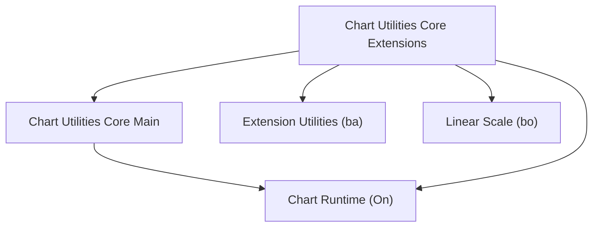
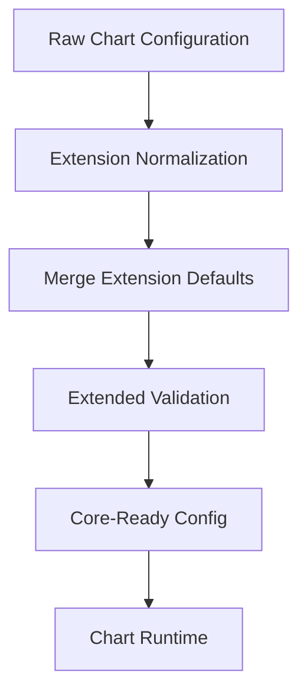
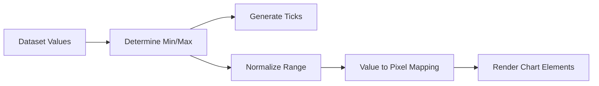
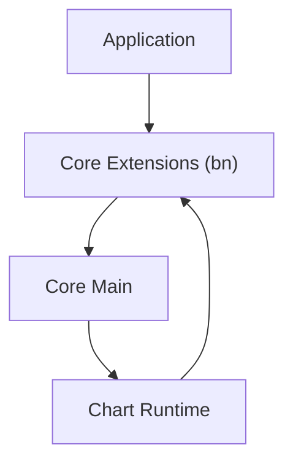

# Chart Utilities Core Extensions

The **Chart Utilities Core Extensions** module provides the extension layer that augments the Chart Utilities Core runtime. It enhances configuration processing, scale behavior, and runtime orchestration without modifying the base chart engine directly.

This module acts as a bridge between:

- **Chart Utilities Core Main** (base runtime and lifecycle)
- Extension utilities and auxiliary scale logic
- Higher-level chart features built on top of the core system

It is located under:

```text
public/scripts
└── charts
    └── chart-utilities
        └── chart-utilities-core
            └── chart-utilities-core-extensions
```

---

## 1. Purpose of the Module

The **Chart Utilities Core Extensions** layer is responsible for:

- Extending core chart runtime behavior
- Enhancing configuration normalization
- Providing additional scale and transformation logic
- Injecting lifecycle hooks into chart initialization and updates
- Coordinating extension utilities with the core engine

It ensures the charting system remains:

- Modular
- Extensible
- Backward-compatible
- Cleanly separated between core logic and enhancements

---

## 2. Repository Structure

```text
chart-utilities-core-extensions
├── chart-utilities-core-extensions-main
│   ├── chart-utilities-core-main (ba)
│   └── chart-utilities-core-extensions-main (bn)
└── chart-utilities-core-extensions-auxiliary
    └── Linear Scale (bo)
```

### Core Components

| Component | Responsibility |
|------------|----------------|
| `meshcentral.public.scripts.charts.ba` | Core extension utility bridge |
| `meshcentral.public.scripts.charts.bn` | Extension orchestration layer |
| `meshcentral.public.scripts.charts.bo` | Linear scale implementation |

---

## 3. Architectural Overview

The module sits between the core runtime and higher-level chart utilities.



### Key Relationships

- **Core Main** owns lifecycle and rendering.
- **Extensions** enhance configuration and runtime behavior.
- **Linear Scale (bo)** provides numeric axis functionality.
- **Utilities (ba)** supply reusable transformation helpers.

---

## 4. Internal Structure

The module is divided into two major submodules:

### 4.1 Chart Utilities Core Extensions Main

Primary extension orchestration layer.

- Component: `meshcentral.public.scripts.charts.bn`
- Coordinates lifecycle hooks
- Normalizes and enriches configuration
- Injects extension defaults
- Bridges utilities with runtime

Reference documentation:

- [Chart Utilities Core Extensions Main](chart-utilities-core-extensions-main/chart-utilities-core-extensions-main.md)

---

### 4.2 Chart Utilities Core Extensions Auxiliary

Provides scale-level numeric logic.

- Component: `meshcentral.public.scripts.charts.bo`
- Implements Linear Scale
- Handles numeric range normalization
- Generates ticks
- Performs value ↔ pixel transformations

Reference documentation:

- [Chart Utilities Core Extensions Auxiliary](chart-utilities-core-extensions-auxiliary/chart-utilities-core-extensions-auxiliary.md)

---

## 5. Extension Processing Flow

The extension layer enhances configuration before the chart is instantiated.



This ensures:

- Backward compatibility
- Centralized option processing
- Consistent extension behavior
- Safe integration with the core runtime

---

## 6. Scale Integration Flow

The auxiliary module provides deterministic numeric positioning.



The **Linear Scale (bo)** ensures:

- Accurate numeric axis behavior
- Stable tick generation
- Precision-safe transformations
- Interactive coordinate mapping

---

## 7. Interaction with Core Modules



The extension module:

- Pre-processes configuration
- Delegates rendering to Core Main
- Hooks into lifecycle events
- Injects enhanced behaviors

---

## 8. Responsibilities Breakdown

| Concern | Owned By |
|----------|----------|
| Rendering lifecycle | Chart Utilities Core Main |
| Configuration enrichment | Core Extensions (bn) |
| Numeric scaling | Linear Scale (bo) |
| Utility helpers | Extension Utilities (ba) |
| Dataset controllers | Core Logic modules |

---

## 9. Boundaries

**Chart Utilities Core Extensions does NOT:**

- Render chart elements directly
- Implement dataset controllers
- Replace the core runtime
- Manage animation primitives

Instead, it augments and enhances existing core behavior.

---

## 10. Summary

The **Chart Utilities Core Extensions** module provides a structured extension framework for the charting subsystem.

It:

- Extends the base Chart runtime
- Enhances configuration handling
- Implements deterministic numeric scaling
- Injects lifecycle-aware behaviors
- Maintains clean architectural separation

By isolating extension logic from the core engine, the system remains:

- Modular
- Maintainable
- Extensible
- Scalable for future chart features

For detailed implementation specifics, refer to:

- **Chart Utilities Core Main**
- **Chart Utilities Core Extensions Main**
- **Chart Utilities Core Extensions Auxiliary**