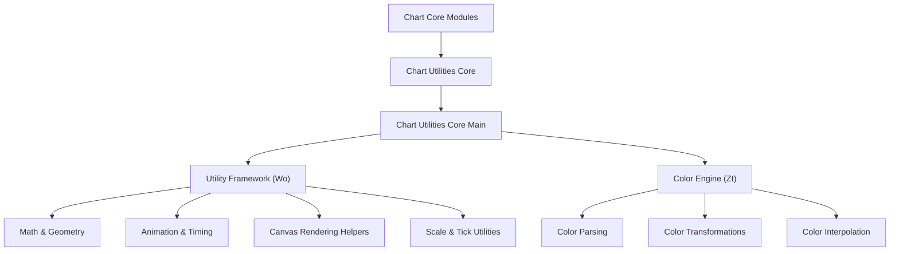
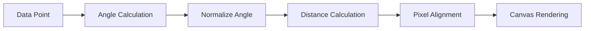
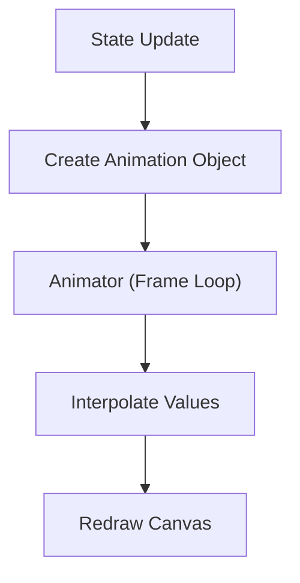
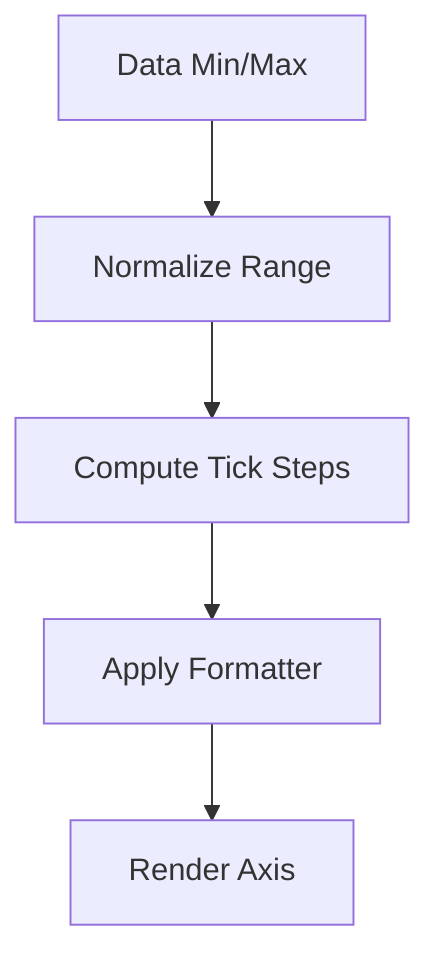
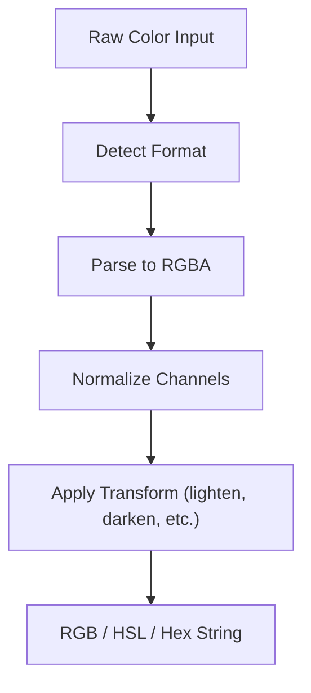
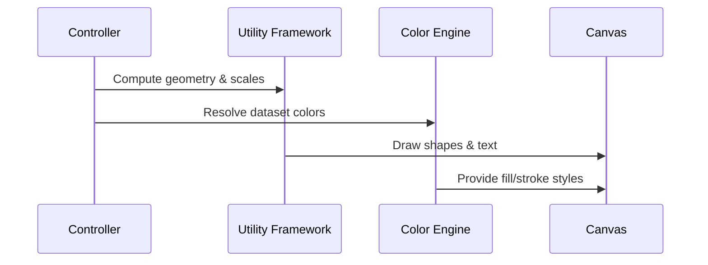
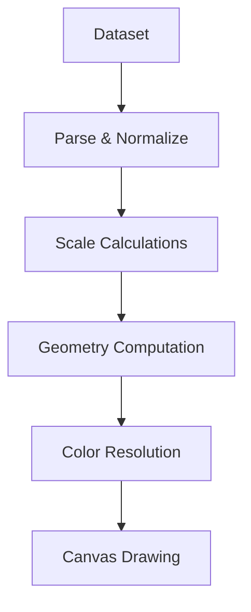

# Chart Utilities Core Main

The **Chart Utilities Core Main** module provides the foundational utility layer for the charting subsystem. It encapsulates the core helper logic and color-processing engine used throughout the chart pipeline, primarily backed by Chart.js v4.3.3 internals.

This module contains the core components:

- `meshcentral.public.scripts.charts.Wo` – Core utility namespace and helper framework
- `meshcentral.public.scripts.charts.Zt` – Color abstraction and transformation engine

Together, these components power numeric formatting, geometry math, animation helpers, scale utilities, rendering primitives, and color parsing used by higher-level chart modules.

---

## 1. Architectural Context

Within the chart hierarchy, **Chart Utilities Core Main** sits at the lowest shared utility layer under the Chart Utilities Core module.

It is responsible for:

- Math and geometry helpers
- Data normalization and object merging
- Rendering primitives (canvas helpers)
- Animation timing utilities
- Scale and tick formatting helpers
- Color parsing and manipulation

### Position in Module Hierarchy

This module is a child of:

- [Chart Utilities Core](../chart-utilities-core.md)

It supports higher-level modules such as:

- Chart Core Logic
- Chart Core Extensions
- Chart Extensions

(See the corresponding module documentation for their usage of these utilities.)

---

## 2. High-Level Architecture

---

## 3. Core Component: Utility Framework (Wo)

`meshcentral.public.scripts.charts.Wo` exposes a large collection of shared helpers used by controllers, elements, scales, and plugins.

### 3.1 Functional Categories

#### 3.1.1 Type & Object Utilities

- `isArray`, `isObject`, `isNumber`, `defined`
- Deep cloning and merging
- Safe property access (`resolveObjectKey`)
- Descriptor and resolver utilities

These functions normalize user configuration and dataset options before rendering.

---

#### 3.1.2 Math & Geometry Helpers

Includes:

- Angle normalization
- Radian/degree conversions
- Distance calculations
- Bezier curve interpolation
- Bounding checks
- Pixel alignment

Example internal flow for geometry calculations:

These helpers are heavily used by line, arc, and bar elements.

---

#### 3.1.3 Canvas Rendering Utilities

The module provides:

- `drawPoint`
- `renderText`
- `clipArea` / `unclipArea`
- `clearCanvas`
- `addRoundedRectPath`

These abstract raw `CanvasRenderingContext2D` operations and standardize rendering behavior.

---

#### 3.1.4 Animation & Timing Utilities

Includes:

- Easing functions
- Frame throttling
- Debounce helpers
- Animation frame scheduling
- Interpolation helpers

Animation workflow:

This ensures consistent animation behavior across datasets and elements.

---

#### 3.1.5 Scale & Tick Utilities

Utility helpers manage:

- Tick generation
- Numeric formatting
- Logarithmic scaling
- Time-series normalization
- Label measurement

Tick generation flow:

These utilities are consumed by scale classes in the Chart Core.

---

## 4. Core Component: Color Engine (Zt)

`meshcentral.public.scripts.charts.Zt` implements a color abstraction layer capable of:

- Parsing multiple color formats
- Converting between RGB and HSL
- Applying alpha transparency
- Performing interpolation
- Generating CSS-compatible strings

### 4.1 Supported Input Formats

- Hex (`#RGB`, `#RRGGBB`, `#RRGGBBAA`)
- RGB / RGBA
- HSL / HSLA
- Named colors
- Object-based `{ r, g, b, a }`

---

### 4.2 Color Processing Pipeline

---

### 4.3 Transformation Capabilities

- `lighten()` / `darken()`
- `saturate()` / `desaturate()`
- `rotate()` (hue shift)
- `alpha()` adjustments
- `mix()` with other colors
- `interpolate()` in linear color space

These transformations enable dynamic styling such as hover states and gradient effects.

---

## 5. Interaction Between Utilities and Rendering

The utility layer feeds directly into element rendering.

---

## 6. Data Flow Overview

From raw dataset to rendered chart:

The Chart Utilities Core Main module contributes at every stage except raw dataset definition.

---

## 7. Responsibilities and Boundaries

### This Module Handles

- Shared helper logic
- Rendering math
- Animation infrastructure
- Color parsing and manipulation
- Scale formatting utilities

### This Module Does NOT Handle

- Chart controller orchestration
- Dataset lifecycle management
- Plugin registration logic
- DOM-level UI composition

Those concerns are addressed in higher-level chart modules.

---

## 8. Key Design Characteristics

### 8.1 Stateless Utility Design

Most helper functions are pure and reusable, minimizing side effects.

### 8.2 Performance-Oriented

- Memoization of formatters
- Efficient lookup tables for time scales
- Avoidance of unnecessary object allocation

### 8.3 Rendering Consistency

Centralized helpers ensure:

- Consistent pixel alignment
- Uniform easing behavior
- Predictable color blending

---

## 9. Summary

The **Chart Utilities Core Main** module forms the computational backbone of the charting system.

It provides:

- A comprehensive utility framework (`Wo`)
- A robust color processing engine (`Zt`)

All higher-level chart components depend on this module for:

- Math and geometry
- Canvas rendering
- Animations
- Scale normalization
- Color handling

Without this layer, controllers, elements, and extensions would need to reimplement fundamental rendering and formatting logic.

This module ensures consistency, performance, and extensibility across the entire chart subsystem.