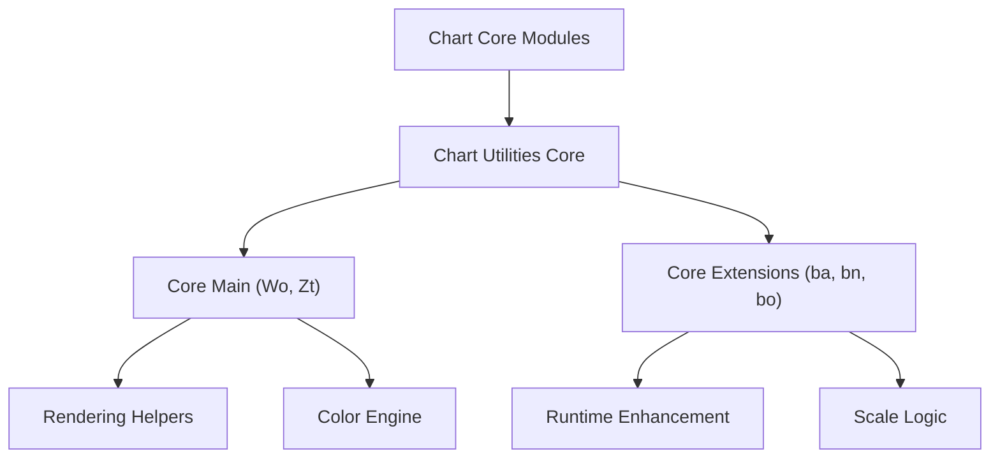
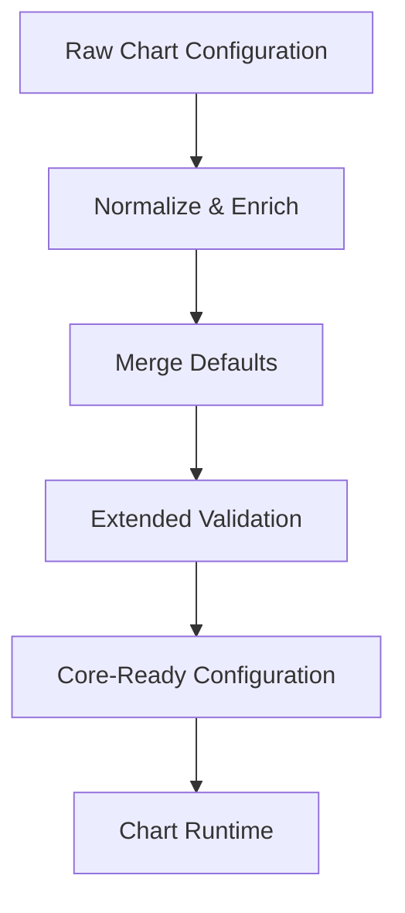
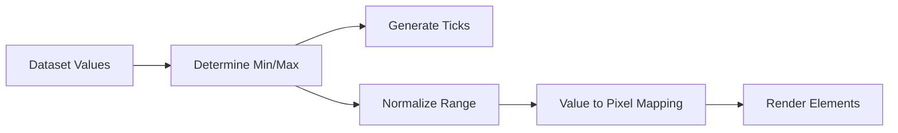
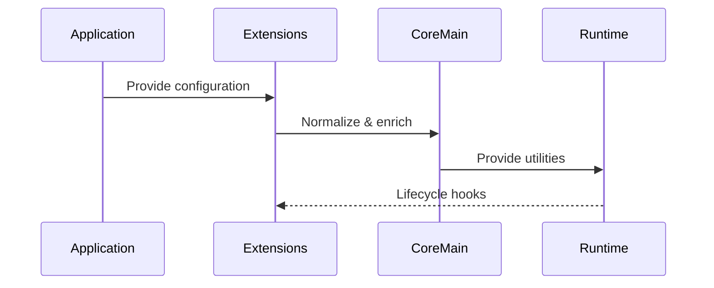

# Chart Utilities Core

The **Chart Utilities Core** module provides the foundational utility layer for the charting subsystem located under:

```text
public/scripts/charts/chart-utilities/chart-utilities-core
```

It consolidates shared helpers, configuration processors, runtime extensions, and scale utilities used by higher-level chart modules. This module ensures that chart rendering, scaling, configuration normalization, and extension behavior remain consistent, modular, and extensible across the entire chart stack.

---

## 1. Purpose of the Module

The **Chart Utilities Core** module is responsible for:

- Providing shared chart utility functions
- Hosting the core utility runtime
- Extending configuration and lifecycle behavior
- Implementing scale-level logic (e.g., linear scaling)
- Serving as a bridge between core chart logic and extension modules

It acts as the backbone for:

- Chart Core Logic
- Chart Core Extensions
- Chart Extensions
- Chart Utilities Extensions

Without this layer, higher modules would need to duplicate scaling, configuration merging, and runtime enhancement logic.

---

## 2. Repository Structure

```text
public/scripts/charts/chart-utilities/chart-utilities-core
├── chart-utilities-core-main
│   ├── Wo
│   └── Zt
└── chart-utilities-core-extensions
    ├── ba
    ├── bn
    └── bo
```

### Core Components

| Component | Description |
|------------|-------------|
| `meshcentral.public.scripts.charts.Wo` | Core utility framework |
| `meshcentral.public.scripts.charts.Zt` | Color abstraction and transformation engine |
| `meshcentral.public.scripts.charts.ba` | Extension utility bridge |
| `meshcentral.public.scripts.charts.bn` | Extension orchestration layer |
| `meshcentral.public.scripts.charts.bo` | Linear scale implementation |

---

## 3. High-Level Architecture

The module sits between chart runtime logic and higher-level feature modules.



---

## 4. Internal Architecture

The module is divided into two major submodules:

### 4.1 Chart Utilities Core Main

Provides foundational helpers and rendering utilities.

**Components:**

- `meshcentral.public.scripts.charts.Wo`
- `meshcentral.public.scripts.charts.Zt`

Responsibilities include:

- Math and geometry helpers
- Animation timing utilities
- Canvas rendering helpers
- Object normalization and merging
- Color parsing and transformation
- Tick and scale formatting utilities

Detailed documentation:

- [Chart Utilities Core Main](chart-utilities-core-main/chart-utilities-core-main.md)

---

### 4.2 Chart Utilities Core Extensions

Provides extension and scale enhancement capabilities.

**Components:**

- `meshcentral.public.scripts.charts.ba`
- `meshcentral.public.scripts.charts.bn`
- `meshcentral.public.scripts.charts.bo`

Responsibilities include:

- Configuration enrichment
- Lifecycle hook injection
- Extension orchestration
- Linear scale logic
- Numeric normalization and tick generation

Detailed documentation:

- [Chart Utilities Core Extensions](chart-utilities-core-extensions/chart-utilities-core-extensions.md)

---

## 5. Configuration and Extension Flow

The extension layer enhances raw chart configuration before it reaches the runtime.



This design guarantees:

- Centralized configuration handling  
- Backward compatibility  
- Predictable extension behavior  
- Safe integration with the chart runtime  

---

## 6. Scale Processing Flow

The module implements deterministic numeric scaling through the Linear Scale component.



The `bo` component ensures:

- Accurate numeric axis rendering  
- Stable tick calculation  
- Precision-safe transformations  
- Interactive coordinate mapping  

---

## 7. Runtime Interaction Model



The **Chart Utilities Core**:

- Pre-processes configuration  
- Supplies reusable helpers  
- Extends runtime behavior  
- Supports scale computation  
- Remains decoupled from dataset controllers  

---

## 8. Responsibilities and Boundaries

### This Module Owns

- Shared rendering helpers  
- Color transformation logic  
- Configuration normalization  
- Lifecycle extension orchestration  
- Numeric scaling utilities  

### This Module Does Not Own

- Dataset controller implementations  
- Chart type definitions  
- Plugin registration systems  
- UI-level composition  

These concerns are handled in higher-level chart modules.

---

## 9. Architectural Characteristics

### Modular

Clear separation between core helpers and extension logic.

### Extensible

New scale types and runtime behaviors can be added without modifying core runtime code.

### Deterministic

Centralized scale and tick processing ensures predictable rendering behavior.

### Performance-Oriented

- Efficient numeric normalization  
- Centralized helper reuse  
- Reduced duplication across controllers  

---

## 10. Summary

The **Chart Utilities Core** module is the structural foundation of the charting subsystem. It unifies:

- Core rendering utilities (`Wo`)
- Color processing engine (`Zt`)
- Extension orchestration (`bn`)
- Utility bridge helpers (`ba`)
- Linear scale logic (`bo`)

It enables higher-level chart modules to remain focused on visualization and interaction while delegating shared computational and extension responsibilities to a centralized, maintainable core.

For deeper implementation details, refer to:

- **Chart Utilities Core Main**
- **Chart Utilities Core Extensions**

Together, these submodules form the computational and extensibility backbone of the chart system.