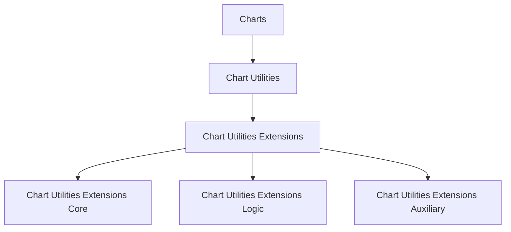
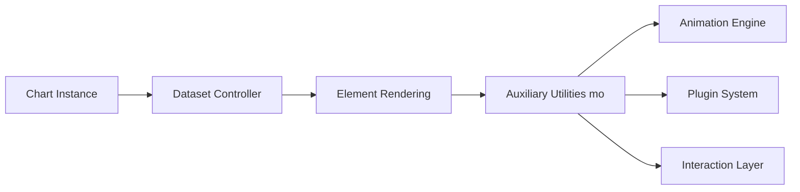
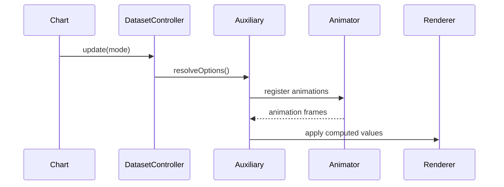
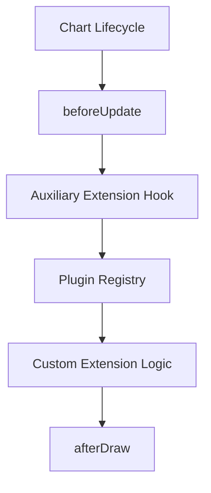
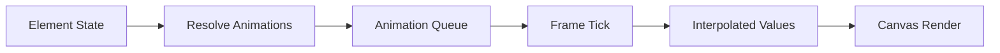

# Chart Utilities Extensions Auxiliary

## Overview

The **Chart Utilities Extensions Auxiliary** module provides supporting logic for advanced Chart.js utility extensions within the MeshCentral UI. It encapsulates auxiliary behaviors that complement the core and logic layers of chart utilities, enabling enhanced rendering, animation handling, interaction support, and plugin orchestration.

This module is built around the following core component:

- `meshcentral.public.scripts.charts.mo`

This component is part of the bundled Chart.js distribution and represents an auxiliary layer used by higher-level chart utilities and extensions.

---

## Architectural Context

The Chart Utilities Extensions Auxiliary module is positioned within the chart utilities extension stack:

- Parent: [Chart Utilities Extensions](../chart-utilities-extensions.md)
- Sibling (Core): [Chart Utilities Extensions Core](../chart-utilities-extensions-core/chart-utilities-extensions-core.md)
- Sibling (Logic): [Chart Utilities Extensions Logic](../chart-utilities-extensions-logic/chart-utilities-extensions-logic.md)

### Hierarchical Placement

The Auxiliary module supports extension-level customization scenarios that are not part of the primary core rendering or logic pipelines.

---

## Core Responsibilities

The Chart Utilities Extensions Auxiliary module focuses on:

1. Supplemental rendering behaviors
2. Advanced animation orchestration
3. Tooltip and interaction support wiring
4. Plugin integration hooks
5. Dataset and scale coordination helpers

It enhances extensibility without modifying primary chart core logic.

---

## Internal Structure

Although delivered as part of a bundled Chart.js build, the `mo` component participates in several internal systems:

### Key Integration Points

- **Animation System** – Works with `Animation` and `Animations` classes to coordinate property transitions.
- **Plugin Lifecycle** – Hooks into plugin phases such as `beforeDraw`, `afterDraw`, and `afterEvent`.
- **Scale Interaction** – Assists in value-to-pixel and pixel-to-value translations when extensions require derived positioning.
- **Tooltip Infrastructure** – Contributes to advanced rendering and positioning logic.

---

## Data Flow Integration

When a chart is updated, auxiliary extensions participate in the update pipeline.

### Update Cycle Participation

1. Chart triggers dataset update.
2. Dataset controller resolves shared and element-specific options.
3. Auxiliary utilities enhance configuration (animation, fill, interaction hooks).
4. Animator processes transitions.
5. Final values are rendered.

---

## Interaction with Plugin System

Auxiliary extensions integrate tightly with Chart.js plugins:

This enables:

- Conditional rendering behaviors
- Dynamic dataset styling
- Tooltip customizations
- Runtime feature injection

---

## Animation Coordination

Auxiliary logic interacts with the animation subsystem to manage:

- Property transitions (position, opacity, dimensions)
- Easing effects
- Dataset-level animation inheritance
- Element-level override behaviors

The auxiliary layer ensures animation consistency when extensions modify datasets or visual properties.

---

## Scale and Coordinate Support

Extensions often require derived values from chart scales. The auxiliary component helps bridge:

- Data value → Pixel conversion
- Radial and Cartesian transformations
- Stacked dataset offsets
- Segment interpolation

This ensures visual correctness even when extensions modify geometry.

---

## Integration Within MeshCentral UI

Within the MeshCentral interface, this module supports:

- Dashboard charts
- Usage graphs
- System metric visualizations
- Device monitoring panels

It enables extended behaviors without tightly coupling UI logic to Chart.js internals.

---

## Relationship to Other Chart Modules

| Module | Responsibility | Relationship |
|--------|----------------|-------------|
| Chart Core | Base rendering engine | Provides foundational chart behavior |
| Chart Utilities Core | Utility abstractions | Supplies shared utilities |
| Chart Utilities Extensions Logic | Business/interaction logic | Implements feature-level logic |
| **Chart Utilities Extensions Auxiliary** | Supplemental integration layer | Enhances and supports extension behaviors |

---

## Summary

The **Chart Utilities Extensions Auxiliary** module acts as a structural support layer for advanced chart behaviors in MeshCentral. While it does not define primary rendering logic, it:

- Enhances extensibility
- Coordinates animations and plugins
- Supports advanced tooltip and scale operations
- Maintains separation between core chart logic and extension behaviors

This design promotes modularity, allowing extension features to evolve independently of the Chart.js core engine.
