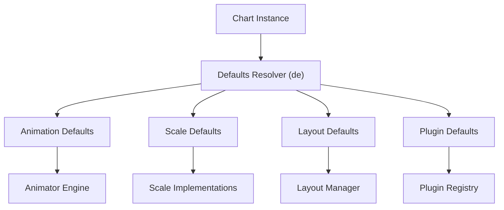
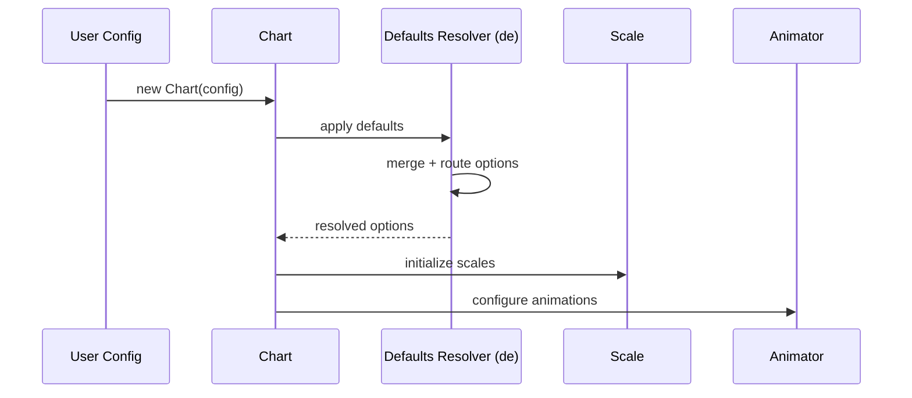
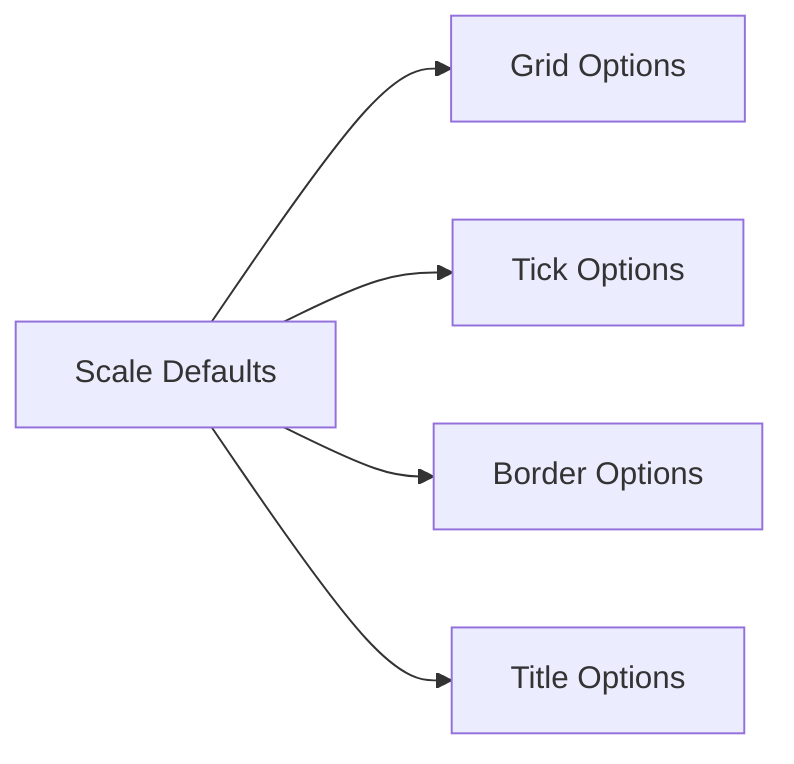
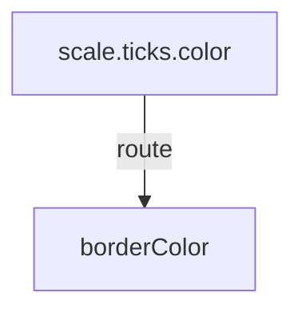
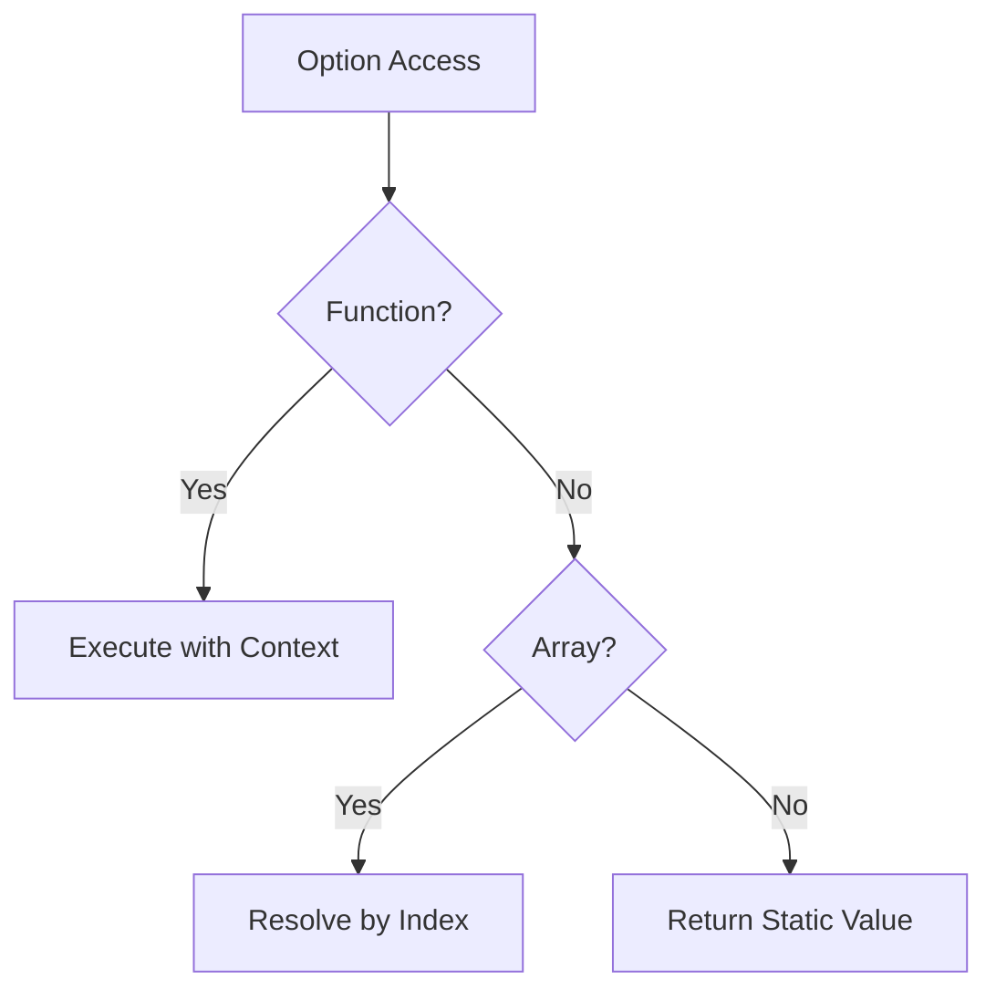
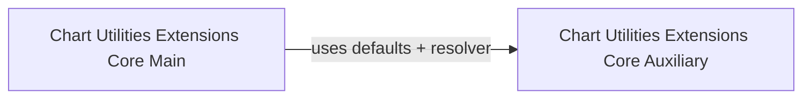

# Chart Utilities Extensions Core Auxiliary

The **Chart Utilities Extensions Core Auxiliary** module encapsulates auxiliary core logic for chart utility extensions, centered around the `meshcentral.public.scripts.charts.de` component (Chart.js core configuration and defaults layer).

This module provides:
- Global default configuration management
- Scriptable and indexable option resolution
- Animation and transition defaults
- Scale and layout base configuration
- Plugin configuration scaffolding

It acts as a foundational configuration engine used by higher-level chart utilities and extensions.

---

## Module Context in the Chart Hierarchy

Within the charts domain, this module belongs to:

- Charts
  - Chart Utilities
    - Chart Utilities Extensions
      - Chart Utilities Extensions Core
        - **Chart Utilities Extensions Core Auxiliary (current module)**

It complements:
- [Chart Utilities Extensions Core Main](../chart-utilities-extensions-core-main/chart-utilities-extensions-core-main.md)

The Main module typically handles primary extension behaviors, while this Auxiliary module focuses on configuration defaults, option merging, and animation scaffolding.

---

## Core Component

### `meshcentral.public.scripts.charts.de`

This component implements the **global defaults registry and configuration resolver** for Chart.js.

Responsibilities include:

- Defining default values for:
  - Animations
  - Transitions
  - Layout
  - Scales
  - Ticks
  - Fonts
- Supporting scriptable and indexable options
- Merging user configuration with defaults
- Routing option values between related configuration branches
- Providing fallback resolution logic

---

## Architectural Overview



The Defaults Resolver (`de`) acts as a configuration hub that prepares runtime-ready option objects for the rest of the charting pipeline.

---

## Configuration Resolution Flow

When a chart is instantiated or updated, configuration resolution proceeds as follows:



Key behaviors:
- Deep merge of configuration objects
- Scriptable option evaluation
- Context-aware resolution (dataset, element, scale)
- Transition-based overrides (e.g., `active`, `resize`, `show`, `hide`)

---

## Default Configuration Domains

### 1. Animation System

Defines:
- Default duration
- Easing functions
- Per-property animation typing
- Transition presets (active, resize, show, hide)

Example conceptual structure:

```text
animation
 ├─ duration
 ├─ easing
 ├─ loop
 └─ fn

animations
 ├─ colors
 └─ numbers

transitions
 ├─ active
 ├─ resize
 ├─ show
 └─ hide
```

These defaults are consumed by the Animator subsystem.

---

### 2. Scale Defaults

Provides baseline configuration for:
- Display behavior
- Grid lines
- Border rendering
- Tick formatting
- Title styling



These defaults are inherited and extended by specific scale types (linear, logarithmic, time, radial).

---

### 3. Layout Defaults

Defines chart-level layout configuration:

- Automatic padding
- Explicit padding (top, right, bottom, left)

This feeds into the layout engine responsible for:
- Chart area sizing
- Box layout (legend, title, subtitle)
- Scale placement

---

### 4. Plugin Defaults

The module initializes a structured `plugins` configuration namespace, enabling:

- Tooltip defaults
- Legend defaults
- Subtitle and title defaults
- Custom plugin configuration

Plugins rely on this resolver to:
- Access scoped options
- Apply scriptable properties
- Inherit defaults safely

---

## Option Routing and Fallbacks

A critical feature of `de` is **option routing**.

Routing allows one option branch to inherit from another automatically.

Example conceptual routing:



If `scale.ticks.color` is not explicitly defined, it may fallback to `borderColor` or other routed values.

This mechanism ensures:
- Minimal duplication
- Predictable cascading
- Theme consistency

---

## Scriptable and Indexable Options

The resolver supports dynamic options:

- **Scriptable**: values defined as functions receiving context
- **Indexable**: arrays that vary per data index



This flexibility enables advanced behaviors such as:
- Per-point styling
- Context-aware colors
- Dynamic animation durations

---

## Interaction with Sibling Module

The **Chart Utilities Extensions Core Main** module typically:

- Registers controllers and elements
- Extends chart behaviors
- Defines higher-level extension logic

The Auxiliary module provides the configuration backbone that those behaviors rely on.

Relationship:



---

## Lifecycle Integration

During chart lifecycle phases:

1. Initialization → Defaults applied
2. Update → Options re-resolved
3. Animation → Transitions applied
4. Resize → Layout recalculated
5. Destroy → Defaults remain intact (global registry)

This module ensures configuration consistency across all phases.

---

## Summary

The **Chart Utilities Extensions Core Auxiliary** module is a configuration and defaults engine that:

- Centralizes Chart.js global defaults
- Provides deep merge and fallback logic
- Enables scriptable and dynamic options
- Powers animations, scales, layout, and plugins
- Supports extension modules with consistent configuration behavior

It is foundational to the chart utility ecosystem, ensuring that all chart extensions operate on a robust, flexible, and predictable configuration layer.