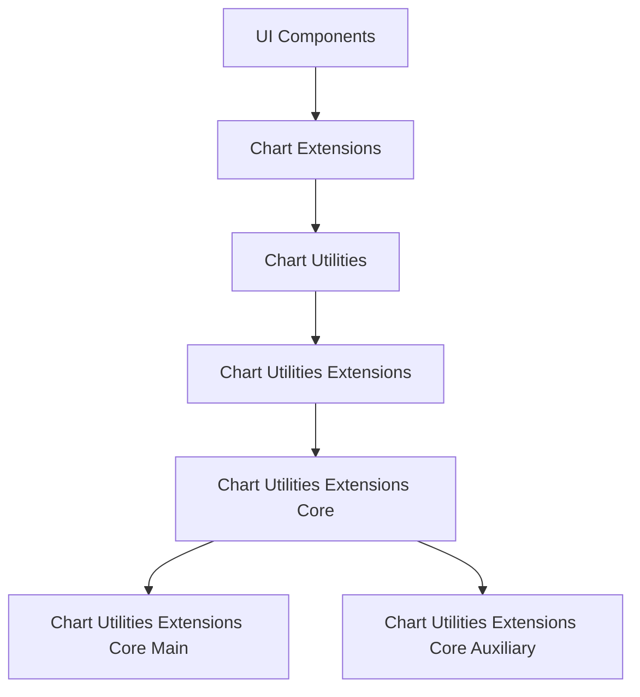
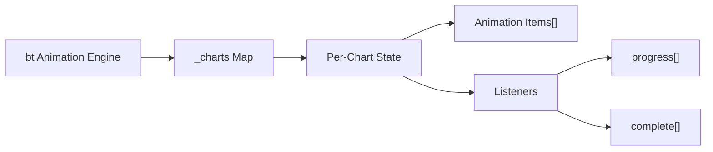
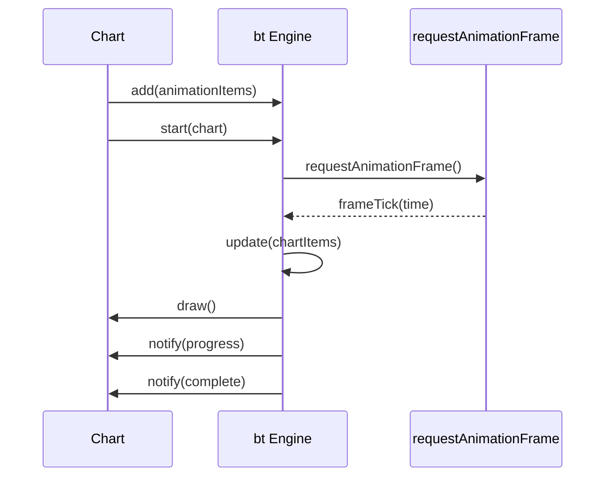
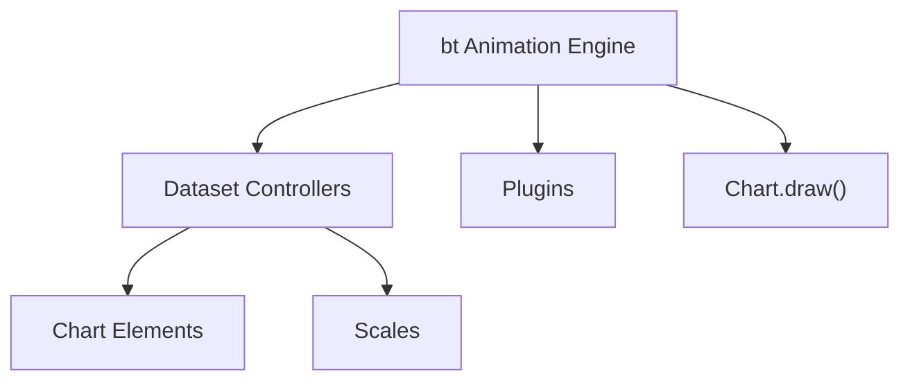
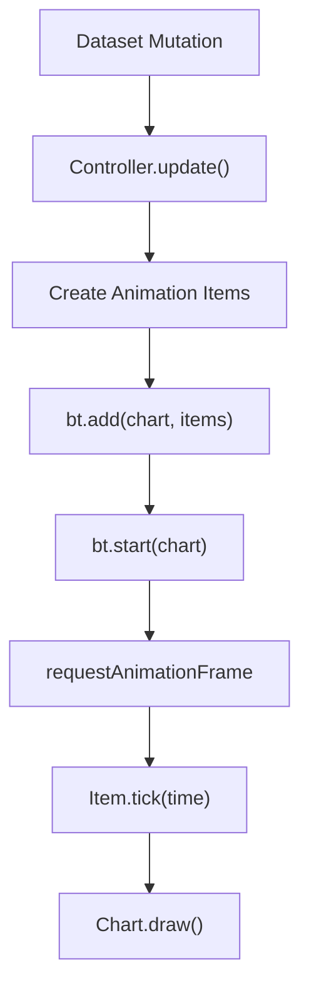
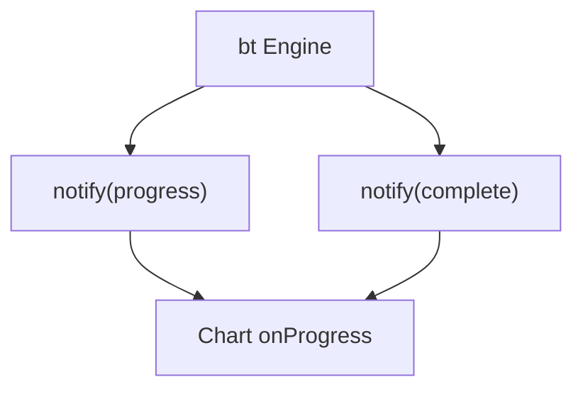
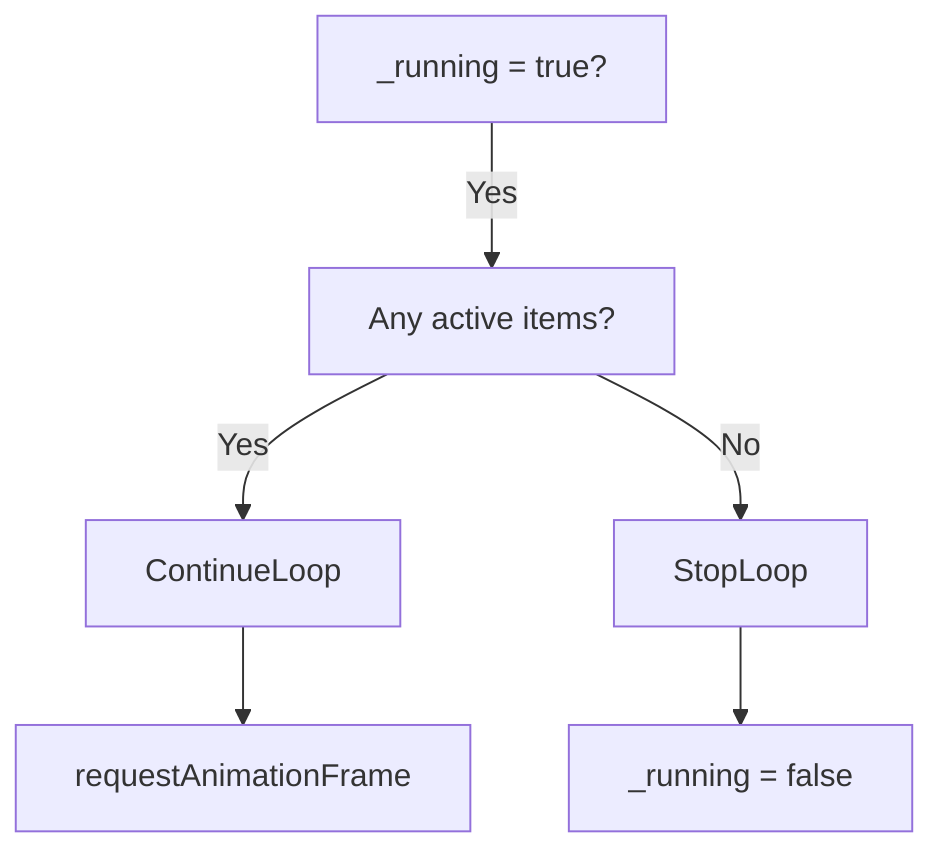

# Chart Utilities Extensions Core Main

The **Chart Utilities Extensions Core Main** module encapsulates the primary runtime engine for advanced chart utilities within the MeshCentral UI layer. At its core, it integrates the Chart.js rendering engine (v4.x) and exposes animation, layout, scale, controller, plugin, and rendering orchestration capabilities used by higher-level chart utility extensions.

This module is centered around the `meshcentral.public.scripts.charts.bt` component, which represents the animation scheduler and runtime coordination backbone of the chart system.

---

## 1. Purpose and Responsibilities

Chart Utilities Extensions Core Main is responsible for:

- Coordinating chart animation lifecycles
- Managing per-chart animation queues
- Synchronizing rendering updates with `requestAnimationFrame`
- Dispatching progress and completion events
- Acting as the runtime bridge between datasets, elements, scales, and plugins

It does **not** define chart types or utility helpers directly. Instead, it provides the orchestration layer that higher-level modules depend on.

This module sits within the following hierarchy:

- Parent: Chart Utilities Extensions Core
- Sibling: [Chart Utilities Extensions Core Auxiliary](chart-utilities-extensions-core-auxiliary/chart-utilities-extensions-core-auxiliary.md)

---

## 2. Architectural Positioning

### High-Level Placement in Chart System

Chart Utilities Extensions Core Main provides the animation and rendering coordination layer that the rest of the chart system relies upon.

---

## 3. Core Component: bt (Animation Engine)

The `bt` class is the animation scheduler and runtime manager.

### Responsibilities of bt

- Maintain a map of active charts
- Track animation items per chart
- Start and stop animation loops
- Trigger `progress` and `complete` callbacks
- Synchronize animation ticks with the browser frame loop

### Internal State Structure

Each chart has an internal animation state:

- `running`: Whether animations are active
- `items`: Animation objects to update
- `listeners`: Progress and completion callbacks
- `duration`: Maximum animation duration
- `start`: Timestamp when animation begins

---

## 4. Animation Lifecycle

### Animation Flow

### Execution Phases

1. **Registration**
   - Chart registers animation items via `add()`

2. **Start**
   - `start(chart)` marks animation as running
   - Duration computed from all animation items

3. **Frame Loop**
   - `_refresh()` schedules frame updates
   - `_update()` processes animation tick logic

4. **Tick Processing**
   - Active animations receive `tick(time)`
   - Expired animations are removed
   - Chart redraw triggered

5. **Completion**
   - When no items remain, `complete` listeners fire
   - Engine stops scheduling frames

---

## 5. Interaction with Chart Core

Chart Utilities Extensions Core Main does not directly implement:

- Chart controllers
- Scales
- Dataset logic
- Element rendering

Instead, it orchestrates them.

### Integration Overview

The animator drives redraw cycles. Controllers update element state. Elements render themselves. Plugins receive lifecycle notifications.

---

## 6. Data Flow During Animation

This ensures:

- Smooth transitions between old and new dataset states
- Coordinated rendering across multiple elements
- Efficient frame scheduling

---

## 7. Event Notification Model

The animation engine exposes two primary listener types:

- `progress`
- `complete`

### Listener Model

Listeners receive:

- Chart reference
- Total steps
- Current step
- Whether animation is initial

This allows higher layers to:

- Update UI state
- Trigger dependent calculations
- Synchronize external systems

---

## 8. Rendering and Performance Strategy

### Key Design Principles

- Single animation scheduler shared across charts
- Batched updates per frame
- Removal of inactive animation items
- Automatic stop when no animations remain
- Avoid redundant frame scheduling

### Frame Control Logic

This ensures the engine consumes CPU only while animations are active.

---

## 9. Relationship to Auxiliary Module

While Chart Utilities Extensions Core Main manages animation and coordination, related logic such as extended helpers, formatting, and advanced computation reside in:

- [Chart Utilities Extensions Core Auxiliary](chart-utilities-extensions-core-auxiliary/chart-utilities-extensions-core-auxiliary.md)

The separation allows:

- Clean runtime engine boundaries
- Modular extension support
- Easier maintainability

---

## 10. Summary

Chart Utilities Extensions Core Main provides the animation and rendering orchestration engine for the charting subsystem.

It:

- Drives animation timing
- Coordinates redraw cycles
- Dispatches lifecycle events
- Integrates controllers, elements, scales, and plugins

Without this module, chart updates would be static and uncoordinated. With it, the system achieves smooth transitions, synchronized updates, and extensible rendering behavior across the entire chart utilities stack.

It serves as the heartbeat of the chart runtime within the MeshCentral UI ecosystem.
