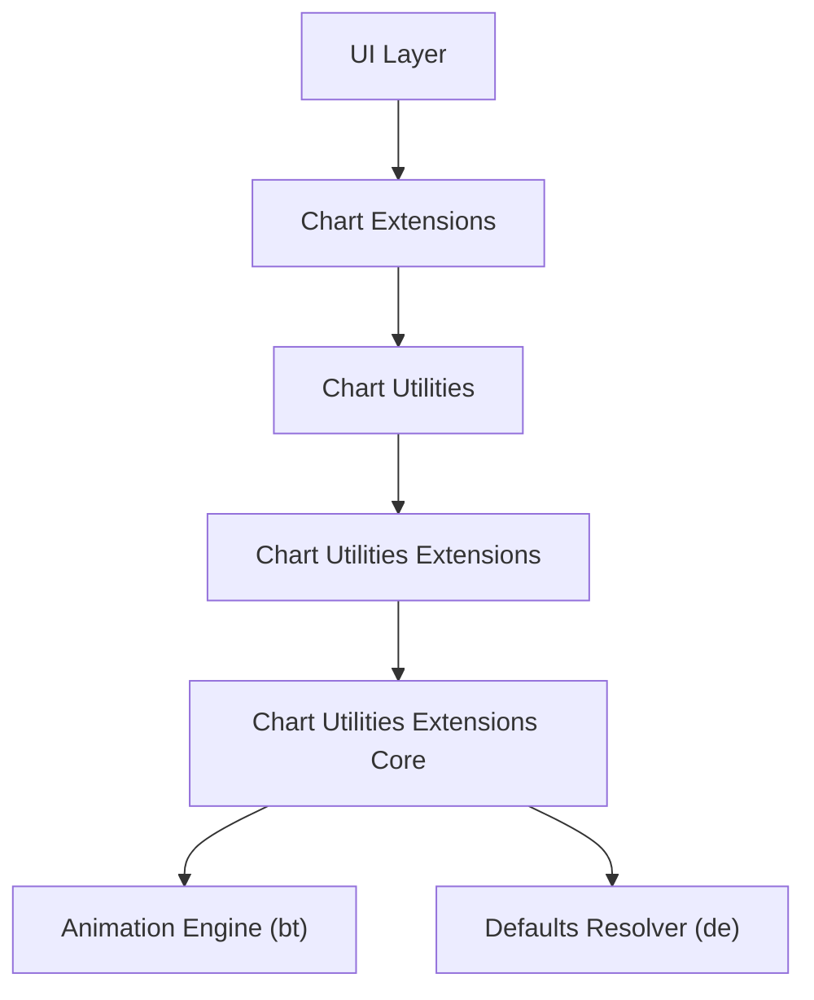
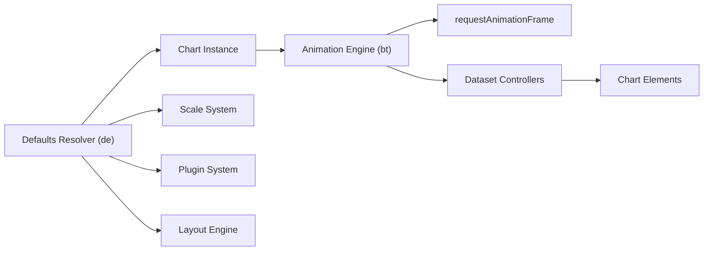
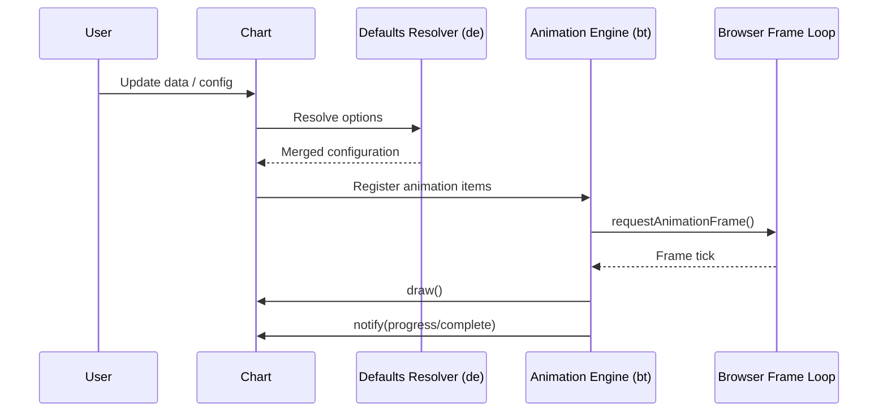
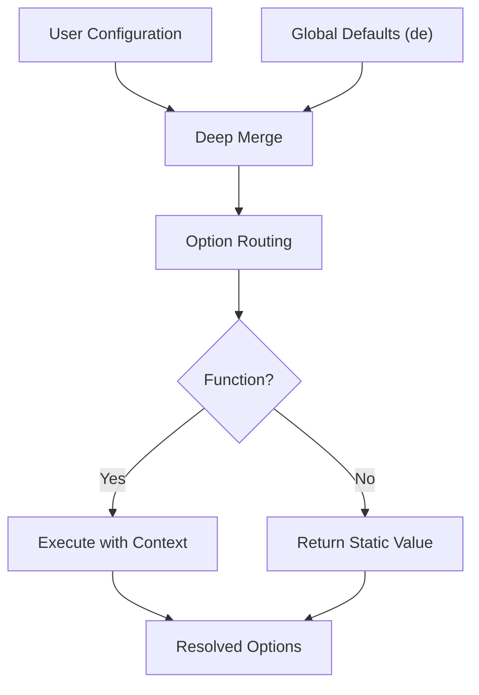
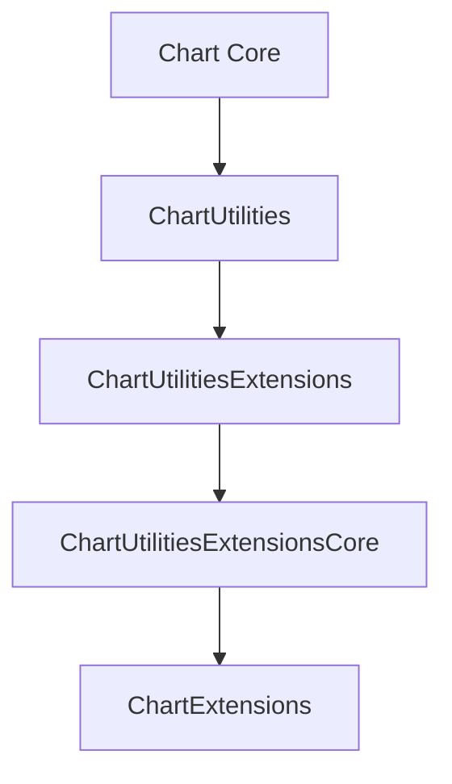

# Chart Utilities Extensions Core

The **Chart Utilities Extensions Core** module is the foundational extension layer within the chart utilities subsystem of the MeshCentral UI. It consolidates the runtime animation engine and the global configuration resolver that power advanced chart behaviors built on top of Chart.js.

This module lives under:

```
public/scripts
└── charts
    └── chart-utilities
        └── chart-utilities-extensions
            └── chart-utilities-extensions-core
```

It provides:

- The animation orchestration engine for chart rendering
- The global defaults and configuration resolver
- Integration hooks for controllers, scales, layouts, and plugins
- A stable runtime backbone for higher-level chart extensions

---

## 1. Purpose of the Module

The **Chart Utilities Extensions Core** module is responsible for:

- Coordinating animation lifecycles across charts
- Managing frame scheduling and redraw synchronization
- Resolving global and scoped configuration defaults
- Supporting scriptable and indexable options
- Providing extension-ready runtime infrastructure

It acts as the bridge between:

- Low-level chart runtime mechanics
- Higher-level utility extensions
- Chart controllers, scales, and plugins

Without this module, chart utilities would lack coordinated animation, consistent configuration behavior, and extensibility.

---

## 2. Core Components

This module contains two primary components:

### 2.1 Animation Engine

- `meshcentral.public.scripts.charts.bt`

Acts as the animation scheduler and runtime coordination engine.

Responsibilities:

- Track per-chart animation state
- Schedule updates via `requestAnimationFrame`
- Trigger redraw cycles
- Notify progress and completion listeners
- Stop scheduling when no animations remain

See:
- [Chart Utilities Extensions Core Main](chart-utilities-extensions-core-main/chart-utilities-extensions-core-main.md)

---

### 2.2 Defaults & Configuration Resolver

- `meshcentral.public.scripts.charts.de`

Acts as the global defaults registry and configuration resolution engine.

Responsibilities:

- Define and manage default values for:
  - Animations
  - Scales
  - Layout
  - Plugins
- Merge user configuration with defaults
- Provide routing and fallback logic
- Support scriptable and indexable options

See:
- [Chart Utilities Extensions Core Auxiliary](chart-utilities-extensions-core-auxiliary/chart-utilities-extensions-core-auxiliary.md)

---

## 3. Architectural Overview

### High-Level Position in the Chart System



The module forms the internal runtime backbone for chart utility extensions.

---

## 4. Internal Architecture

### Component Relationship



### Responsibilities Split

| Concern | Component |
|----------|------------|
| Animation scheduling | `bt` |
| Frame lifecycle | `bt` |
| Progress / complete events | `bt` |
| Global defaults | `de` |
| Option merging | `de` |
| Scriptable resolution | `de` |
| Fallback routing | `de` |

---

## 5. Animation and Rendering Flow



Key characteristics:

- Centralized animation scheduler
- Batched frame updates
- Auto-stop when animations finish
- Clean separation between configuration and execution

---

## 6. Configuration Resolution Model



This enables:

- Context-aware dynamic styling
- Transition-based overrides
- Per-dataset and per-element customization
- Predictable fallback chains

---

## 7. Position Within the Repository

Relevant path:

```
public/scripts/charts/
└── chart-utilities/
    └── chart-utilities-extensions/
        └── chart-utilities-extensions-core/
            ├── bt  (Animation Engine)
            └── de  (Defaults & Resolver)
```

Hierarchy context:

- Charts
  - Chart Utilities
    - Chart Utilities Extensions
      - **Chart Utilities Extensions Core**
        - Chart Utilities Extensions Core Main (`bt`)
        - Chart Utilities Extensions Core Auxiliary (`de`)

---

## 8. Relationship to Other Chart Modules

The module integrates with:

- Chart Core (controllers, elements, dataset logic)
- Chart Utilities (shared helpers)
- Chart Extensions (feature-level extensions)



- The **Core Main** component drives animation.
- The **Core Auxiliary** component standardizes configuration.
- Higher-level extensions rely on both.

---

## 9. Design Principles

The module follows several architectural principles:

- Single animation scheduler shared across charts
- Strict separation between configuration and runtime execution
- Declarative configuration model with scriptable flexibility
- Extension-safe defaults registry
- Minimal coupling between animation and business logic

This separation allows:

- Smooth transitions between dataset states
- Predictable configuration inheritance
- High-performance frame scheduling
- Clean extension layering

---

## 10. Summary

The **Chart Utilities Extensions Core** module is the runtime and configuration backbone of the MeshCentral chart utilities ecosystem.

It provides:

- A centralized animation engine (`bt`)
- A powerful defaults and configuration resolver (`de`)
- Frame-synchronized rendering orchestration
- Option routing and scriptable resolution
- Extension-ready infrastructure

Together, these components ensure that chart utilities operate with:

- Smooth animations  
- Consistent configuration behavior  
- Modular extension capabilities  
- Scalable rendering performance  

For detailed documentation of internal components, refer to:

- **Chart Utilities Extensions Core Main**
- **Chart Utilities Extensions Core Auxiliary**

This module serves as the structural and operational core that enables advanced, extensible, and performant chart behavior across the MeshCentral UI.