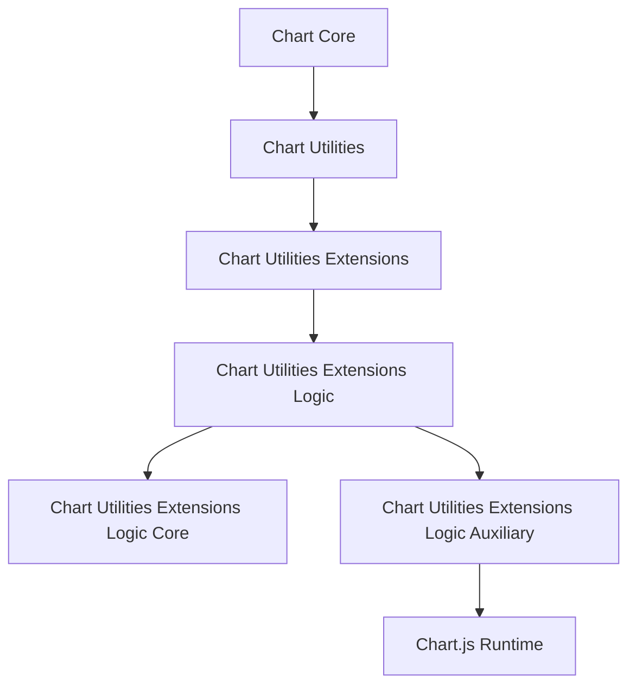
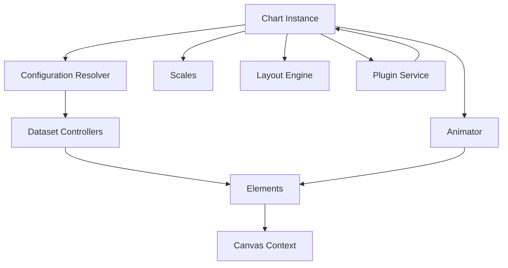
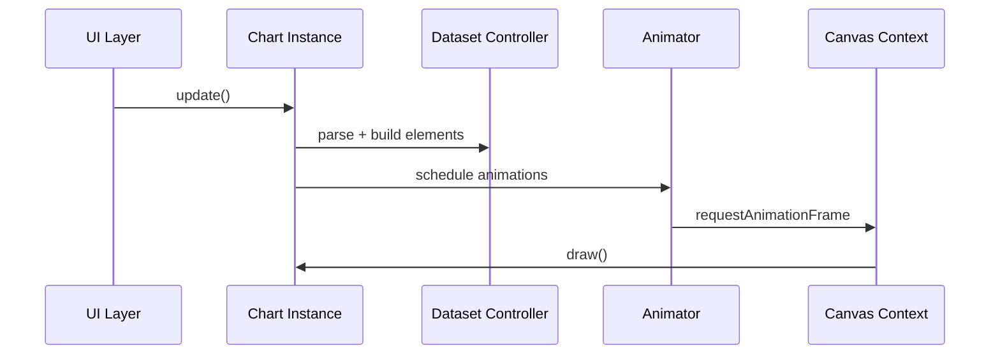
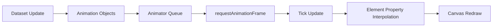
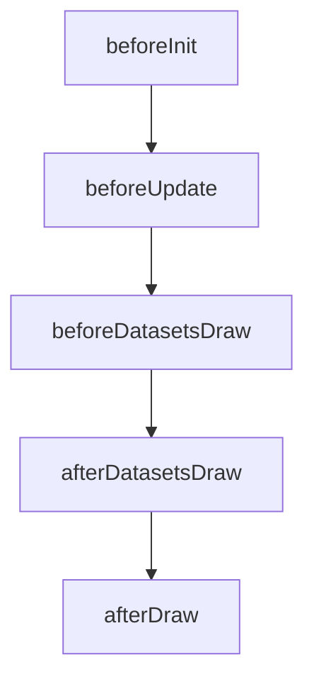
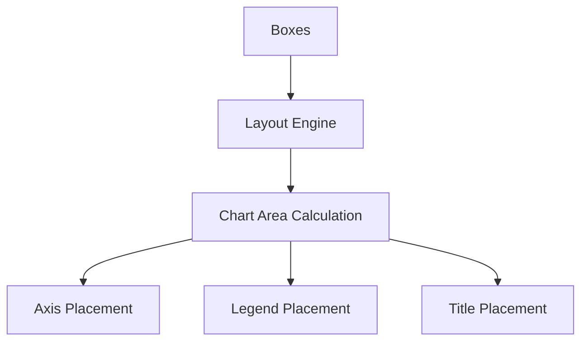
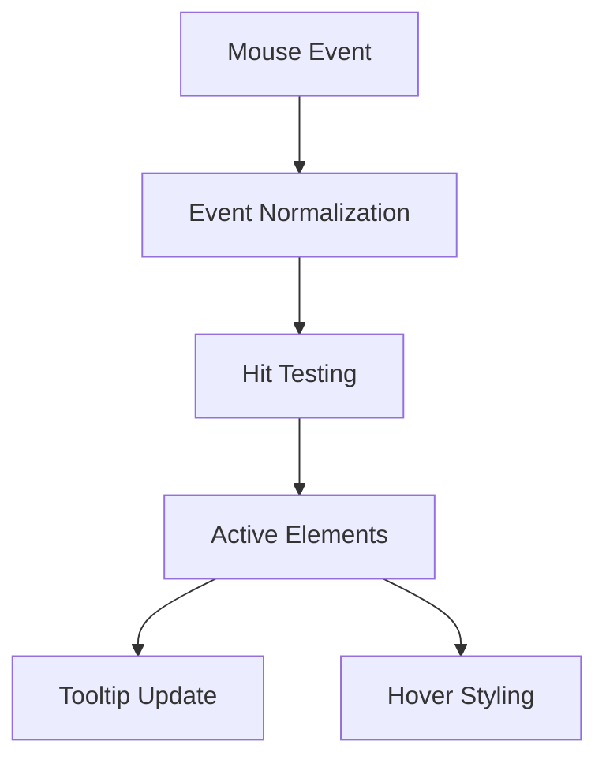
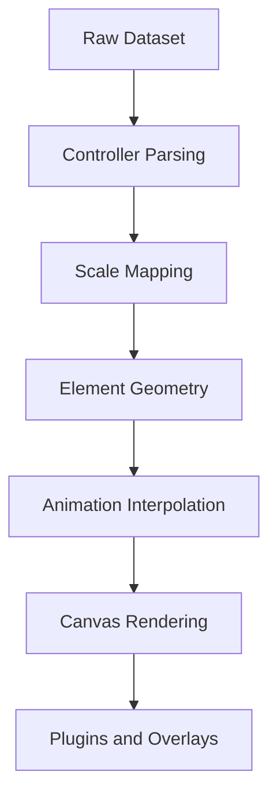

# Chart Utilities Extensions Logic Auxiliary

The **Chart Utilities Extensions Logic Auxiliary** module encapsulates auxiliary logic that complements the core chart utilities extension pipeline. It is primarily responsible for hosting and exposing the extended Chart.js runtime (via `meshcentral.public.scripts.charts.ls`) and providing platform abstraction, animation orchestration, plugin wiring, and rendering utilities that support higher-level chart logic.

This module acts as a *supporting runtime layer* for chart utilities extensions logic, ensuring consistent rendering behavior, animation handling, layout management, and plugin execution across the UI.

---

## 1. Module Purpose and Responsibilities

The Chart Utilities Extensions Logic Auxiliary module:

- Provides the bundled **Chart.js runtime (v4.x)**
- Supplies:
  - Rendering primitives (Arc, Line, Bar, Point elements)
  - Dataset controllers (Line, Bar, Scatter, Pie, Doughnut, etc.)
  - Scale implementations (Linear, Logarithmic, Time, Radial)
  - Layout engine
  - Plugin system
  - Animation engine
- Hosts built-in plugins:
  - Legend
  - Tooltip
  - Title / Subtitle
  - Filler
  - Decimation
  - Colors
- Implements platform abstraction (DOM and Basic platforms)
- Provides interaction and hit-testing logic

It does **not** define business-specific chart behavior. Instead, it enables higher-level modules such as:

- [Chart Utilities Extensions Logic Core](chart-utilities-extensions-logic-core/chart-utilities-extensions-logic-core.md)
- [Chart Utilities Extensions Logic](../chart-utilities-extensions-logic.md)

---

## 2. Architectural Position

Within the chart hierarchy:

The Chart Utilities Extensions Logic Auxiliary module provides the **runtime engine** used by Logic Core to:

- Register datasets
- Configure scales
- Execute animations
- Render charts
- Manage tooltips and legends

---

## 3. High-Level Runtime Architecture

The embedded Chart.js runtime follows a layered architecture.

### Core Layers

| Layer | Responsibility |
|-------|---------------|
| Chart Instance | Entry point coordinating updates and rendering |
| Configuration Resolver | Merges defaults, dataset options, and overrides |
| Dataset Controllers | Translate raw data into drawable elements |
| Elements | Primitive drawing units (Arc, Line, Bar, Point) |
| Scales | Convert values to pixel space |
| Layout Engine | Computes chart area, legend placement, title placement |
| Animator | Drives transitions and easing |
| Plugin Service | Lifecycle hooks for extensibility |

---

## 4. Core Runtime Components

The module exposes the full Chart.js bundle via the `ls` export.

### 4.1 Chart Class

The `Chart` class:

- Owns canvas context
- Manages datasets and metadata
- Coordinates update lifecycle
- Dispatches plugin hooks
- Executes rendering pipeline

Update lifecycle:

---

### 4.2 Dataset Controllers

Controllers transform parsed data into renderable elements.

Examples included in this module:

- LineController
- BarController
- ScatterController
- DoughnutController
- RadarController
- PolarAreaController

Each controller:

- Parses dataset input
- Resolves options
- Updates geometry
- Applies stacking logic
- Coordinates animations

---

### 4.3 Elements

Primitive renderable units:

- ArcElement
- LineElement
- PointElement
- BarElement

Each element:

- Implements `draw()`
- Implements hit detection (`inRange()`)
- Supports animated properties

---

### 4.4 Scales

Scale types provided:

- CategoryScale
- LinearScale
- LogarithmicScale
- TimeScale
- TimeSeriesScale
- RadialLinearScale

Scales:

- Maintain min/max bounds
- Convert values → pixels
- Generate ticks
- Format labels

---

## 5. Animation Subsystem

The animation system is centralized in the Animator.

Animation features:

- Property-based animation definitions
- Easing functions
- Looping support
- Progress / completion listeners
- Transition presets (show/hide/resize)

This is critical for smooth transitions handled by Logic Core.

---

## 6. Plugin Infrastructure

Built-in plugins included in this module:

- Legend
- Tooltip
- Title
- Subtitle
- Filler
- Decimation
- Colors

Plugin lifecycle hooks:

Plugins can:

- Inject layout boxes
- Modify datasets
- Intercept draw phases
- Add interactivity

The Chart Utilities Extensions Logic Core module relies on this plugin pipeline for advanced behaviors.

---

## 7. Layout System

The layout engine manages:

- Chart area
- Legends
- Titles
- Subtitles
- Axes positioning

The auxiliary module ensures consistent spacing and adaptive layout regardless of chart type.

---

## 8. Interaction & Hit Testing

Interaction modes supported:

- nearest
- index
- dataset
- x
- y
- point

Interaction flow:

This enables tooltips and hover effects used by upper logic layers.

---

## 9. Platform Abstraction

Two platform implementations exist:

- DomPlatform
- BasicPlatform

Responsibilities:

- Canvas acquisition
- Event binding
- Resize observation
- Device pixel ratio handling

This abstraction ensures:

- Browser compatibility
- Responsive behavior
- High-DPI support

---

## 10. Data Flow Through the Module

The auxiliary module guarantees:

- Correct transformation from data → visuals
- Efficient incremental updates
- Plugin-safe lifecycle management

---

## 11. Relationship With Logic Core

The Chart Utilities Extensions Logic Auxiliary module:

- Provides the rendering engine
- Does not enforce business rules
- Does not transform domain-specific data

The [Chart Utilities Extensions Logic Core](chart-utilities-extensions-logic-core/chart-utilities-extensions-logic-core.md) module:

- Prepares datasets
- Applies domain transformations
- Configures chart options
- Triggers updates

Separation of concerns:

| Module | Responsibility |
|---------|---------------|
| Logic Core | Business-specific chart configuration |
| Logic Auxiliary | Generic Chart.js runtime and rendering engine |

---

## 12. Why This Module Exists

Although Chart.js could be imported directly, this module:

- Encapsulates the bundled runtime
- Ensures consistent versioning
- Centralizes rendering behavior
- Provides extension-friendly architecture
- Enables controlled plugin registration

This prevents fragmentation of chart runtime logic across the UI.

---

## 13. Summary

The **Chart Utilities Extensions Logic Auxiliary** module is the runtime backbone of the chart subsystem. It provides:

- Full Chart.js engine
- Animation orchestration
- Layout management
- Scale resolution
- Dataset controllers
- Rendering elements
- Plugin lifecycle
- Interaction and tooltip logic

It works in tandem with higher-level logic modules to transform structured data into animated, interactive visualizations within the UI ecosystem.

---

### Related Modules

- [Chart Utilities Extensions Logic](../chart-utilities-extensions-logic.md)
- [Chart Utilities Extensions Logic Core](chart-utilities-extensions-logic-core/chart-utilities-extensions-logic-core.md)
