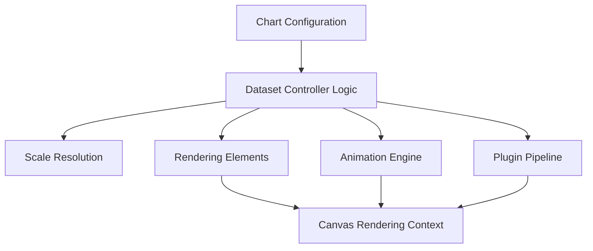
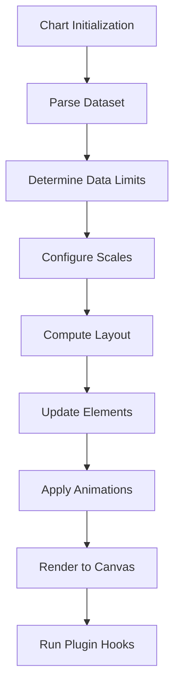
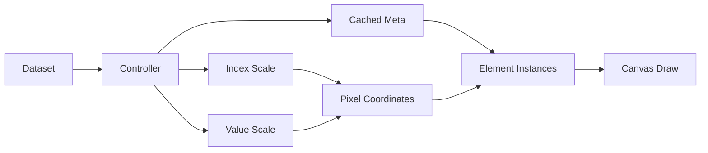
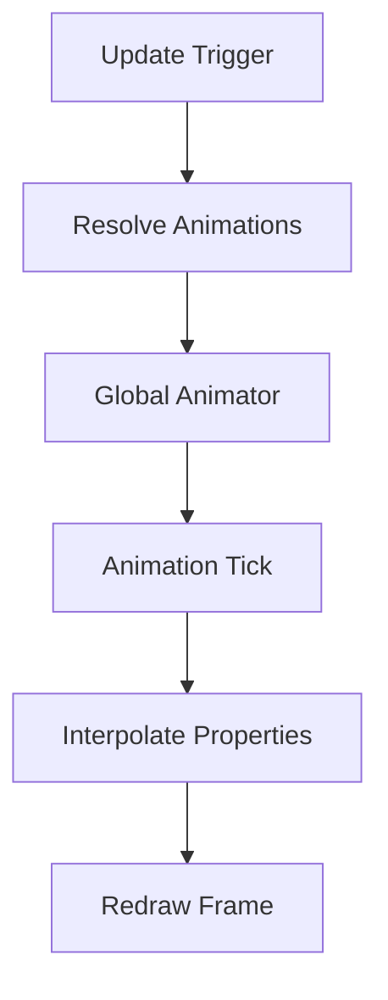
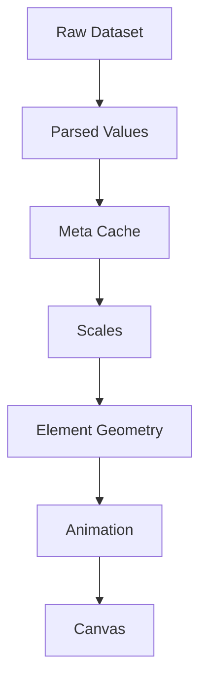

# Chart Utilities Extensions Logic Core

The **Chart Utilities Extensions Logic Core** module encapsulates the foundational runtime logic that powers advanced chart behavior within the Chart Utilities Extensions layer. Built on top of Chart.js v4.3.3, this module exposes and orchestrates the core logic components responsible for:

- Dataset parsing and normalization
- Scale resolution and coordinate transformation
- Animation lifecycle management
- Plugin and interaction pipelines
- Rendering flow control for complex chart types

This module acts as the execution engine behind higher-level chart utilities and extensions, bridging configuration, data, rendering, and interaction.

---

## Position in the Module Hierarchy

This module is part of the Chart Utilities Extensions Logic layer.

- Parent: [Chart Utilities Extensions Logic](../chart-utilities-extensions-logic.md)
- Sibling: [Chart Utilities Extensions Logic Auxiliary](../chart-utilities-extensions-logic-auxiliary/chart-utilities-extensions-logic-auxiliary.md)

Within the overall Charts structure, this module focuses strictly on **core execution logic**, while auxiliary modules provide helpers and secondary utilities.

---

## Core Components

This module is built from the following Chart.js core logic components:

- `meshcentral.public.scripts.charts.jn`
- `meshcentral.public.scripts.charts.la`

These correspond to:

- Core controller logic (dataset lifecycle, scale coordination, rendering flow)
- Core rendering element logic (line/path abstractions and geometry computation)

Together, they implement the runtime behavior of charts including parsing, updating, layout computation, animation, and drawing.

---

# Architectural Overview

The Chart Utilities Extensions Logic Core module follows the standard Chart.js architecture pattern:

### Key Responsibilities

| Layer | Responsibility |
|-------|----------------|
| Dataset Controller | Parsing, normalization, dataset lifecycle |
| Scale System | Domain → pixel coordinate transformation |
| Elements | Geometry calculation and path rendering |
| Animation Engine | Interpolation and transition control |
| Plugin System | Extensibility and lifecycle hooks |

---

# Execution Flow

The following diagram illustrates the full lifecycle of a chart update:

### 1. Dataset Parsing
- Primitive, array, and object-based data formats are supported.
- Parsed values are cached in `_cachedMeta._parsed`.
- Stack and index axis resolution occur here.

### 2. Scale Coordination
- Index and value scales are resolved via axis IDs.
- Pixel mapping functions are derived from scale types (linear, logarithmic, time, radial, etc.).

### 3. Element Updates
- Each data point is converted into a rendering element.
- Geometry is calculated (position, dimensions, angles, radii).
- Shared options are resolved to optimize memory usage.

### 4. Animation Handling
- Animations are registered with the global animator.
- Property transitions interpolate via easing functions.
- Completion and progress hooks notify listeners.

### 5. Rendering
- Elements render in z-index order.
- Clipping and stacking logic are respected.
- Canvas context is managed for high-DPI support.

---

# Component Interaction Model

The controller acts as the coordination layer between raw data, scale computation, and element rendering.

---

# Animation Subsystem

The animation subsystem enables smooth transitions between states.

### Animation Features
- Per-property animation configuration
- Shared animation descriptors
- Easing functions (linear, cubic, elastic, bounce, etc.)
- Cancelation and lifecycle notifications

---

# Plugin Integration

The logic core integrates deeply with the plugin system.

Lifecycle hooks include:

- `beforeInit`
- `beforeUpdate`
- `beforeLayout`
- `beforeDraw`
- `afterDraw`
- `afterDestroy`

Plugins can:

- Modify options
- Inject drawing behavior
- Observe animation progress
- Control tooltip and legend behavior

---

# Rendering Strategy

Rendering is optimized for:

- High-DPI displays (retina scaling)
- Clipping regions
- Partial redraws
- Segment-based drawing for performance

Elements expose:

- `draw()`
- `update()`
- `getCenterPoint()`
- `inRange()`

These methods allow precise hit detection and interaction.

---

# Data Flow Summary

This layered flow ensures separation between:

- Data interpretation
- Coordinate transformation
- Visual geometry
- Rendering execution

---

# Responsibilities Within the Charts System

Within the broader Charts module hierarchy, the Chart Utilities Extensions Logic Core module:

- Implements core runtime mechanics
- Provides the foundation for chart types (bar, line, pie, radar, etc.)
- Enables advanced utilities through extensible plugin hooks
- Acts as the bridge between configuration and visual output

Higher-level utilities and auxiliary modules build upon this core without reimplementing rendering or animation behavior.

---

# When to Modify This Module

Changes in this module affect:

- All chart rendering behavior
- Scale precision and axis handling
- Animation smoothness and performance
- Tooltip and legend positioning logic

Modifications should be carefully evaluated due to cross-cutting impact across the Charts subsystem.

---

# Conclusion

The **Chart Utilities Extensions Logic Core** module is the central execution engine of the charting system. It orchestrates:

- Data parsing
- Scale transformation
- Element lifecycle management
- Animation execution
- Plugin extensibility
- Canvas rendering

By encapsulating the runtime logic of Chart.js, this module provides a powerful and extensible foundation upon which all higher-level chart utilities and extensions are built.