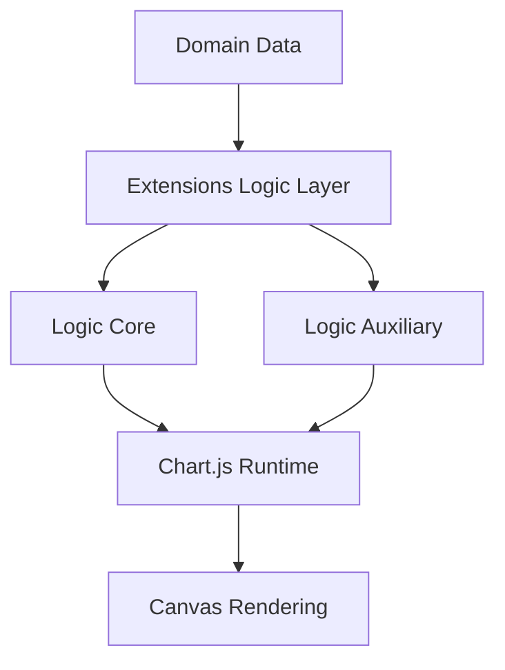
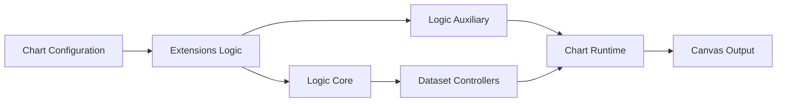
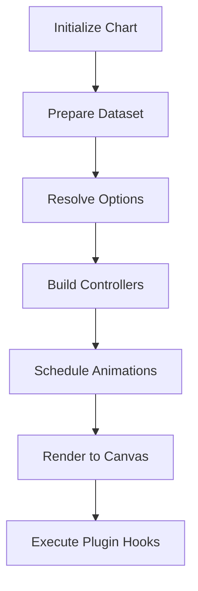
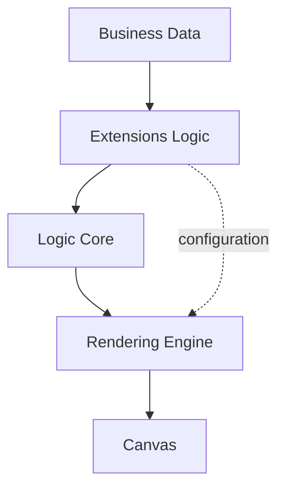

# Chart Utilities Extensions Logic

The **Chart Utilities Extensions Logic** module provides the high-level execution layer for advanced chart utilities within the MeshCentral UI. It coordinates extended chart behaviors, domain-specific transformations, and runtime orchestration on top of the embedded Chart.js engine.

This module sits within:

```
public/scripts/charts
```

and acts as the logical bridge between:

- Chart configuration and domain-specific data preparation  
- Core Chart.js runtime (rendering, scales, animations)  
- Utility extensions and auxiliary logic  

It ensures that extended chart features remain modular, maintainable, and separated from the underlying rendering engine.

---

## Module Purpose

The **Chart Utilities Extensions Logic** module is responsible for:

- Coordinating extended chart behaviors
- Transforming structured datasets into runtime-ready chart configurations
- Managing lifecycle hooks for complex visualizations
- Orchestrating interaction between utility extensions and core chart runtime
- Providing logical separation between business-level chart behavior and rendering engine mechanics

It does **not** implement raw rendering primitives directly. Instead, it builds upon:

- **Chart Utilities Extensions Logic Core**
- **Chart Utilities Extensions Logic Auxiliary**

---

## Repository Structure

```text
public/scripts/charts/
└── chart-utilities/
    └── chart-utilities-extensions/
        └── chart-utilities-extensions-logic/
            ├── jn
            ├── la
            ├── ls
            ├── chart-utilities-extensions-logic-core/
            │   ├── jn
            │   └── la
            └── chart-utilities-extensions-logic-auxiliary/
                └── ls
```

### Core Components

The module is composed of the following primary components:

- `meshcentral.public.scripts.charts.jn`
- `meshcentral.public.scripts.charts.la`
- `meshcentral.public.scripts.charts.ls`

Submodules:

- **Chart Utilities Extensions Logic Core**
  - `jn`
  - `la`
- **Chart Utilities Extensions Logic Auxiliary**
  - `ls`

---

## Architectural Overview

The module follows a layered orchestration model:



### Layer Responsibilities

| Layer | Responsibility |
|--------|---------------|
| Extensions Logic | High-level orchestration and configuration |
| Logic Core | Dataset lifecycle and chart behavior coordination |
| Logic Auxiliary | Chart.js runtime, plugins, animation engine |
| Chart.js Runtime | Rendering, scales, controllers, elements |

---

## Internal Interaction Model

The module coordinates logical flow between configuration, transformation, and rendering.



Key orchestration behaviors:

- Resolves merged configuration
- Applies dataset transformations
- Registers or configures plugins
- Triggers update and animation cycles
- Ensures layout consistency

---

## Execution Lifecycle

The high-level update flow:



This lifecycle ensures:

- Deterministic update behavior
- Smooth animated transitions
- Proper plugin invocation order
- Safe extensibility

---

## Relationship to Core Documentation

This module depends on and extends:

### 1. Chart Utilities Extensions Logic Core

See:  
`chart-utilities-extensions-logic-core/chart-utilities-extensions-logic-core.md`

Responsibilities:

- Dataset parsing and normalization  
- Controller coordination  
- Element geometry updates  
- Scale resolution  
- Animation triggering  

### 2. Chart Utilities Extensions Logic Auxiliary

See:  
`chart-utilities-extensions-logic-auxiliary/chart-utilities-extensions-logic-auxiliary.md`

Responsibilities:

- Full Chart.js runtime bundle  
- Built-in plugins (Legend, Tooltip, Title, etc.)  
- Layout engine  
- Interaction and hit-testing  
- Platform abstraction  

---

## Component-Level Breakdown

### `jn`
Primary dataset orchestration and controller logic.

### `la`
Core rendering logic and element coordination.

### `ls`
Bundled Chart.js runtime and plugin infrastructure.

Together, they provide:

- Controller lifecycle management
- Data-to-visual transformation
- Animation scheduling
- Rendering coordination
- Plugin pipeline integration

---

## Separation of Concerns



| Module | Focus |
|--------|-------|
| Extensions Logic | High-level orchestration |
| Logic Core | Chart behavior execution |
| Logic Auxiliary | Runtime & rendering |
| Chart.js | Low-level drawing |

This structure prevents:

- Business logic leaking into rendering code  
- Rendering code being duplicated  
- Tight coupling between utilities and engine  

---

## Why This Module Exists

Without this abstraction layer:

- Chart configuration would be scattered
- Runtime logic would mix with business logic
- Plugin wiring would become inconsistent
- Upgrades to Chart.js would be harder to manage

The **Chart Utilities Extensions Logic** module provides:

- Clean orchestration boundaries
- Centralized lifecycle control
- Extensibility-safe architecture
- Predictable rendering behavior

---

## Summary

The **Chart Utilities Extensions Logic** module is the orchestration layer for advanced chart functionality in the MeshCentral UI.

It:

- Coordinates dataset preparation and rendering
- Bridges configuration and runtime execution
- Leverages Logic Core for execution behavior
- Relies on Logic Auxiliary for rendering and plugins
- Ensures maintainable, modular chart extensibility

This module enables scalable, interactive, and animated visualizations while preserving architectural separation across the chart subsystem.