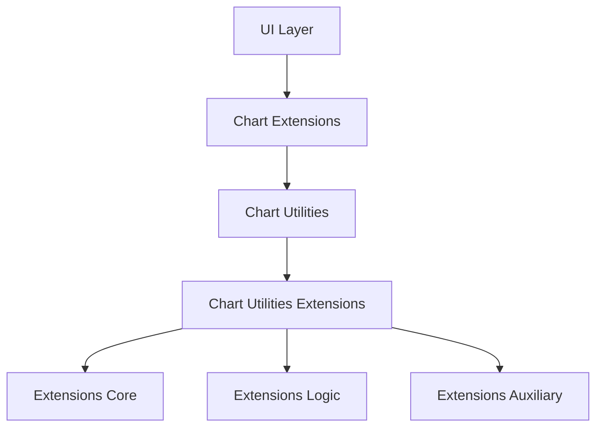
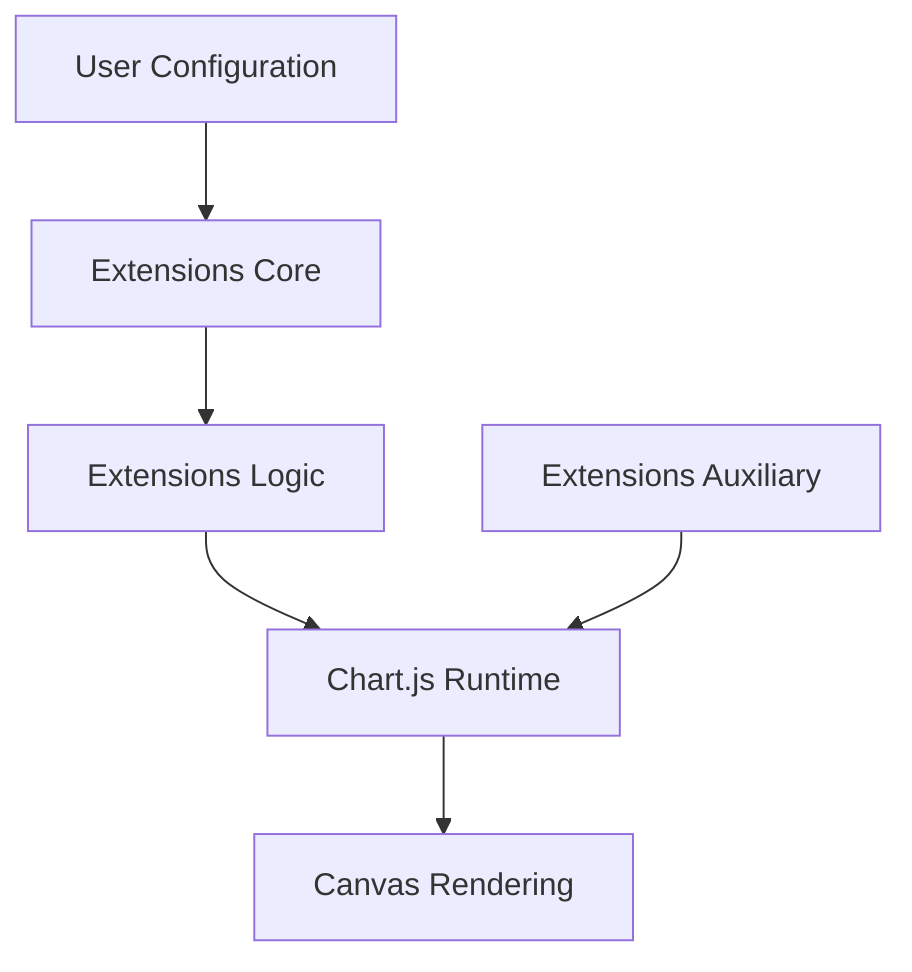
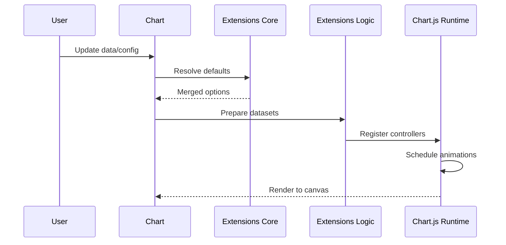
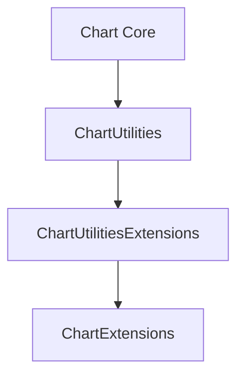

# Chart Utilities Extensions

The **Chart Utilities Extensions** module provides the advanced extension layer for chart behavior within the MeshCentral UI. It builds on top of the Chart Utilities core and Chart.js runtime to introduce higher-level orchestration, extended logic, and auxiliary integration mechanisms.

This module lives under:

```text
public/scripts/charts/
└── chart-utilities/
    └── chart-utilities-extensions/
        ├── chart-utilities-extensions-core/
        ├── chart-utilities-extensions-logic/
        └── chart-utilities-extensions-auxiliary/
```

It acts as the structural bridge between:

- Core chart utilities
- Chart.js runtime and rendering engine
- Higher-level chart extensions
- Domain-specific visualization logic

---

## 1. Purpose of the Module

The **Chart Utilities Extensions** module is responsible for:

- Extending the chart utility system with advanced behaviors
- Coordinating runtime logic and configuration resolution
- Managing animation orchestration and execution flow
- Providing structured layering for extension-safe development
- Enabling modular, maintainable chart feature expansion

It separates:

- Configuration resolution
- Animation scheduling
- Dataset lifecycle logic
- Runtime and plugin integration

This layered design ensures scalability and safe extensibility of chart features.

---

## 2. Repository Structure

```text
public/scripts/charts/chart-utilities/chart-utilities-extensions/
├── chart-utilities-extensions-core/
│   ├── bt
│   └── de
├── chart-utilities-extensions-logic/
│   ├── jn
│   ├── la
│   └── ls
└── chart-utilities-extensions-auxiliary/
    └── mo
```

### Core Components

The module includes the following primary components:

- `meshcentral.public.scripts.charts.bt`
- `meshcentral.public.scripts.charts.de`
- `meshcentral.public.scripts.charts.jn`
- `meshcentral.public.scripts.charts.la`
- `meshcentral.public.scripts.charts.ls`
- `meshcentral.public.scripts.charts.mo`

---

## 3. Architectural Position in the Chart System



The **Chart Utilities Extensions** module sits between foundational utilities and feature-level chart extensions, acting as the runtime expansion layer.

---

## 4. Internal Architecture

### Layered Structure



### Responsibilities by Layer

| Layer | Responsibility |
|--------|---------------|
| Extensions Core | Animation engine and configuration resolver |
| Extensions Logic | Dataset orchestration and execution lifecycle |
| Extensions Auxiliary | Runtime bundling and integration utilities |
| Chart.js Runtime | Rendering, scales, controllers, plugins |

---

## 5. Core Submodules

### 5.1 Chart Utilities Extensions Core

Contains:

- `bt` – Animation engine
- `de` – Defaults and configuration resolver

Responsibilities:

- Frame scheduling via `requestAnimationFrame`
- Animation lifecycle tracking
- Global defaults registry
- Scriptable option resolution
- Configuration merging and fallback routing

See:

- `chart-utilities-extensions-core/chart-utilities-extensions-core.md`

---

### 5.2 Chart Utilities Extensions Logic

Contains:

- `jn`
- `la`
- `ls`

Responsibilities:

- Dataset transformation
- Controller coordination
- Plugin registration and lifecycle hooks
- Orchestration of update and render cycles

See:

- `chart-utilities-extensions-logic/chart-utilities-extensions-logic.md`
- `chart-utilities-extensions-logic-core/chart-utilities-extensions-logic-core.md`
- `chart-utilities-extensions-logic-auxiliary/chart-utilities-extensions-logic-auxiliary.md`

---

### 5.3 Chart Utilities Extensions Auxiliary

Contains:

- `mo`

Responsibilities:

- Supplemental runtime utilities
- Integration helpers
- Auxiliary extension support mechanisms

See:

- `chart-utilities-extensions-auxiliary/chart-utilities-extensions-auxiliary.md`

---

## 6. Execution Flow



Key characteristics:

- Centralized animation scheduling
- Deterministic update lifecycle
- Layered configuration resolution
- Clear separation of concerns

---

## 7. Integration with Other Chart Modules



The module integrates with:

- **Chart Core** – Controllers, elements, scales
- **Chart Utilities** – Shared helpers and abstractions
- **Chart Extensions** – Feature-level enhancements

It provides the infrastructure that allows higher-level extensions to operate without directly interacting with low-level runtime mechanics.

---

## 8. Design Principles

The **Chart Utilities Extensions** module follows these architectural principles:

- Clear separation between configuration and execution
- Single animation coordination mechanism
- Layered extension model
- Modular runtime integration
- Deterministic update lifecycle
- Safe plugin and controller orchestration

This enables:

- Smooth animated transitions
- Predictable configuration inheritance
- Scalable feature development
- Easier maintenance and upgrades

---

## 9. Summary

The **Chart Utilities Extensions** module is the advanced runtime and orchestration layer of the MeshCentral chart subsystem.

It:

- Extends chart utilities with modular runtime logic
- Provides animation and configuration infrastructure
- Coordinates dataset preparation and rendering
- Integrates seamlessly with Chart.js runtime
- Enables scalable, maintainable chart feature expansion

By separating core execution, logic orchestration, and auxiliary integration, the module ensures that chart extensions remain robust, extensible, and performant across the MeshCentral UI.