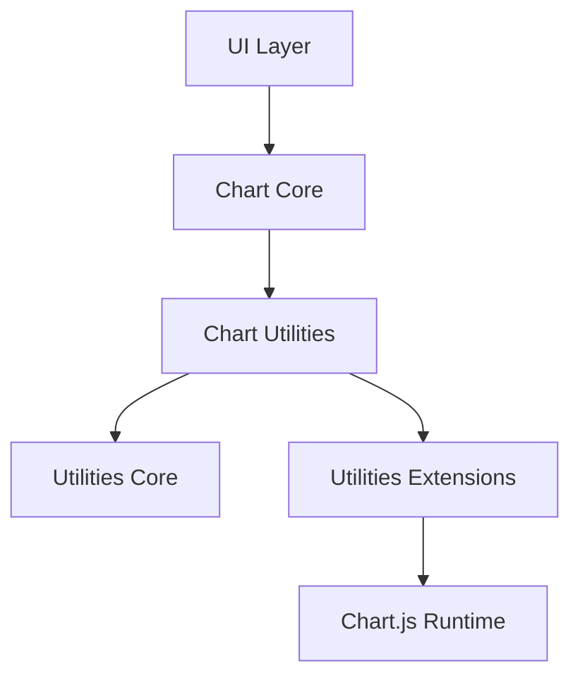
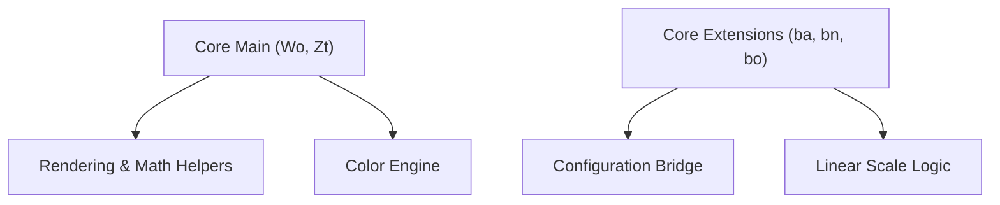
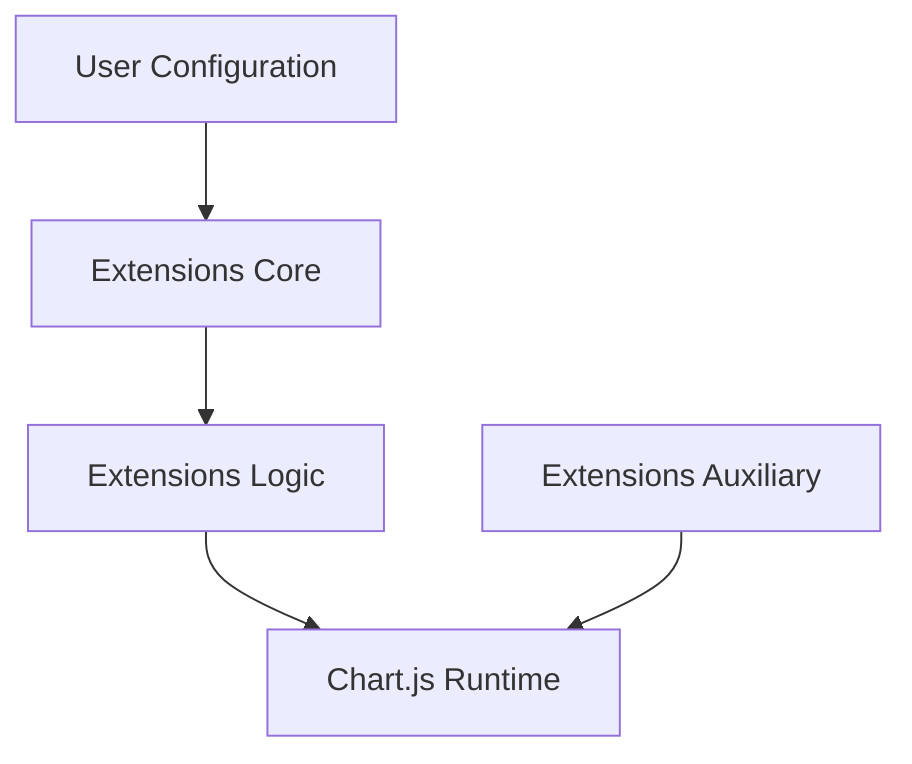
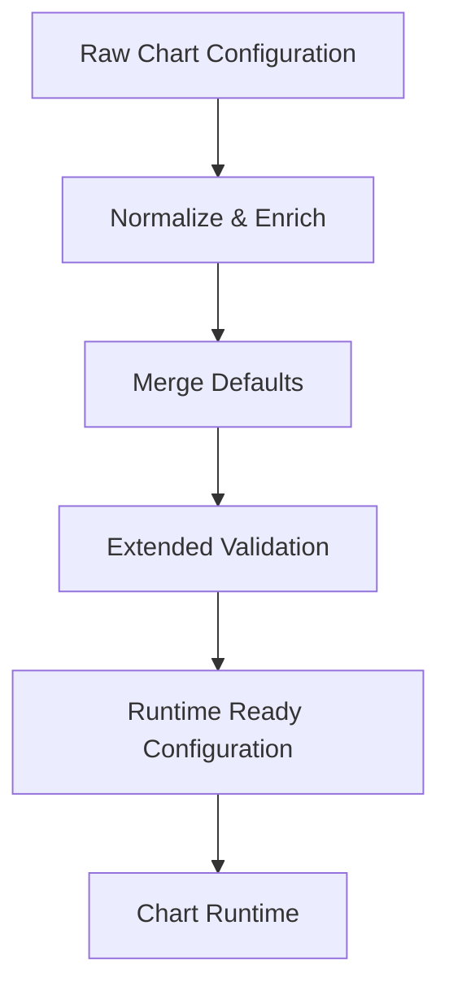
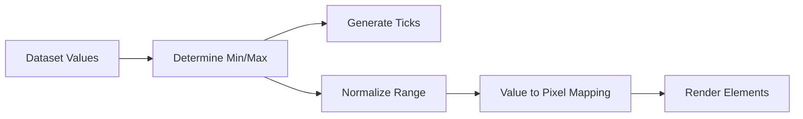
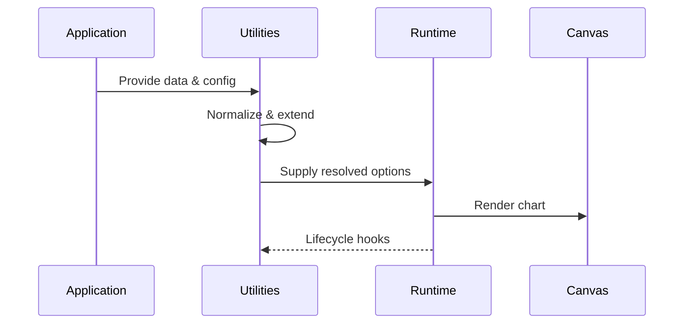

# Chart Utilities

The **Chart Utilities** module provides the foundational helper, scaling, orchestration, and extension infrastructure for the MeshCentral charting subsystem. It centralizes reusable chart logic that supports configuration normalization, animation scheduling, scale computation, dataset orchestration, and runtime integration.

This module resides under:

```text
public/scripts/charts/chart-utilities/
```

It acts as the bridge between:

- Chart Core modules  
- Chart Extensions  
- The Chart.js runtime layer  
- Higher-level UI chart integrations  

---

## 1. Purpose of the Module

The **Chart Utilities** module is responsible for:

- Providing reusable chart helper functions
- Normalizing and enriching configuration
- Implementing numeric scale processing
- Coordinating runtime animation lifecycle
- Managing extension-safe orchestration
- Supporting deterministic rendering behavior

It ensures that higher-level chart modules remain focused on visualization logic while shared computational and orchestration concerns are centralized.

---

## 2. Repository Structure

```text
public/scripts/charts/chart-utilities/
├── chart-utilities-core/
│   ├── chart-utilities-core-main/
│   │   ├── Wo
│   │   └── Zt
│   └── chart-utilities-core-extensions/
│       ├── ba
│       ├── bn
│       └── bo
└── chart-utilities-extensions/
    ├── chart-utilities-extensions-core/
    │   ├── bt
    │   └── de
    ├── chart-utilities-extensions-logic/
    │   ├── jn
    │   ├── la
    │   └── ls
    └── chart-utilities-extensions-auxiliary/
        └── mo
```

### Core Components

**Chart Utilities Core**

- `meshcentral.public.scripts.charts.Wo`
- `meshcentral.public.scripts.charts.Zt`
- `meshcentral.public.scripts.charts.ba`
- `meshcentral.public.scripts.charts.bn`
- `meshcentral.public.scripts.charts.bo`

**Chart Utilities Extensions**

- `meshcentral.public.scripts.charts.bt`
- `meshcentral.public.scripts.charts.de`
- `meshcentral.public.scripts.charts.jn`
- `meshcentral.public.scripts.charts.la`
- `meshcentral.public.scripts.charts.ls`
- `meshcentral.public.scripts.charts.mo`

---

## 3. High-Level Architecture

The **Chart Utilities** module sits between chart logic and the Chart.js runtime, offering reusable helpers and extension infrastructure.



It enables:

- Centralized configuration processing  
- Shared rendering utilities  
- Structured extension lifecycle  
- Deterministic animation scheduling  

---

## 4. Internal Layering

The module is divided into two primary layers:

- **Chart Utilities Core**
- **Chart Utilities Extensions**

### 4.1 Chart Utilities Core

Provides foundational helpers and scale logic.



**Responsibilities:**

- Math and geometry utilities  
- Color transformation engine  
- Configuration normalization  
- Lifecycle hook bridging  
- Linear scale implementation  
- Tick generation and value normalization  

📘 See:
- `chart-utilities-core/chart-utilities-core.md`
- `chart-utilities-core/chart-utilities-core-main/chart-utilities-core-main.md`
- `chart-utilities-core/chart-utilities-core-extensions/chart-utilities-core-extensions.md`

---

### 4.2 Chart Utilities Extensions

Provides advanced runtime orchestration and animation management.



**Responsibilities:**

- Animation scheduling (`requestAnimationFrame` coordination)
- Global defaults registry
- Dataset orchestration
- Plugin lifecycle coordination
- Scriptable option resolution
- Runtime bundling utilities

📘 See:
- `chart-utilities-extensions/chart-utilities-extensions.md`
- `chart-utilities-extensions/chart-utilities-extensions-core/chart-utilities-extensions-core.md`
- `chart-utilities-extensions/chart-utilities-extensions-logic/chart-utilities-extensions-logic.md`
- `chart-utilities-extensions/chart-utilities-extensions-auxiliary/chart-utilities-extensions-auxiliary.md`

---

## 5. Configuration Processing Flow

The module ensures consistent configuration enrichment before runtime execution.



This guarantees:

- Backward compatibility  
- Centralized default resolution  
- Predictable extension behavior  
- Reduced duplication across chart controllers  

---

## 6. Scale Processing Flow

The linear scale implementation (`bo`) ensures stable numeric axis rendering.



Key properties:

- Precision-safe transformations  
- Deterministic tick generation  
- Interactive coordinate mapping  
- Efficient normalization logic  

---

## 7. Runtime Interaction Model



The **Chart Utilities** module:

- Pre-processes configuration  
- Supplies shared computational helpers  
- Coordinates animation lifecycle  
- Extends runtime behavior safely  
- Maintains decoupling from dataset controllers  

---

## 8. Responsibilities and Boundaries

### Owns

- Shared rendering utilities  
- Color abstraction and parsing  
- Configuration merging and normalization  
- Linear scaling implementation  
- Animation orchestration  
- Extension lifecycle management  

### Does Not Own

- Chart type definitions  
- Dataset controller implementations  
- High-level feature plugins  
- UI-level layout composition  

These concerns are handled in **Chart Core** and **Chart Extensions** modules.

---

## 9. Architectural Characteristics

**Modular**  
Clear separation between core helpers and extension orchestration.

**Extensible**  
New scales, behaviors, and animation strategies can be introduced without modifying chart runtime internals.

**Deterministic**  
Centralized configuration and scaling ensure consistent rendering outcomes.

**Performance-Oriented**  
- Shared helper reuse  
- Efficient numeric normalization  
- Single animation coordination mechanism  

---

## 10. Summary

The **Chart Utilities** module forms the computational and orchestration backbone of the MeshCentral charting subsystem.

It unifies:

- Core rendering and math utilities (`Wo`)
- Color engine (`Zt`)
- Configuration bridge and extension orchestration (`ba`, `bn`)
- Linear scale logic (`bo`)
- Animation and runtime coordination (`bt`)
- Dataset lifecycle logic (`jn`, `la`, `ls`)
- Auxiliary integration helpers (`mo`)

By separating core computation from extension orchestration, the module enables scalable, maintainable, and predictable chart behavior across the MeshCentral UI.

For detailed component documentation, refer to:

- **Chart Utilities Core**
- **Chart Utilities Core Main**
- **Chart Utilities Core Extensions**
- **Chart Utilities Extensions**
- **Chart Utilities Extensions Core**
- **Chart Utilities Extensions Logic**
- **Chart Utilities Extensions Auxiliary**

Together, these layers form the structural foundation that supports all higher-level chart features within the system.