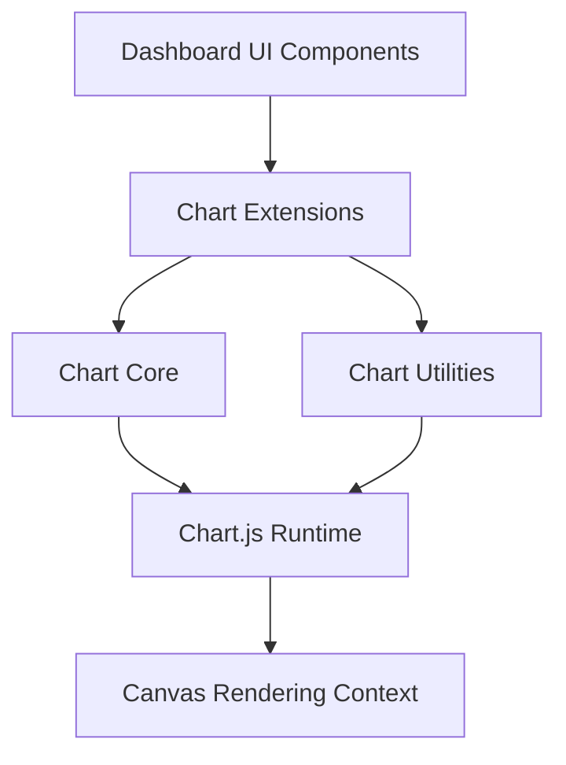
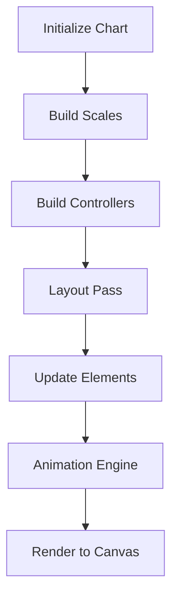
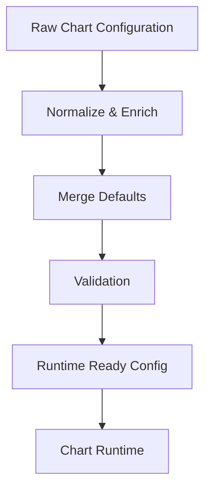
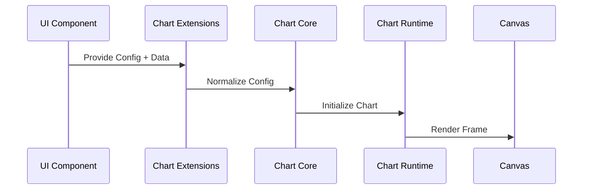
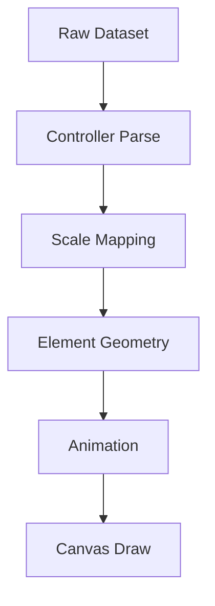
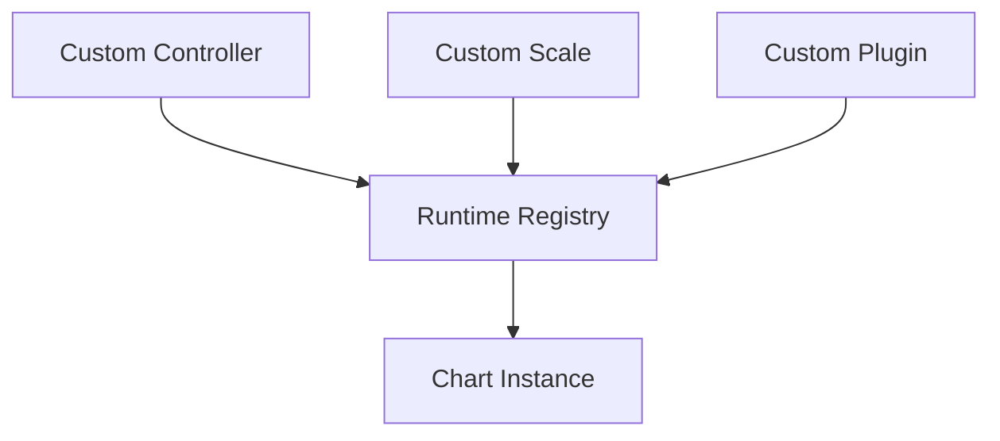
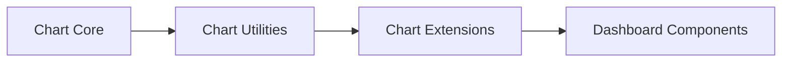

# Charts

The **Charts** module provides the complete client-side charting subsystem used across the MeshCentral web interface. It delivers interactive, animated, and extensible visualizations for dashboards, telemetry panels, analytics views, and reporting components.

The module is located under:

```text
public/scripts/charts
```

It is implemented within the namespace:

```text
meshcentral.public.scripts.charts.*
```

The Charts module is structured into three primary architectural layers:

- **Chart Core** – Runtime foundation and rendering lifecycle
- **Chart Utilities** – Shared helpers, configuration processing, scaling, and animation coordination
- **Chart Extensions** – High-level orchestration and integration layer

---

# 1. Purpose of the Module

The **Charts** module is responsible for:

- Transforming structured datasets into visual canvas-based charts
- Managing scale computation and coordinate mapping
- Coordinating dataset controllers and rendering elements
- Handling animation scheduling and redraw cycles
- Providing extension and plugin registration mechanisms
- Standardizing configuration processing across dashboards

It acts as the visualization backbone of the MeshCentral frontend.

---

# 2. Repository Structure

```text
public/scripts/
└── charts/
    ├── chart-core/
    ├── chart-utilities/
    └── chart-extensions/
```

### Core Namespace Components

```text
meshcentral.public.scripts.charts.Cs
meshcentral.public.scripts.charts.Fa
meshcentral.public.scripts.charts.Hn
meshcentral.public.scripts.charts.Hs
meshcentral.public.scripts.charts.Js
meshcentral.public.scripts.charts.Ln
meshcentral.public.scripts.charts.Lo
meshcentral.public.scripts.charts.Ns
meshcentral.public.scripts.charts.On
meshcentral.public.scripts.charts.Os
meshcentral.public.scripts.charts.Qs
meshcentral.public.scripts.charts.Wo
meshcentral.public.scripts.charts.Zt
meshcentral.public.scripts.charts.ba
meshcentral.public.scripts.charts.bn
meshcentral.public.scripts.charts.bo
meshcentral.public.scripts.charts.bt
meshcentral.public.scripts.charts.de
meshcentral.public.scripts.charts.jn
meshcentral.public.scripts.charts.la
meshcentral.public.scripts.charts.ls
meshcentral.public.scripts.charts.mo
meshcentral.public.scripts.charts.rs
meshcentral.public.scripts.charts.sn
meshcentral.public.scripts.charts.so
meshcentral.public.scripts.charts.tn
meshcentral.public.scripts.charts.wo
meshcentral.public.scripts.charts.ws
meshcentral.public.scripts.charts.ya
```

---

# 3. High-Level Architecture

The Charts module follows a layered orchestration model:



### Layer Responsibilities

| Layer | Responsibility |
|--------|----------------|
| Chart Core | Rendering lifecycle, scales, dataset controllers |
| Chart Utilities | Configuration normalization, scaling logic, animation coordination |
| Chart Extensions | Integration layer and feature orchestration |
| Chart.js Runtime | Low-level rendering engine |
| Canvas | Final drawing surface |

---

# 4. Internal Architecture

## 4.1 Chart Core

**Location:** `public/scripts/charts/chart-core`

The Chart Core layer provides:

- Scale abstractions (`Js`, `Lo`)
- Dataset controller base (`Ns`)
- Date adapter interface (`Ln`)
- Runtime orchestrator (`On`)
- Animation engine (`Os`)
- Registry (`Qs`)
- Shared utilities (`Cs`, `Fa`, `Hn`, `Hs`)

### Chart Core Execution Flow



📘 See detailed documentation:
- **Chart Core**
- **Chart Core Logic**
- **Chart Core Extensions**

---

## 4.2 Chart Utilities

**Location:** `public/scripts/charts/chart-utilities`

This layer centralizes reusable computational logic:

- Rendering and math helpers (`Wo`)
- Color processing (`Zt`)
- Configuration bridge (`ba`, `bn`)
- Linear scale logic (`bo`)
- Animation coordination (`bt`)
- Dataset orchestration (`jn`, `la`, `ls`)
- Auxiliary helpers (`mo`, `de`)

### Configuration Processing Pipeline



📘 See detailed documentation:
- **Chart Utilities Core**
- **Chart Utilities Extensions**
- **Chart Utilities Extensions Logic**

---

## 4.3 Chart Extensions

**Location:** `public/scripts/charts/chart-extensions`

This is the integration and orchestration layer that connects UI components to the runtime.

Core responsibilities:

- Registering controllers and plugins
- Standardizing initialization patterns
- Managing lifecycle hooks
- Coordinating interaction behavior
- Exposing extension points

### Chart Instantiation Flow



📘 See detailed documentation:
- **Chart Extensions Core**
- **Chart Extensions Utilities**

---

# 5. Data Transformation Pipeline

The Charts module ensures deterministic transformation from dataset to visual output.



This guarantees:

- Consistent scaling behavior
- Smooth animation transitions
- Deterministic layout computation
- Extensibility via plugins

---

# 6. Extensibility Model

The Charts module is designed to support modular expansion:



Supported extension patterns:

- Custom dataset controllers
- Custom scale implementations
- Plugin lifecycle hooks
- Animation overrides
- Registry-based injection

---

# 7. Relationship Between Submodules



- **Chart Core** provides runtime primitives.
- **Chart Utilities** provides computational and orchestration helpers.
- **Chart Extensions** integrates charts into the UI ecosystem.

---

# 8. Architectural Characteristics

**Modular**  
Clear separation between runtime, utilities, and extension layers.

**Extensible**  
Registry-driven component registration enables safe feature expansion.

**Deterministic**  
Centralized configuration and scaling logic ensure consistent rendering.

**Performance-Oriented**  
- Shared helper reuse  
- Coordinated animation scheduling  
- Efficient scale normalization  
- Canvas-based rendering  

---

# Summary

The **Charts** module is the complete frontend visualization subsystem of MeshCentral. It:

- Provides scale abstractions and dataset controllers
- Coordinates animation and rendering lifecycle
- Normalizes configuration and manages defaults
- Integrates charts into dashboard and analytics UI
- Enables plugin-driven extensibility

It forms the foundational infrastructure for all chart-based visualizations throughout the MeshCentral web interface.

For deeper technical documentation, refer to:

- **Chart Core**
- **Chart Utilities**
- **Chart Extensions**

Together, these submodules compose a structured, extensible, and production-ready charting system.