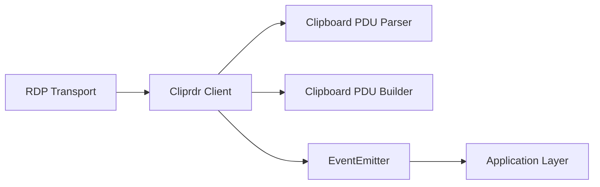
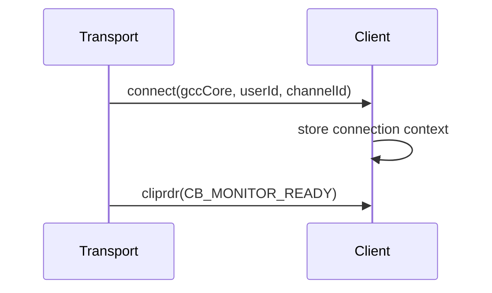
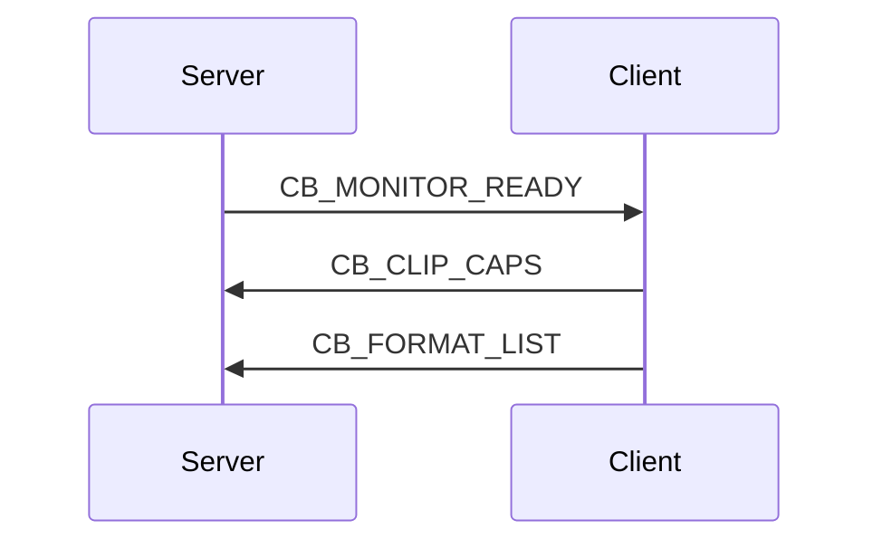
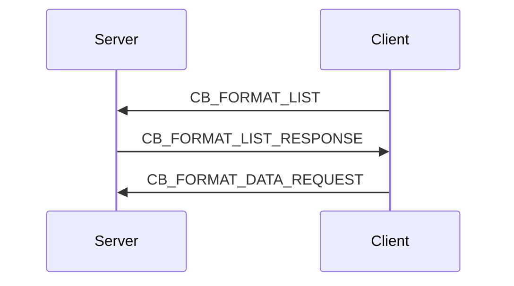
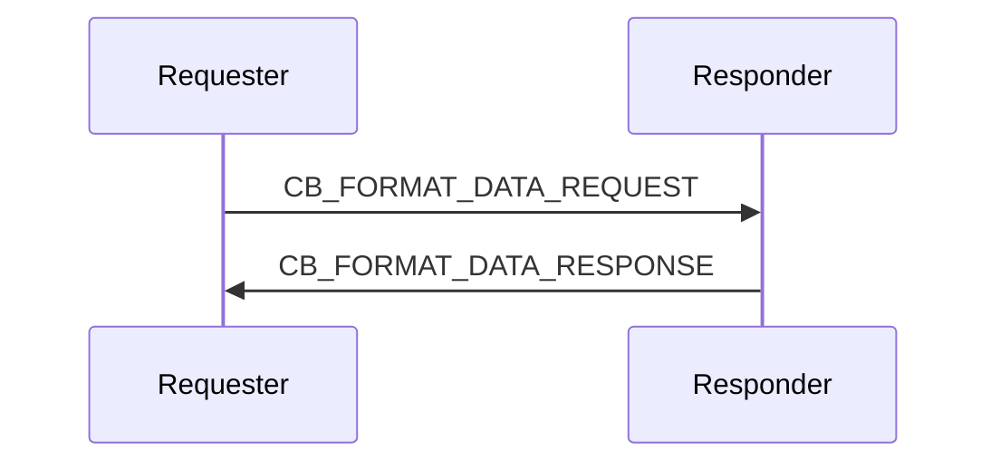
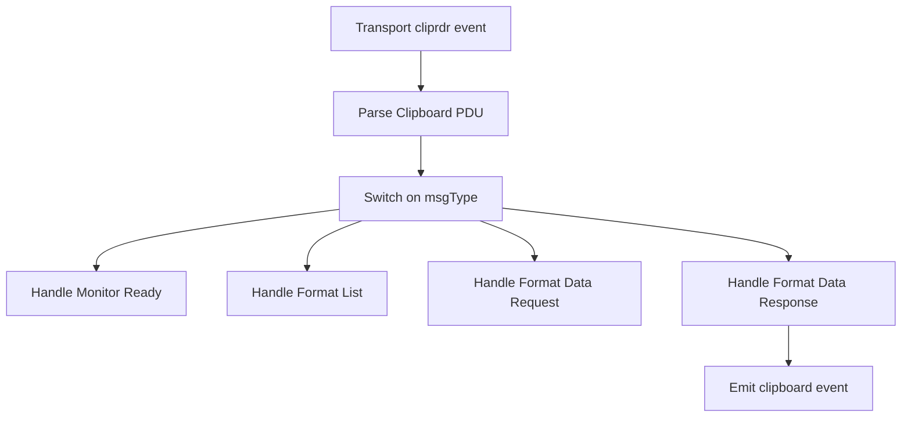
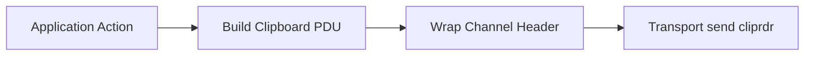
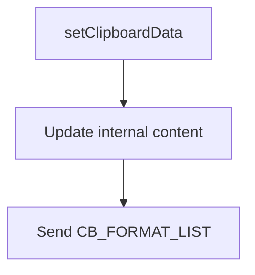
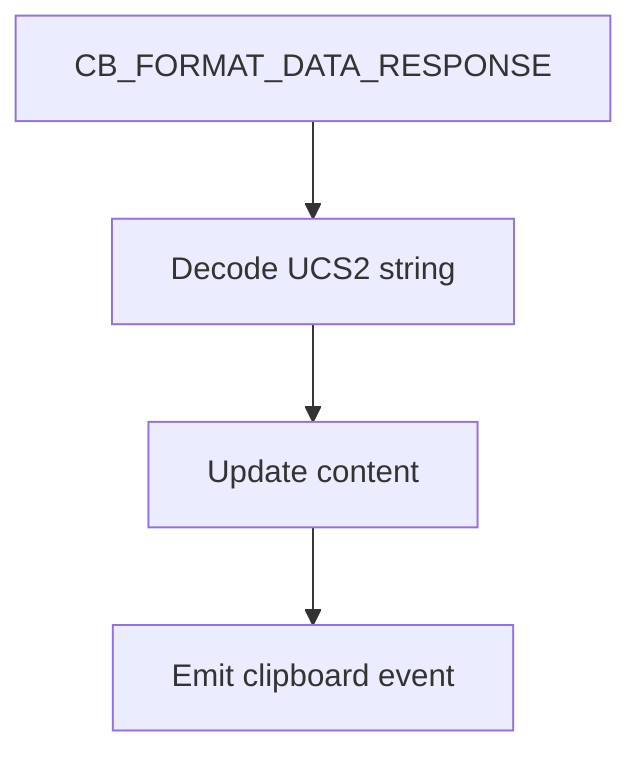
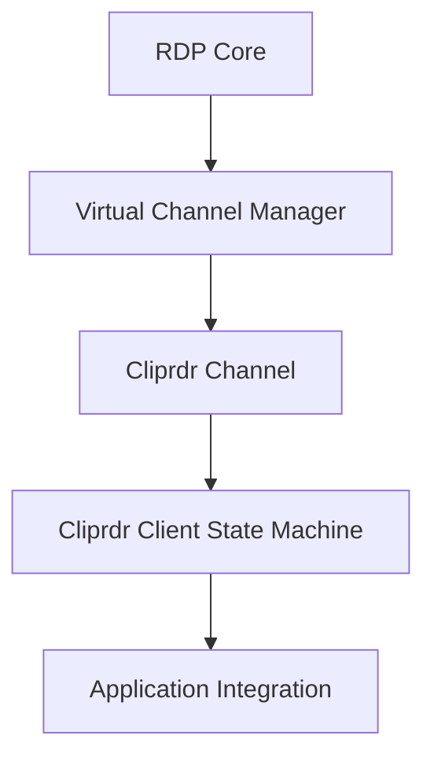

# Cliprdr

The **Cliprdr** module implements the RDP Clipboard Virtual Channel (CLIPRDR) for MeshCentral. It enables bidirectional clipboard synchronization between the RDP client and the remote server by exchanging Clipboard Protocol Data Units (PDUs) over a virtual channel.

At its core, the module provides:

- A base **Cliprdr** channel abstraction
- A **Client** state machine that handles clipboard capability negotiation and data exchange
- Encoding and decoding of Clipboard PDUs
- Event-driven clipboard updates via Node.js `EventEmitter`

This module operates within the RDP protocol stack and communicates over an abstract `transport` that delivers channel data.

---

## 1. Purpose and Responsibilities

The Cliprdr module is responsible for:

1. Establishing the clipboard virtual channel after RDP connection setup
2. Negotiating clipboard capabilities between client and server
3. Exchanging supported clipboard formats
4. Requesting and responding with clipboard data
5. Emitting clipboard change events to higher-level components

It strictly handles protocol-level logic and does not directly interact with UI components or operating system clipboards. Instead, it exposes events and methods for integration.

---

## 2. Core Components

### 2.1 Cliprdr (Base Channel)

`meshcentral.rdp.protocol.pdu.cliprdr.Cliprdr`

**Responsibilities:**

- Extends `EventEmitter`
- Stores transport reference
- Maintains user and capability state

**Key Properties:**

- `transport` – Underlying RDP virtual channel transport
- `userId` – RDP user identifier
- `serverCapabilities` – Capabilities received from server
- `clientCapabilities` – Capabilities advertised by client

This class provides the foundational structure for clipboard channel communication.

---

### 2.2 Client (Clipboard State Machine)

`meshcentral.rdp.protocol.pdu.cliprdr.Client`

Extends **Cliprdr** and implements the full client-side clipboard protocol automaton.

**Key Responsibilities:**

- Subscribes to transport lifecycle events
- Parses incoming PDUs
- Sends clipboard-related PDUs
- Manages clipboard content buffer
- Emits `clipboard` events when new content is received

**Important Fields:**

- `content` – Internal clipboard text buffer
- `channelId` – Assigned RDP channel identifier
- `gccCore` – RDP GCC core information

---

## 3. High-Level Architecture

### Flow Explanation

1. The RDP transport delivers `cliprdr` channel messages.
2. The Client parses the incoming PDU.
3. Based on message type, it triggers the appropriate handler.
4. Outgoing PDUs are constructed using typed components.
5. Clipboard updates are emitted to the application layer.

---

## 4. Clipboard Protocol Lifecycle

The clipboard handshake follows a defined RDP sequence.

### 4.1 Connection Phase

When the transport emits a `connect` event:

- The client stores `gccCore`, `userId`, and `channelId`
- It begins listening for `cliprdr` channel messages

---

### 4.2 Monitor Ready → Capability Negotiation

When the server sends `CB_MONITOR_READY`:

1. Client sends `CB_CLIP_CAPS`
2. Client sends `CB_FORMAT_LIST`

---

### 4.3 Format Negotiation

After format list exchange:

- Server responds with `CB_FORMAT_LIST_RESPONSE`
- Client may request clipboard data with `CB_FORMAT_DATA_REQUEST`

---

### 4.4 Data Transfer

When clipboard data is requested:

- Request via `CB_FORMAT_DATA_REQUEST`
- Response via `CB_FORMAT_DATA_RESPONSE`

On receiving `CB_FORMAT_DATA_RESPONSE`, the Client:

- Decodes UCS-2 string
- Updates internal `content`
- Emits `clipboard` event

---

## 5. PDU Processing Pipeline

Incoming messages are handled by `recv()`.

### Message Types Handled

- `CB_MONITOR_READY`
- `CB_CLIP_CAPS`
- `CB_FORMAT_LIST`
- `CB_FORMAT_LIST_RESPONSE`
- `CB_FORMAT_DATA_REQUEST`
- `CB_FORMAT_DATA_RESPONSE`
- `CB_TEMP_DIRECTORY` (placeholder)

---

## 6. Outgoing PDU Construction

All outgoing messages are wrapped as:

1. Channel PDU Header
2. Channel flags
3. Clipboard PDU payload

The module uses typed components such as:

- `UInt16Le`
- `UInt32Le`
- `BinaryString`

These ensure correct little-endian encoding and structured serialization.

---

## 7. Clipboard Content Handling

### 7.1 Setting Local Clipboard

`setClipboardData(content)`:

1. Updates internal `content`
2. Sends `CB_FORMAT_LIST` to notify server

---

### 7.2 Receiving Remote Clipboard

When `CB_FORMAT_DATA_RESPONSE` arrives:

- Buffer decoded as UCS-2
- Null terminator removed
- `clipboard` event emitted

---

## 8. Event Model

The Client inherits from `EventEmitter`.

### Emitted Events

- `clipboard` – Triggered when new clipboard content is received from server

This allows higher-level components (e.g., UI or session manager) to subscribe and synchronize system clipboard state.

---

## 9. Integration Within RDP Stack

Cliprdr operates as a **virtual channel module** in the RDP protocol stack.

### Responsibilities by Layer

- **RDP Core** – Manages session and channel creation
- **Virtual Channel Manager** – Routes channel-specific data
- **Cliprdr Channel** – Encodes/decodes clipboard PDUs
- **Application Layer** – Consumes clipboard events

---

## 10. Capability Negotiation

During initialization, the client advertises:

- Clipboard capability version
- Supported flags

The server responds with its own capability sets. Although capability parsing is currently minimal, the structure allows future expansion.

---

## 11. Design Characteristics

### Event-Driven

The module is fully asynchronous and event-driven:

- Transport events trigger PDU parsing
- Clipboard updates trigger application events

### Stateful Automaton

The Client behaves as a protocol automaton:

- Reacts to specific PDU types
- Sends corresponding responses
- Maintains clipboard synchronization state

### Extensible

The structure allows future support for:

- File clipboard transfers
- Extended format lists
- Additional capability sets
- Enhanced security validation

---

## 12. Summary

The Cliprdr module provides a focused implementation of the RDP Clipboard Virtual Channel.

It:

- Negotiates clipboard capabilities
- Exchanges format lists
- Requests and provides clipboard data
- Emits events for application-level integration

By encapsulating clipboard protocol complexity within a dedicated state machine, Cliprdr cleanly separates RDP channel logic from higher-level session and UI concerns, making it modular, maintainable, and extensible.