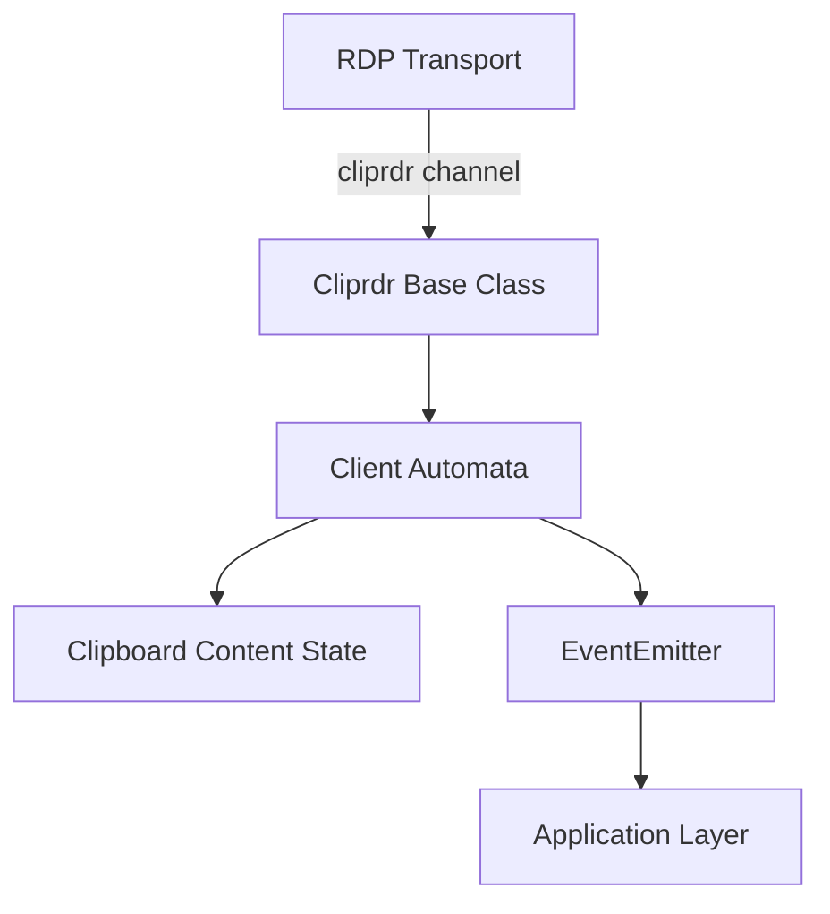
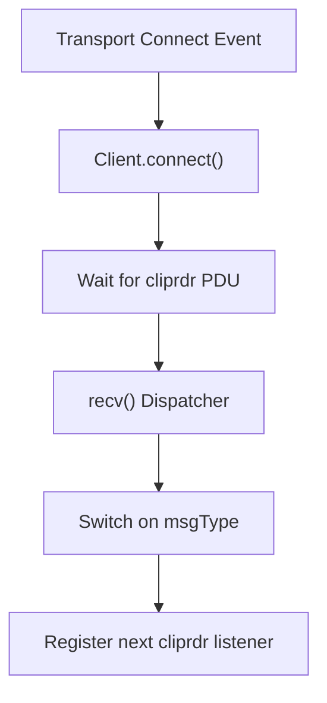
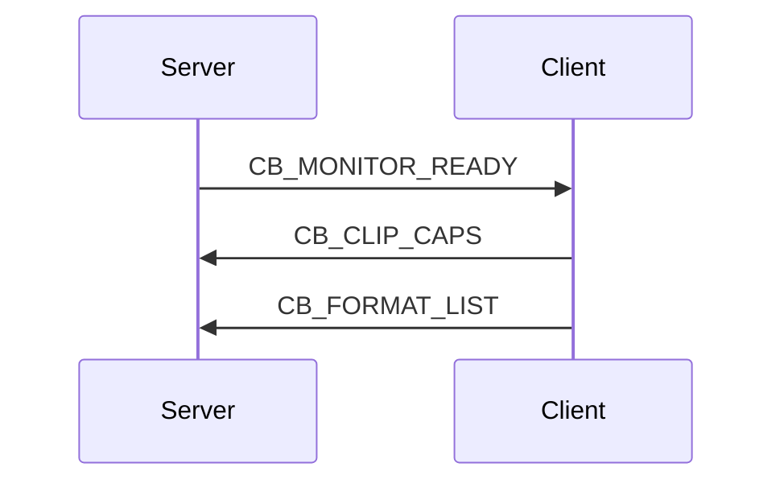
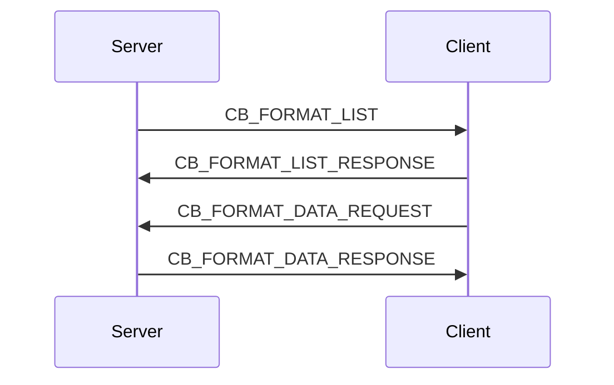
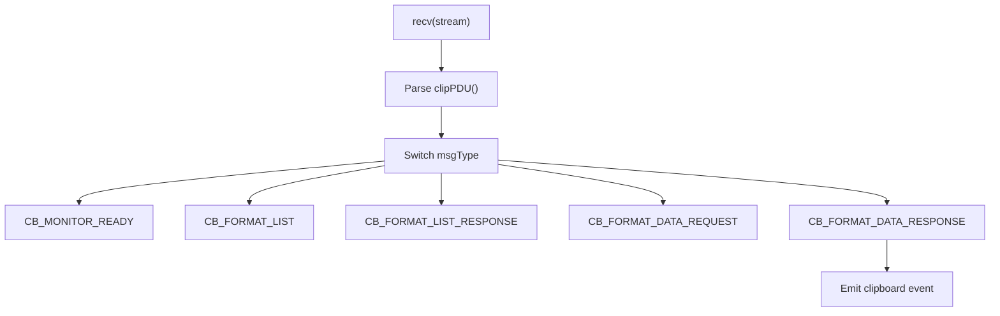
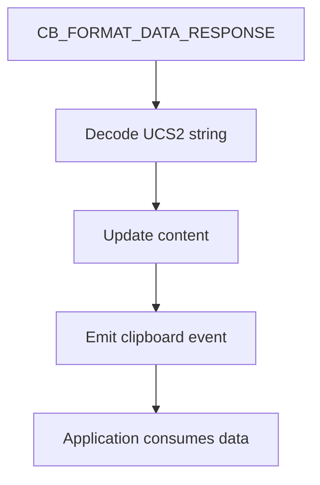
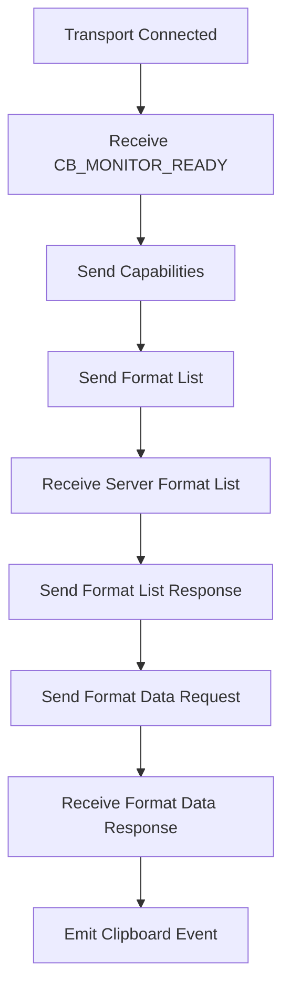

# Cliprdr

The Cliprdr module implements the Remote Desktop Protocol (RDP) Clipboard Virtual Channel (CLIPRDR). It enables bi-directional clipboard synchronization between a local client and a remote RDP server.

Within the MeshCentral RDP protocol stack, Cliprdr is responsible for:

- Exchanging clipboard capabilities
- Advertising supported clipboard formats
- Requesting clipboard data
- Responding with clipboard content
- Emitting clipboard events to higher-level consumers

The module is built around two core classes:

- `Cliprdr` – Base event-driven channel abstraction
- `Client` – Client-side clipboard channel automaton

---

## 1. Architectural Overview

Cliprdr operates as a virtual channel layered on top of the RDP transport. It relies on:

- The RDP transport for message delivery
- The core type system for PDU serialization
- Clipboard PDU definitions for protocol structure
- Node.js EventEmitter for event propagation

### High-Level Architecture



### Layered Responsibility

- **Transport Layer** – Handles channel framing and raw byte delivery
- **Protocol Layer (Cliprdr)** – Encodes and decodes clipboard PDUs
- **Automation Layer (Client)** – Implements RDP clipboard state machine
- **Application Layer** – Consumes clipboard events

---

## 2. Core Classes

### 2.1 Cliprdr (Base Channel)

The `Cliprdr` class extends `EventEmitter` and provides the foundational channel abstraction.

#### Responsibilities

- Store channel metadata (`userId`, `channelId`)
- Maintain capability state
- Provide shared structure for client implementation
- Hold reference to transport

#### Key Properties

- `transport` – RDP channel transport
- `userId` – RDP user identifier
- `serverCapabilities` – Server capability list
- `clientCapabilities` – Client capability list

This class does not implement protocol automation. That responsibility is delegated to `Client`.

---

### 2.2 Client (Clipboard Automaton)

The `Client` class extends `Cliprdr` and implements the clipboard virtual channel state machine.

It binds to transport events and processes clipboard PDUs sequentially.



---

## 3. Clipboard Protocol Flow

The RDP clipboard exchange follows a defined handshake and data flow.

### 3.1 Connection Sequence

When the transport emits `connect`:

1. Client stores `gccCore`, `userId`, `channelId`
2. Registers listener for `cliprdr` PDUs
3. Waits for server PDUs

---

### 3.2 Monitor Ready → Capability Exchange



#### Explanation

- Server signals readiness with `CB_MONITOR_READY`
- Client responds with:
  - Clipboard capability PDU
  - Supported format list PDU

---

### 3.3 Format Negotiation Flow



#### Key Steps

1. Format list exchange
2. Response acknowledgment
3. Data request for selected format
4. Data transmission

---

## 4. PDU Handling and Dispatch

All incoming PDUs are handled by `recv()`.



After each message, the client re-registers a one-time listener for the next `cliprdr` event, ensuring ordered sequential processing.

---

## 5. Supported Clipboard Formats

The client advertises several clipboard formats in `sendFormatListPDU()`.

Examples include:

- Native format
- Text format identifiers (0x0d, 0x10, 0x01)
- Additional predefined identifiers

Each format entry consists of:

- `formatId`
- `formatName` (optional UTF-16 string)

The implementation currently focuses primarily on Unicode text transfers.

---

## 6. Clipboard Data Flow

### 6.1 Sending Clipboard Data

When local clipboard content changes:

```text
setClipboardData(content)
    ↓
Update internal state
    ↓
sendFormatListPDU()
```

Eventually, when the server requests format data:

```text
sendFormatDataResponsePDU()
    ↓
Encode UTF-16 content
    ↓
Transmit CB_FORMAT_DATA_RESPONSE
```

### 6.2 Receiving Clipboard Data

Upon receiving `CB_FORMAT_DATA_RESPONSE`:

- Decode UTF-16 string from buffer
- Store in `this.content`
- Emit `clipboard` event



---

## 7. Internal State Management

The client maintains minimal state:

- `content` – Current clipboard string
- `userId` – RDP session user
- `channelId` – Virtual channel identifier
- Capability metadata

This lightweight design keeps the module focused strictly on protocol translation rather than UI or persistence concerns.

---

## 8. Transport Integration

Cliprdr relies on the transport layer for:

- Channel framing
- Delivery guarantees
- Multiplexing over RDP

Messages are wrapped using:

- `type.Component`
- `UInt16Le`, `UInt32Le`
- `BinaryString`

This ensures correct little-endian encoding and structured PDU serialization.

---

## 9. Event Model

Cliprdr uses an event-driven model.

### Emitted Events

- `clipboard` – Emitted when clipboard content is received

Consumers can subscribe:

```javascript
client.on('clipboard', (data) => {
    console.log(data);
});
```

This decouples protocol handling from UI or higher-level logic.

---

## 10. Error Handling and Extensibility

The current implementation:

- Ignores several optional PDU types (e.g., temporary directory)
- Provides placeholder capability handling
- Supports text clipboard transfer

Future enhancements may include:

- Rich text formats
- File transfer support
- Extended capability negotiation
- Robust error propagation

---

## 11. Complete Clipboard Lifecycle Summary



---

# Conclusion

The Cliprdr module provides a focused implementation of the RDP clipboard virtual channel. It bridges low-level RDP PDU encoding with high-level clipboard events, enabling seamless clipboard synchronization in remote desktop sessions.

Its event-driven structure, structured PDU serialization, and clear state machine make it easy to extend and integrate into the broader MeshCentral RDP protocol stack.