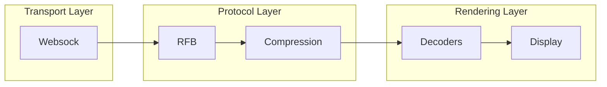
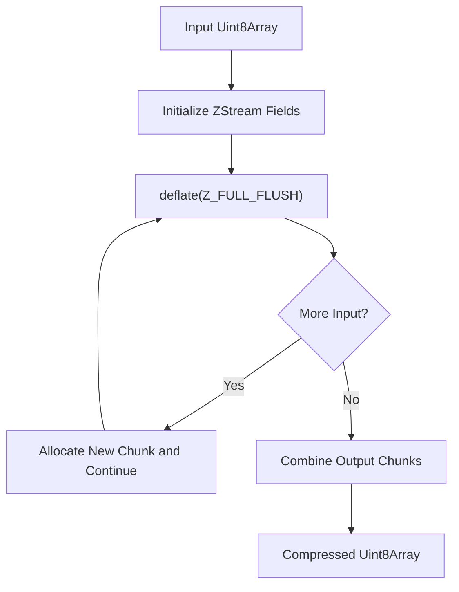
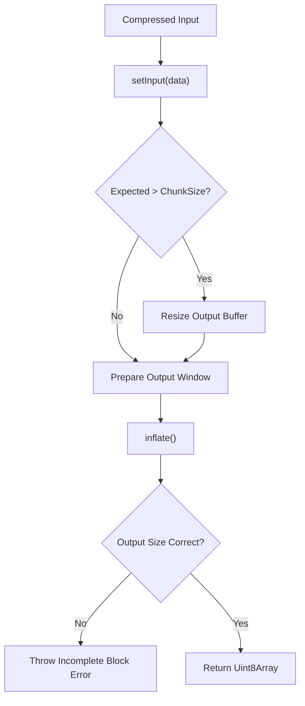
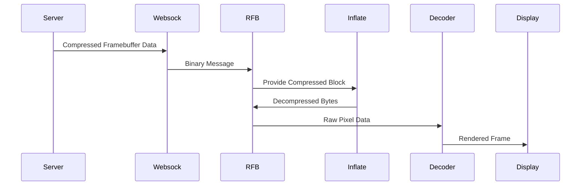

# Compression

The **Compression** module provides low-level data compression and decompression services for the noVNC stack embedded within MeshCentral. It is responsible for handling zlib-compatible deflate and inflate operations used by higher-level components such as the RFB protocol implementation and various framebuffer decoders.

At its core, the module wraps the `pako` zlib implementation and exposes two primary classes:

- `Deflator` — Compresses binary data using zlib (deflate algorithm)
- `Inflate` — Decompresses zlib-compressed binary data

These classes are optimized for streaming scenarios and predictable memory allocation, making them suitable for real-time remote desktop workloads.

---

## Architectural Context

The Compression module operates within the noVNC data pipeline. It sits between the transport layer and the framebuffer decoding layer.



### Related Modules

- [Websock](../websock/websock.md) — Provides binary WebSocket transport.
- [RFB and Display](../rfb-and-display/rfb-and-display.md) — Implements the RFB protocol and rendering orchestration.
- [Decoders](../decoders/decoders.md) — Uses decompressed data to reconstruct framebuffer updates.
- [Crypto Components](../crypto-components/crypto-components.md) — Handles encryption prior to decompression when required.

The Compression module does not implement protocol logic itself. Instead, it provides efficient primitives that other modules depend on.

---

# Core Components

## Deflator

**Component:** `meshcentral.public.novnc.core.deflator.Deflator`

The `Deflator` class performs zlib compression using the deflate algorithm via `pako`.

### Responsibilities

- Initialize a zlib compression stream
- Accept binary input (`Uint8Array`)
- Produce compressed binary output
- Handle large inputs via chunking
- Perform full flush operations for streaming consistency

### Internal Design

`Deflator` maintains:

- A `ZStream` instance
- A preallocated output buffer
- A configurable chunk size (default: 100 KB)

Compression is performed using `Z_FULL_FLUSH`, ensuring stream boundaries are respected. This is important in interactive or incremental transmission environments like VNC.

### Compression Flow



### Error Handling

- Throws `Error("zlib deflate failed")` if compression fails.
- Ensures all remaining input is processed before returning.

### Design Considerations

- Uses dynamic chunk allocation when input exceeds buffer size.
- Avoids repeated memory reallocations by predefining chunk size.
- Designed for performance in high-frequency compression workloads.

---

## Inflate

**Component:** `meshcentral.public.novnc.core.inflator.Inflate`

The `Inflate` class performs zlib decompression and is typically used when receiving compressed framebuffer updates.

### Responsibilities

- Initialize and maintain an inflate stream
- Accept compressed input data
- Decompress a fixed expected number of bytes
- Reset state between logical streams

### Internal Design

The class maintains:

- A `ZStream` instance
- A preallocated output buffer
- A dynamically resized buffer when expected output exceeds default size

Unlike `Deflator`, `Inflate` expects a known output size. This aligns with how RFB encodings provide expected decompressed lengths.

### Decompression Flow



### Error Handling

- Throws `Error("zlib inflate failed")` on inflate errors.
- Throws `Error("Incomplete zlib block")` if decompressed size differs from expected.

### Reset Capability

The `reset()` method calls `inflateReset()` on the underlying stream, allowing reuse of the instance without reallocation.

---

# Interaction with Framebuffer Decoders

Many RFB encodings use compression (e.g., Tight, ZRLE). The decompression process typically follows this pattern:



In this pipeline:

- The RFB layer determines whether compression is used.
- The Inflate class expands compressed blocks.
- Decoders interpret pixel encoding.
- The Display module renders final output.

---

# Performance and Memory Considerations

The Compression module is designed for real-time remote desktop scenarios:

- ✅ Preallocated buffers reduce garbage collection pressure
- ✅ Chunked compression handles arbitrarily large inputs
- ✅ Explicit expected-size validation prevents silent corruption
- ✅ Stream reuse improves throughput

### Chunk Size

Default chunk size:

```text
1024 * 10 * 10 bytes
= 102400 bytes (100 KB)
```

This provides a balance between memory overhead and minimizing reallocation frequency.

---

# Design Principles

The Compression module adheres to the following principles:

1. **Isolation of Concerns** — Pure compression logic without protocol awareness.
2. **Streaming Safety** — Uses full flush semantics for incremental transmission.
3. **Deterministic Output** — Strict validation of decompression size.
4. **Performance Optimization** — Reduced memory churn and predictable buffer usage.

---

# Summary

The **Compression** module provides foundational zlib compression and decompression capabilities within the MeshCentral noVNC stack. Though small in surface area, it is critical to:

- Efficient transport of framebuffer updates
- Compatibility with compressed RFB encodings
- Maintaining high-performance remote desktop sessions

By abstracting zlib stream handling behind simple `Deflator` and `Inflate` classes, the module ensures clean integration with the broader architecture while maintaining strict correctness and performance guarantees.