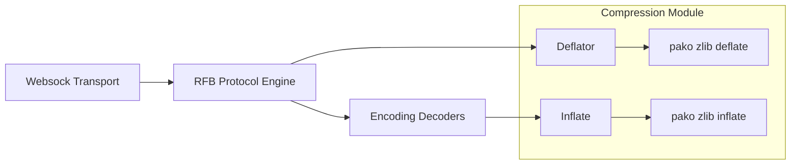
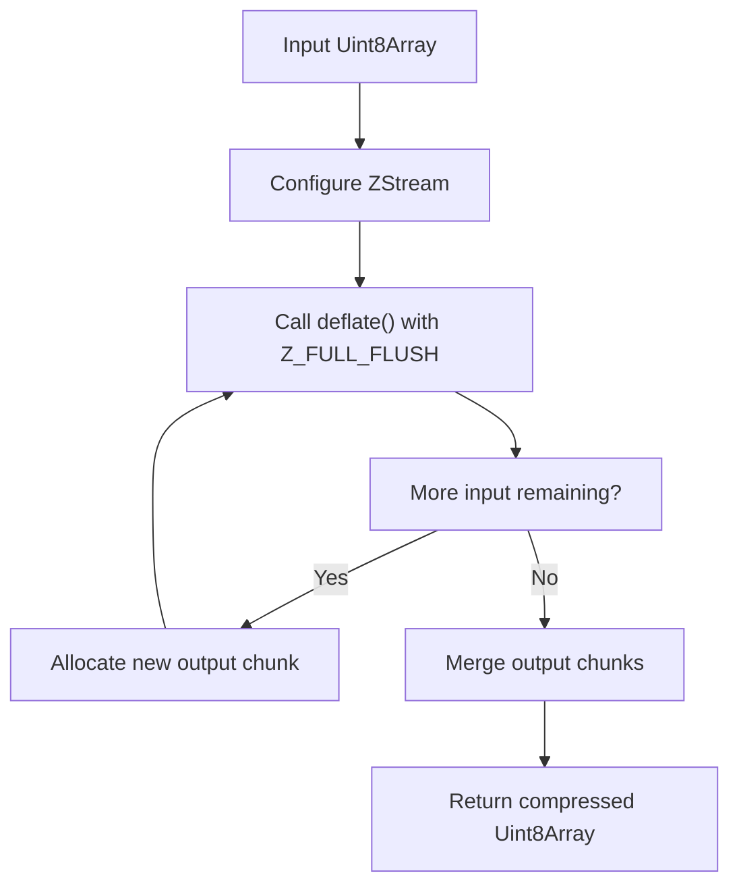
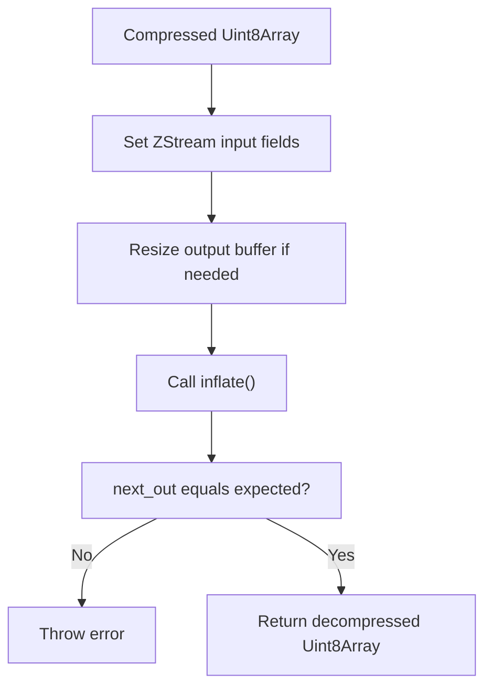

# Compression

The **Compression** module provides low-level zlib-based data compression and decompression services for the noVNC client embedded in MeshCentral. It acts as a thin, performance-oriented wrapper around the bundled `pako` zlib implementation and is responsible for efficiently handling compressed binary streams used throughout the remote framebuffer (RFB) protocol.

Within the overall architecture, Compression is primarily consumed by:

- The [Decoders](../decoders/decoders.md) module (e.g., Tight, ZRLE)
- The [RFB and Display](../rfb-and-display/rfb-and-display.md) module
- The [Websock](../websock/websock.md) transport layer

Compression is intentionally minimal and stateless at the application level, delegating stream state management to the underlying zlib `ZStream` implementation.

---

## Purpose and Responsibilities

The Compression module provides two core capabilities:

1. **Deflation (Compression)** – Compress raw binary data before transmission.
2. **Inflation (Decompression)** – Decompress incoming zlib-compressed blocks.

These capabilities are essential for:

- Reducing bandwidth usage in remote desktop sessions.
- Supporting RFB encodings such as Tight and ZRLE.
- Maintaining protocol compatibility with VNC servers that rely on zlib streams.

The module consists of two primary classes:

- `Deflator` – Handles zlib compression.
- `Inflate` – Handles zlib decompression.

---

## High-Level Architecture

### Interaction Flow

- **Incoming Data Path**:
  1. Websock receives binary frames.
  2. RFB parses encoding type.
  3. If compressed, a decoder invokes `Inflate`.
  4. Decompressed data is passed to the Display pipeline.

- **Outgoing Data Path**:
  1. RFB prepares protocol messages.
  2. `Deflator` compresses payloads if required.
  3. Websock transmits compressed bytes.

---

## Core Components

### Deflator

**Component:** `meshcentral.public.novnc.core.deflator.Deflator`

The Deflator class wraps the zlib `deflate` functionality from `pako`. It maintains an internal `ZStream` instance and performs chunked compression using `Z_FULL_FLUSH`.

#### Key Characteristics

- Uses `Z_DEFAULT_COMPRESSION` during initialization.
- Applies `Z_FULL_FLUSH` for each compression call.
- Handles multi-chunk output automatically.
- Returns a single flattened `Uint8Array`.

#### Internal Workflow

#### Stream Handling

The Deflator:

- Sets `input`, `avail_in`, and `next_in` before compression.
- Allocates a reusable output buffer (`chunkSize` default 100 KB).
- Iteratively calls `deflate()` until all input is consumed.
- Merges chunks if multiple passes are required.
- Clears input references after completion.

This design ensures:

- Efficient memory reuse.
- Proper flushing of zlib state.
- Safe handling of large payloads.

---

### Inflate

**Component:** `meshcentral.public.novnc.core.inflator.Inflate`

The Inflate class wraps zlib `inflate` operations for decompressing binary RFB data blocks.

#### Key Characteristics

- Initializes a persistent `ZStream` via `inflateInit()`.
- Allows dynamic resizing of the output buffer.
- Requires the expected output size.
- Throws explicit errors on incomplete or failed decompression.

#### Internal Workflow

#### Stream Lifecycle

The Inflate class provides:

- `setInput(data)` – Assigns compressed input to the stream.
- `inflate(expected)` – Decompresses exactly `expected` bytes.
- `reset()` – Resets the zlib stream state.

Strict validation ensures:

- Detection of truncated or corrupted zlib blocks.
- Prevention of silent partial decompression.

---

## Relationship to Other Modules

### Decoders Module

The [Decoders](../decoders/decoders.md) module relies heavily on Compression for RFB encodings such as:

- Tight
- TightPNG
- ZRLE

These encodings embed zlib-compressed pixel or tile data, which is passed through the `Inflate` class before rendering.

### RFB and Display Module

The [RFB and Display](../rfb-and-display/rfb-and-display.md) module orchestrates protocol negotiation and framebuffer updates. When compression is negotiated, it:

- Uses Inflate for incoming compressed rectangles.
- May use Deflator for outgoing messages.

### Websock Module

The [Websock](../websock/websock.md) module provides raw binary transport over WebSocket. It does not interpret compression but supplies and receives the byte streams that Compression processes.

---

## Error Handling Strategy

Both Deflator and Inflate follow a fail-fast model:

- Any negative zlib return code triggers an exception.
- Inflate validates output size strictly.
- Partial blocks result in explicit errors.

This approach prevents subtle rendering corruption and ensures protocol-level correctness.

---

## Performance Considerations

### Chunk-Based Processing

Deflator supports multi-chunk compression for large inputs, reducing the risk of:

- Large contiguous memory allocations.
- Buffer overflow conditions.

### Pre-Allocated Buffers

Inflate pre-allocates its output buffer and resizes only when necessary, minimizing allocation overhead during frequent framebuffer updates.

### Stream Reuse

Both classes reuse a single `ZStream` instance per object, avoiding repeated initialization costs.

---

## Security Considerations

Because compression operates on untrusted remote data:

- Inflate strictly enforces expected output size.
- Errors are surfaced immediately.
- No implicit buffer growth occurs beyond expected bounds.

This reduces risk from:

- Corrupted streams.
- Malformed zlib payloads.
- Resource exhaustion attacks.

---

## Summary

The **Compression** module provides a focused, high-performance abstraction over zlib for the noVNC client in MeshCentral. By encapsulating `pako` stream handling inside the `Deflator` and `Inflate` classes, it:

- Simplifies integration with RFB encodings.
- Ensures protocol-compliant zlib handling.
- Maintains predictable memory and error behavior.

It forms a foundational layer beneath the Decoders and RFB modules, enabling efficient and reliable remote desktop rendering over WebSocket connections.
