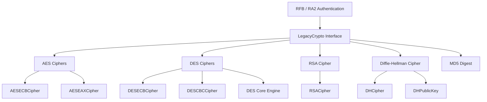
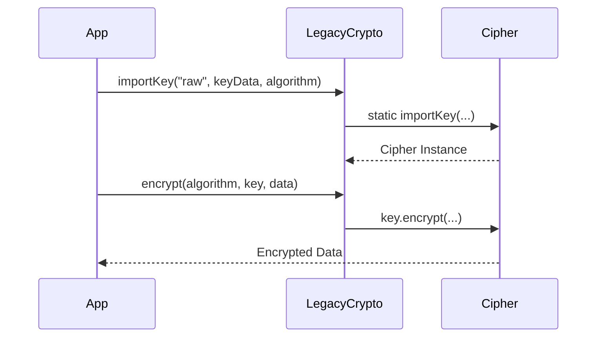
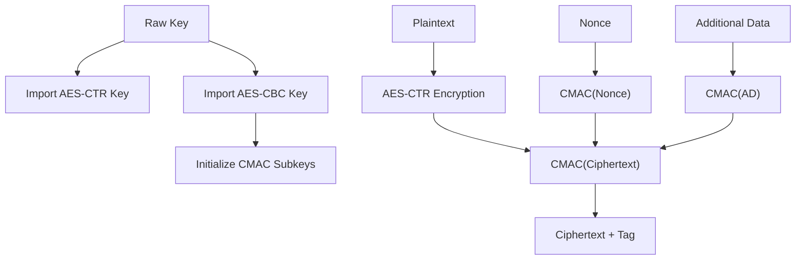
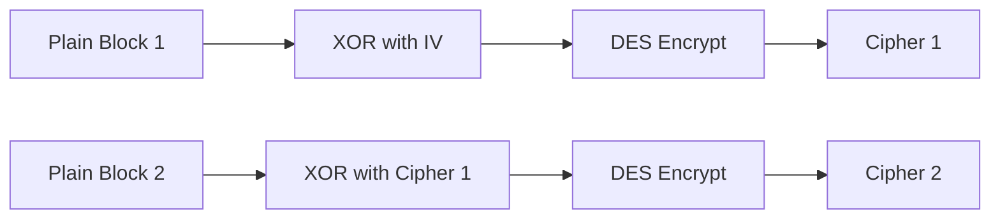
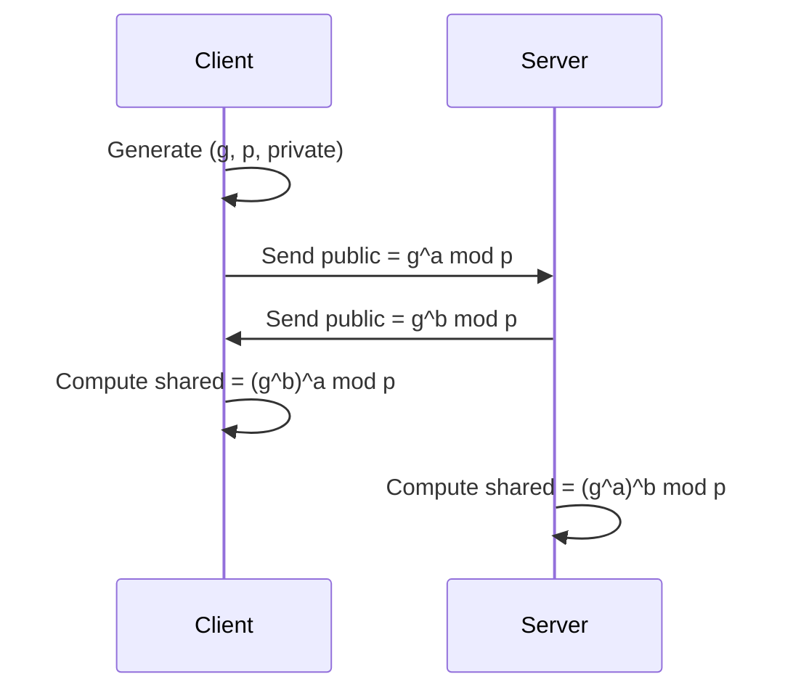
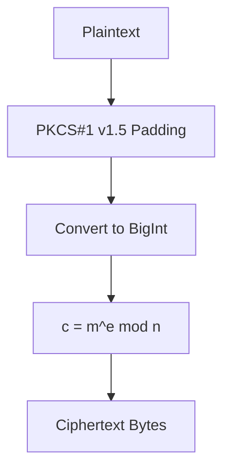
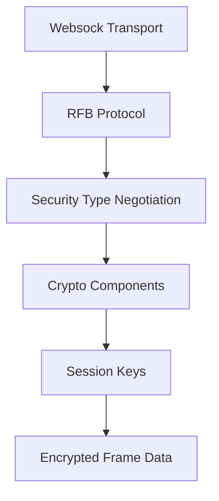

# Crypto Components

The **Crypto Components** module provides the cryptographic foundation for the browser-based remote desktop stack used in MeshCentral’s noVNC integration. It implements symmetric encryption, asymmetric encryption, key exchange, and legacy compatibility layers required for RFB (Remote Framebuffer) authentication and secure session establishment.

This module complements the networking and protocol layers (such as RFB, RA2, and Websock) by delivering the cryptographic primitives required during authentication handshakes and secure data exchange.

---

## 1. Purpose and Scope

The Crypto Components module is responsible for:

- Implementing AES-based symmetric encryption (ECB and EAX modes)
- Providing DES encryption for legacy VNC authentication
- Supporting RSA (PKCS#1 v1.5) for key transport
- Implementing Diffie-Hellman (DH) key exchange
- Offering a unified legacy crypto interface compatible with SubtleCrypto-like APIs
- Supporting digest and key derivation functionality through pluggable algorithms

It bridges modern Web Crypto APIs (`window.crypto.subtle`) with custom cryptographic implementations required by VNC/RFB security types.

---

## 2. High-Level Architecture

The module is structured around algorithm-specific cipher classes and a unifying `LegacyCrypto` facade.



### Design Characteristics

- **Algorithm abstraction**: Each cipher exposes a consistent `algorithm` property.
- **SubtleCrypto integration**: AES and RSA key generation rely on Web Crypto when available.
- **Legacy compatibility**: DES and RSA-PKCS1-v1_5 are implemented for protocol compatibility.
- **Pluggable interface**: `LegacyCrypto` maps algorithm names to implementations.

---

## 3. LegacyCrypto Interface

**Core Component:**
- `meshcentral.public.novnc.core.crypto.crypto.LegacyCrypto`

`LegacyCrypto` provides a SubtleCrypto-like API for algorithms not natively supported in the browser or requiring custom behavior.

### Responsibilities

- Route encryption/decryption requests to correct cipher
- Import/export raw keys
- Generate keys (if supported)
- Perform digest operations (e.g., MD5)
- Perform key derivation (e.g., DH)

### Algorithm Registry

Internally, it maps algorithm names to implementations:

- `AES-ECB` → `AESECBCipher`
- `AES-EAX` → `AESEAXCipher`
- `DES-ECB` → `DESECBCipher`
- `DES-CBC` → `DESCBCCipher`
- `RSA-PKCS1-v1_5` → `RSACipher`
- `DH` → `DHCipher`
- `MD5` → MD5 implementation

### Call Flow



This abstraction allows RFB authentication code to remain algorithm-agnostic.

---

## 4. AES Implementations

**Core Components:**
- `meshcentral.public.novnc.core.crypto.aes.AESECBCipher`
- `meshcentral.public.novnc.core.crypto.aes.AESEAXCipher`

### 4.1 AESECBCipher

Provides AES in ECB-like behavior by encrypting 16-byte blocks individually using `AES-CBC` with a zero IV.

#### Characteristics

- Uses `window.crypto.subtle.importKey`
- Requires plaintext length to be multiple of 16 bytes
- Encrypts each block independently
- Returns `null` on invalid input or uninitialized key

This mode exists primarily for protocol compatibility rather than modern security best practices.

---

### 4.2 AESEAXCipher

Implements AES-EAX (Authenticated Encryption with Associated Data).

EAX combines:

- AES-CTR for encryption
- AES-CMAC for authentication

#### Internal Structure



#### Key Concepts

- **Prefix blocks** distinguish nonce, associated data, and ciphertext.
- CMAC subkeys are derived from AES encryption of a zero block.
- Tag verification is done in constant-time style comparison.

EAX is used when authenticated encryption is required (e.g., secure session data exchange).

---

## 5. DES Implementations

**Core Components:**
- `meshcentral.public.novnc.core.crypto.des.DES`
- `meshcentral.public.novnc.core.crypto.des.DESECBCipher`
- `meshcentral.public.novnc.core.crypto.des.DESCBCCipher`

### 5.1 DES Core Engine

The `DES` class implements:

- Key scheduling
- 16-round Feistel network
- Permutation tables and S-box operations

It encrypts 8-byte blocks using:

```text
Input (8 bytes)
 → Initial permutation
 → 16 Feistel rounds
 → Final permutation
 → Output (8 bytes)
```

This implementation is ported and optimized for compatibility with legacy VNC authentication.

---

### 5.2 DESECBCipher

- Encrypts 8-byte blocks independently
- Requires plaintext multiple of 8 bytes
- Used in classic VNC challenge-response authentication

---

### 5.3 DESCBCCipher

- Implements Cipher Block Chaining
- Uses provided IV
- XORs each block with previous ciphertext



DES support is retained strictly for compatibility with older RFB security types.

---

## 6. Diffie-Hellman (DH)

**Core Components:**
- `meshcentral.public.novnc.core.crypto.dh.DHCipher`
- `meshcentral.public.novnc.core.crypto.dh.DHPublicKey`

The DH implementation enables secure key agreement between client and server.

### Workflow



### Implementation Details

- Uses `modPow` for modular exponentiation
- Converts between `Uint8Array` and `BigInt`
- Returns raw shared secret bytes via `deriveBits`

This mechanism is typically used to derive symmetric session keys.

---

## 7. RSA (PKCS#1 v1.5)

**Core Component:**
- `meshcentral.public.novnc.core.crypto.rsa.RSACipher`

Provides RSA encryption and decryption using PKCS#1 v1.5 padding.

### Features

- Key generation via Web Crypto (`RSA-OAEP` internally)
- Manual extraction of modulus (`n`), exponent (`e`), and private exponent (`d`)
- Public key import support
- PKCS#1 v1.5 block formatting

### Encryption Flow



### Decryption Flow

- Convert ciphertext to BigInt
- Compute `m = c^d mod n`
- Validate PKCS#1 padding
- Extract plaintext

RSA is typically used to securely exchange symmetric keys during authentication.

---

## 8. Security Model and Integration

The Crypto Components module is deeply integrated into:

- RFB authentication negotiation
- RA2 security type
- Session key establishment
- Challenge-response verification

### Layered Interaction



### Key Properties

- Uses browser-native crypto where possible
- Falls back to custom implementations for protocol compatibility
- Maintains consistent API surface
- Enforces algorithm-name validation to prevent misuse

---

## 9. Summary

The **Crypto Components** module delivers the cryptographic primitives required by the browser-based remote desktop stack. It:

- Supports both modern and legacy algorithms
- Implements authenticated encryption (AES-EAX)
- Enables secure key exchange (DH)
- Supports key transport (RSA)
- Maintains backward compatibility with DES-based VNC authentication

By abstracting algorithm selection through `LegacyCrypto`, the module ensures protocol flexibility while keeping higher layers (such as RFB and authentication logic) clean and algorithm-independent.

It serves as the cryptographic backbone of secure remote session establishment within the MeshCentral noVNC integration.