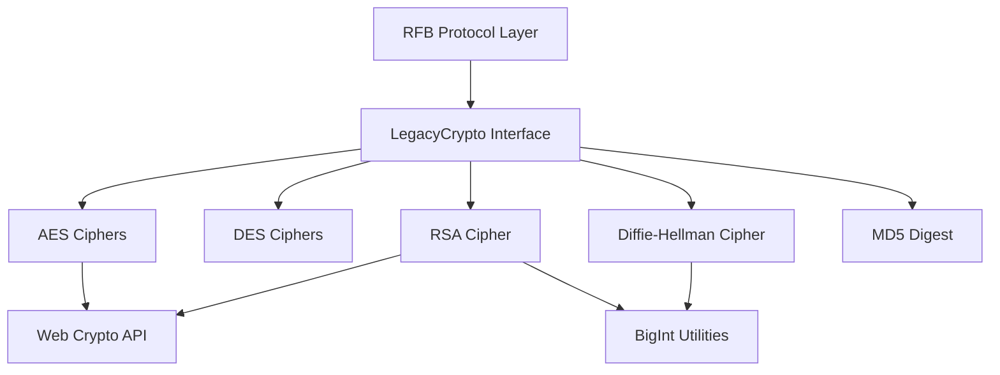
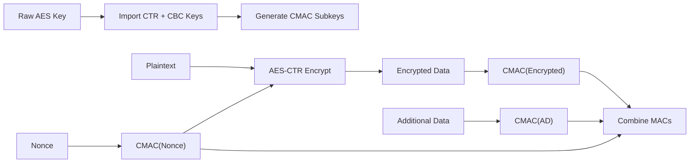
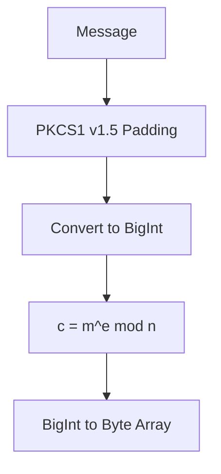
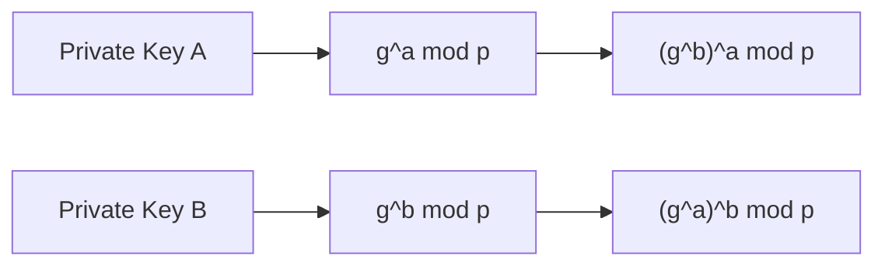
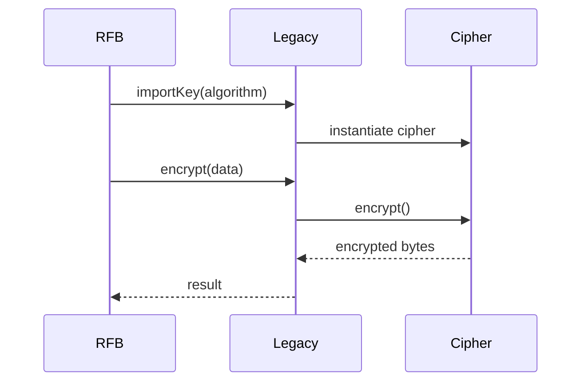

# Crypto Components

The **Crypto Components** module provides the cryptographic foundation for MeshCentral's embedded noVNC client. It implements a collection of symmetric, asymmetric, and key exchange algorithms required for secure Remote Framebuffer (RFB) communication, legacy VNC authentication schemes, and compatibility with environments where the Web Crypto API does not fully cover required primitives.

This module acts as a compatibility and abstraction layer over:

- The browser `window.crypto.subtle` API
- Custom JavaScript implementations (DES, RSA, DH, MD5)
- Legacy VNC-specific cryptographic workflows

It ensures that the rest of the noVNC stack (notably the RFB layer) can rely on a unified crypto interface without being tightly coupled to a specific browser capability set.

---

## Architectural Overview

The Crypto Components module is organized around algorithm families and a unifying facade:

- **AES Ciphers** – Modern symmetric encryption (ECB and EAX modes)
- **DES Ciphers** – Legacy VNC authentication encryption
- **RSA Cipher** – Public key encryption (PKCS#1 v1.5 style padding)
- **Diffie-Hellman Cipher** – Key agreement for shared secret derivation
- **LegacyCrypto** – Unified compatibility interface

### High-Level Architecture



The **LegacyCrypto** class acts as the primary entry point. It selects and delegates to the appropriate cipher implementation based on the algorithm name.

---

## Core Components

### 1. AES Ciphers

**Components:**
- `meshcentral.public.novnc.core.crypto.aes.AESEAXCipher`
- `meshcentral.public.novnc.core.crypto.aes.AESECBCipher`

AES is used for modern symmetric encryption scenarios.

#### AESECBCipher

- Wraps AES block encryption using `AES-CBC` with a zero IV
- Emulates ECB behavior by encrypting blocks individually
- Requires input length to be a multiple of 16 bytes
- Uses `window.crypto.subtle.importKey()` and `encrypt()`

This is primarily included for compatibility where AES-ECB is required but not directly available via Web Crypto.

#### AESEAXCipher

Implements **AES-EAX**, an authenticated encryption mode combining:

- AES-CTR for encryption
- AES-CMAC for authentication

Internal workflow:



Key characteristics:

- Provides confidentiality + integrity
- Appends a 16-byte authentication tag
- Validates MAC before decryption
- Returns `null` on authentication failure

This cipher is significantly more secure than ECB and suitable for modern encrypted sessions.

---

### 2. DES Ciphers

**Components:**
- `meshcentral.public.novnc.core.crypto.des.DES`
- `meshcentral.public.novnc.core.crypto.des.DESECBCipher`
- `meshcentral.public.novnc.core.crypto.des.DESCBCCipher`

DES is retained for **legacy VNC authentication compatibility**.

#### DES (Core Engine)

- Full JavaScript implementation of DES
- Implements key scheduling and 16 Feistel rounds
- Encrypts 8-byte blocks via `enc8()`
- Derived from historical ACME and Flashlight VNC implementations

#### DESECBCipher

- Encrypts 8-byte blocks independently
- Requires plaintext length multiple of 8 bytes
- Used for traditional VNC challenge-response authentication

#### DESCBCCipher

- Implements CBC chaining
- Uses XOR with previous block or IV
- Applies DES block encryption per round

DES should be considered cryptographically weak by modern standards and is preserved strictly for protocol compatibility.

---

### 3. RSA Cipher

**Component:**
- `meshcentral.public.novnc.core.crypto.rsa.RSACipher`

Implements RSA encryption using:

- BigInt modular exponentiation
- PKCS#1 v1.5-style padding
- Web Crypto key generation (internally exported to JWK)

#### Responsibilities

- Generate RSA key pairs (via Web Crypto)
- Import public keys
- Perform modular exponentiation using BigInt
- Encrypt/decrypt using manual padding logic

Encryption workflow:



Decryption performs:

- `m = c^d mod n`
- Padding validation
- Extraction of original message

The implementation explicitly checks padding structure and returns `null` on invalid input.

---

### 4. Diffie-Hellman Cipher

**Components:**
- `meshcentral.public.novnc.core.crypto.dh.DHCipher`
- `meshcentral.public.novnc.core.crypto.dh.DHPublicKey`

Provides a pure JavaScript Diffie-Hellman key exchange mechanism using BigInt arithmetic.

#### Key Generation

- Accepts `g` (generator) and `p` (prime modulus)
- Generates random private key
- Computes public key: `g^private mod p`

#### Shared Secret Derivation



Both parties derive the same shared secret using:

- `modPow()` BigInt exponentiation
- Byte-array conversion utilities

This is used when secure key negotiation is required before symmetric encryption begins.

---

### 5. LegacyCrypto Interface

**Component:**
- `meshcentral.public.novnc.core.crypto.crypto.LegacyCrypto`

The central compatibility layer.

#### Responsibilities

- Maps algorithm names to implementations
- Delegates encryption and decryption
- Provides key import/export abstraction
- Supports:
  - `encrypt()`
  - `decrypt()`
  - `importKey()`
  - `generateKey()`
  - `exportKey()`
  - `digest()`
  - `deriveBits()`

Algorithm registry example:

```text
"AES-ECB"        → AESECBCipher
"AES-EAX"        → AESEAXCipher
"DES-ECB"        → DESECBCipher
"DES-CBC"        → DESCBCCipher
"RSA-PKCS1-v1_5" → RSACipher
"DH"             → DHCipher
"MD5"            → MD5
```

This abstraction ensures the rest of the system does not depend on concrete implementations.

---

## Interaction with the RFB Layer

The Crypto Components module primarily serves the RFB protocol implementation during:

- Authentication negotiation
- Challenge-response encryption
- Secure key agreement
- Encrypted session setup



The RFB layer remains algorithm-agnostic by interacting only with the LegacyCrypto interface.

---

## Security Considerations

- **AES-EAX** provides authenticated encryption and should be preferred.
- **AES-ECB** is included for compatibility and should not be used for new designs.
- **DES** is cryptographically weak and maintained solely for legacy VNC support.
- **RSA-PKCS1 v1.5** padding is historically common but less robust than modern OAEP.
- Diffie-Hellman relies on secure parameter selection (`p`, `g`).

Where available, Web Crypto primitives are leveraged for stronger security and performance.

---

## Design Principles

The Crypto Components module follows these architectural principles:

1. **Protocol Compatibility First** – Supports legacy VNC requirements.
2. **Web Crypto Integration** – Uses browser-native primitives when possible.
3. **BigInt-Based Fallbacks** – Implements required math when not provided by SubtleCrypto.
4. **Clear Algorithm Abstraction** – Prevents higher layers from depending on implementation details.
5. **Graceful Failure** – Returns `null` on invalid inputs or authentication failures.

---

## Summary

The **Crypto Components** module is the cryptographic backbone of the MeshCentral noVNC client. It provides:

- Modern AES authenticated encryption
- Legacy DES compatibility
- RSA public key encryption
- Diffie-Hellman key exchange
- A unified LegacyCrypto interface

By isolating cryptographic logic into a dedicated module, the system maintains clear separation between transport, rendering, input handling, and security logic while ensuring compatibility with both modern and legacy remote desktop environments.
