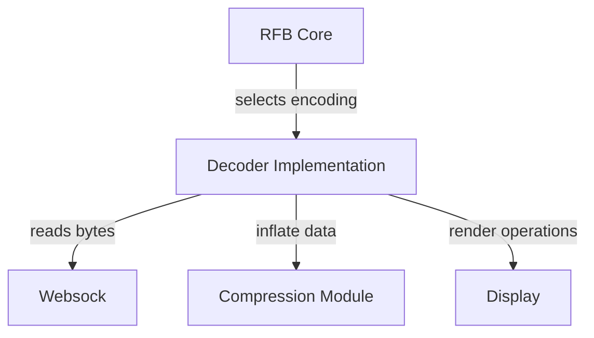
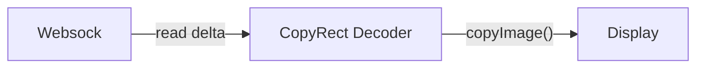
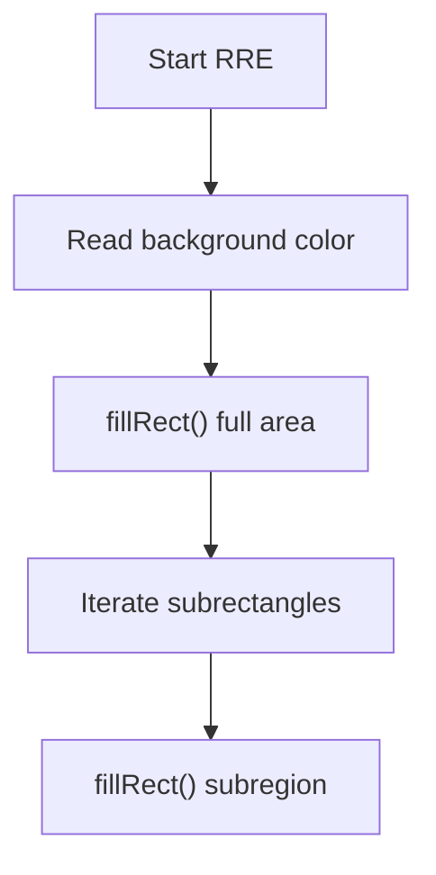
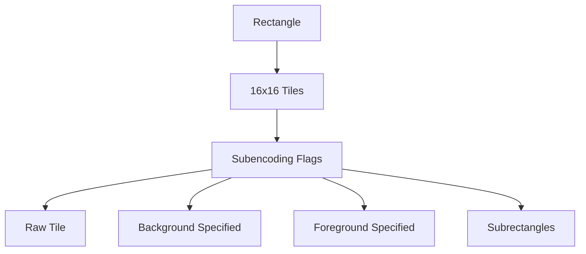
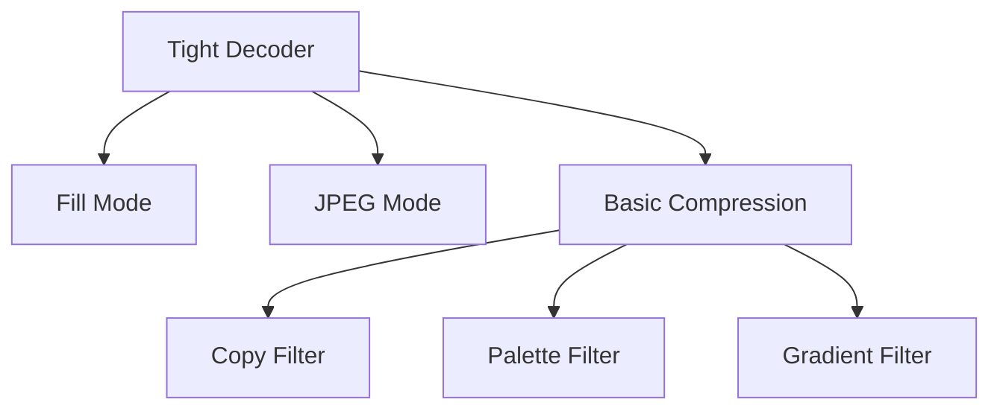
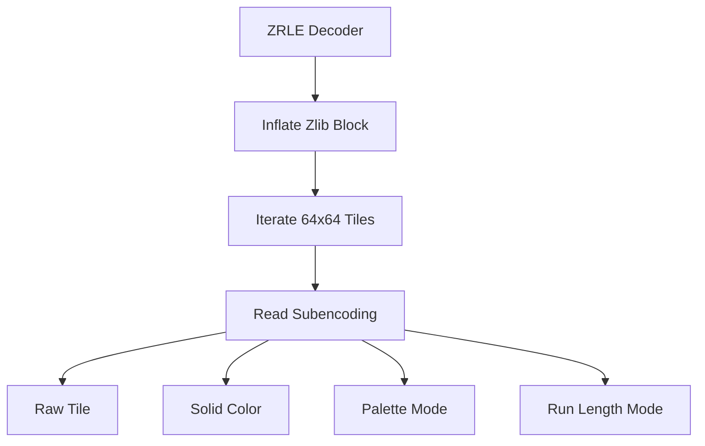
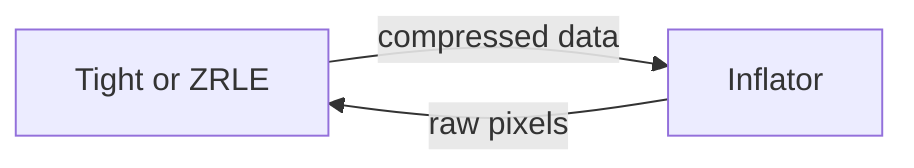

# Decoders

The **Decoders** module is responsible for transforming encoded Remote Framebuffer (RFB) rectangle data into pixel operations that can be rendered by the Display layer. It is a critical part of the noVNC-based rendering pipeline used by MeshCentral, converting network-level framebuffer updates into visual updates on the HTML5 canvas.

Each decoder implements a specific RFB encoding defined by the VNC protocol (e.g., Raw, CopyRect, Hextile, Tight, ZRLE, JPEG). The Decoders module works closely with:

- The RFB core for protocol orchestration
- The Websock transport for buffered network reads
- The Display module for rendering pixel data
- The Compression module for zlib-based inflation

This document describes the architecture, responsibilities, and internal design of the Decoders module.

---

## Architectural Overview

At runtime, the RFB core selects a decoder based on the encoding type specified in a framebuffer update. Each decoder processes the rectangle and invokes rendering methods on the Display instance.



### Key Responsibilities

- Parse rectangle metadata and payload from the socket buffer
- Wait for sufficient bytes using `rQwait`
- Decode or decompress pixel data
- Convert pixel formats where necessary
- Invoke drawing primitives such as:
  - `blitImage()`
  - `fillRect()`
  - `copyImage()`
  - `imageRect()`

---

## Decoder Interface Contract

All decoders expose a common method:

```javascript
decodeRect(x, y, width, height, sock, display, depth)
```

### Parameters

- `x`, `y` – Top-left rectangle position
- `width`, `height` – Rectangle dimensions
- `sock` – Websock instance (buffered network reader)
- `display` – Display renderer
- `depth` – Pixel depth (8-bit or 24/32-bit)

### Return Value

- `true` → Rectangle fully processed
- `false` → Not enough data available yet (caller must retry)

This cooperative design allows incremental parsing of streamed network data.

---

# Decoder Implementations

## CopyRect Decoder

**Component:** `meshcentral.public.novnc.core.decoders.copyrect.CopyRectDecoder`

The CopyRect Decoder performs server-side screen copy operations. Instead of transmitting pixel data, the server instructs the client to copy a rectangle from one location to another.

### Behavior

- Reads source coordinates (`deltaX`, `deltaY`)
- Calls `display.copyImage()`



### Characteristics

- No pixel decoding
- Extremely bandwidth-efficient
- Used for window moves and scrolling

---

## Raw Decoder

**Component:** `meshcentral.public.novnc.core.decoders.raw.RawDecoder`

The Raw Decoder processes uncompressed pixel data transmitted line-by-line.

### Behavior

- Calculates bytes per line
- Reads row data
- Converts 8-bit indexed color to RGBA if necessary
- Ensures alpha channel is fully opaque
- Calls `display.blitImage()`

### Use Case

- Simple servers
- High-bandwidth connections
- Fallback encoding

---

## RRE Decoder

**Component:** `meshcentral.public.novnc.core.decoders.rre.RREDecoder`

RRE (Rise-and-Run-length Encoding) encodes a background color and multiple subrectangles.

### Behavior

1. Read subrectangle count
2. Fill entire rectangle with background color
3. Render each subrectangle with its own color



### Advantages

- Efficient for large solid-color areas
- Low computational overhead

---

## Hextile Decoder

**Component:** `meshcentral.public.novnc.core.decoders.hextile.HextileDecoder`

Hextile divides a rectangle into 16×16 tiles and encodes each tile separately using subencoding flags.

### Tile Model



### Key Features

- Maintains tile buffer
- Supports raw tile fallback
- Handles background and foreground optimization
- Efficient for mixed content

---

## JPEG Decoder

**Component:** `meshcentral.public.novnc.core.decoders.jpeg.JPEGDecoder`

The JPEG Decoder reconstructs a complete JPEG image from streamed segments.

### Special Handling

- Caches quantization tables
- Caches Huffman tables
- Inserts missing tables if omitted by server
- Concatenates segments into full JPEG binary

### Rendering

Uses:

```javascript
display.imageRect(x, y, width, height, "image/jpeg", data);
```

### Advantages

- High compression ratio
- Ideal for photo-realistic content

---

## Tight Decoder

**Component:** `meshcentral.public.novnc.core.decoders.tight.TightDecoder`

Tight encoding is one of the most complex and efficient encodings in VNC. It supports multiple filters and zlib streams.

### Control Byte Structure

- Lower 4 bits → zlib stream selection
- Upper bits → filter/compression mode
- Stream reset flags

### Supported Modes

- Fill (solid color)
- JPEG
- Copy filter (raw RGB)
- Palette filter
- Gradient filter



### Compression

- Uses four zlib streams
- Integrated with the Compression module (Inflator)
- Supports incremental decompression

### Why Tight Matters

- Excellent bandwidth efficiency
- Adaptive compression strategies
- Common default encoding in many VNC servers

---

## TightPNG Decoder

**Component:** `meshcentral.public.novnc.core.decoders.tightpng.TightPNGDecoder`

Extends the Tight Decoder to support PNG rectangles instead of JPEG.

### Differences from Tight

- Overrides PNG handler
- Disallows basic compression mode

### Rendering

```javascript
display.imageRect(x, y, width, height, "image/png", data);
```

---

## ZRLE Decoder

**Component:** `meshcentral.public.novnc.core.decoders.zrle.ZRLEDecoder`

ZRLE (Zlib Run-Length Encoding) compresses 64×64 tiles using zlib followed by per-tile subencoding.

### Tile Processing Pipeline



### Supported Subencodings

- Raw
- Solid
- Palette-based
- RLE
- Palette + RLE

### Benefits

- Very efficient for mixed graphical content
- Good balance between compression and decoding complexity

---

# Interaction with Other Modules

## RFB and Display

The Decoders module is orchestrated by the RFB core. It does not manage protocol negotiation directly.

For protocol handling details, see the RFB and Display module documentation.

## Compression Module

Tight and ZRLE use zlib inflation via the Compression module.



## Websock Transport

All decoders rely on the Websock abstraction for:

- Buffered reads
- Waiting for sufficient bytes
- Peeking without shifting
- Shifting typed values

---

# Design Patterns and Principles

## Incremental Decoding

Decoders never assume the entire rectangle payload is available. They:

- Call `rQwait()` before reading
- Return `false` when insufficient data exists
- Preserve state between calls

This enables streaming and avoids blocking behavior.

## Stateless vs Stateful Decoders

- Stateless: CopyRect
- Stateful: Tight, Hextile, ZRLE (maintain buffers and counters)

## Alpha Channel Normalization

All decoders ensure alpha is set to `255` (fully opaque), standardizing canvas rendering behavior.

---

# Performance Considerations

- Tight and ZRLE use reusable inflation streams
- Scratch buffers reduce allocations
- Tile-based approaches improve cache locality
- Palette and RLE reduce bandwidth dramatically

---

# Summary

The **Decoders** module is the rendering backbone of the noVNC client within MeshCentral. It:

- Implements multiple RFB encoding algorithms
- Integrates tightly with Websock and Display
- Supports incremental and streaming decoding
- Balances CPU cost against bandwidth savings

By abstracting encoding-specific logic into dedicated decoder classes, the architecture remains modular, extensible, and maintainable while supporting a wide range of VNC server implementations.
