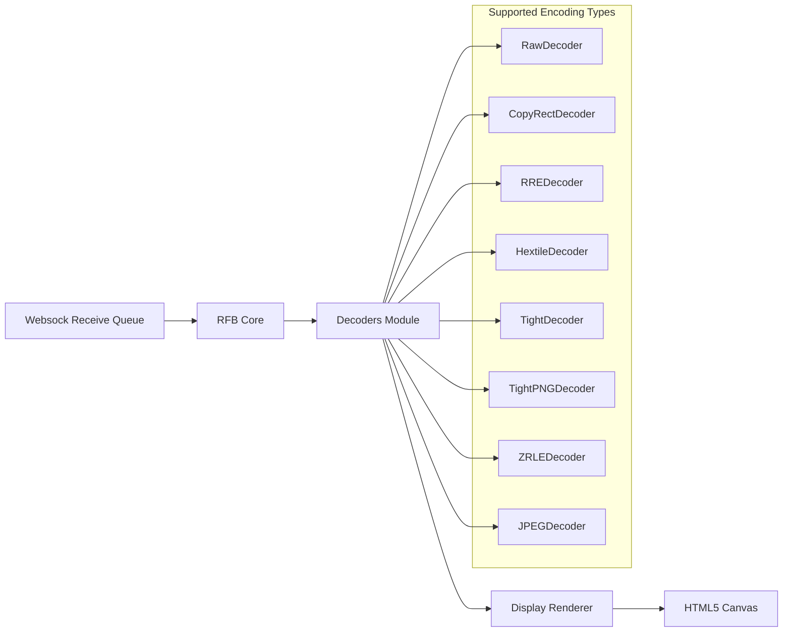
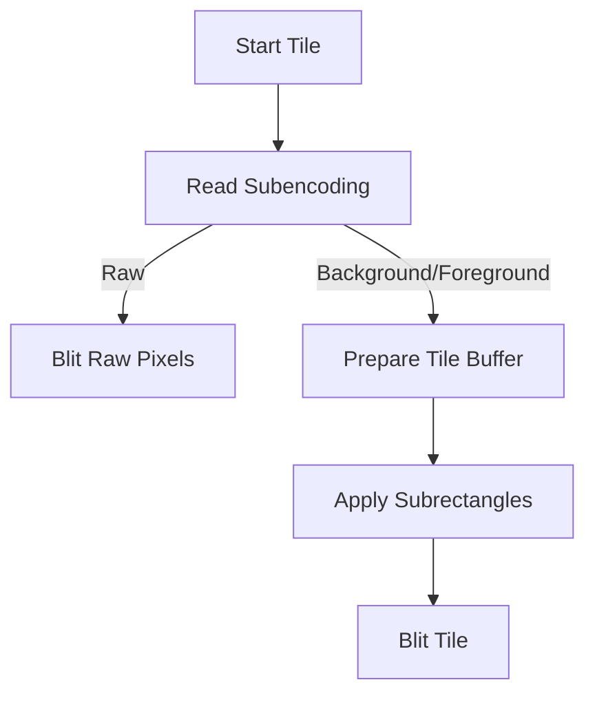
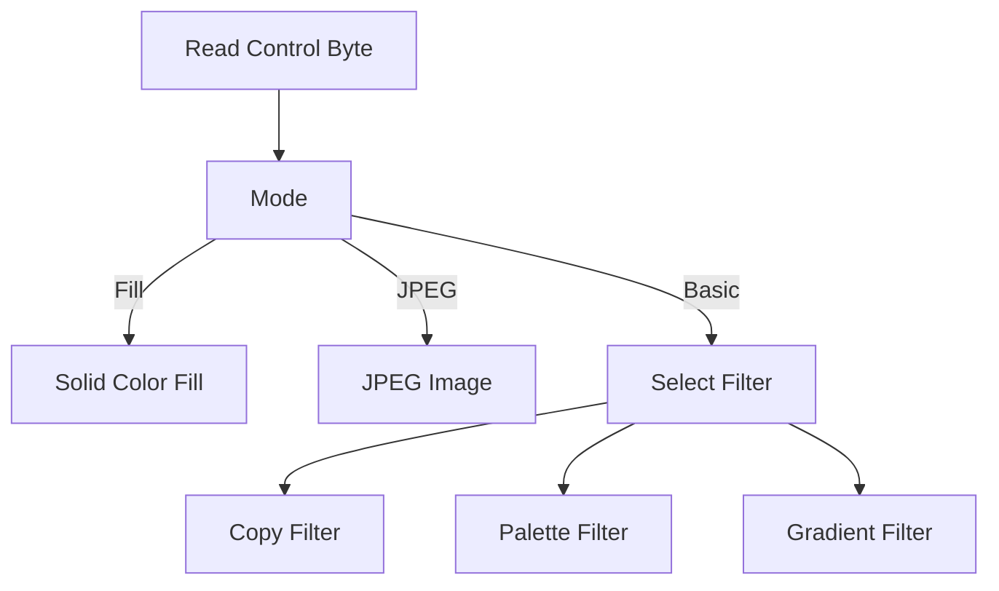
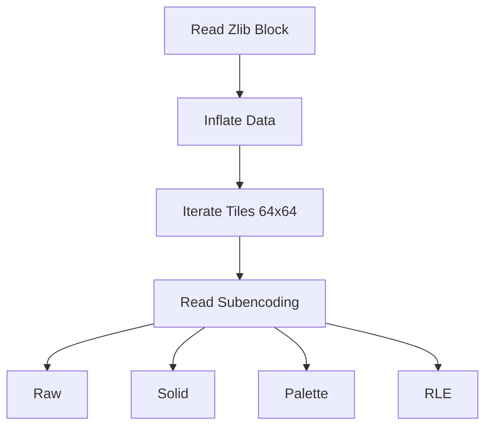
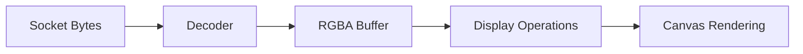

# Decoders

The **Decoders** module is a core part of the noVNC rendering pipeline embedded in MeshCentral. It is responsible for translating encoded framebuffer update rectangles received via the Remote Framebuffer (RFB) protocol into pixel operations on the client-side display.

Each decoder implements a specific VNC encoding type (e.g., RAW, Hextile, Tight, ZRLE) and exposes a consistent `decodeRect(...)` interface used by the RFB layer. The decoded pixel data is then forwarded to the Display subsystem for rendering.

---

## Purpose and Responsibilities

The Decoders module:

- Parses rectangle updates from the RFB stream
- Handles protocol-specific encoding formats
- Decompresses and transforms pixel data
- Converts indexed or compressed data into RGBA buffers
- Delegates final rendering to the Display component

It operates directly on:

- `Websock` receive queues (via `sock.rQ*` methods)
- The Display abstraction (via `fillRect`, `blitImage`, `imageRect`, `copyImage`)

---

## Architectural Overview



### Execution Flow

1. The RFB layer receives a framebuffer update message.
2. The encoding type determines which decoder is selected.
3. `decodeRect(x, y, width, height, sock, display, depth)` is invoked.
4. The decoder consumes bytes from the socket queue.
5. Pixel data is reconstructed and passed to the Display.
6. Rendering is performed on the canvas.

All decoders are incremental and return `false` when more data is required, allowing non-blocking processing.

---

## Common Decoder Interface

All decoders implement:

```text
decodeRect(x, y, width, height, sock, display, depth) -> boolean
```

Where:

- `x, y` — rectangle origin
- `width, height` — rectangle dimensions
- `sock` — Websock abstraction for reading RFB data
- `display` — Display instance responsible for rendering
- `depth` — bits per pixel depth

Return value:

- `true` → rectangle fully decoded
- `false` → waiting for more socket data

---

# Decoder Implementations

## RawDecoder

**Encoding Type:** RAW

The simplest encoding. Pixel data is transmitted uncompressed.

### Behavior

- Reads line-by-line pixel data
- Handles 8-bit and 32-bit depth
- Converts 8-bit packed RGB into 32-bit RGBA
- Forces alpha channel to 255 (fully opaque)
- Uses `display.blitImage()` per scanline

### Characteristics

- No compression
- High bandwidth usage
- Minimal processing complexity

---

## CopyRectDecoder

**Encoding Type:** COPYRECT

Optimized encoding for screen regions that can be copied from existing framebuffer content.

### Behavior

- Reads source coordinates (`deltaX`, `deltaY`)
- Calls `display.copyImage()`

### Use Case

- Window dragging
- Scrolling
- Moving UI components

Very low bandwidth and CPU cost.

---

## RREDecoder (Rise-and-Run-length Encoding)

**Encoding Type:** RRE

Encodes a rectangle as:

- A background color
- A list of subrectangles with individual colors

### Behavior

1. Read number of subrectangles
2. Fill full area with background color
3. Apply colored subrectangles using `display.fillRect()`

Efficient for large areas with solid color blocks.

---

## HextileDecoder

**Encoding Type:** HEXTILE

Divides rectangles into 16×16 tiles.

### Features

- Tile-based processing
- Optional background and foreground colors
- Subrectangle support
- Raw tile fallback

### Internal Flow



Optimized for typical desktop UI patterns with repeating backgrounds and small updates.

---

## TightDecoder

**Encoding Type:** TIGHT

A complex, high-efficiency encoding using zlib compression and optional filters.

### Control Byte Structure

- Lower 4 bits → zlib stream reset flags
- Upper 4 bits → compression type

### Supported Modes

- FillRect (solid color)
- JPEG
- Basic compression (Copy, Palette, Gradient filters)

### Zlib Streams

Maintains four independent zlib streams to improve compression across updates.

### Filters

1. **CopyFilter** — raw RGB data, optionally compressed
2. **PaletteFilter** — indexed color images
3. **GradientFilter** — predictive encoding based on neighboring pixels



Tight is one of the most bandwidth-efficient encodings.

---

## TightPNGDecoder

Extension of TightDecoder.

### Differences

- Supports PNG image rectangles
- Disallows BasicCompression mode

Delegates PNG data directly to:

```text
display.imageRect(x, y, width, height, "image/png", data)
```

---

## JPEGDecoder

Handles standalone JPEG-encoded rectangles.

### Key Features

- Reads complete JPEG segment stream
- Reconstructs missing Huffman or quantization tables
- Caches tables for reuse (RealVNC compatibility)
- Emits final image via `display.imageRect()`

Optimized for photographic content and compressed screen regions.

---

## ZRLEDecoder

**Encoding Type:** ZRLE (Zlib Run-Length Encoding)

Tile-based encoding (64×64 tiles) with zlib compression.

### Supported Subencodings

- Raw tile
- Solid tile
- Palette tile
- RLE tile
- RLE palette tile

### Tile Processing Model



Efficient for mixed content with repeated patterns.

---

# Data Flow Summary



---

# State Management

Many decoders maintain internal state across calls:

- Partial tile counters (Hextile, ZRLE)
- Remaining scanlines (Raw)
- Pending subrectangles (RRE)
- Active zlib streams (Tight)
- Cached JPEG tables (JPEG)

This allows safe incremental decoding when socket buffers do not yet contain complete rectangle data.

---

# Performance Considerations

| Decoder | CPU Cost | Bandwidth Usage | Typical Use Case |
|----------|------------|------------------|------------------|
| Raw | Low | High | Simple or LAN environments |
| CopyRect | Very Low | Very Low | UI movement |
| RRE | Low | Medium | Large solid areas |
| Hextile | Medium | Medium | Classic VNC servers |
| Tight | Medium–High | Low | Modern servers |
| TightPNG | Medium | Low | Image-heavy content |
| JPEG | Medium | Low | Photographic regions |
| ZRLE | Medium | Low | Mixed workloads |

---

# Integration with Other Modules

The Decoders module collaborates closely with:

- **RFB Core** — selects encoding and invokes decoder
- **Websock** — provides buffered socket reads
- **Compression (Inflator)** — used by Tight and ZRLE
- **Display** — performs final rendering

The module is intentionally isolated from UI logic and input handling, focusing strictly on framebuffer transformation.

---

# Design Principles

- Incremental decoding
- Zero-copy where possible
- Explicit alpha normalization
- Stream reuse for performance
- Clear separation between protocol parsing and rendering

---

# Conclusion

The **Decoders** module is a performance-critical layer in MeshCentral’s noVNC client stack. It translates diverse VNC encoding formats into consistent RGBA pixel operations, enabling efficient and responsive remote desktop rendering inside the browser.

By supporting multiple encoding strategies and maintaining incremental state handling, it ensures compatibility with a wide range of VNC servers while balancing CPU and bandwidth efficiency.