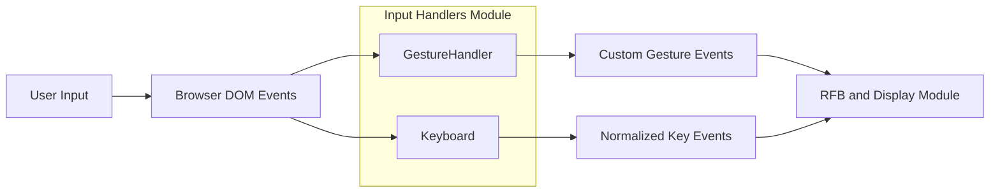
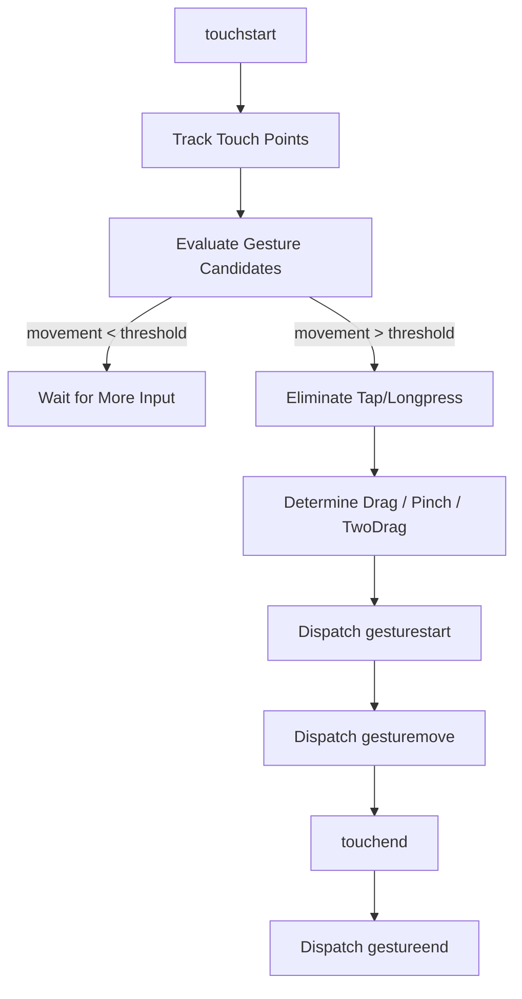
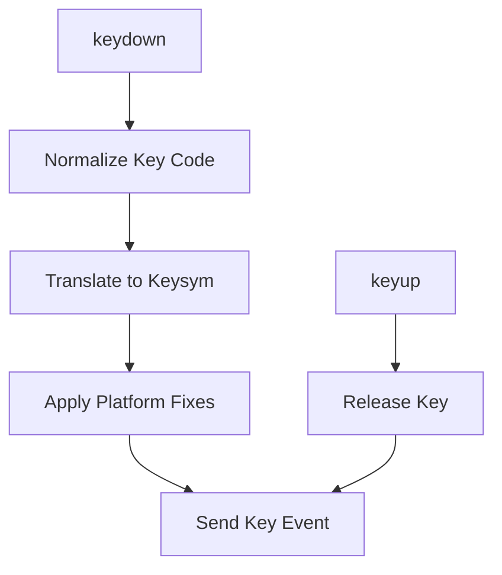
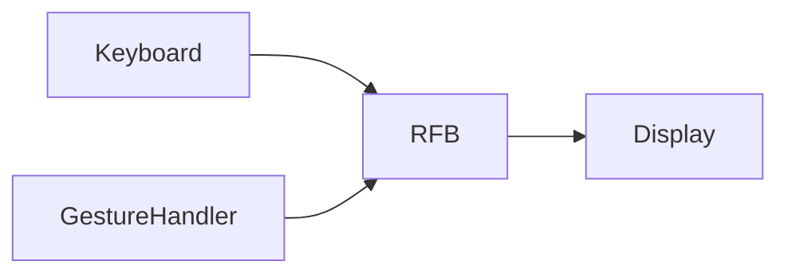

# Input Handlers

The **Input Handlers** module is responsible for capturing, normalizing, and translating user input events (touch and keyboard) into structured, protocol-ready actions for the noVNC-based remote desktop stack inside MeshCentral.

It acts as the bridge between browser-native input events and the Remote Framebuffer (RFB) protocol layer implemented in the [RFB and Display](rfb-and-display/rfb-and-display.md) module.

---

## Purpose and Responsibilities

The Input Handlers module provides:

- ✅ Touch gesture detection (tap, drag, pinch, long press)
- ✅ Cross-platform keyboard normalization
- ✅ Browser-specific compatibility handling
- ✅ Translation of DOM events into high-level gesture/key events
- ✅ Clean lifecycle management (attach/detach, grab/ungrab)

It ensures that input behavior is consistent across:

- Windows
- macOS
- iOS
- Android
- Linux
- Physical and virtual keyboards
- Multi-touch devices

---

## Core Components

The module consists of two primary components:

| Component | Responsibility |
|-----------|---------------|
| `GestureHandler` | Detects and emits high-level multi-touch gestures |
| `Keyboard` | Captures and normalizes keyboard events into keysyms |

---

# Architecture Overview



The module transforms low-level browser input into structured events that the RFB layer can transmit to the remote system.

---

# GestureHandler

**Component:** `meshcentral.public.novnc.core.input.gesturehandler.GestureHandler`

The GestureHandler converts raw touch events into semantic gestures.

## Supported Gestures

| Gesture | Description |
|----------|------------|
| `onetap` | Single finger tap |
| `twotap` | Two-finger tap |
| `threetap` | Three-finger tap |
| `drag` | Single-finger drag |
| `twodrag` | Two-finger drag |
| `pinch` | Pinch/zoom gesture |
| `longpress` | Press-and-hold gesture |

---

## Internal State Model

Gesture detection is implemented as a bitmask-based state machine.

Key characteristics:

- Multiple possible gestures remain active until eliminated
- Threshold-based movement detection
- Timeout-based differentiation (tap vs longpress vs pinch)
- Conflict resolution between gesture candidates

### Gesture Detection Flow



---

## Key Detection Mechanisms

### 1. Movement Threshold

Small movements are ignored to prevent accidental gestures.

### 2. Angle Threshold

Used to distinguish:

- Two-finger drag (parallel movement)
- Pinch (diverging or converging movement)

### 3. Timeout Strategy

Multiple timeouts are used to disambiguate gestures:

| Timeout | Purpose |
|----------|---------|
| Multi-touch timeout | Ensures grouped touches form one gesture |
| Tap timeout | Ensures tap duration is short |
| Longpress timeout | Detects hold gestures |
| Two-touch timeout | Differentiates pinch vs two-drag |

---

## Event Emission

GestureHandler dispatches **CustomEvent** objects:

- `gesturestart`
- `gesturemove`
- `gestureend`

Each event includes:

```text
{
  type: "pinch" | "drag" | "onetap" | ...,
  clientX: number,
  clientY: number,
  magnitudeX?: number,
  magnitudeY?: number
}
```

These events are consumed by higher-level modules such as RFB to generate pointer events or scaling operations.

---

# Keyboard

**Component:** `meshcentral.public.novnc.core.input.keyboard.Keyboard`

The Keyboard component captures browser keyboard events and translates them into X11-compatible keysyms for the remote system.

---

## Responsibilities

- Normalize key codes across browsers
- Translate to X11 keysyms
- Track depressed keys
- Handle platform-specific quirks
- Emit consistent key down/up events

---

## Keyboard Event Flow



---

## Platform Compatibility Handling

The component includes extensive logic for:

### Windows

- AltGr detection via Ctrl+Alt sequence timing
- Missing Shift release bug workaround
- Japanese IM key handling

### macOS / iOS

- Remapping of Alt/Super behavior
- CapsLock emulation (press + release)
- Meta-key release inconsistencies
- NumLock unsupported detection

### Virtual Keyboards

If a key cannot be identified:

- Immediately send press and release
- Prevents stuck keys

---

## Internal Key Tracking

Keyboard maintains an internal map:

```text
_keyDownList = {
  "KeyA": XK_A,
  "ShiftLeft": XK_Shift_L
}
```

This ensures:

- Consistent release events
- No duplicate keysyms
- Recovery when focus is lost

---

## Lifecycle Management

### grab()

- Attaches `keydown` and `keyup` listeners
- Adds window `blur` listener
- Begins capturing keyboard input

### ungrab()

- Removes listeners
- Releases all depressed keys
- Prevents stuck key state

---

# Integration with RFB and Display

The Input Handlers module feeds directly into the RFB client implementation.



- Keyboard events → RFB key messages
- Gesture events → Pointer/mouse messages
- RFB forwards events to remote server

See: [RFB and Display](rfb-and-display/rfb-and-display.md)

---

# Design Characteristics

### Deterministic Gesture Resolution

The bitmask-based gesture elimination model ensures:

- Only one final gesture survives
- Conflicting gestures are eliminated early
- No ambiguous output states

### Cross-Browser Robustness

Both components implement fallback paths for:

- Legacy browsers
- Inconsistent key APIs
- Platform-specific event quirks

### Clean Separation of Concerns

- GestureHandler → touch semantics
- Keyboard → key semantics
- RFB → protocol transport
- Display → rendering

---

# Summary

The **Input Handlers** module provides a critical abstraction layer between browser-native input systems and the remote desktop protocol stack.

It ensures:

- Reliable multi-touch gesture detection
- Cross-platform keyboard normalization
- Stable lifecycle management
- Clean integration with the RFB layer

Without this module, remote desktop interaction would suffer from inconsistent input behavior, stuck keys, incorrect gesture interpretation, and platform-specific bugs.

It is a foundational component in delivering a smooth and predictable remote control experience within MeshCentral.