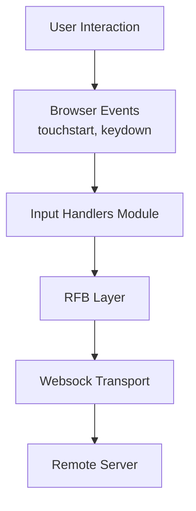
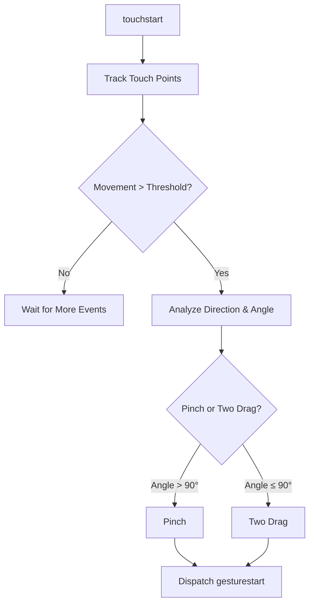
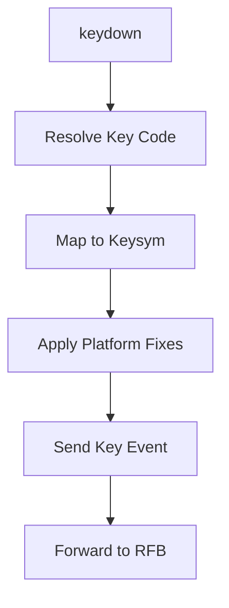

# Input Handlers

The **Input Handlers** module is responsible for capturing, normalizing, and translating user interaction events (touch and keyboard) into a format suitable for remote transmission within the MeshCentral noVNC client stack.

It acts as the bridge between browser-native input events and the Remote Framebuffer (RFB) protocol layer, ensuring that gestures and key presses are interpreted consistently across platforms and devices.

This module contains two primary components:

- `GestureHandler` – Multi-touch gesture recognition and abstraction
- `Keyboard` – Cross-platform keyboard event normalization and translation

Together, these components provide a unified input abstraction layer for remote desktop and terminal sessions.

---

## Architectural Overview

The Input Handlers module sits between the browser DOM event system and the RFB layer that communicates with the remote server.



### Responsibilities

- Capture DOM input events
- Normalize platform-specific differences
- Detect complex gestures (pinch, drag, tap, etc.)
- Maintain key state tracking
- Dispatch standardized input events
- Forward processed input to the RFB layer

---

## Component Overview

### 1. GestureHandler

**Component:** `meshcentral.public.novnc.core.input.gesturehandler.GestureHandler`

The GestureHandler detects and abstracts multi-touch gestures from raw touch events. It converts low-level touch sequences into higher-level semantic gesture events.

#### Supported Gestures

| Gesture | Description |
|----------|-------------|
| onetap | Single-finger tap |
| twotap | Two-finger tap |
| threetap | Three-finger tap |
| drag | Single-finger movement |
| longpress | Press and hold |
| twodrag | Two-finger parallel movement |
| pinch | Two-finger zoom gesture |

#### Gesture Detection Model

Gesture detection is implemented using:

- A bitmask-based state machine
- Movement and angle thresholds
- Time-based detection windows
- Multi-touch coordination logic



#### Key Internal Concepts

- **Tracked Touches** – Active touch points being analyzed
- **Ignored Touches** – Touches ignored due to conflict or cleanup
- **Timeouts**:
  - Multi-touch timeout
  - Long press timeout
  - Two-touch disambiguation timeout
- **Average Position Calculation** – Used to compute gesture coordinates
- **Magnitude Reporting** – Used for pinch distance or drag movement

#### Event Dispatch Model

GestureHandler emits `CustomEvent` instances:

- `gesturestart`
- `gesturemove`
- `gestureend`

Each event contains:

```text
{
  type: "pinch" | "drag" | "onetap" | ...,
  clientX: number,
  clientY: number,
  magnitudeX?: number,
  magnitudeY?: number
}
```

These events are consumed by higher layers (typically the RFB module) to generate remote pointer or scaling actions.

---

### 2. Keyboard

**Component:** `meshcentral.public.novnc.core.input.keyboard.Keyboard`

The Keyboard component captures and normalizes browser keyboard events, translating them into X11-style keysyms for remote transmission.

#### Core Responsibilities

- Track key press/release state
- Normalize browser key codes
- Convert to X11 keysym values
- Handle platform-specific quirks
- Detect composite key sequences (e.g., AltGr)
- Prevent browser default behavior

---

## Keyboard Processing Flow



### Key Features

#### 1. Key State Tracking

Maintains `_keyDownList` to ensure consistent press/release matching.

Prevents duplicate key events and ensures proper cleanup on blur.

#### 2. AltGr Detection (Windows)

Windows emulates AltGr as a rapid sequence of:

```text
ControlLeft + AltRight
```

The module detects timing patterns (< 50 ms) to merge them into a single ISO Level 3 Shift event.

#### 3. macOS Modifier Normalization

macOS modifier behavior differs significantly:

- Super keys remapped
- Alt behaves as Mode_switch
- CapsLock toggled as synthetic press-release
- Meta key edge-case handling

#### 4. Japanese IME Handling (Windows)

Certain IME keys do not generate proper release events. The module simulates press-release pairs to maintain consistency.

#### 5. Blur Safety

When the browser window loses focus:

- All pressed keys are automatically released
- Prevents "stuck key" conditions remotely

---

## Interaction with Other Modules

Although this document focuses only on Input Handlers, it integrates closely with:

- RFB – Receives normalized pointer and key events
- Websock – Transports encoded input to the remote server
- Display – Reflects results of remote interaction
- Utility components – Logging, browser detection, and event helpers

Input Handlers never directly manage rendering or networking. Instead, they provide a clean abstraction layer between user input and remote protocol logic.

---

## State Management Strategies

### Gesture State Machine

The GestureHandler uses a bitmask strategy:

```text
State = Bitmask of possible gestures

If only one bit remains set → Gesture detected
If multiple bits remain → Still ambiguous
If zero bits remain → No gesture
```

This approach allows:

- Efficient elimination of impossible gestures
- Parallel evaluation of gesture possibilities
- Clear conflict resolution

---

## Error Handling and Edge Cases

### GestureHandler

- Throws errors if invalid internal states are reached
- Guards against empty tracked touch lists
- Resets state after gesture completion
- Ignores conflicting touches

### Keyboard

- Ignores unidentified keys safely
- Prevents duplicate releases
- Handles OS inconsistencies gracefully
- Clears all key state during ungrab

---

## Public API Summary

### GestureHandler

| Method | Purpose |
|--------|----------|
| attach(target) | Begin listening for touch events |
| detach() | Remove event listeners |

### Keyboard

| Method | Purpose |
|--------|----------|
| grab() | Start listening for key events |
| ungrab() | Stop listening and release keys |
| onkeyevent | Callback for processed key events |

---

## Design Principles

1. Platform abstraction over direct DOM usage
2. Defensive handling of inconsistent browser behavior
3. Separation of gesture recognition and protocol logic
4. Deterministic state machines over heuristic guessing
5. Clear event emission contract

---

## Summary

The **Input Handlers** module provides the critical translation layer between browser-native interaction events and the remote desktop protocol stack.

- GestureHandler transforms complex touch input into structured gesture events.
- Keyboard normalizes cross-platform key behavior into protocol-safe keysyms.

By isolating browser and OS quirks within this module, the rest of the MeshCentral noVNC stack can operate with consistent, predictable input behavior across devices and platforms.