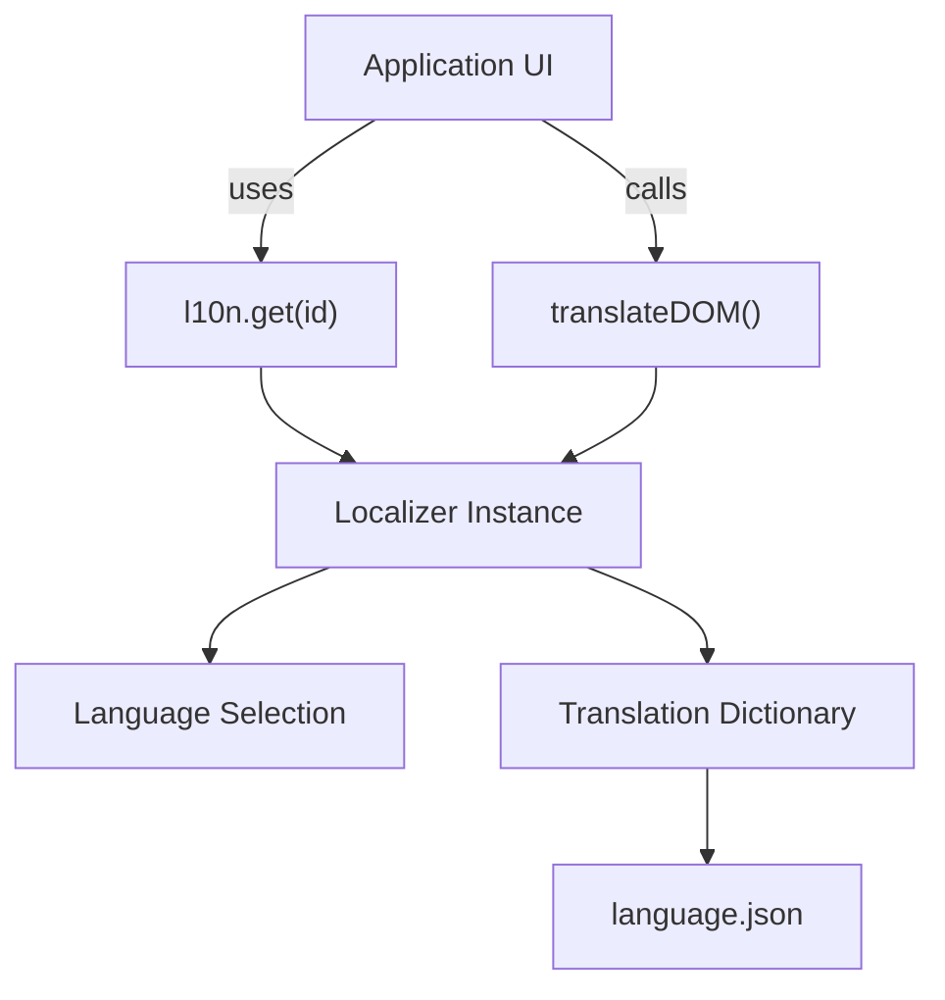
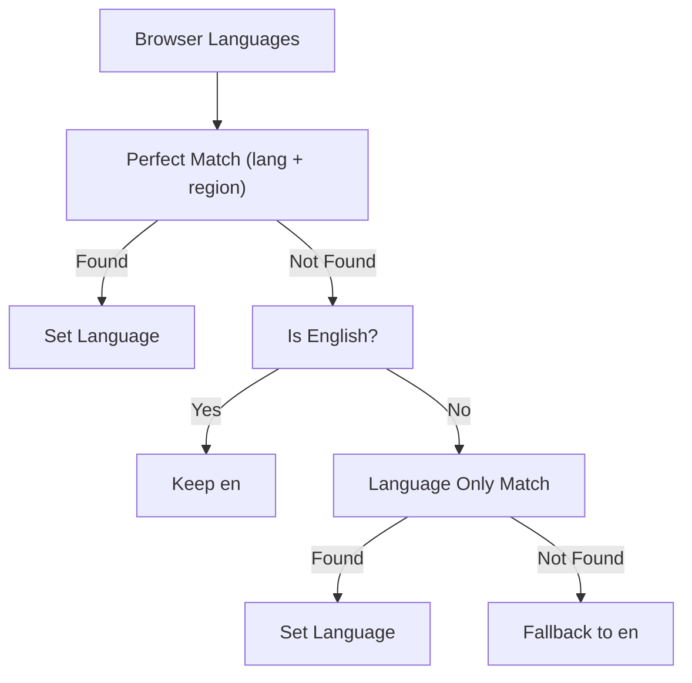
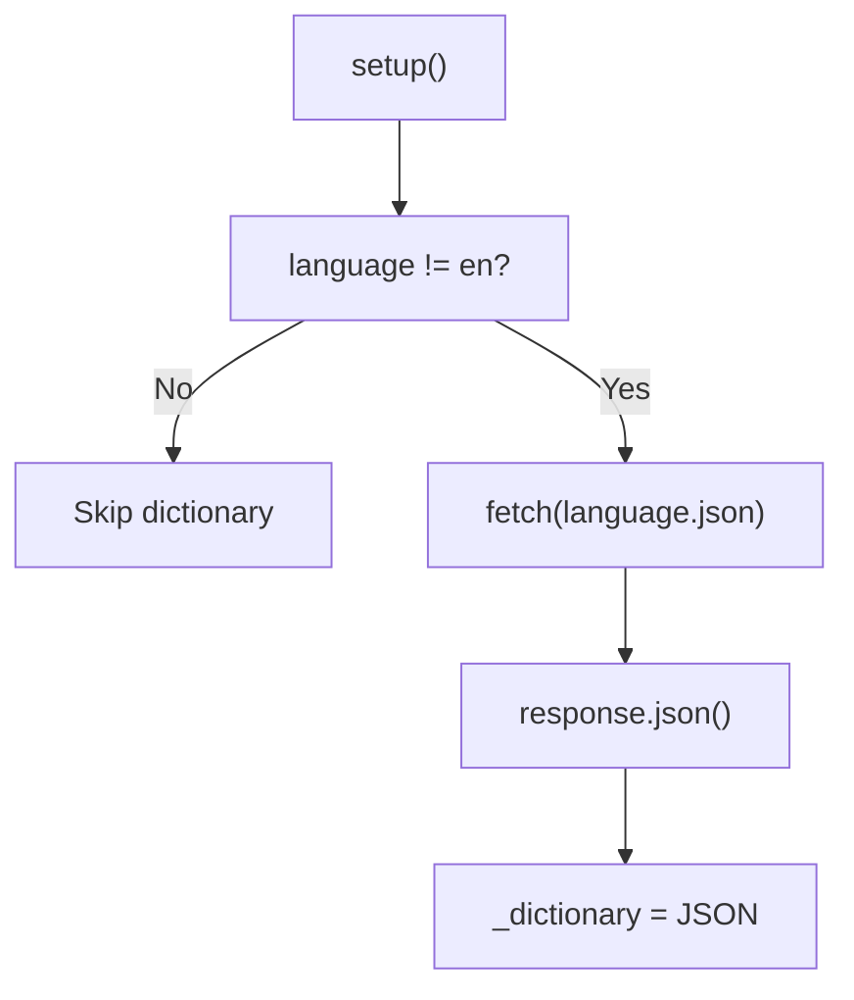
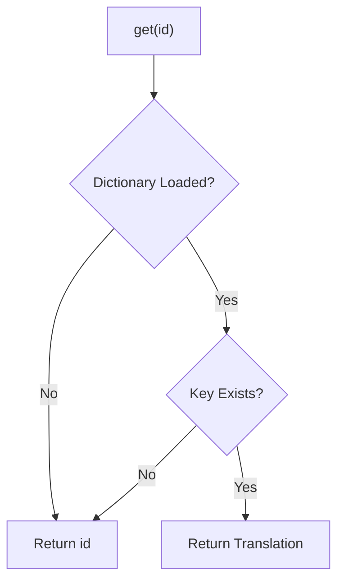
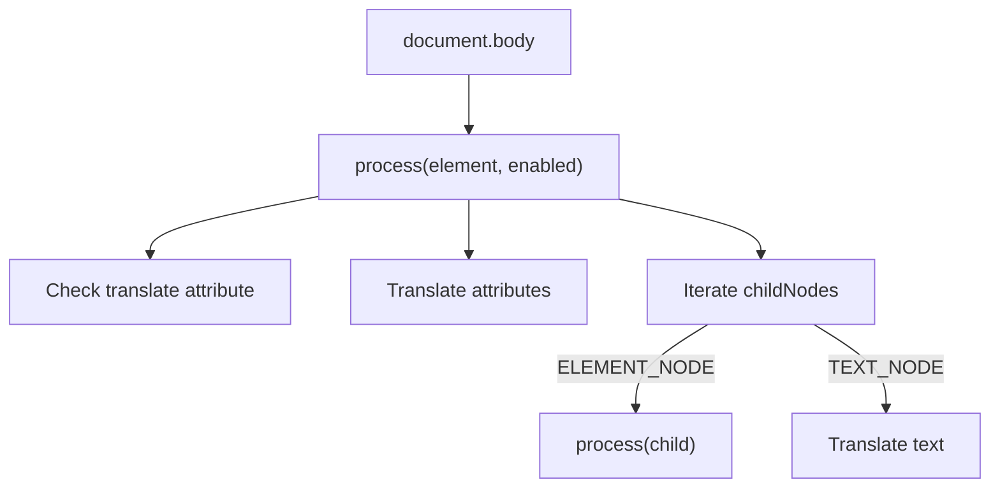
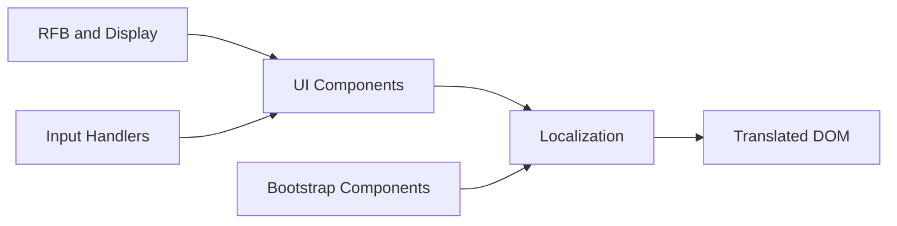

# Localization

The **Localization** module provides internationalization (i18n) support for the MeshCentral web client, specifically within the noVNC application layer. It is responsible for:

- Detecting the user’s preferred language
- Selecting the best matching supported language
- Loading translation dictionaries dynamically
- Translating UI strings at runtime
- Traversing and updating the DOM to reflect localized content

At its core, this module is implemented by the `Localizer` class (`meshcentral.public.novnc.app.localization.Localizer`) and exposes a singleton instance used throughout the UI.

---

## 1. Purpose and Responsibilities

The Localization module ensures that the user interface adapts to the end user’s language preferences without requiring separate builds per language.

### Primary Responsibilities

- ✅ Language negotiation using browser preferences
- ✅ Dynamic dictionary loading via HTTP (`fetch`)
- ✅ Key-based string lookup
- ✅ Automatic DOM traversal and translation
- ✅ Graceful fallback to English or source strings

---

## 2. Core Component: Localizer

**Namespace:** `meshcentral.public.novnc.app.localization.Localizer`  
**Exports:**
- `Localizer` (class)
- `l10n` (singleton instance)
- Default export: `l10n.get.bind(l10n)` (translation function)

### High-Level Structure



The module is designed around a **singleton pattern** so that all UI components share the same language context and dictionary.

---

## 3. Language Detection and Negotiation

### Setup Entry Point

```javascript
await l10n.setup(supportedLanguages, baseURL);
```

This performs two steps:

1. `_setupLanguage(supportedLanguages)`
2. `_setupDictionary(baseURL)`

---

### 3.1 Language Selection Algorithm

The module determines the best language match using the browser’s preferences:

- `window.navigator.languages` (preferred)
- Fallback: `navigator.language` or `navigator.userLanguage`

#### Matching Strategy

The matching process is performed in three passes:



### Pass Breakdown

1. **Perfect match**  
   Example: `en-US` matches `en-US`

2. **English fallback**  
   If the user language is English but no regional match exists, remain on `en`.

3. **Language-only match**  
   Example: `fr-CA` matches `fr`.

If no match is found, the system defaults to:

```text
en
```

---

## 4. Dictionary Loading

After language selection, `_setupDictionary(baseURL)` loads a JSON dictionary file:

```text
<baseURL>/<language>.json
```

### Behavior

- If language is `en`, no dictionary is loaded (English is treated as source language).
- If language is not `en`, a JSON file is fetched.
- If the request fails, an error is thrown.

### Data Flow



The dictionary structure is expected to be:

```json
{
  "Connect": "Verbinden",
  "Disconnect": "Trennen"
}
```

Keys must match the source UI text.

---

## 5. Translation Lookup

### Method: `get(id)`

```javascript
l10n.get("Connect");
```

### Behavior

- If a dictionary is loaded and contains the key → return translated value.
- Otherwise → return the original string (`id`).



This guarantees:

- No UI crashes due to missing translations
- Safe fallback to source strings

---

## 6. DOM Translation Engine

### Method: `translateDOM()`

This method recursively traverses `document.body` and updates:

- Text nodes
- Translatable attributes

It respects the HTML `translate` attribute as defined by the HTML specification.

---

### 6.1 Traversal Strategy



### 6.2 Attribute Handling

The module selectively translates specific attributes based on tag type:

| Attribute     | Elements                                 |
|--------------|-------------------------------------------|
| `abbr`       | `TH`                                      |
| `alt`        | `AREA`, `IMG`, `INPUT`                    |
| `download`   | `A`, `AREA`                               |
| `label`      | `MENUITEM`, `MENU`, `OPTGROUP`, etc.      |
| `placeholder`| `INPUT`, `TEXTAREA`                       |
| `title`      | All elements                              |
| `value`      | `INPUT` (`reset`, `button`, `submit`)     |

### 6.3 Whitespace Normalization

Before lookup, text is normalized:

- Line breaks trimmed
- Whitespace collapsed
- Surrounding whitespace removed

This ensures dictionary keys remain stable even if formatted across multiple lines in HTML.

---

## 7. Singleton Export Pattern

The module exports:

```javascript
export const l10n = new Localizer();
export default l10n.get.bind(l10n);
```

This allows two usage patterns:

### Pattern 1: Direct Function Import

```javascript
import _ from './localization.js';

button.textContent = _("Connect");
```

### Pattern 2: Full Instance Access

```javascript
import { l10n } from './localization.js';

await l10n.setup([...], '/locales/');
l10n.translateDOM();
```

This design keeps translation usage concise while preserving configurability.

---

## 8. Integration with Other Modules

The Localization module operates at the **UI layer** and integrates primarily with:

- UI components (buttons, labels, modals)
- noVNC display and connection views
- Bootstrap components (tooltips, modals, forms)

### Architectural Context



It does **not** directly interact with:

- Crypto components
- Compression
- WebSocket layer
- Decoders

Localization is strictly presentation-layer logic.

---

## 9. Error Handling and Fallback Strategy

### Network Errors

If dictionary fetch fails:

- An exception is thrown
- The application may catch and handle this
- English remains the active fallback

### Missing Keys

If a key does not exist in the dictionary:

- The original source string is returned
- UI remains readable
- Missing translations are non-fatal

---

## 10. Extension and Customization

### Adding a New Language

1. Add language code to `supportedLanguages`
2. Create JSON file:

```text
/locales/<language>.json
```

3. Ensure keys exactly match source strings

### Best Practices

- Use full sentences as keys for clarity
- Avoid dynamic string concatenation
- Keep formatting consistent to prevent mismatches

---

## 11. Design Characteristics

### ✅ Strengths

- Lightweight and dependency-free
- Browser-native language negotiation
- Standards-compliant DOM translation
- Safe fallback behavior
- Singleton architecture ensures consistency

### ⚠ Limitations

- No pluralization rules
- No parameter interpolation (e.g., "Hello {name}")
- No ICU message formatting
- Dictionary loaded as a single JSON file

---

# Summary

The **Localization** module provides a simple yet robust internationalization system for the MeshCentral noVNC UI layer.

It:

- Detects user language
- Selects the best supported match
- Dynamically loads translations
- Performs safe string lookup
- Recursively translates the DOM

By isolating translation logic in a single `Localizer` class and exporting a shared singleton instance, the system ensures consistent multilingual behavior across the entire web client while remaining lightweight and easy to maintain.