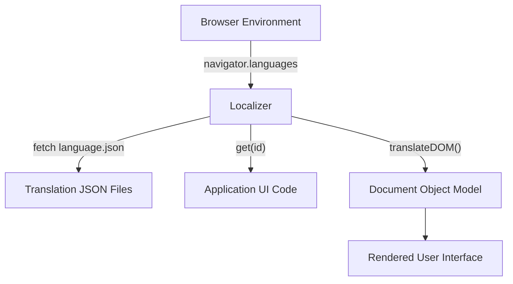
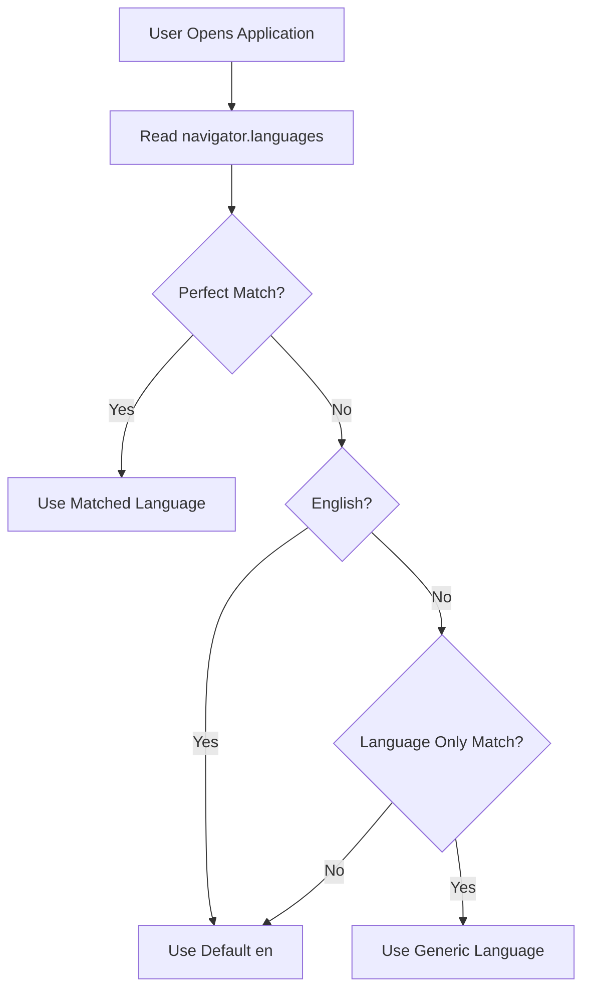
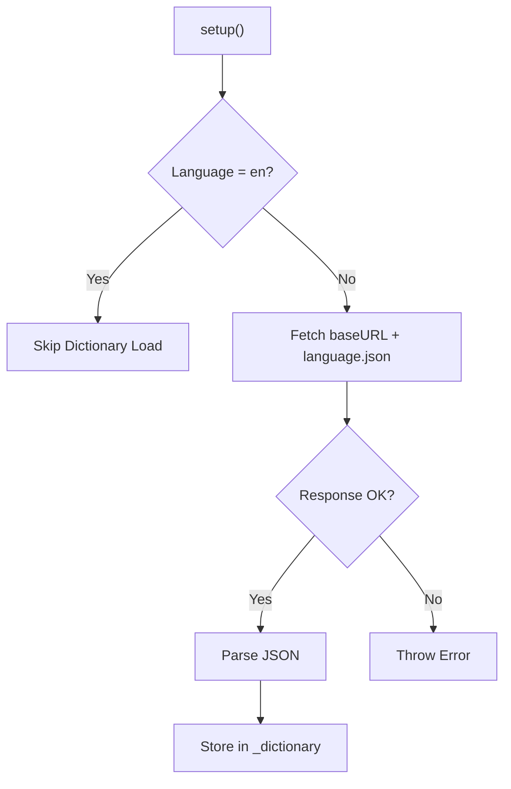
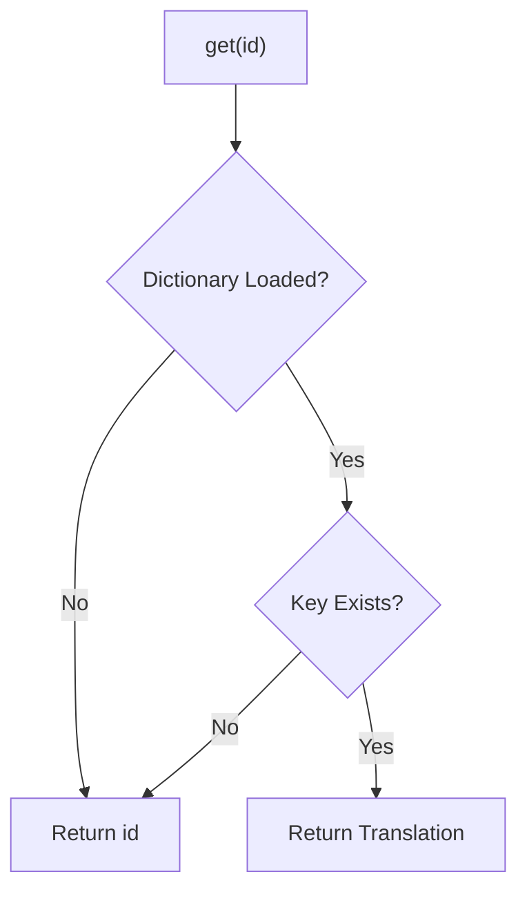
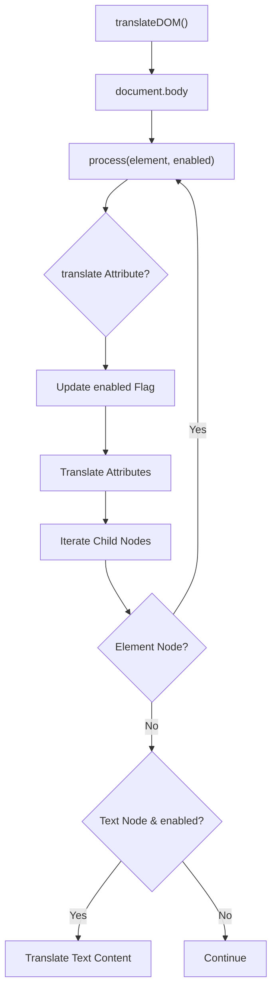

# Localization

The **Localization** module provides client-side internationalization (i18n) capabilities for the MeshCentral web interface, specifically within the noVNC-based application layer. It is responsible for:

- Detecting the user’s preferred language
- Selecting the best supported language
- Loading translation dictionaries dynamically
- Resolving translation keys at runtime
- Translating DOM elements and attributes automatically

At the core of this module is the `Localizer` class (`meshcentral.public.novnc.app.localization.Localizer`), which encapsulates language negotiation, dictionary management, and DOM traversal logic.

---

## 1. Purpose and Responsibilities

The Localization module ensures that user-facing text in the browser UI is presented in the most appropriate language available. It acts as a thin but powerful abstraction layer between:

- The browser environment (`window.navigator`)
- Translation JSON files
- The DOM tree
- UI components rendered by the noVNC application

### Key Responsibilities

- ✅ Language negotiation using browser preferences
- ✅ Fallback handling (regional → generic → English)
- ✅ Dynamic loading of language dictionaries
- ✅ Key-based translation lookup
- ✅ Automatic DOM traversal and translation

---

## 2. High-Level Architecture

The Localization module operates entirely on the client side and integrates directly with the browser and UI layer.



### Core Component

- `Localizer` — Manages language selection, dictionary loading, and translation resolution.

Additionally:

- `l10n` — Singleton instance of `Localizer`
- Default export — Bound `get()` method for simplified key lookup

---

## 3. Language Negotiation Process

The language selection process occurs during `setup()` and follows a structured fallback strategy.

### Entry Point

```javascript
await localizer.setup(supportedLanguages, baseURL);
```

### Selection Algorithm

The `_setupLanguage()` method:

1. Reads `navigator.languages` (or `navigator.language` fallback)
2. Normalizes language codes (e.g., `en_US` → `en-us`)
3. Attempts matching in three passes:
   - Perfect match (language + region)
   - English fallback
   - Language-only fallback



### Default Behavior

If no supported language matches, the system defaults to:

```text
en
```

English (`en`) requires no external dictionary file.

---

## 4. Dictionary Loading

After language selection, `_setupDictionary()` is responsible for loading the translation file.

### Behavior

- Appends `/` to `baseURL` if necessary
- Skips loading if language is `en`
- Fetches `<language>.json`
- Parses JSON into `_dictionary`



### Dictionary Format

Translation files are expected to be simple key-value JSON objects:

```json
{
  "Connect": "Verbinden",
  "Disconnect": "Trennen"
}
```

If a key is missing, the original identifier is returned.

---

## 5. Runtime Translation Lookup

The `get(id)` method provides key-based translation resolution.

### Logic



### Fallback Guarantee

The module guarantees:

- No undefined return values
- Original key returned if no translation exists

This ensures UI stability even with incomplete dictionaries.

---

## 6. DOM Translation Engine

The `translateDOM()` method recursively traverses the DOM starting at `document.body` and translates:

- Text nodes
- Selected attributes
- Elements with `translate="yes"` or no attribute
- Skips elements with `translate="no"`

### Supported Attributes

The module translates attributes such as:

- `title`
- `placeholder`
- `alt`
- `label`
- `download`
- `abbr` (for `TH` elements)
- `value` (for specific input types)

### DOM Traversal Flow



### Text Normalization

Before translation:

- Line breaks are trimmed
- Whitespace is normalized
- Surrounding spaces removed

This ensures dictionary keys match predictable string patterns.

---

## 7. Integration with the UI Layer

The Localization module integrates with the noVNC application layer and indirectly supports UI components rendered in the browser.

Typical integration pattern:

```javascript
import l10n from './localization.js';

button.textContent = l10n("Connect");
```

Or globally:

```javascript
import { l10n } from './localization.js';

await l10n.setup(["en", "de", "fr"], "/locales/");
l10n.translateDOM();
```

### Interaction with Other Modules

- **UI Components** — Provide DOM elements that are translated.
- **RFB and Display** — May surface user-facing messages requiring localization.
- **Input Handlers** — UI labels and hints can be localized.

The Localization module remains decoupled from rendering logic and focuses strictly on language resolution.

---

## 8. Singleton Pattern

At the bottom of the module:

```javascript
export const l10n = new Localizer();
export default l10n.get.bind(l10n);
```

This provides:

- A single shared instance across the application
- A convenient default export for translation lookups

### Benefits

- Centralized language state
- Consistent dictionary usage
- Minimal boilerplate for consumers

---

## 9. Error Handling Strategy

The module uses explicit failure behavior during dictionary loading:

- If `fetch()` fails → throws an error
- If dictionary key missing → returns original ID

This creates:

- Fail-fast behavior for missing translation files
- Graceful degradation for missing keys

---

## 10. Design Characteristics

| Characteristic | Description |
|---------------|-------------|
| Client-Side Only | No server-side dependency |
| Lazy Dictionary Loading | Only loads non-English dictionaries |
| Graceful Fallback | Defaults to English or key |
| DOM-Aware | Traverses and updates live DOM |
| Framework-Agnostic | Works without dependency on UI frameworks |

---

## 11. Summary

The **Localization** module provides a lightweight yet robust internationalization system for the MeshCentral web client. Through:

- Intelligent language negotiation
- Dynamic dictionary loading
- Safe key-based lookups
- Recursive DOM translation

It enables multi-language support without introducing heavy framework dependencies or complex configuration.

Its design emphasizes:

- Simplicity
- Predictability
- Runtime safety
- Minimal integration overhead

This makes it a foundational utility module that enhances usability across global deployments of the MeshCentral web interface.