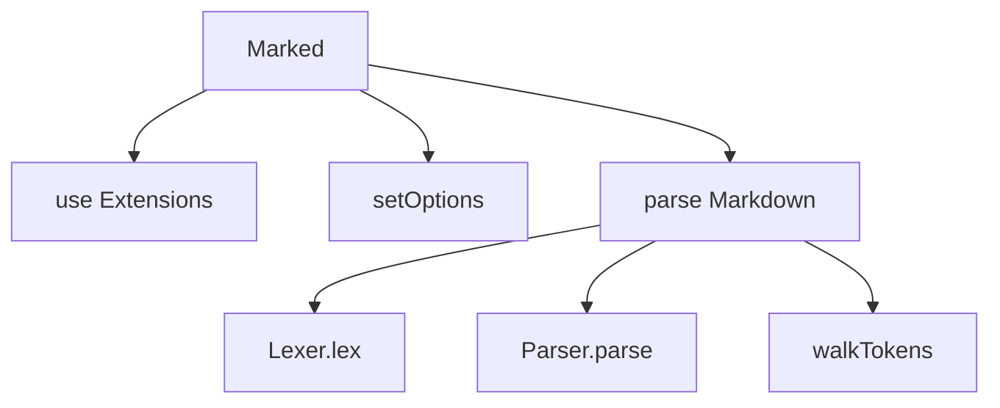
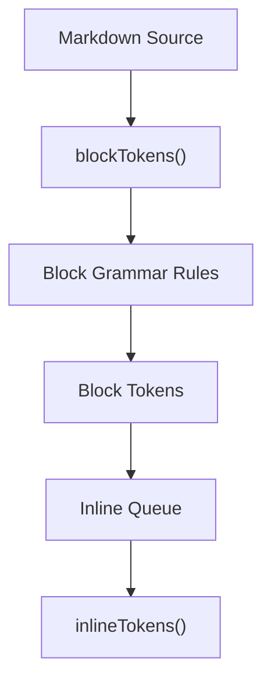
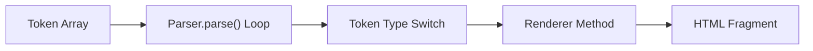
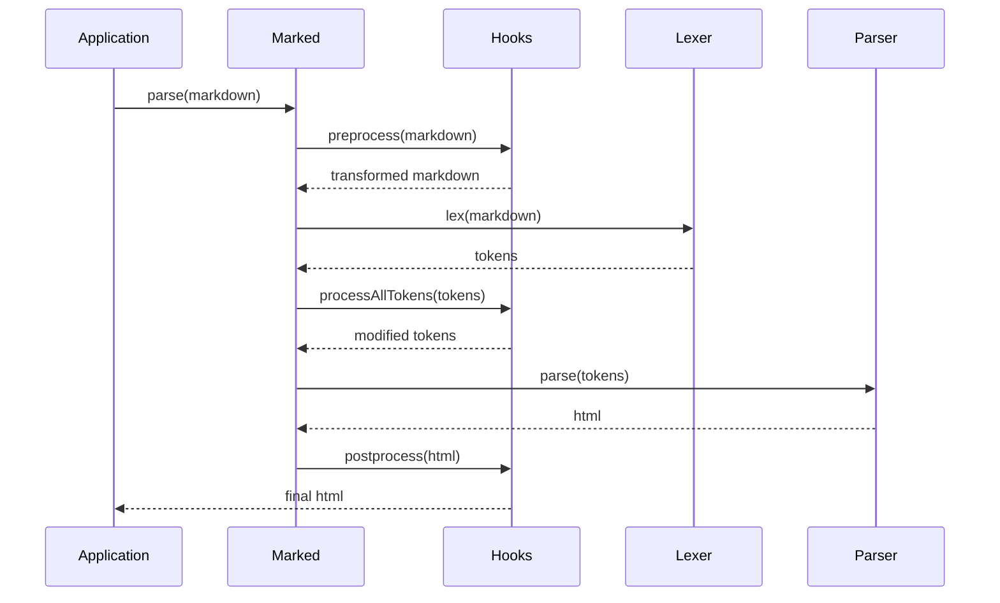
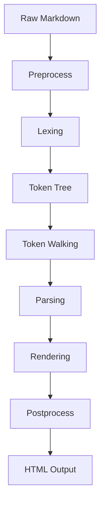

# Marked Components

The **Marked Components** module provides Markdown parsing and rendering capabilities within the MeshCentral web interface. It is built around the `marked` parser (v14.x) and is responsible for converting Markdown content into safe, structured HTML for display in the browser.

This module implements a full Markdown processing pipeline including:

- Tokenization (block and inline)
- Lexical analysis
- Abstract token tree generation
- Parsing into HTML
- Rendering via customizable renderer classes
- Extension and hook support

It is typically used wherever dynamic Markdown content needs to be rendered in the UI (documentation panels, notes, descriptions, or dynamic help content).

---

## Core Components

The module is implemented in `public/scripts/marked.js` and exposes the following primary classes:

- `Marked` – High-level API and orchestration layer
- `_Lexer` – Converts Markdown text into tokens
- `_Tokenizer` – Performs block-level and inline token detection
- `_Parser` – Converts tokens into HTML output
- `_Renderer` – Default HTML renderer implementation
- `_TextRenderer` – Plain-text renderer implementation
- `_Hooks` – Extension lifecycle hooks

Together, these classes form a modular Markdown processing engine.

---

## High-Level Architecture

The Markdown processing pipeline follows a structured, multi-stage architecture:

```mermaid
flowchart LR
    Input["Markdown Input String"] --> HooksPre["Preprocess Hooks"]
    HooksPre --> Lexer["Lexer"]
    Lexer --> Tokenizer["Tokenizer"]
    Tokenizer --> Tokens["Token Tree"]
    Tokens --> Walk["walkTokens Extension"]
    Walk --> Parser["Parser"]
    Parser --> Renderer["Renderer"]
    Renderer --> HooksPost["Postprocess Hooks"]
    HooksPost --> Output["HTML Output"]
```

### Stage Overview

1. **Preprocess Hooks** – Optional transformation before lexing.
2. **Lexer** – Splits the Markdown into block-level and inline tokens.
3. **Tokenizer** – Applies grammar rules (GFM, pedantic, breaks) to identify token types.
4. **Token Tree** – Structured representation of Markdown content.
5. **walkTokens** – Optional traversal hook for analysis or mutation.
6. **Parser** – Iterates through tokens and delegates rendering.
7. **Renderer** – Converts tokens into HTML elements.
8. **Postprocess Hooks** – Final HTML transformation.

---

## Component Responsibilities

### Marked (Facade and Orchestrator)

The `Marked` class is the public-facing API and coordinates the entire Markdown workflow.

Key responsibilities:

- Managing default options
- Registering extensions
- Executing parse and parseInline operations
- Handling async vs sync execution
- Coordinating hooks and token walking

The module also exposes a singleton-style instance via the exported `marked()` function for convenience.

---

### Lexer

The `_Lexer` performs block-level parsing and produces an ordered token list.

Responsibilities:

- Normalizing line endings
- Applying block grammar (normal, GFM, pedantic)
- Managing inline token queues
- Maintaining parsing state

Block token examples:

- heading
- paragraph
- list
- blockquote
- table
- code
- html

The Lexer delegates actual token recognition to the `_Tokenizer`.

---

### Tokenizer

The `_Tokenizer` applies grammar rules to detect token boundaries and extract structured information.

It supports:

- Block-level tokens (heading, list, table, etc.)
- Inline-level tokens (strong, em, link, image, code, etc.)
- GitHub Flavored Markdown extensions
- Task list detection
- Autolink parsing

The tokenizer is rule-driven and operates using compiled regular expressions.

---

### Parser

The `_Parser` converts tokens into HTML output.

Responsibilities:

- Iterating over token sequences
- Delegating rendering to `_Renderer`
- Supporting renderer extensions
- Handling inline and block rendering modes

The parser supports two primary entry points:

- `parse()` – Block-level Markdown
- `parseInline()` – Inline-only Markdown

---

### Renderer

The `_Renderer` class defines how each token type is transformed into HTML.

Examples:

- heading → `<h1>` through `<h6>`
- paragraph → `
`
- list → `<ul>` or `<ol>`
- code → `<pre><code>`
- strong → `<strong>`
- em → `<em>`

The renderer can be overridden via the extension system to customize HTML output.

---

### TextRenderer

The `_TextRenderer` provides a minimal implementation that extracts only textual content.

It is useful for:

- Generating previews
- Building search indexes
- Producing stripped text representations

---

### Hooks System

The `_Hooks` class allows interception at key lifecycle stages:

- preprocess(markdown)
- processAllTokens(tokens)
- postprocess(html)
- provideLexer()
- provideParser()

Hooks support both synchronous and asynchronous execution modes.

---

## Extension Architecture

The Marked Components module supports multiple extension mechanisms:

### 1. Renderer Extensions
Override or augment rendering behavior per token type.

### 2. Tokenizer Extensions
Add custom block or inline token recognition logic.

### 3. Child Token Definitions
Allow walkTokens to traverse nested token structures.

### 4. walkTokens
Apply a callback to every token for inspection or mutation.

Extension registration is handled via:

- `Marked.use()`
- `marked.use()`

Internally, extensions are merged into the defaults configuration and layered with fallback behavior.

---

## Processing Modes

The module supports configurable parsing behavior:

- **GFM Mode** – Enables GitHub Flavored Markdown features (tables, task lists, strikethrough)
- **Pedantic Mode** – Closer to original Markdown spec
- **Breaks Mode** – Converts line breaks into ` `
- **Async Mode** – Enables Promise-based parsing pipeline
- **Silent Mode** – Suppresses thrown errors and renders error HTML

Grammar selection dynamically adjusts rule sets in the Lexer.

---

## Error Handling Model

Errors are processed through `onError()`:

- In silent mode → Returns formatted error HTML
- In async mode → Rejects Promise
- Otherwise → Throws error

All errors append a diagnostic hint referencing the upstream marked project.

---

## Integration Within MeshCentral

The Marked Components module is a client-side utility module that integrates with the broader UI layer. It complements:

- UI components for displaying formatted content
- Chart and dashboard modules that may include Markdown descriptions
- Terminal or console modules where Markdown-formatted help text is rendered

It operates entirely in the browser and does not depend on server-side parsing.

---

## Data Flow Summary

The pipeline is deterministic and modular, allowing safe customization at multiple stages.

---

## Maintainability Considerations

- The file is generated from upstream marked sources.
- Direct modifications should be avoided.
- Extensions should be implemented using the public extension API.
- Renderer overrides are safer than modifying core parsing behavior.

Because this is a bundled UMD build, changes should originate from the upstream marked source tree rather than editing this file directly.

---

## Conclusion

The **Marked Components** module provides a robust, extensible Markdown processing engine for the MeshCentral frontend. Its layered architecture — Tokenizer → Lexer → Parser → Renderer — ensures clear separation of concerns, while the Hooks and Extension systems enable deep customization without modifying core logic.

This modular design allows the platform to safely render dynamic Markdown content while remaining flexible and maintainable.