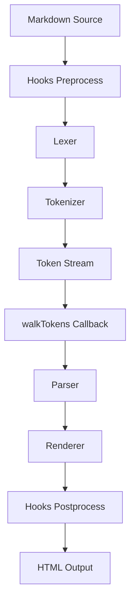
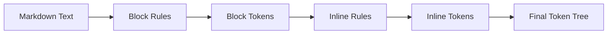
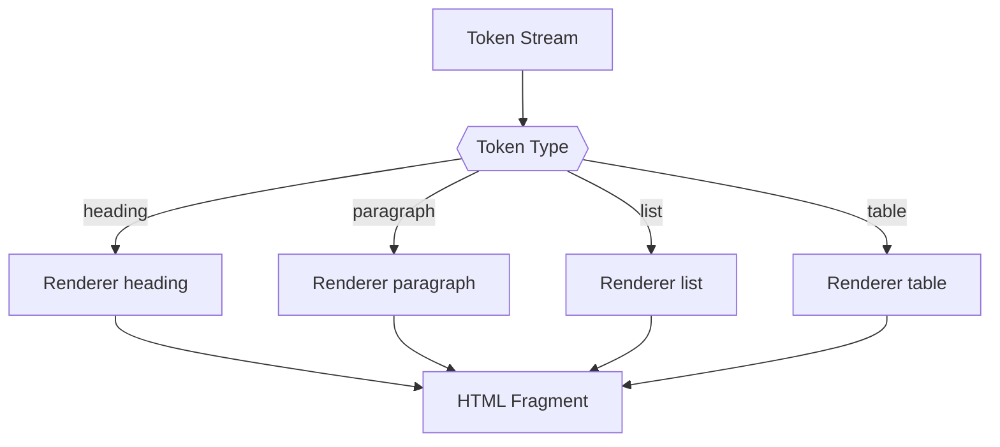
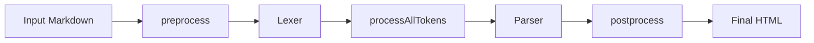
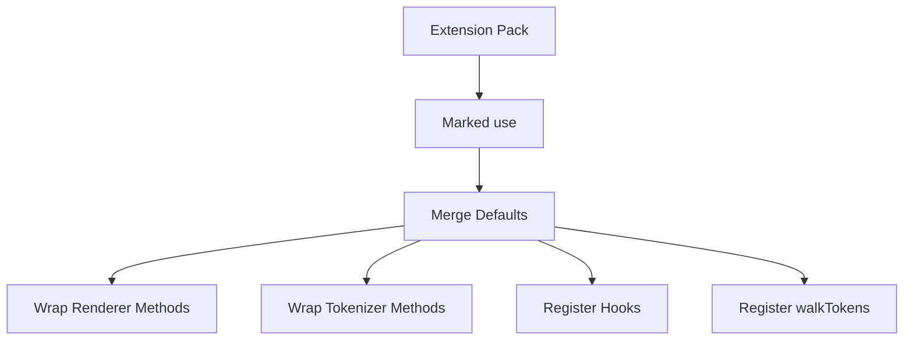
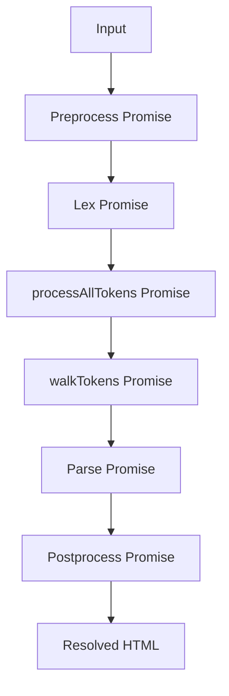
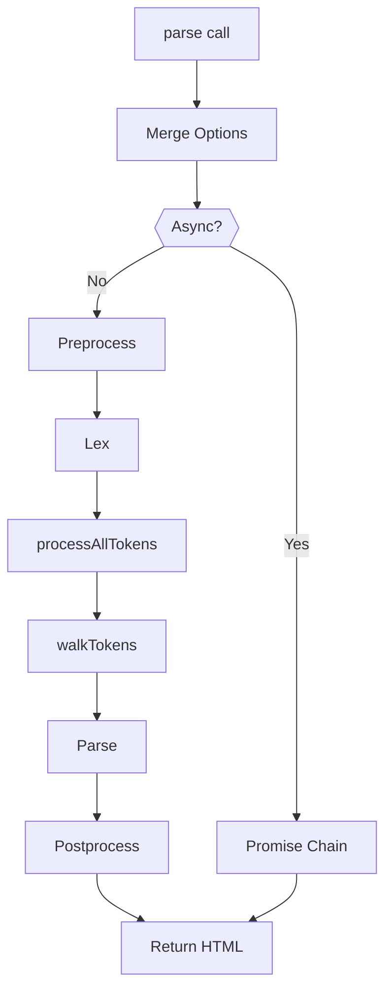

# Marked

The **Marked** module provides a full-featured Markdown parsing engine used within the MeshCentral web interface. It converts Markdown source into HTML through a multi-stage pipeline consisting of lexing, tokenization, parsing, and rendering.

This module is a bundled distribution of the Marked library (v14.x) and exposes extensibility points such as custom tokenizers, renderers, hooks, and token walkers. It supports synchronous and asynchronous parsing modes, GitHub Flavored Markdown (GFM), and extension-based customization.

---

## 1. Purpose and Responsibilities

The Marked module is responsible for:

- Converting Markdown text into HTML
- Providing inline-only parsing (no wrapping paragraph)
- Supporting GFM features (tables, task lists, strikethrough, autolinks)
- Allowing runtime extensions (renderer, tokenizer, hooks)
- Supporting token-level inspection and transformation
- Providing both synchronous and asynchronous parsing pipelines

It acts as a self-contained Markdown engine and does not depend on other UI modules directly.

---

## 2. High-Level Architecture

The Marked module is structured as a classic compiler pipeline:

### Core Stages

| Stage | Component | Responsibility |
|--------|------------|----------------|
| Preprocessing | _Hooks | Optional transformation before parsing |
| Lexing | _Lexer | Converts Markdown into block and inline tokens |
| Tokenizing | _Tokenizer | Applies grammar rules to recognize syntax |
| Parsing | _Parser | Converts tokens into HTML via renderer |
| Rendering | _Renderer | Generates HTML for each token type |
| Text Rendering | _TextRenderer | Produces plain-text representations |
| Postprocessing | _Hooks | Optional transformation of final HTML |

---

## 3. Core Components

### 3.1 Marked (Facade API)

The `Marked` class is the main orchestration layer and public interface.

Responsibilities:

- Stores global defaults
- Manages extensions via `use()`
- Exposes `parse()` and `parseInline()`
- Supports async and sync modes
- Coordinates hooks, lexer, parser, and walkTokens

### Public API Surface

- `parse(markdown, options)`
- `parseInline(markdown, options)`
- `lexer(src, options)`
- `parser(tokens, options)`
- `use(extensionPack)`
- `walkTokens(tokens, callback)`

---

### 3.2 _Lexer (Block and Inline Lexer)

The `_Lexer` performs two major tasks:

1. Block-level tokenization
2. Inline-level tokenization

It builds a structured token array representing the Markdown document.

The lexer supports three grammar modes:

- Normal
- GFM
- Pedantic

Grammar selection depends on options:

- `gfm`
- `breaks`
- `pedantic`

---

### 3.3 _Tokenizer (Syntax Recognition)

The `_Tokenizer` applies regular expression grammars to recognize Markdown constructs.

Supported block constructs include:

- Headings
- Code blocks
- Fenced code
- Lists
- Tables (GFM)
- Blockquotes
- HTML blocks

Supported inline constructs include:

- Emphasis and strong
- Inline code
- Links and images
- Autolinks
- Strikethrough (GFM)
- Line breaks

Each recognized construct becomes a structured token object.

---

### 3.4 _Parser (Token Compiler)

The `_Parser` transforms token arrays into HTML.

The parser:

- Iterates over tokens
- Dispatches by `token.type`
- Delegates output generation to the renderer
- Handles nested tokens recursively

---

### 3.5 _Renderer (HTML Generator)

The `_Renderer` defines how each token type converts into HTML.

Examples:

- `heading()` → `<h1>`–`<h6>`
- `paragraph()` → `
`
- `list()` → `<ul>` / `<ol>`
- `code()` → `<pre><code>`
- `table()` → `<table>`
- `link()` → `<a>`

Renderer methods may be overridden via extension packs.

---

### 3.6 _TextRenderer (Plain Text Renderer)

The `_TextRenderer` extracts textual content only.

Use cases:

- Accessibility
- Search indexing
- Plain-text export

It ignores formatting and returns raw textual values.

---

### 3.7 _Hooks (Lifecycle Hooks)

Hooks allow interception at multiple stages:

Available hooks:

- `preprocess(markdown)`
- `processAllTokens(tokens)`
- `postprocess(html)`
- `provideLexer()`
- `provideParser()`

Hooks can operate synchronously or asynchronously.

---

## 4. Extension System

The extension system allows runtime augmentation without modifying core logic.

### Extension Types

| Type | Purpose |
|------|----------|
| Renderer extension | Override HTML output |
| Tokenizer extension | Add new syntax |
| Hooks extension | Intercept lifecycle |
| walkTokens extension | Inspect/modify tokens |

### Extension Flow

Extensions can:

- Override behavior
- Fall back to previous implementations
- Inject new block or inline tokenizers
- Register child token traversal rules

---

## 5. Token Model

Tokens are structured objects with a `type` field and additional metadata.

Examples:

- `heading`
- `paragraph`
- `list`
- `list_item`
- `table`
- `code`
- `link`
- `image`
- `strong`
- `em`

Nested tokens contain a `tokens` property for recursive parsing.

---

## 6. Synchronous vs Asynchronous Parsing

Marked supports asynchronous parsing when:

- Extensions set `async: true`
- Hooks return Promises

### Async Pipeline

If async mode is active, `parse()` returns a Promise.

---

## 7. Configuration Options

Default options include:

- `gfm`
- `breaks`
- `pedantic`
- `renderer`
- `tokenizer`
- `hooks`
- `walkTokens`
- `async`
- `silent`

Options can be set globally via:

- `marked.setOptions(options)`

Or per-call:

- `marked.parse(src, options)`

---

## 8. Error Handling

Error behavior depends on:

- `silent`
- `async`

If `silent` is true:

- Returns formatted error HTML

If false:

- Throws (sync mode)
- Rejects Promise (async mode)

All errors include a reference message directing to the Marked project.

---

## 9. Internal Control Flow (End-to-End)

---

## 10. Integration Context

Within the MeshCentral UI, the Marked module is typically used to:

- Render Markdown documentation
- Display formatted text content
- Support dynamic content areas with Markdown input
- Enable plugin-driven content formatting

Because it is self-contained and UMD-wrapped, it can be used in:

- Browser environments
- AMD environments
- CommonJS environments

---

# Summary

The **Marked** module implements a complete Markdown-to-HTML compilation pipeline with:

- Clear separation of lexing, parsing, and rendering
- Highly extensible architecture
- Async support
- Token walking and inspection capabilities
- Multiple grammar modes

It serves as a robust Markdown engine within the MeshCentral frontend, enabling flexible and extensible content rendering while maintaining strong separation between syntax recognition and HTML generation.