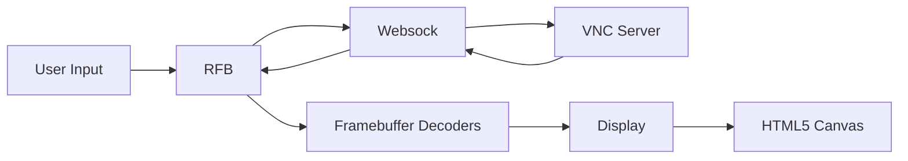
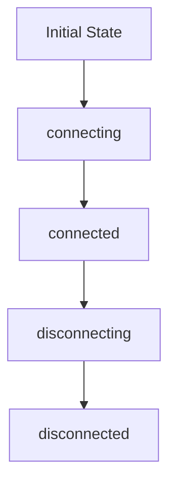
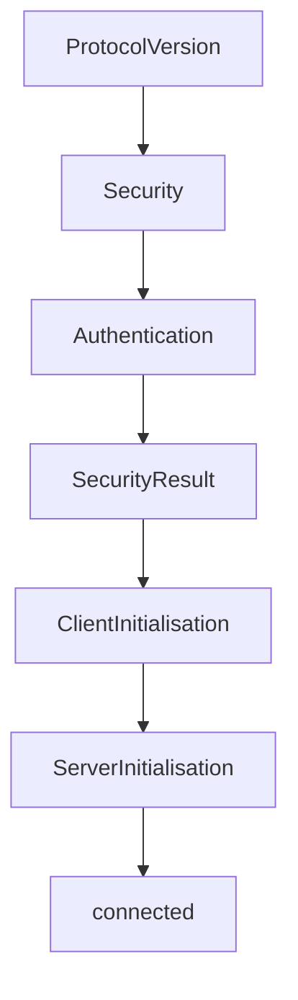
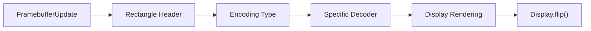
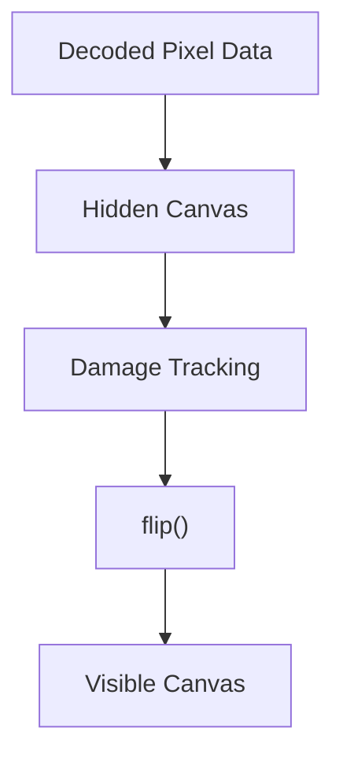
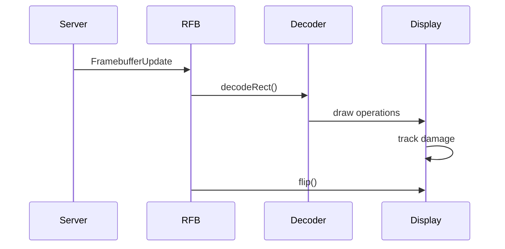

# Rfb And Display

The **Rfb And Display** module is the core of MeshCentral’s browser-based remote desktop functionality. It implements a full **RFB (Remote Framebuffer)** client (the protocol used by VNC) and renders the remote desktop to an HTML5 `<canvas>` element.

This module is built around two primary classes:

- `meshcentral.public.novnc.core.rfb.RFB`
- `meshcentral.public.novnc.core.display.Display`

Together, they:

- Establish and manage the RFB protocol connection over WebSockets
- Negotiate authentication and security schemes
- Decode framebuffer updates using multiple encoding algorithms
- Render remote graphics efficiently to a browser canvas
- Capture and forward keyboard, mouse, and gesture input
- Manage clipboard, cursor, and desktop resizing extensions

---

## 1. Architectural Overview

At a high level, the Rfb And Display module sits between the network transport layer and the rendering/input layers.



### Key Responsibilities

| Layer | Responsibility |
|--------|---------------|
| RFB | Protocol state machine, authentication, message parsing |
| Websock | WebSocket transport abstraction |
| Decoders | Decode framebuffer rectangles (Raw, Tight, ZRLE, etc.) |
| Display | Render decoded pixel data to canvas efficiently |
| Input Handlers | Capture keyboard, mouse, wheel, and gestures |

---

## 2. Core Components

### 2.1 RFB

**Class:** `meshcentral.public.novnc.core.rfb.RFB`  
**Role:** Complete RFB protocol implementation and session controller.

The RFB class:

- Manages connection lifecycle (`connecting → connected → disconnecting → disconnected`)
- Implements protocol negotiation and security handshakes
- Handles framebuffer update parsing and dispatching
- Sends keyboard and mouse events
- Coordinates clipboard and cursor extensions
- Orchestrates decoders and rendering

#### 2.1.1 Connection State Machine



Each transition triggers specific setup or teardown logic:

- `connecting` → Creates DOM elements, attaches canvas, opens socket
- `connected` → Begins framebuffer updates and input capture
- `disconnecting` → Cleans up listeners and closes transport
- `disconnected` → Final terminal state

---

#### 2.1.2 Protocol Initialization Phases

The RFB handshake follows strict protocol stages:



Supported security types include:

- None
- VNC Authentication (DES challenge-response)
- VeNCrypt (Plain subtype)
- Tight authentication
- Apple Remote Desktop (DH + AES)
- RA2ne (RSA-AES secure negotiation)
- MSLogonII

The module integrates with crypto components (AES, DES, DH, RSA) via the crypto subsystem.

---

#### 2.1.3 Framebuffer Update Pipeline

When the server sends graphical updates:



Supported encodings:

- Raw
- CopyRect
- RRE
- Hextile
- Tight
- TightPNG
- ZRLE
- JPEG

The RFB class selects a decoder from an internal map and invokes:

```text
decoder.decodeRect(x, y, width, height, sock, display, depth)
```

Decoded pixel data is rendered via the `Display` class.

---

#### 2.1.4 Input Event Handling

RFB captures and translates:

- Keyboard events (including QEMU extended key events)
- Mouse movement and button events
- Wheel scrolling
- Multi-touch gestures

Mouse events are throttled (`MOUSE_MOVE_DELAY`) to prevent network flooding.

Keyboard synchronization includes automatic correction for:

- Caps Lock
- Num Lock

Translated input is sent using RFB message builders such as:

- `RFB.messages.keyEvent()`
- `RFB.messages.pointerEvent()`

---

#### 2.1.5 Extensions and Capabilities

The module supports advanced protocol features:

- Extended Desktop Size (dynamic resizing)
- Continuous Updates
- Fence synchronization
- Extended Clipboard (compressed zlib streams)
- VMware and standard cursor encodings
- XVP power operations (shutdown, reboot, reset)

These are enabled via pseudo-encodings negotiated during connection.

---

### 2.2 Display

**Class:** `meshcentral.public.novnc.core.display.Display`  
**Role:** High-performance canvas rendering engine.

The Display class abstracts drawing operations and manages:

- Backbuffer canvas (off-screen rendering)
- Visible viewport canvas
- Dirty region tracking
- Render queue ordering
- Scaling and clipping

---

#### 2.2.1 Rendering Architecture



Key ideas:

- All drawing happens on a hidden backbuffer
- Only damaged regions are copied to the visible canvas
- Rendering operations are queued to preserve order

---

#### 2.2.2 Render Queue System

Display maintains `_renderQ` to ensure in-order rendering, especially when images load asynchronously.

Queue action types include:

- `fill`
- `copy`
- `blit`
- `img`
- `flip`

When queue becomes empty, pending promises from `flush()` are resolved.

---

#### 2.2.3 Viewport and Scaling

Display supports:

- Viewport clipping
- Scroll-based viewport movement
- Autoscaling to container size
- Coordinate transformation (`absX`, `absY`)

Scaling adjusts CSS dimensions instead of canvas dimensions to avoid clearing content.

---

#### 2.2.4 Drawing Operations

Core drawing methods:

- `fillRect()` – Fill region with RGB color
- `copyImage()` – Copy region within canvas
- `blitImage()` – Write raw RGBA data
- `imageRect()` – Draw encoded image (base64)
- `drawImage()` – Draw HTML image element
- `flip()` – Commit damaged region to visible canvas

The class also exposes export capabilities:

- `getImageData()`
- `toDataURL()`
- `toBlob()`

---

## 3. Interaction Between RFB and Display



RFB never draws directly. Instead:

1. It parses protocol messages.
2. Delegates decoding to the correct decoder.
3. Decoders call Display drawing methods.
4. Display batches and renders changes efficiently.

This separation ensures:

- Protocol logic remains isolated
- Rendering is optimized and centralized
- Encodings can evolve independently

---

## 4. Performance Strategies

The Rfb And Display module uses multiple optimizations:

- Damage-based redraw (no full-canvas refresh)
- Deferred flushing via promises
- Mouse movement throttling
- Zlib compression for clipboard
- Multiple encoding preference ordering
- CSS-based scaling instead of canvas resize
- Render queue ordering for asynchronous images

These are critical for high-latency or low-bandwidth environments.

---

## 5. Security Integration

The module integrates tightly with the crypto subsystem:

- DES for classic VNC authentication
- AES for ARD and modern schemes
- Diffie-Hellman for key exchange
- RSA-AES hybrid negotiation (RA2ne)
- Secure context enforcement (`window.isSecureContext`)

Authentication failures trigger `securityfailure` events for UI handling.

---

## 6. Event Model

RFB extends `EventTargetMixin`, dispatching events such as:

- `connect`
- `disconnect`
- `securityfailure`
- `credentialsrequired`
- `desktopname`
- `clipboard`
- `bell`
- `capabilities`

This makes the module UI-agnostic and easily integrable into higher-level components.

---

## 7. Summary

The **Rfb And Display** module provides a complete, production-grade browser VNC client implementation.

It combines:

- A robust RFB protocol state machine
- Multi-scheme authentication
- Efficient framebuffer decoding
- High-performance canvas rendering
- Full input and clipboard support
- Advanced protocol extensions

By cleanly separating protocol logic (RFB) from rendering logic (Display), the module remains maintainable, extensible, and performant across a wide range of remote desktop scenarios.