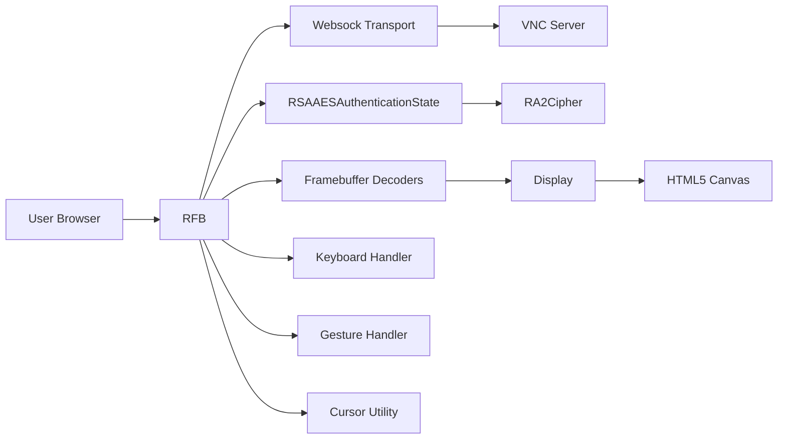
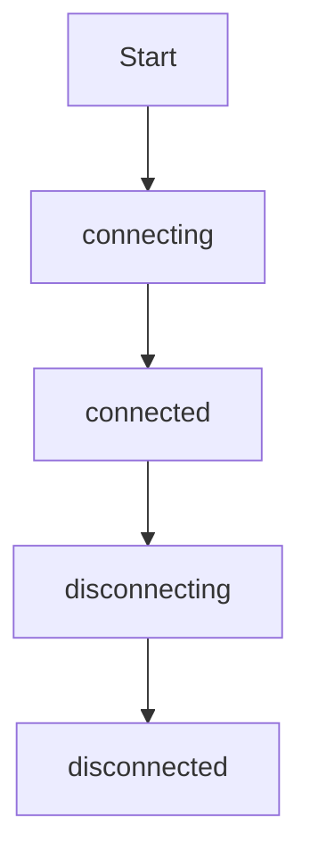
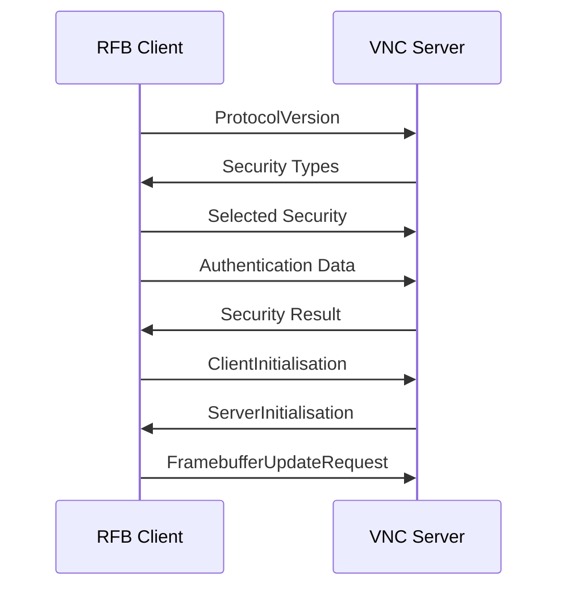
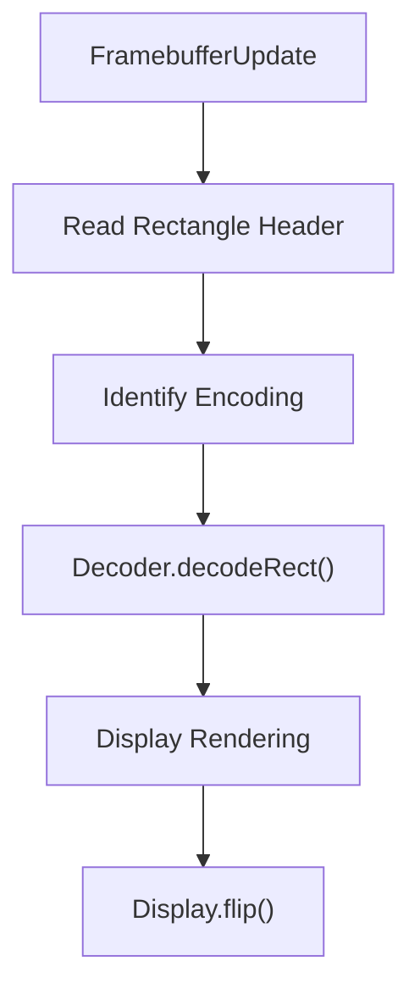
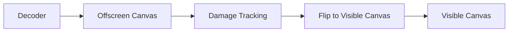
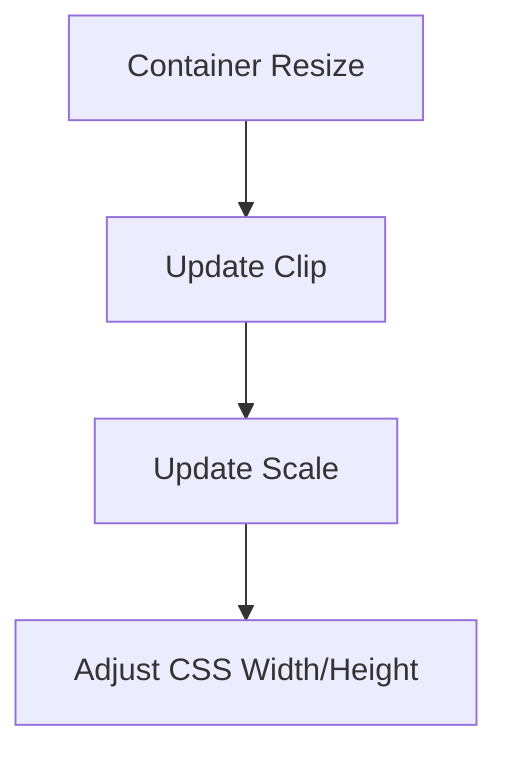
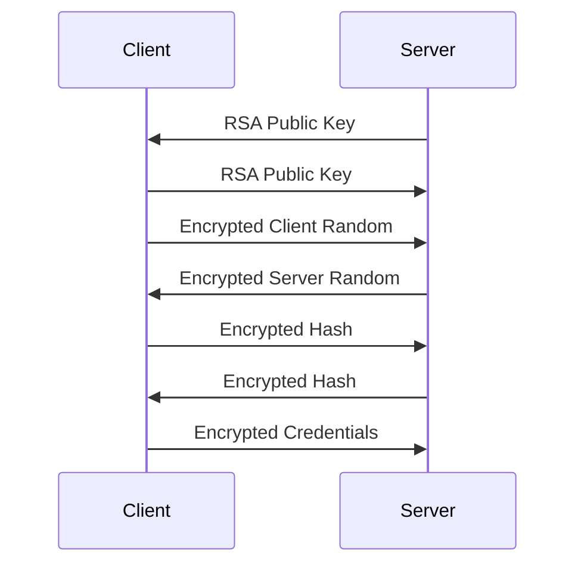

# Rfb And Display

The **Rfb And Display** module implements the full Remote Framebuffer (RFB) client stack used by MeshCentral’s embedded noVNC client. It is responsible for:

- Establishing and managing the RFB protocol connection
- Negotiating authentication and security schemes (including RSA-AES RA2)
- Decoding framebuffer updates using multiple encoding strategies
- Rendering remote desktop pixels to an HTML5 canvas
- Handling keyboard, mouse, gesture, clipboard, and cursor interactions

At its core, this module binds together networking, cryptography, decoding, and rendering into a single cohesive remote desktop client runtime.

---

## Core Components

The Rfb And Display module consists of three primary classes:

- `RFB` — Main protocol engine and connection manager  
- `Display` — Canvas-based framebuffer renderer  
- `RSAAESAuthenticationState` and `RA2Cipher` — RSA-AES (RA2) authentication implementation

These components integrate with supporting modules such as WebSocket transport, input handlers, decoders, compression utilities, and cryptographic primitives defined elsewhere in the system.

---

## Architectural Overview

### Responsibility Layers

| Layer | Responsibility |
|--------|----------------|
| Transport | WebSocket / RTC data channel communication |
| Protocol | RFB state machine and message negotiation |
| Security | Authentication (None, VNCAuth, RA2, VeNCrypt, etc.) |
| Encoding | Framebuffer decoding (Raw, Tight, ZRLE, etc.) |
| Rendering | Canvas drawing, scaling, viewport clipping |
| Input | Mouse, keyboard, gesture handling |

---

# RFB Class

`meshcentral.public.novnc.core.rfb.RFB`

The `RFB` class is the central protocol engine. It manages the entire lifecycle of a remote desktop session.

## Key Responsibilities

### 1. Connection State Machine

The RFB connection transitions through strict states:

- `connecting`
- `connected`
- `disconnecting`
- `disconnected`

State transitions are validated to prevent invalid protocol behavior.

---

### 2. Protocol Negotiation Flow

The RFB initialization follows the standard VNC handshake:

Supported authentication schemes include:

- None
- VNCAuth (DES challenge-response)
- RA2 (RSA + AES-EAX)
- VeNCrypt
- Tight authentication
- MSLogonII
- ARD (Apple Remote Desktop)

The selected scheme determines which negotiation method is executed.

---

### 3. Framebuffer Processing

When connected, the RFB instance continuously processes server messages.

Framebuffer updates:

1. Receive rectangle header
2. Identify encoding
3. Dispatch to decoder
4. Render to `Display`
5. Flip updated region to visible canvas

Supported encodings include:

- Raw
- CopyRect
- RRE
- Hextile
- Tight
- TightPNG
- ZRLE
- JPEG

Pseudo-encodings handle cursor updates, clipboard, desktop resizing, extended features, and power controls.

---

### 4. Input Handling

The RFB class integrates:

- Keyboard events → `keyEvent` / `QEMUExtendedKeyEvent`
- Mouse events → `pointerEvent`
- Wheel events → translated into button mask steps
- Touch gestures → tap, drag, pinch-to-zoom

All pointer coordinates are converted through the `Display` scaling and viewport system before being transmitted.

---

### 5. Clipboard Integration

Supports both:

- Classic `ServerCutText`
- Extended clipboard pseudo-encoding

Extended clipboard supports:

- Capability negotiation
- Format flags
- Action flags (Notify, Request, Provide, Caps)
- Zlib compression for payload transport

---

# Display Class

`meshcentral.public.novnc.core.display.Display`

The `Display` class manages all framebuffer rendering using an off-screen backbuffer and a visible HTML5 canvas.

## Rendering Architecture

### Key Concepts

#### 1. Backbuffer Rendering

All drawing operations occur on a hidden canvas (`_backbuffer`).
This prevents flicker and ensures ordered rendering.

#### 2. Render Queue

Drawing actions are queued when asynchronous operations (such as image decoding) are involved.

Types of queued operations:

- `fill`
- `copy`
- `blit`
- `img`
- `flip`

The queue ensures in-order rendering and guarantees frame consistency.

---

#### 3. Damage Tracking

The display tracks modified regions using bounding coordinates:

- `left`
- `top`
- `right`
- `bottom`

Only damaged regions are copied to the visible canvas during `flip()`.

---

#### 4. Viewport & Scaling

The display supports:

- Viewport clipping
- Viewport dragging
- Autoscaling
- Explicit scaling factor

Autoscaling preserves aspect ratio by comparing framebuffer and container dimensions.

---

# RA2 Authentication

`meshcentral.public.novnc.core.ra2.RSAAESAuthenticationState`

RA2 (RSA-AES) is a modern secure authentication scheme combining:

- RSA key exchange
- AES-EAX encrypted messages
- SHA-1 key derivation

## Authentication Flow

### Session Key Derivation

1. Client and server exchange 16-byte random values
2. Two 32-byte buffers are constructed
3. SHA-1 digest is applied
4. First 16 bytes are used as AES session keys

Separate client and server ciphers are established.

---

# RA2Cipher

`meshcentral.public.novnc.core.ra2.RA2Cipher`

A thin wrapper over AES-EAX providing:

- Authenticated encryption
- Counter-based IV handling
- Length-prefixed additional authenticated data

Each message:

- Prefixes 2-byte length
- Encrypts with AES-EAX
- Appends 16-byte authentication tag
- Increments internal counter

---

# Cursor Management

Cursor updates use pseudo-encodings:

- VMware cursor format
- Standard cursor format

The RFB class converts pixel data into RGBA format and forwards it to the `Cursor` utility.

A fallback “dot cursor” may be displayed when the server provides a fully transparent cursor.

---

# Desktop Resizing

Supports:

- Server-driven resize
- Client-requested resize (ExtendedDesktopSize)
- Continuous updates

When enabled:

- The browser viewport size is observed
- Resize requests are rate-limited
- The server may accept or reject the resize

---

# Power and Extended Capabilities

If supported by the server (XVP extension):

- Shutdown
- Reboot
- Reset

Capabilities are dynamically detected and exposed via events.

---

# Event Model

The Rfb And Display module emits DOM-style events:

- `connect`
- `disconnect`
- `desktopname`
- `clipboard`
- `bell`
- `securityfailure`
- `credentialsrequired`
- `serververification`
- `capabilities`

This allows integration with UI layers without coupling protocol logic to interface components.

---

# Integration With Other Modules

The Rfb And Display module integrates with:

- WebSocket transport layer
- Input handlers (keyboard, gestures)
- Cryptographic utilities
- Framebuffer decoders
- Compression utilities (Deflator, Inflator)
- Cursor utility

It acts as the orchestrator that binds these pieces into a working remote desktop client.

---

# Summary

The **Rfb And Display** module provides a complete, browser-based VNC client implementation featuring:

- Full RFB protocol negotiation
- Multiple security schemes including RSA-AES
- Efficient framebuffer decoding
- Optimized canvas rendering with damage tracking
- Advanced input handling
- Clipboard synchronization
- Dynamic resizing and scaling

It represents the core remote desktop engine powering MeshCentral’s in-browser terminal and desktop capabilities.