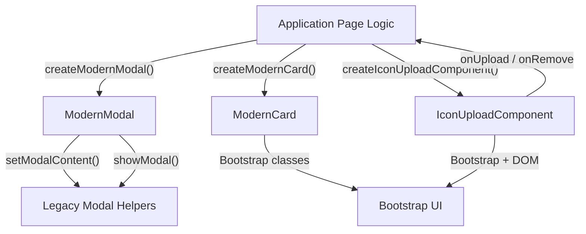
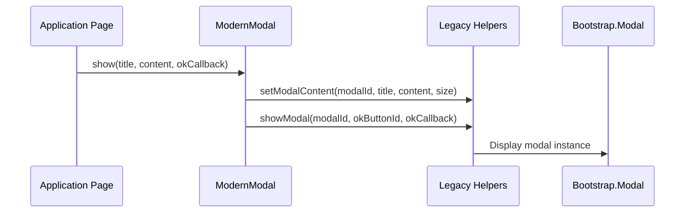
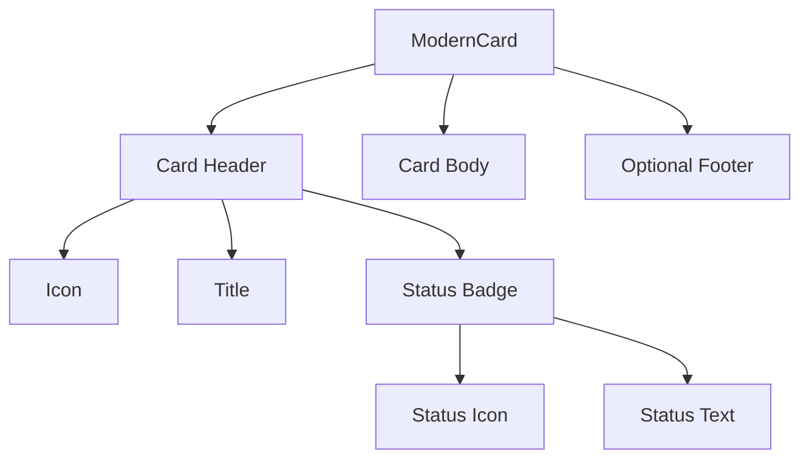
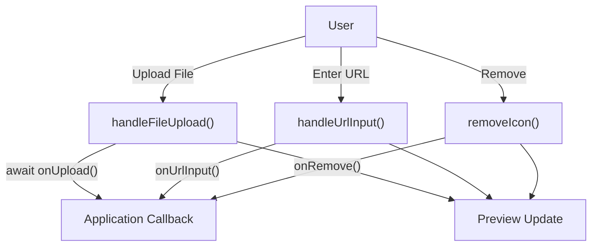
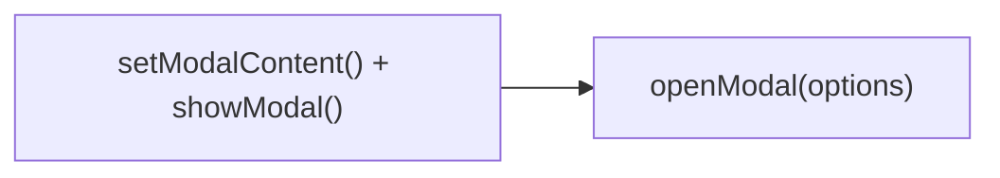
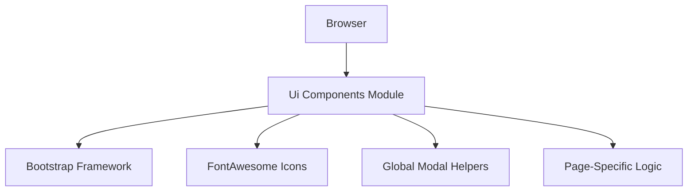
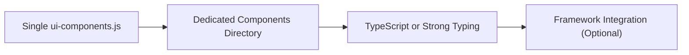

# Ui Components

The **Ui Components** module provides reusable, modernized front-end building blocks for the MeshCentral web interface. It centralizes common UI patterns such as modals, cards, and icon uploads into structured, composable JavaScript classes.

The primary goals of this module are:

- Reduce duplication in template files (notably modal logic in `default3.handlebars`)
- Standardize UI behaviors across the application
- Encapsulate DOM manipulation behind reusable abstractions
- Improve maintainability and extensibility of the front-end layer

At its core, the module defines three main components:

- `ModernModal`
- `ModernCard`
- `IconUploadComponent`

It also provides helper factory functions to simplify instantiation and migration from legacy modal usage.

---

## 1. Architectural Overview

The Ui Components module acts as a thin abstraction layer above Bootstrap and existing global helpers (`setModalContent`, `showModal`). It does not replace the rendering system but standardizes interaction patterns.



### Key Characteristics

- **Encapsulation**: Each component manages its own DOM generation and updates.
- **Extensibility**: Options objects allow behavior customization without modifying internal code.
- **Migration-friendly**: The `openModal()` helper reduces legacy modal invocation patterns.

---

## 2. ModernModal

### Purpose

`ModernModal` standardizes modal dialog creation and display while leveraging existing global helpers. It reduces repetitive `setModalContent()` + `showModal()` usage patterns into a single structured call.

### Constructor

```javascript
new ModernModal(modalId, options)
```

**Options:**

- `size`: `medium`, `large`, or `extra-large`
- `showCloseButton`: boolean
- `backdrop`: boolean
- `keyboard`: boolean

### Show Flow



### Responsibilities

- Determines Bootstrap size class (`modal-lg`, `modal-xl`)
- Injects header, body, and footer structure
- Optionally binds OK callback
- Delegates rendering and lifecycle to Bootstrap

### Hide Logic

The `hide()` method retrieves the Bootstrap modal instance and invokes `modal.hide()` safely.

---

## 3. ModernCard

### Purpose

`ModernCard` provides a reusable card UI pattern with:

- Status visualization
- Icon support
- Dynamic content injection
- Optional action buttons

### Rendering Structure



### Status System

Supported statuses:

- `default`
- `success`
- `warning`
- `danger`

Each status maps to:

- Border class
- Text color class
- FontAwesome icon

### Dynamic Updates

`updateStatus(status)`:

- Removes existing border and color classes
- Applies new classes
- Updates icon and text
- Avoids full re-render

This ensures lightweight UI updates without DOM reconstruction.

---

## 4. IconUploadComponent

### Purpose

`IconUploadComponent` abstracts icon selection logic including:

- Manual URL input
- File upload
- Live preview
- Remove/reset functionality
- Asynchronous upload callbacks

Unlike other components, it separates UI ownership from persistence logic.

### High-Level Interaction Flow



### Component Responsibilities

- Generates full input + preview HTML
- Registers instance in `window.iconUploadComponents`
- Manages loading, success, and error button states
- Updates preview dynamically
- Delegates storage to provided callbacks

### Callback Design

The component accepts:

- `onUpload(iconKey, file)` → async
- `onUrlInput(iconKey, value)`
- `onRemove(iconKey)`
- `normalizePreviewUrl(value)`

This inversion-of-control pattern keeps it reusable across different pages.

---

## 5. Utility Functions

To simplify usage and migration, helper functions are provided:

```javascript
createModernModal(modalId, options)
createModernCard(container, options)
createIconUploadComponent(iconKey, container, options)
openModal(options)
```

### openModal Helper

`openModal()` reduces legacy modal patterns into a single call:



It internally delegates to:

- `setModalContent()`
- `showModal()`

This provides backward compatibility while enabling gradual migration.

---

## 6. Design Patterns Used

### 1. Factory Pattern

Helper functions encapsulate object creation.

### 2. Options Object Pattern

Each component merges defaults with user-supplied configuration.

### 3. Inversion of Control

IconUploadComponent delegates business logic to injected callbacks.

### 4. Progressive Migration Strategy

The module allows incremental refactoring of existing UI code without breaking legacy behavior.

---

## 7. Integration Within the Front-End Stack

Ui Components sits within the browser layer and interacts with:

- Bootstrap (styling + modal lifecycle)
- FontAwesome (icons)
- Legacy global modal helpers
- Page-specific logic scripts



It does not directly depend on back-end modules, but it can trigger application-level actions through callback injection.

---

## 8. Extensibility Strategy

The file is structured to allow:

- Migration to one-component-per-file organization
- Additional reusable UI primitives
- Replacement of legacy modal helpers in the future
- Gradual decoupling from global window state

Potential evolution path:



---

# Summary

The **Ui Components** module modernizes MeshCentral's UI layer by:

- Consolidating repetitive UI logic
- Standardizing modal and card behaviors
- Providing reusable, callback-driven upload controls
- Supporting incremental refactoring

It serves as a foundational abstraction layer that improves consistency, reduces duplication, and prepares the front-end for future modularization and scalability.