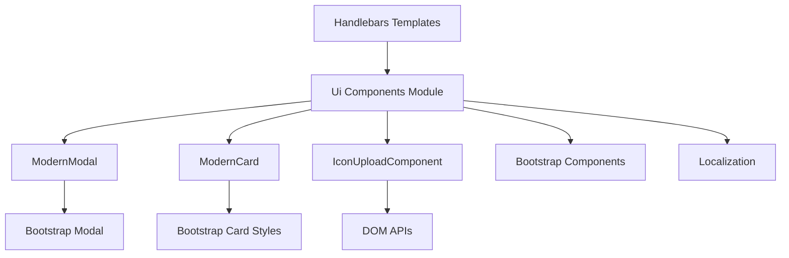
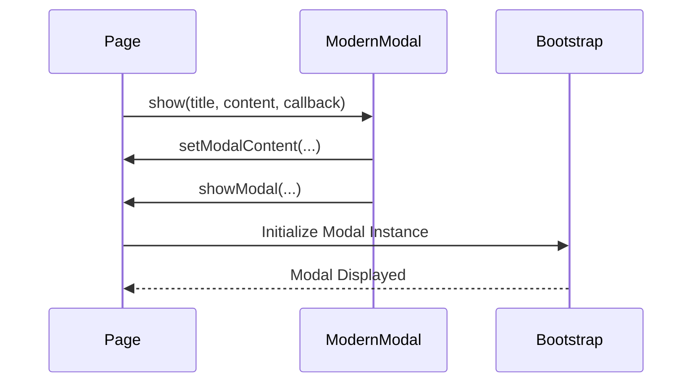
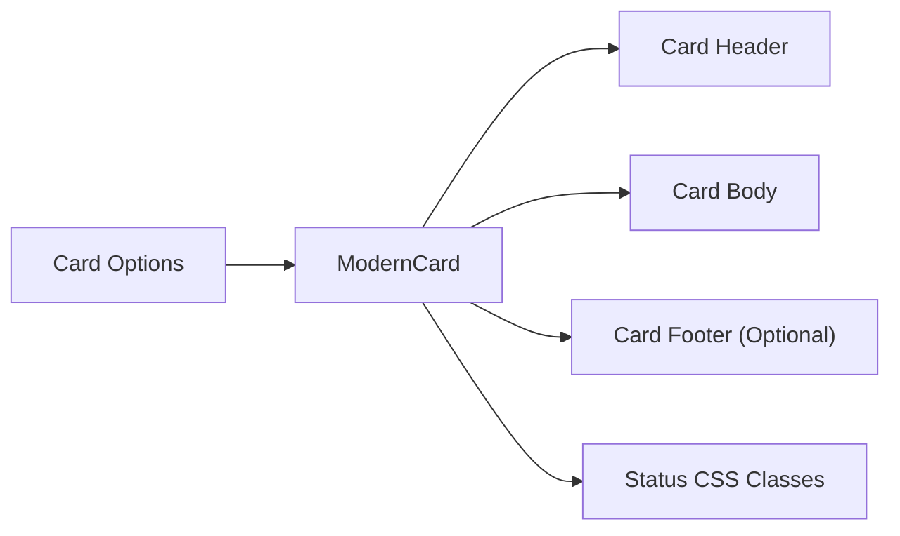
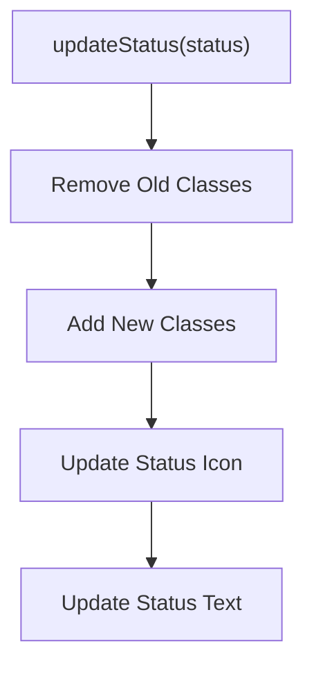
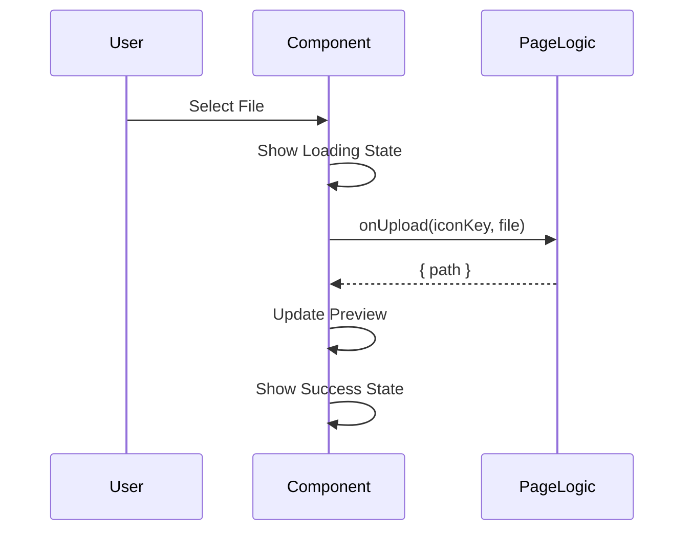
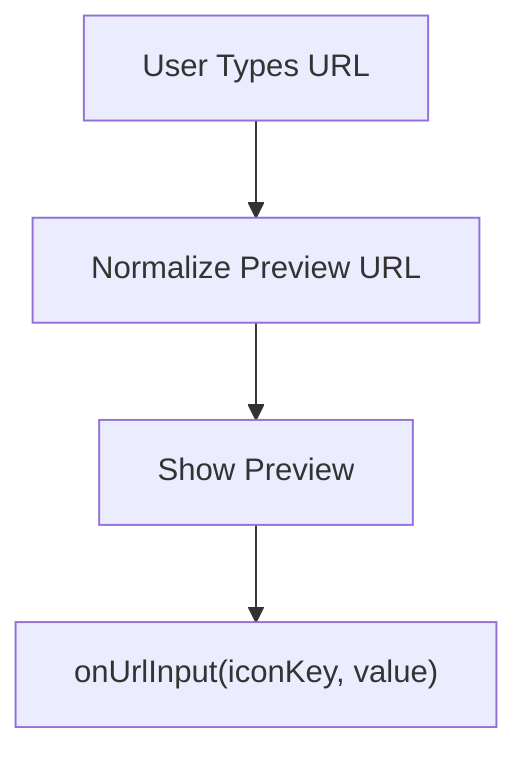

# Ui Components

The **Ui Components** module provides reusable, client-side user interface building blocks for the MeshCentral web application. It centralizes modal dialogs, cards, and icon upload workflows into standardized JavaScript classes, reducing duplication and improving consistency across templates such as `default3.handlebars`.

This module plays a critical role in:
- Standardizing modal invocation patterns
- Providing status-aware card components
- Encapsulating icon upload and preview logic
- Reducing template-level duplication and inline scripting

At a system level, Ui Components sits above foundational UI and utility modules such as Bootstrap integrations, localization, and browser-level APIs.

---

## Architectural Overview

The Ui Components module exposes three primary classes:

- **ModernModal** – Standardized modal dialog abstraction
- **ModernCard** – Status-aware card component
- **IconUploadComponent** – Reusable icon upload + preview component

It also provides factory helpers:

- `createModernModal()`
- `createModernCard()`
- `createIconUploadComponent()`
- `openModal()` (migration helper for legacy modal usage)

### High-Level Architecture



**Related Modules:**
- [Bootstrap Components](bootstrap-components/bootstrap-components.md)
- [Localization](localization/localization.md)

---

## Design Goals

### 1. Reduce Template Duplication

The legacy UI relied heavily on repeated patterns such as:

- `setModalContent(...)`
- `showModal(...)`

By encapsulating modal logic in `ModernModal` and `openModal()`, repeated modal setup can be reduced to a single standardized call.

### 2. Standardize Interaction Patterns

All reusable UI elements:

- Encapsulate their DOM generation
- Maintain consistent CSS usage
- Expose minimal, predictable APIs
- Avoid business logic coupling

### 3. Isolate UI State from Page Logic

Ui Components own rendering and visual state transitions, while:

- Persistence
- API calls
- Server communication

remain outside the component layer.

---

# Core Components

## ModernModal

The **ModernModal** class standardizes Bootstrap modal usage across the application.

### Responsibilities

- Construct modal markup dynamically
- Inject header, body, footer
- Support size variants
- Handle optional OK callback wiring
- Provide programmatic hide control

### Configuration Options

```text
size: "medium" | "large" | "extra-large"
showCloseButton: boolean
backdrop: boolean
keyboard: boolean
```

### Modal Flow



### Key Methods

- `show(title, content, okCallback, okButtonText)`
- `hide()`

### Migration Helper: openModal

The `openModal()` function provides a backward-compatible abstraction for legacy modal invocation.

```text
openModal({
  modalId,
  title,
  body,
  size,
  okButtonId,
  onOk
})
```

This enables incremental migration away from repeated modal boilerplate.

---

## ModernCard

The **ModernCard** component renders status-aware cards with optional action buttons.

### Responsibilities

- Render consistent card structure
- Apply status-based styling
- Support icon + title header
- Provide dynamic status updates
- Attach configurable footer actions

### Status Model

Supported statuses:

- `default`
- `success`
- `warning`
- `danger`

Each status controls:

- Border color
- Status icon
- Text color

### Card Rendering Architecture



### Runtime Status Update



### Key Methods

- `render()`
- `updateStatus(status)`

---

## IconUploadComponent

The **IconUploadComponent** encapsulates:

- URL-based icon input
- File-based upload
- Preview rendering
- Removal/reset handling

It is reusable across any page requiring icon configuration.

### Separation of Concerns

The component owns:

- Input rendering
- Preview state
- Button states (loading, success, error)

The page logic owns:

- Upload persistence
- Server communication
- Validation

### Upload Flow



### URL Input Flow



### Global Registry Pattern

The component stores instances in:

```text
window.iconUploadComponents[iconKey]
```

This allows inline HTML event bindings to reference instance methods safely.

### Key Methods

- `render()`
- `triggerFileUpload()`
- `handleUrlInput(input)`
- `handleFileUpload(input)`
- `removeIcon()`

---

# Interaction with Other Modules

## Bootstrap Components

Ui Components rely heavily on:

- Bootstrap modal infrastructure
- Button styling
- Card layout utilities
- Spinner/loading indicators

See: [Bootstrap Components](bootstrap-components/bootstrap-components.md)

---

## Localization

Text labels such as modal titles, button labels, and status strings can integrate with the localization system.

See: [Localization](localization/localization.md)

---

# System Placement

Ui Components operate purely on the client side and do not directly interact with:

- Cryptography
- RFB rendering
- WebSocket communication
- Clipboard redirection

Those responsibilities belong to modules such as:

- [Crypto Components](crypto-components/crypto-components.md)
- [Rfb And Display](rfb-and-display/rfb-and-display.md)
- [Websock](websock/websock.md)
- [Cliprdr](cliprdr/cliprdr.md)

Ui Components may wrap or visually represent the state of those systems, but never implement their logic.

---

# Extension Strategy

The file is intentionally structured to allow:

- Gradual migration toward one-component-per-file
- Expansion into a dedicated components directory
- Continued reduction of template duplication

Future candidates for inclusion:

- Standardized form components
- Toast abstraction layer
- Reusable confirmation dialogs

---

# Summary

The **Ui Components** module provides a lightweight, structured abstraction over common UI patterns in the MeshCentral web interface. By encapsulating modal logic, card rendering, and icon upload workflows, it:

- Reduces code duplication
- Improves consistency
- Centralizes UI behavior
- Simplifies template maintenance

It serves as a reusable presentation layer that complements foundational modules like Bootstrap Components and Localization while remaining independent from lower-level communication, cryptographic, and rendering subsystems.