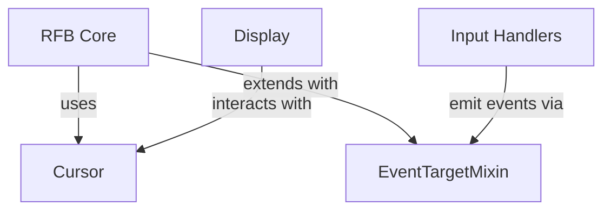
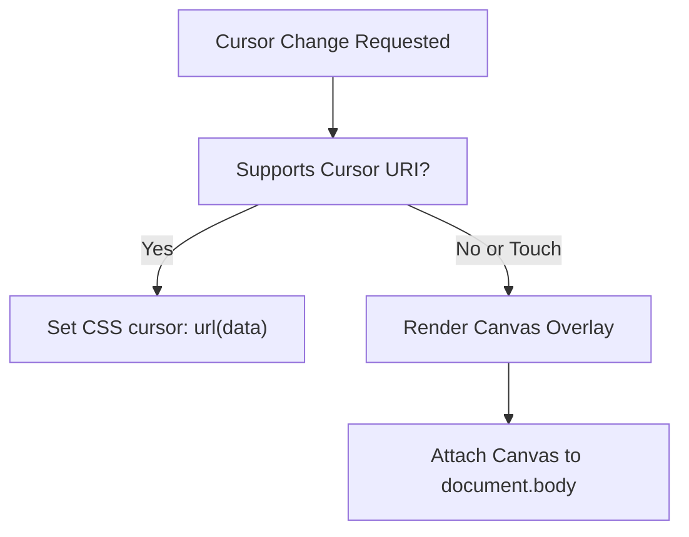
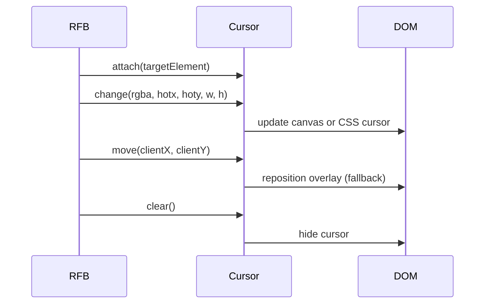
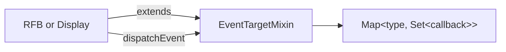
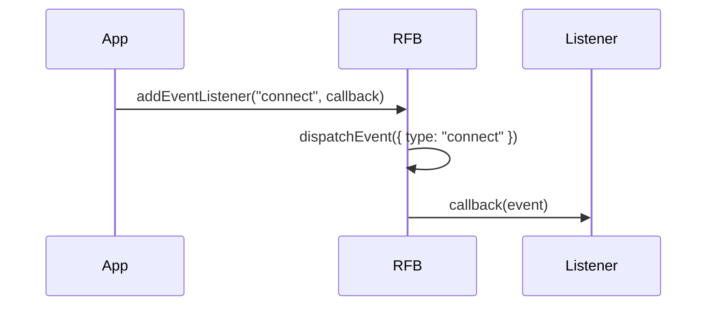
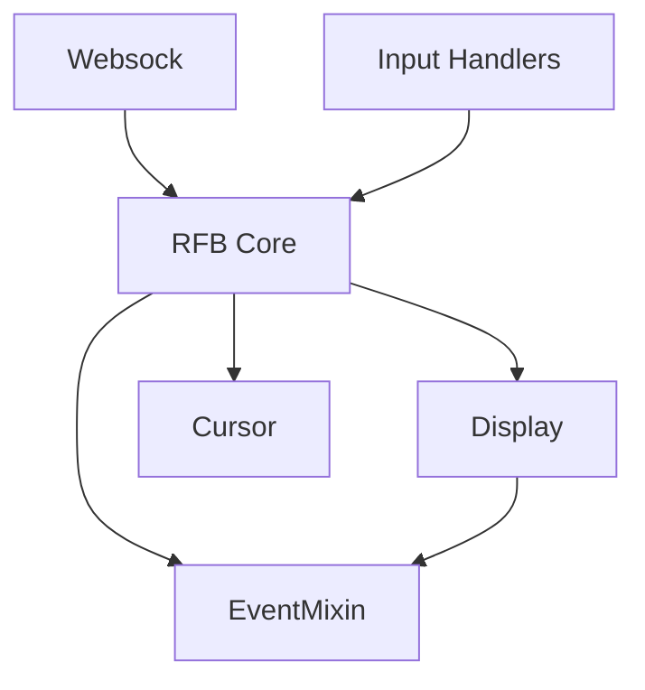

# Utility

The **Utility** module provides foundational helper components used by the noVNC-based remote access stack within MeshCentral. It delivers:

- Custom cursor management for remote desktop rendering
- A lightweight event system mixin for internal component communication

Although small in surface area, Utility is a critical low-level module that supports higher-level modules such as RFB and Display, Input Handlers, and Websock by enabling consistent event propagation and cursor rendering behavior.

---

## Overview

The Utility module contains two core components:

- `meshcentral.public.novnc.core.util.cursor.Cursor`
- `meshcentral.public.novnc.core.util.eventtarget.EventTargetMixin`

These components serve different but complementary roles:

- **Cursor** manages dynamic remote cursor rendering in the browser.
- **EventTargetMixin** provides a minimal event subscription and dispatch mechanism for noVNC core classes.

---

## Architecture



### Responsibilities

| Component | Responsibility |
|------------|----------------|
| Cursor | Renders and updates remote cursor graphics in the browser |
| EventTargetMixin | Enables event-driven communication between noVNC core classes |

---

# Cursor

**Component:** `meshcentral.public.novnc.core.util.cursor.Cursor`

The Cursor class is responsible for displaying the remote system's cursor inside the browser viewport. It supports both:

- Native browser cursor rendering using Data URLs
- A fallback canvas-based cursor overlay for environments without cursor URI support or on touch devices

## Design Goals

- Provide pixel-accurate cursor rendering from remote framebuffer data
- Support cursor hot spots (click offset position)
- Maintain compatibility across browsers and mobile devices
- Handle pointer capture and drag scenarios correctly

---

## Cursor Rendering Strategy

The Cursor class dynamically chooses between two strategies:



### 1. Native Mode

If the browser supports cursor URIs and is not a touch device:

- The RGBA pixel buffer is written to a canvas
- The canvas is converted to a Data URL
- CSS `cursor: url(...) hotx hoty, default` is applied

This approach leverages built-in browser cursor rendering for optimal performance.

### 2. Fallback Mode

Used when:

- Cursor URIs are unsupported
- Running on touch devices

In this mode:

- A fixed-position canvas is appended to `document.body`
- Mouse movement events reposition the canvas
- Visibility is dynamically toggled
- Pointer events are disabled on the canvas to avoid interference

---

## Cursor Lifecycle



### Key Methods

| Method | Purpose |
|---------|----------|
| `attach(target)` | Binds cursor management to a DOM element |
| `detach()` | Removes listeners and canvas overlay |
| `change(rgba, hotx, hoty, w, h)` | Updates cursor image and hotspot |
| `clear()` | Hides the cursor and resets state |
| `move(clientX, clientY)` | Manually repositions cursor (fallback mode) |

---

## Hotspot Management

The cursor hotspot defines where click interactions occur relative to the image.

Internally:

- Position offsets are recalculated whenever the hotspot changes
- The overlay canvas is shifted accordingly
- Mouse event coordinates are corrected to maintain alignment

This ensures accurate click targeting in remote desktop sessions.

---

## Visibility and Capture Handling

The Cursor class accounts for:

- Pointer capture (`document.captureElement`)
- Drag operations leaving the target element
- Nested DOM structures

It determines visibility using `_shouldShowCursor()` based on:

- Whether the pointer is inside the target element
- Whether child elements override the cursor style
- Whether pointer capture is active

This prevents cursor flicker and incorrect visibility during complex interactions.

---

# EventTargetMixin

**Component:** `meshcentral.public.novnc.core.util.eventtarget.EventTargetMixin`

EventTargetMixin provides a lightweight event system compatible with DOM-style event handling but implemented entirely in JavaScript.

It is used throughout noVNC core classes (such as RFB and Display) to provide:

- Custom event emission
- Event subscription
- Controlled event propagation

---

## Architecture



---

## Internal Data Model

EventTargetMixin maintains:

```text
Map<string, Set<Function>>
```

- Key: event type
- Value: set of callback functions

This ensures:

- O(1) listener lookup per event type
- No duplicate listeners per event type
- Clean removal semantics

---

## Core Methods

| Method | Description |
|---------|-------------|
| `addEventListener(type, callback)` | Registers a callback for an event type |
| `removeEventListener(type, callback)` | Removes a specific callback |
| `dispatchEvent(event)` | Invokes all listeners for `event.type` |

### Dispatch Behavior

- All callbacks are invoked using `callback.call(this, event)`
- The method returns `false` if `event.defaultPrevented` is true
- Otherwise returns `true`

This mirrors the semantics of DOM `EventTarget`.

---

## Event Flow Example



---

# Integration with the Remote Desktop Stack

The Utility module sits at a foundational layer of the client runtime:



### How It Fits

- **Websock** handles transport
- **RFB** manages protocol logic
- **Display** renders framebuffer updates
- **Cursor** renders pointer visuals
- **EventTargetMixin** enables internal event-driven architecture

Utility enables these modules to operate cohesively without introducing heavy framework dependencies.

---

# Key Design Principles

### 1. Minimalism
Utility avoids external dependencies and keeps implementations lightweight.

### 2. Browser Compatibility
Cursor fallback mode ensures consistent behavior across:

- Safari (including iOS quirks)
- Firefox cursor limitations
- Touch devices

### 3. Framework Independence
EventTargetMixin allows noVNC core classes to behave like DOM components without requiring actual DOM inheritance.

### 4. Separation of Concerns

- Rendering logic stays in Display
- Protocol logic stays in RFB
- Cursor behavior is isolated
- Event mechanics are abstracted

---

# Summary

The **Utility** module provides essential infrastructure for MeshCentral’s noVNC client:

- Accurate and cross-browser remote cursor rendering
- A consistent internal event dispatch mechanism

While compact in implementation, Utility is foundational to the stability, portability, and architectural cleanliness of the remote desktop client stack.