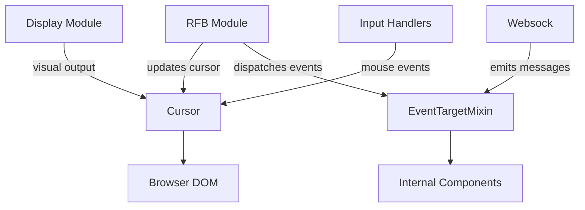
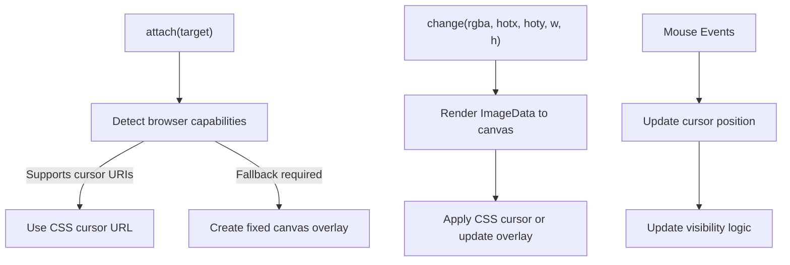
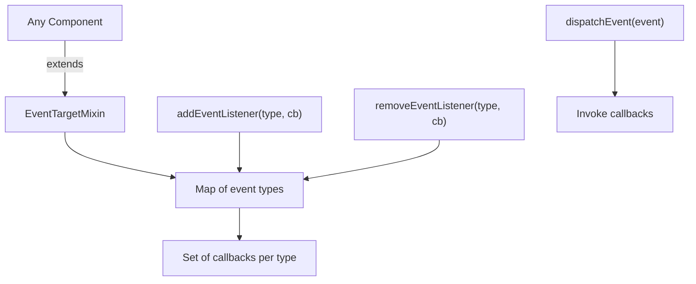
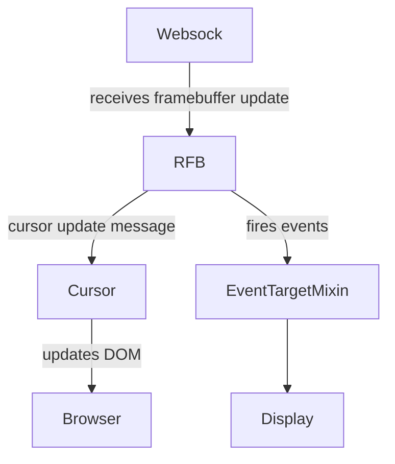

# Utility

The **Utility** module provides foundational browser-side helpers that support the noVNC integration within MeshCentral. It contains low-level building blocks used by higher-level modules such as RFB and Display, Input Handlers, and Websock.

This module focuses on two primary concerns:

- **Cursor management** in environments where native CSS cursors are insufficient or unsupported.
- **Event dispatching infrastructure** via a lightweight EventTarget mixin for internal component communication.

Although small in size, the Utility module plays a critical role in ensuring consistent rendering behavior and predictable event handling across browsers and devices.

---

## Architecture Overview

The Utility module consists of two core components:

- `Cursor` – Manages custom cursor rendering and fallback behavior.
- `EventTargetMixin` – Provides a minimal event subscription and dispatch system.

The Utility module acts as a support layer beneath protocol handling and display logic, interfacing directly with the browser DOM and abstracting event behavior.

---

# Core Components

## Cursor

**Component:** `meshcentral.public.novnc.core.util.cursor.Cursor`

The Cursor class is responsible for rendering and managing the remote cursor in the browser when connected to a VNC session.

### Purpose

Remote desktop protocols (like VNC) transmit cursor images from the server. Browsers, however, have limitations:

- Some environments do not support CSS cursor URIs.
- Touch devices require alternative handling.
- Certain browsers have selection or rendering bugs.

The Cursor class solves these challenges by:

- Dynamically rendering cursor bitmaps to a canvas.
- Using CSS `cursor: url(...)` when supported.
- Falling back to a positioned `<canvas>` overlay when necessary.

---

### High-Level Behavior

---

### Key Responsibilities

#### 1. Attachment Lifecycle

- `attach(target)` – Binds cursor handling to a specific DOM element.
- `detach()` – Removes event listeners and overlay elements.

When fallback mode is active, the class installs capturing mouse listeners:

- `mouseover`
- `mouseleave`
- `mousemove`
- `mouseup`

These are used to maintain cursor visibility and position across nested DOM structures.

---

#### 2. Cursor Image Updates

- `change(rgba, hotx, hoty, w, h)`

This method:

1. Creates an `ImageData` object from raw RGBA pixel data.
2. Draws it into an internal canvas.
3. Applies it either as:
   - A CSS cursor URL (preferred), or
   - A visually positioned canvas overlay (fallback).

The **hotspot** is recalculated whenever the cursor image changes.

---

#### 3. Fallback Overlay Mode

When native cursor URIs are not supported or when running on touch devices:

- A fixed-position canvas is appended to `document.body`.
- Pointer events are disabled to avoid interference.
- Visibility is manually controlled.
- Position is updated on every mouse move.

Special handling exists for:

- Visual vs layout viewport differences.
- Mouse capture edge cases.
- DOM changes during drag operations.

---

#### 4. Visibility Rules

The cursor is only shown when:

- The pointer is over the attached target.
- Or over a child element without its own explicit cursor.

This prevents conflicts with nested UI elements.

---

## EventTargetMixin

**Component:** `meshcentral.public.novnc.core.util.eventtarget.EventTargetMixin`

The EventTargetMixin provides a lightweight event subscription and dispatch system modeled after the browser's native `EventTarget` interface.

It is used throughout the noVNC stack to decouple components and avoid tight coupling between networking, protocol parsing, and rendering logic.

---

### Internal Structure

---

### Responsibilities

#### 1. Listener Registration

- `addEventListener(type, callback)`
  - Stores callbacks in a `Map<string, Set<Function>>`.

- `removeEventListener(type, callback)`
  - Removes the specific callback for the event type.

Using `Set` ensures:

- No duplicate listeners.
- Efficient add/remove operations.

---

#### 2. Event Dispatching

- `dispatchEvent(event)`

This method:

1. Locates listeners for `event.type`.
2. Invokes each callback with the component as context.
3. Returns `true` unless `event.defaultPrevented` is set.

This mirrors browser-native behavior and enables consistent handling patterns across modules.

---

# Interaction with Other Modules

While the Utility module is independent, it is commonly used by:

- RFB (Remote Framebuffer protocol implementation)
- Display (frame rendering layer)
- Websock (WebSocket communication)
- Input Handlers (keyboard and gesture processing)

### Example Interaction Flow

The Utility module ensures that:

- Remote cursor images are accurately represented.
- Event-driven communication remains clean and modular.

---

# Design Principles

The Utility module reflects several architectural principles:

- **Browser compatibility first** – Explicit fallback logic for inconsistent environments.
- **Separation of concerns** – Rendering, networking, and event logic remain isolated.
- **Minimal abstraction** – Small, focused helpers instead of heavy frameworks.
- **Performance-conscious design** – Canvas updates and event maps are optimized for frequent updates.

---

# Summary

The **Utility** module provides essential infrastructure for the MeshCentral noVNC client layer:

- The `Cursor` class ensures reliable and accurate remote cursor rendering across browsers and devices.
- The `EventTargetMixin` enables lightweight, decoupled event-driven communication between core components.

Although compact, this module is fundamental to the stability, compatibility, and extensibility of the remote desktop experience in MeshCentral.