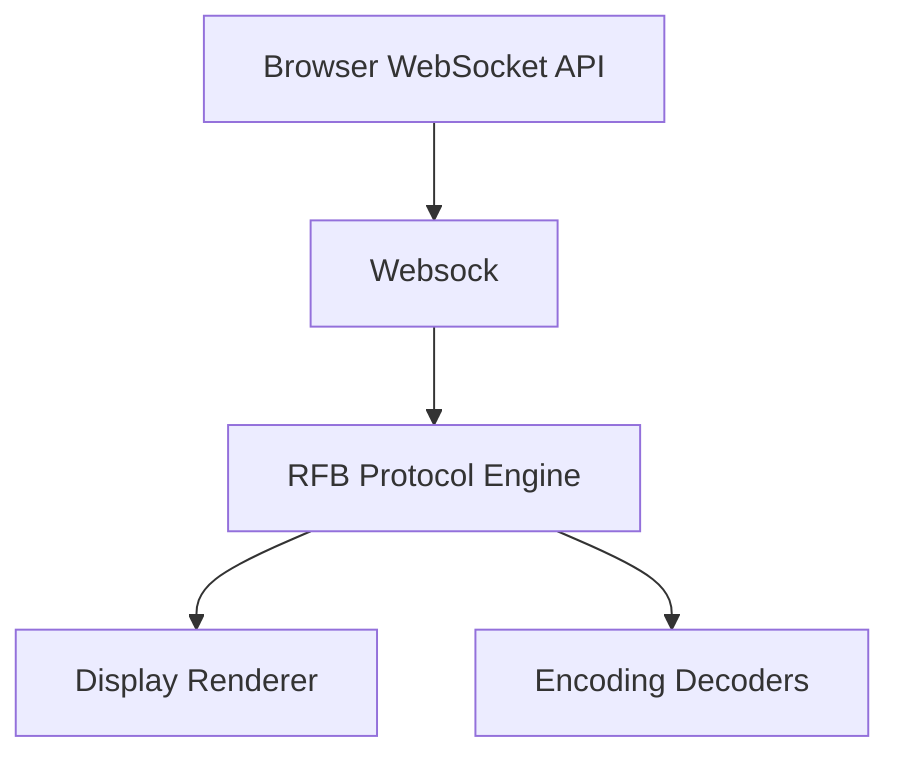
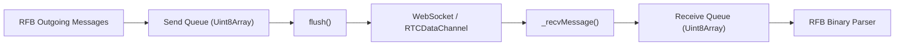
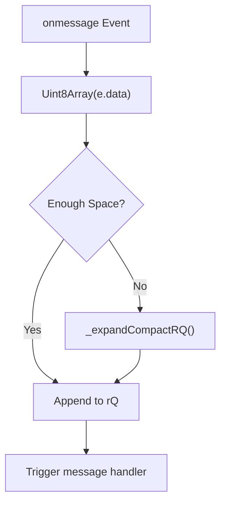
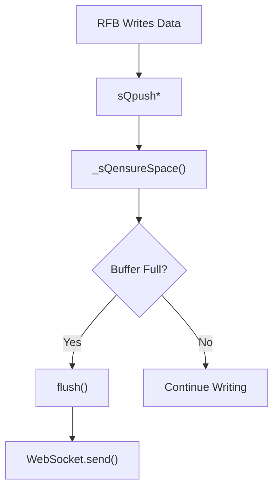
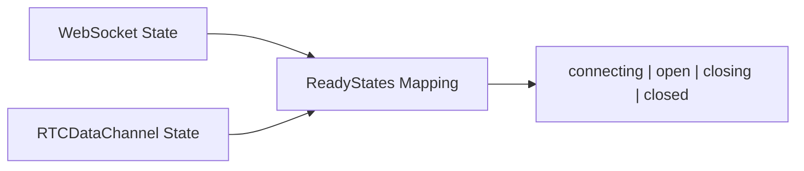
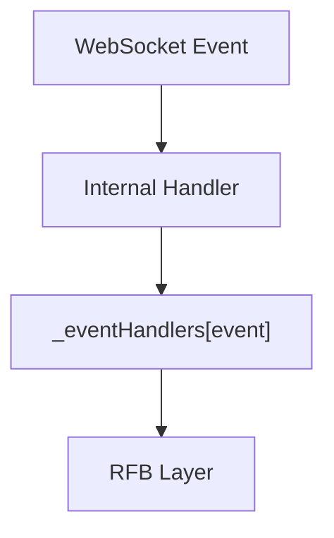
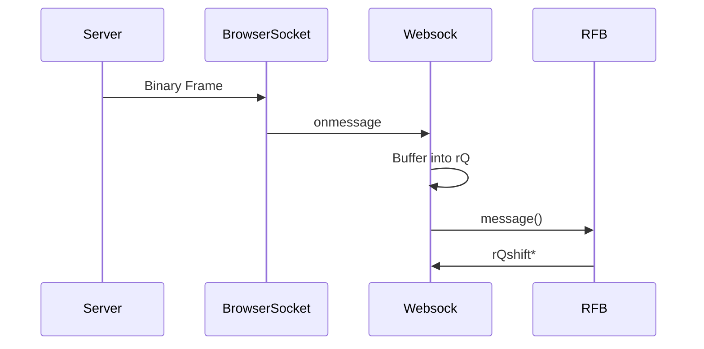

# Websock

The **Websock** module provides a high-performance buffering wrapper around native browser communication channels such as `WebSocket` and `RTCDataChannel`. It is a foundational transport layer within the noVNC-based remote desktop stack, enabling efficient, binary-safe, low-latency communication between the browser client and a remote MeshCentral server.

Unlike the standard `WebSocket` API, Websock introduces:

- Buffered receive and send queues
- Typed binary parsing utilities
- Flow control helpers
- A unified ready state abstraction
- Pluggable raw channel support (WebSocket or RTCDataChannel)

Websock is primarily consumed by the RFB implementation in the [Rfb And Display](rfb-and-display/rfb-and-display.md) module.

---

## 1. Purpose and Responsibilities

The Websock module is responsible for:

- Establishing and managing transport connections
- Buffering incoming binary data
- Providing structured binary read operations
- Buffering outgoing binary data
- Managing transport lifecycle events
- Abstracting differences between WebSocket and RTCDataChannel

It does **not**:

- Interpret protocol messages (handled by RFB)
- Decode framebuffer updates (handled by Decoders)
- Perform cryptographic operations (handled by Crypto Components)

Websock operates strictly as a transport-layer abstraction.

---

## 2. Architectural Context

Websock sits between the browser networking layer and the RFB protocol implementation.

### Upstream Dependency
- Native `WebSocket` or `RTCDataChannel`

### Downstream Consumer
- [Rfb And Display](rfb-and-display/rfb-and-display.md)

Websock ensures that RFB receives consistent, buffered, binary data regardless of the underlying transport.

---

## 3. Core Component

### Websock

**Class:** `meshcentral.public.novnc.core.websock.Websock`

The central class encapsulating:

- Receive Queue (rQ)
- Send Queue (sQ)
- Transport lifecycle management
- Event dispatching

---

## 4. Internal Architecture

Websock maintains two primary buffers:

- **Receive Queue (rQ)** – Stores incoming binary data
- **Send Queue (sQ)** – Buffers outgoing data before flushing

---

## 5. Receive Queue (rQ)

The receive queue is a dynamically managed `Uint8Array` buffer.

### Core Fields

- `_rQ` – Underlying byte buffer
- `_rQi` – Read index
- `_rQlen` – Write index
- `_rQbufferSize` – Allocated buffer size

### Binary Read Operations

Websock provides structured methods for reading protocol primitives:

- `rQshift8()`
- `rQshift16()`
- `rQshift32()`
- `rQshiftStr(len)`
- `rQshiftBytes(len)`
- `rQpeekBytes(len)`
- `rQwait(msg, num, goback)`

These methods allow RFB to parse network frames without interacting with raw ArrayBuffers.

### Receive Flow

### Buffer Growth Strategy

Websock avoids uncontrolled memory growth:

- Compacts unread bytes when possible
- Doubles buffer size when necessary
- Enforces maximum limit (40 MiB)

If the incoming message cannot fit within the maximum buffer size, an error is thrown.

---

## 6. Send Queue (sQ)

The send queue buffers outgoing protocol data before transmitting.

### Core Fields

- `_sQ` – Send buffer
- `_sQlen` – Current write offset
- `_sQbufferSize` – Fixed buffer size

### Write Operations

- `sQpush8(num)`
- `sQpush16(num)`
- `sQpush32(num)`
- `sQpushString(str)`
- `sQpushBytes(bytes)`

### Flush Mechanism

The `flush()` method transmits buffered data only when the transport state is `open`.

---

## 7. Transport Lifecycle Management

Websock abstracts both WebSocket and RTCDataChannel ready states.

### Unified Ready State

This abstraction ensures consistent state handling regardless of the underlying channel type.

### Lifecycle Methods

- `open(uri, protocols)` – Creates a WebSocket
- `attach(rawChannel)` – Attaches existing channel
- `close()` – Gracefully closes connection
- `init()` – Resets internal buffers

---

## 8. Event Model

Websock implements its own minimal event handler registry.

Supported events:

- `open`
- `message`
- `close`
- `error`

This design prevents direct coupling between RFB and the browser API.

---

## 9. Data Processing Flow with RFB

Websock is deeply integrated with the RFB state machine.

RFB never directly reads from `ArrayBuffer`; it consumes structured data from Websock.

---

## 10. Error Handling and Safety

Websock includes multiple safeguards:

- Verifies raw channel properties before attaching
- Throws error if buffer overflow exceeds max limit
- Prevents invalid read rewinds in `rQwait`
- Ignores empty messages

These protections are essential for long-running remote desktop sessions.

---

## 11. Performance Characteristics

### Memory Efficiency

- Uses `Uint8Array` for zero-copy subarrays
- Compacts buffers before resizing
- Caps growth at 40 MiB

### Throughput Optimization

- Batched send operations via send queue
- Avoids excessive `WebSocket.send()` calls
- Minimizes array copying during buffer expansion

### Latency Considerations

- Immediate event trigger after data arrival
- Minimal processing in message handler

---

## 12. Interaction with Other Modules

Websock integrates closely with:

- [Rfb And Display](rfb-and-display/rfb-and-display.md) – Protocol parsing and rendering
- Decoders – Frame decoding logic
- Compression – Deflation/inflation for tight encoding
- Crypto Components – Security handshakes and encryption

Websock itself remains transport-only and protocol-agnostic.

---

## 13. Design Principles

Websock follows several core principles:

1. **Binary-first design** – All operations use typed arrays
2. **Separation of concerns** – No protocol logic inside transport
3. **Backpressure awareness** – Flush only when necessary
4. **Transport abstraction** – WebSocket and RTCDataChannel compatible
5. **Memory boundedness** – Explicit growth limits

---

## 14. Summary

The **Websock** module is a high-performance, binary-safe transport abstraction layer used by the noVNC client in MeshCentral.

It provides:

- Robust receive and send buffering
- Structured binary parsing utilities
- Unified transport lifecycle management
- Memory-safe growth strategies
- Clean separation from protocol logic

By isolating transport complexity within Websock, the RFB layer can focus entirely on protocol semantics and display rendering, resulting in a modular, maintainable, and high-performance remote desktop client architecture.