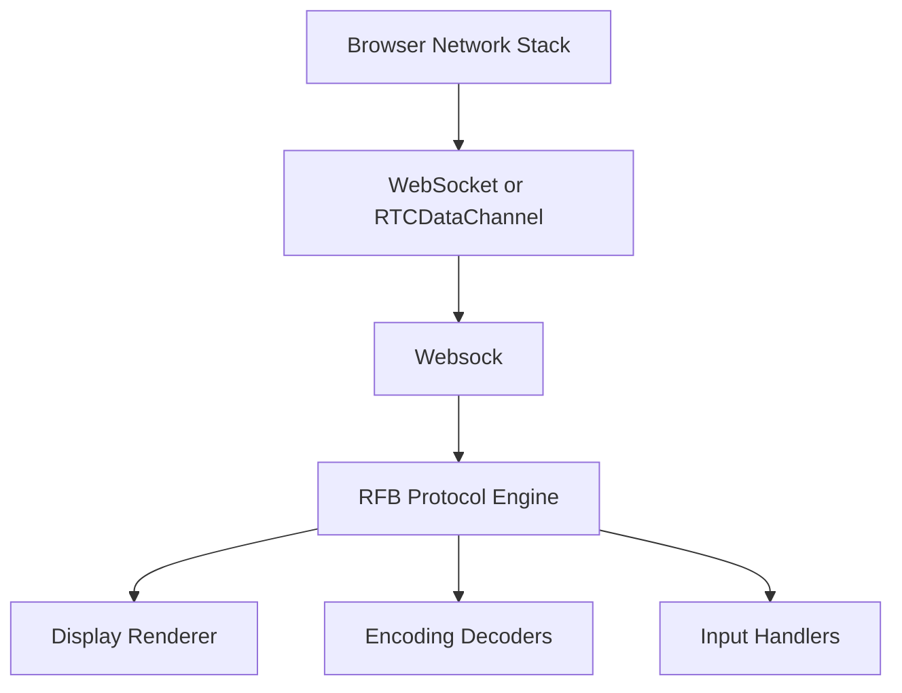
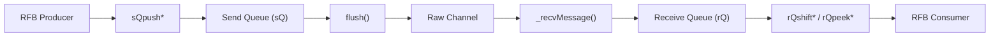
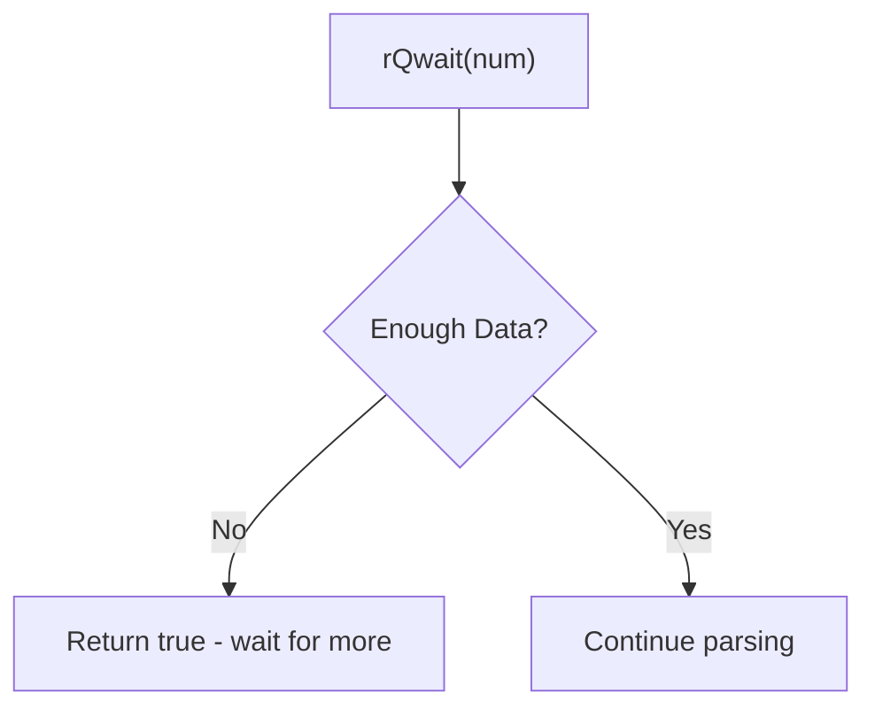
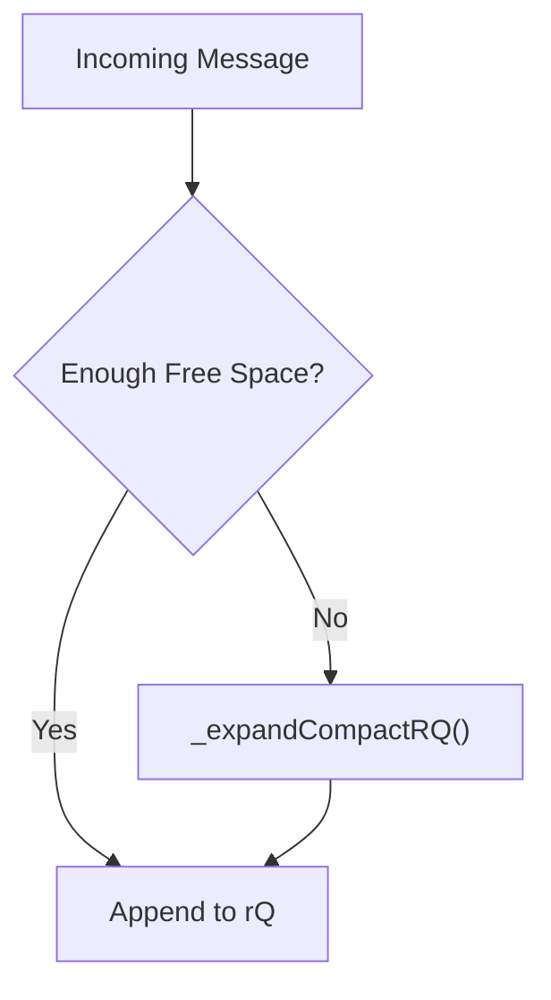
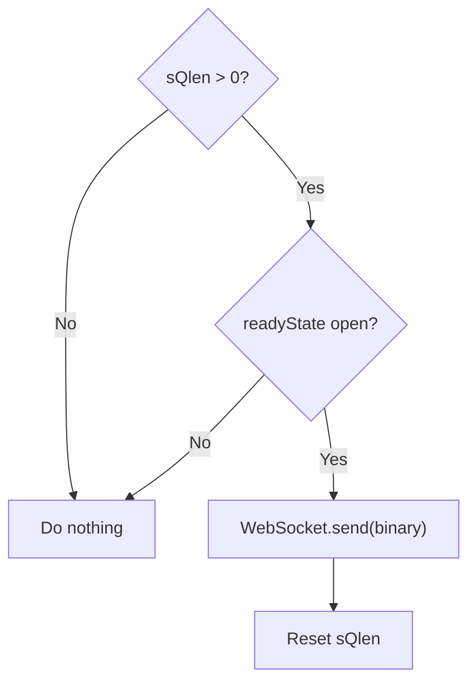
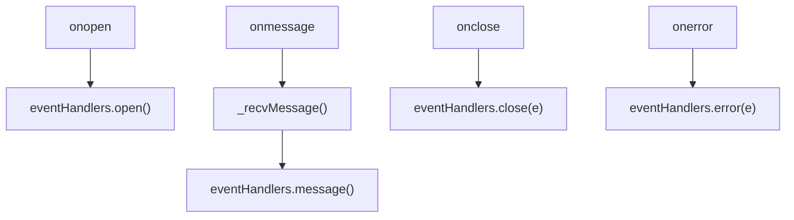
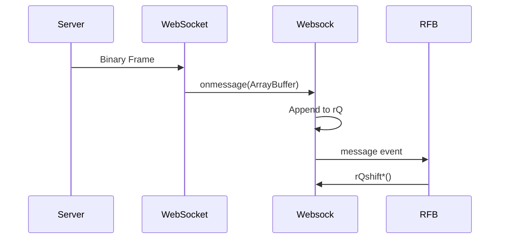

# Websock

The **Websock** module provides a high-performance, buffered abstraction over native `WebSocket` and `RTCDataChannel` objects. It is a foundational transport component in the noVNC stack used by MeshCentral, enabling efficient binary communication for the Remote Framebuffer (RFB) protocol.

Unlike the standard WebSocket API, Websock decouples network events from data parsing by maintaining explicit **receive (rQ)** and **send (sQ)** queues. This design allows upper-layer modules—such as the [Rfb And Display](rfb-and-display/rfb-and-display.md) module—to process binary streams incrementally and safely.

---

## 1. Purpose and Responsibilities

Websock is responsible for:

- Abstracting WebSocket and RTCDataChannel transport differences
- Providing buffered binary read/write operations
- Managing receive queue compaction and growth
- Emitting simplified lifecycle events (`open`, `message`, `close`, `error`)
- Protecting upper layers from partial-frame and fragmentation issues

It does **not**:

- Parse RFB protocol messages (handled by RFB)
- Decode pixel encodings (handled by the Decoders module)
- Perform cryptographic handshakes (handled by Crypto Components and RA2 ciphering)

---

## 2. Architectural Context

Websock sits at the lowest application-level transport layer of the noVNC client stack.



### Key Relationships

- **RFB** consumes structured binary data from Websock's receive queue.
- **Crypto Components** may operate on data before or after transport-level exchange during authentication phases.
- **Compression and Decoders** operate on payloads extracted via Websock’s queue operations.

---

## 3. Core Component

### Websock Class

**Location:** `public/novnc/core/websock.js`  
**Export:** `meshcentral.public.novnc.core.websock.Websock`

The Websock class wraps a "raw channel" (WebSocket or RTCDataChannel) and exposes:

- A unified `readyState`
- Buffered receive queue operations
- Buffered send queue operations
- Lifecycle event management

---

## 4. Internal Architecture

Websock maintains two primary buffers:

- **Receive Queue (rQ)** → `Uint8Array`
- **Send Queue (sQ)** → `Uint8Array`



---

## 5. Receive Queue (rQ)

The receive queue stores binary data from incoming network messages. Instead of passing message payloads directly to listeners, Websock appends them to the buffer and triggers a `message` event notification.

### 5.1 Design Goals

- Handle fragmented protocol messages
- Avoid repeated small allocations
- Allow incremental parsing
- Compact and resize efficiently

### 5.2 Core Fields

```text
_rQ           Uint8Array backing buffer
_rQi          Read index
_rQlen        Write index
_rQbufferSize Current allocated size
```

### 5.3 Read Operations

Websock provides typed read helpers:

| Method | Description |
|--------|------------|
| `rQpeek8()` | Peek next byte |
| `rQshift8()` | Read 8-bit value |
| `rQshift16()` | Read 16-bit big-endian |
| `rQshift32()` | Read 32-bit big-endian |
| `rQshiftBytes(len)` | Read byte array |
| `rQshiftStr(len)` | Read string |
| `rQwait(msg, num, goback)` | Check if enough bytes are available |

### 5.4 Data Availability Check



This mechanism allows RFB to pause parsing until sufficient bytes are available.

---

## 6. Receive Queue Expansion and Compaction

Websock avoids excessive copying by combining compaction and expansion logic.

### Strategy

1. If processed data exists at the start of the buffer → compact.
2. If insufficient space remains → resize (double or fit 8x current data).
3. Cap maximum size at 40 MiB.



### Safety Limit

```text
MAX_RQ_GROW_SIZE = 40 MiB
```

If the queue exceeds this and cannot fit new data, an error is thrown.

---

## 7. Send Queue (sQ)

The send queue buffers outgoing data before transmitting it as a single binary frame.

### 7.1 Core Fields

```text
_sQ           Uint8Array backing buffer
_sQlen        Current write index
_sQbufferSize Initial size 10 KiB
```

### 7.2 Write Operations

| Method | Description |
|--------|------------|
| `sQpush8()` | Write 8-bit value |
| `sQpush16()` | Write 16-bit big-endian |
| `sQpush32()` | Write 32-bit big-endian |
| `sQpushString()` | Write ASCII string |
| `sQpushBytes()` | Write byte array |
| `flush()` | Send buffer to transport |

### 7.3 Flush Logic



Websock flushes automatically when the buffer runs out of space or when explicitly requested.

---

## 8. Lifecycle and Event Handling

Websock normalizes lifecycle states across WebSocket and RTCDataChannel.

### 8.1 Ready State Mapping

It maps:

- WebSocket numeric states
- RTCDataChannel string states

into unified string states:

```text
connecting
open
closing
closed
```

### 8.2 Event Model



Consumers register handlers using:

```text
on(evt, handler)
off(evt)
```

---

## 9. Raw Channel Validation

When attaching to a raw channel, Websock validates required properties:

```text
send
close
binaryType
onerror
onmessage
onopen
protocol
readyState
```

This ensures compatibility with both:

- Native `WebSocket`
- `RTCDataChannel`

---

## 10. Integration with RFB

Websock does not interpret protocol data. Instead, RFB performs parsing using Websock's queue interface.



This separation ensures:

- Clean transport abstraction
- Deterministic parsing
- Safe handling of partial messages

---

## 11. Performance Considerations

### 11.1 Zero-Copy Where Possible

- Uses `Uint8Array.subarray()` when copying is unnecessary
- Compacts buffer using `copyWithin()`

### 11.2 Batching Outgoing Frames

- Aggregates writes before sending
- Reduces WebSocket frame overhead

### 11.3 Memory Growth Control

- Exponential growth strategy
- Hard limit at 40 MiB

---

## 12. Error Handling and Safety

Websock throws errors in cases such as:

- Invalid raw channel (missing required properties)
- Illegal buffer rollback in `rQwait()`
- Buffer overflow beyond maximum limit

Upper layers should treat these as fatal transport-level failures.

---

## 13. Summary

The **Websock** module is a critical transport abstraction that:

- Bridges browser networking APIs and the RFB protocol
- Provides high-performance buffered binary operations
- Handles fragmentation and incremental parsing
- Normalizes lifecycle and transport state
- Enables robust remote desktop streaming in the MeshCentral noVNC client

By isolating transport concerns from protocol logic, Websock ensures that higher-level modules such as RFB, Decoders, and Display can operate deterministically and efficiently.