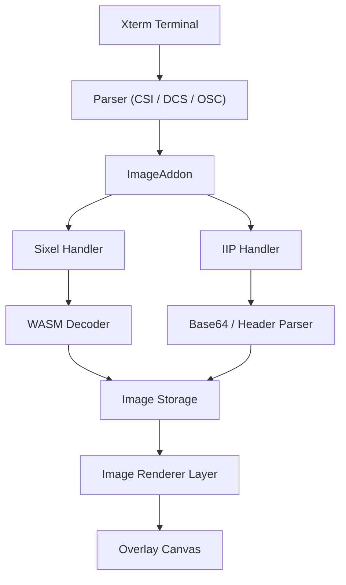
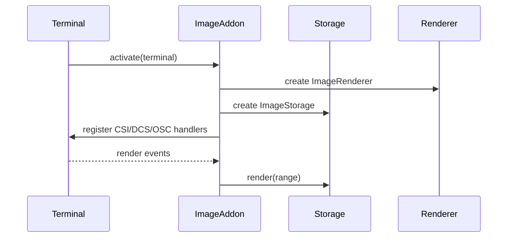
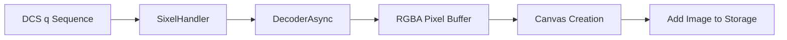
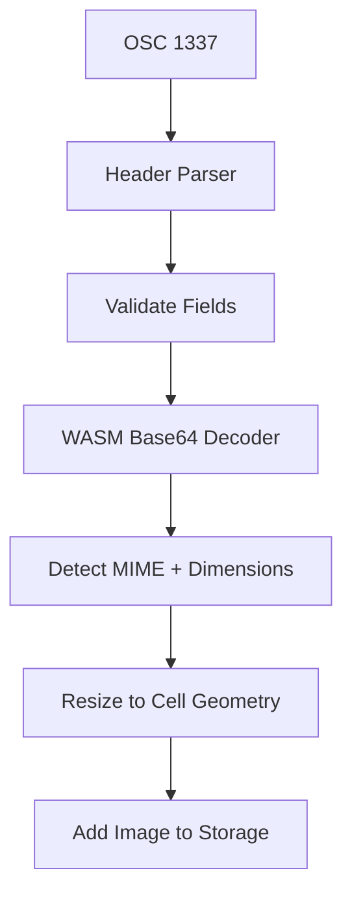
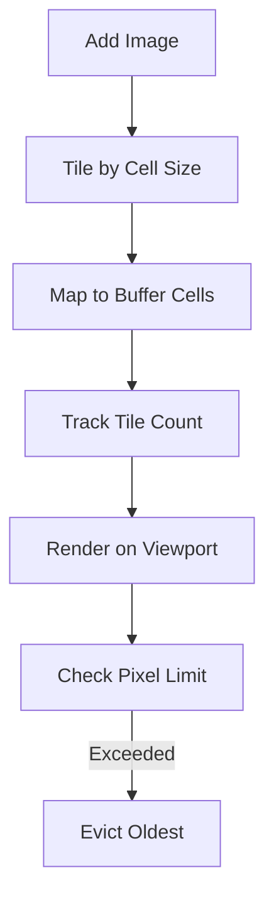

# Xterm Addon Image Auxiliary Extensions Core

The **Xterm Addon Image Auxiliary Extensions Core** module provides the low-level decoding, rendering integration, and storage orchestration for advanced image protocols inside the Xterm image addon. It focuses on the core auxiliary extension components responsible for:

- SIXEL decoding and rendering
- Inline Image Protocol (IIP) parsing and processing
- Image lifecycle management within the terminal buffer
- WebAssembly-backed decoding pipelines

This module acts as the execution engine behind higher-level configuration and extension wiring defined in its parent module.

See also:
- [Xterm Addon Image Auxiliary Extensions](../xterm-addon-image-auxiliary-extensions.md)
- [Xterm Addon Image Auxiliary Extensions Utilities](../xterm-addon-image-auxiliary-extensions-utilities/xterm-addon-image-auxiliary-extensions-utilities.md)
- [Xterm Addon Image Core](../../xterm-addon-image-core/xterm-addon-image-core.md)

---

## Core Components

This module is built around two primary core components from `public/scripts/xterm-addon-image.js`:

- `meshcentral.public.scripts.xterm-addon-image.o`
- `meshcentral.public.scripts.xterm-addon-image.r`

These correspond to:

- **ImageAddon** (main orchestrator for image features)
- **SIXEL / IIP decoding pipeline and storage integration**

Together, they implement protocol handling, rendering hooks, and memory-bound image storage.

---

## High-Level Architecture

The Xterm Addon Image Auxiliary Extensions Core integrates deeply with the Xterm parser, renderer, and buffer system.

### Responsibilities by Layer

| Layer | Responsibility |
|--------|---------------|
| ImageAddon | Registers protocol handlers and manages configuration |
| Sixel Handler | Decodes SIXEL DCS sequences |
| IIP Handler | Handles OSC 1337 inline image protocol |
| Decoder | WebAssembly-based decoding pipeline |
| Image Storage | Tracks images per buffer cell and enforces limits |
| Image Renderer | Renders tiles to a canvas overlay |

---

## Protocol Handling Pipeline

### 1. Activation

When the addon is activated:

- Renderer and storage subsystems are initialized
- CSI, DCS, ESC, and OSC handlers are registered
- Resize and buffer change listeners are attached

---

## SIXEL Handling Flow

SIXEL support is implemented through a DCS handler (`final: "q"`).

### Flow Overview

### Key Features

- Uses WebAssembly-backed decoder for performance
- Enforces:
  - `pixelLimit`
  - `sixelSizeLimit`
  - `sixelPaletteLimit`
- Supports scrolling-aware rendering
- Handles palette reset and resizing

Memory is proactively released if decoder usage exceeds internal thresholds.

---

## Inline Image Protocol (IIP) Flow

IIP support is implemented via an OSC 1337 handler.

### IIP Processing Steps

### Validation Logic

The handler enforces:

- Inline flag must be set
- Declared size must match limits
- Pixel count must be below `pixelLimit`
- MIME must be supported (PNG, JPEG, GIF)

Unsupported or oversized images are aborted early.

---

## Image Storage Model

The storage subsystem maps images into terminal buffer cells.

Each image:

- Receives a unique ID
- Is split into tiles aligned with terminal cell dimensions
- Is associated with buffer markers
- Is evicted if exceeding storage limits

### Storage Lifecycle

### Storage Constraints

- Default storage limit in MB
- Pixel-based memory accounting
- Automatic eviction of oldest images
- Special handling for alternate screen buffer

---

## Rendering Integration

Rendering is done via a dedicated canvas layer injected into the Xterm DOM.

### Rendering Strategy

- Canvas overlay positioned above terminal text layer
- Images drawn per visible row range
- Tile-based drawing for efficiency
- Placeholder pattern optionally displayed

The renderer automatically rescales images when:

- Font size changes
- Terminal is resized

---

## Configuration and Graphics Attributes

The module supports dynamic runtime configuration via CSI sequences.

### Supported Controls

- Enable/disable SIXEL scrolling
- Query and set palette limits
- Query maximum pixel dimensions
- Reset state on ESC or parser reset

Graphics attribute negotiation allows clients to discover:

- Maximum supported resolution
- Current palette limits

---

## Memory and Performance Considerations

The module emphasizes:

- WebAssembly acceleration for decoding
- Chunk-based streaming decode
- Pixel-bound memory limits
- Early abort on malformed sequences
- Efficient tile reuse and disposal

Decoder memory is explicitly released when:

- Images exceed memory threshold
- Reset occurs
- Aborted sequences detected

---

## Error Handling Strategy

Error handling is defensive and silent for user experience:

- Malformed headers abort decoding
- Oversized images abort early
- WebAssembly errors are caught and logged
- Unsupported MIME types ignored

All failure paths ensure decoder and storage state remain consistent.

---

## How This Module Fits in the System

Within the broader architecture:

- The **Core Image Addon** initializes shared logic and configuration
- The **Auxiliary Extensions Core** implements protocol execution and rendering
- The **Utilities module** provides helper functions and shared support structures

This module represents the operational heart of advanced image rendering inside Xterm for MeshCentral.

---

## Summary

The Xterm Addon Image Auxiliary Extensions Core module:

- Implements SIXEL and IIP protocols
- Integrates tightly with the Xterm parser and renderer
- Uses WebAssembly for decoding performance
- Enforces strict memory and pixel limits
- Maps images into terminal buffer cells
- Renders images via a dedicated canvas overlay

It enables rich graphical capabilities inside terminal sessions while maintaining performance, isolation, and memory safety.
